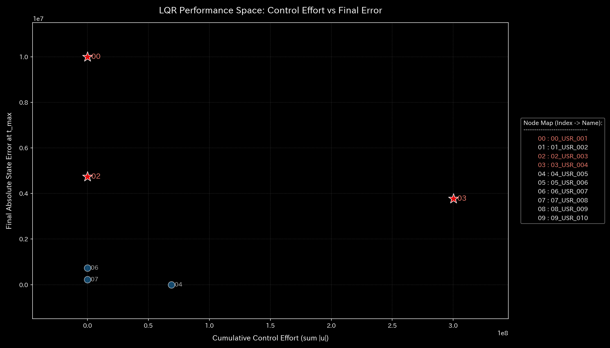
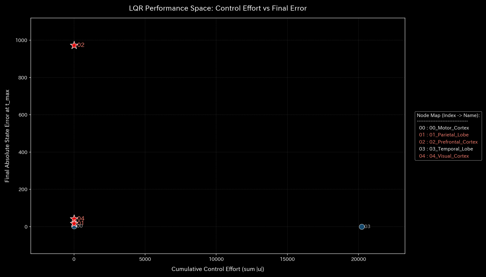

# 🔬 Tensor-Link Utility (TLU)

[](https://www.gnu.org/licenses/agpl-3.0.html)
[](https://www.python.org/)
[](https://www.docker.com/)

### Visualizing "Interaction Data" via Mathematical Physics Analysis

Tensor-Link Utility (TLU) is a platform. It visualizes pathological anomalies in data.

TLU demonstrates a physical law. You cannot cheat the law of conservation of mass or thermodynamics. Even if you forge bookkeeping records, physics exposes the fraud.

TLU models time-series data as force flows in an elastic network. It applies to double-entry bookkeeping, urban traffic, stock markets, and brain fMRI.

It visualizes anomalies such as embezzlement, wash trading, traffic deadlocks, market manipulation, strokes, and seizures. It detects them as physical signatures. These include stiffness collapses, pathological resonance, thermal anomalies, and correlation abnormalities.

An AI agent interprets the metrics from the engine. It uses [LLM_Diagnostic_Manual.md](docs/LLM_Diagnostic_Manual.md). The AI translates these metrics into a clinical diagnosis report.

---

## 📚 Documentation Map

All documents are in `docs/`. Below is the mapping between English and Japanese versions.

| # | Document Title (English) | Corresponding Japanese Version | Core Content |
| :---: | :--- | :--- | :--- |
| **1** | **[📂 01. Physics-Mathematics Engine Theory & Interpretation Guide](docs/samples/README.md)**<br>- **[000_0: Statistics](docs/samples/000_0_Basic_Statistics.md)** / **[000_1: Kinematics](docs/samples/000_1_Dynamics_Kinematics.md)** / **[000_2: Stiffness & PCA](docs/samples/000_2_Stiffness_PCA.md)**<br>- **[001_1: Thermodynamics](docs/samples/001_1_Thermodynamics.md)** / **[001_2: Local Entropy](docs/samples/001_2_Local_Entropy.md)** / **[001_3: Local Temperature](docs/samples/001_3_Local_Temperature.md)** / **[001_4: Local Energy Gradient](docs/samples/001_4_Local_Gradient.md)**<br>- **[002_1: Information Geometry](docs/samples/002_1_Information_Geometry.md)** / **[002_2: Conservation & Auditing](docs/samples/002_2_Forensics.md)**<br>- **[003_1: Kinematics](docs/samples/003_1_Kinematics.md)**<br>- **[004_1: LQR Control](docs/samples/004_1_Control_Theory.md)** / **[004_2: Intervention Sensitivity](docs/samples/004_2_Stability.md)**<br>- **[005_1: Wave Mechanics](docs/samples/005_1_Wave_Mechanics.md)** / **[005_2: 1/f Fluctuation](docs/samples/005_2_Coherence.md)** | Mathematical Physics Analysis Guide (under `ja/samples/`):<br>- **[000_0: Statistics](docs/ja/samples/000_0_Basic_Statistics.md)** / **[000_1: Kinematics](docs/ja/samples/000_1_Dynamics_Kinematics.md)** / **[000_2: Stiffness & PCA](docs/ja/samples/000_2_Stiffness_PCA.md)**<br>- **[001_1: Thermodynamics](docs/ja/samples/001_1_Thermodynamics.md)** / **[001_2: Local Entropy](docs/ja/samples/001_2_Local_Entropy.md)** / **[001_3: Local Temperature](docs/ja/samples/001_3_Local_Temperature.md)** / **[001_4: Local Energy Gradient](docs/ja/samples/001_4_Local_Gradient.md)**<br>- **[002_1: Information Geometry](docs/ja/samples/002_1_Information_Geometry.md)** / **[002_2: Conservation & Auditing](docs/ja/samples/002_2_Forensics.md)**<br>- **[003_1: Kinematics](docs/ja/samples/003_1_Kinematics.md)**<br>- **[004_1: LQR Control](docs/ja/samples/004_1_Control_Theory.md)** / **[004_2: Intervention Sensitivity](docs/ja/samples/004_2_Stability.md)**<br>- **[005_1: Wave Mechanics](docs/ja/samples/005_1_Wave_Mechanics.md)** / **[005_2: 1/f Fluctuation](docs/ja/samples/005_2_Coherence.md)** | This guide explains mathematical physics theories for TLU. It covers the 8 core modules (000 to 005) and visualizes the 10 verification samples. |
| **2** | **[📂 02. System Architecture & Operations Guide](docs/System_Architecture_and_Operations.md)** | **[02. System Architecture & Operations (Japanese)](docs/ja/System_Architecture_and_Operations.md)** | Explains system design, pipelines, visualizer themes, anomalous data generators, and LQR control models. |
| **3** | **[📂 03. Market Forensics & Compliance Rules](scratch/03_Market_Forensics_Rules_EN.md)** | **[03. Market Forensics & Compliance (Japanese)](scratch/03_Market_Forensics_Rules.md)** | Covers order-book dynamics, USR circular trading, bipartite projection, and direct cash-flow audit. |
| **4** | **[📂 LLM Diagnostic Manual (Supreme prompt)](docs/LLM_Diagnostic_Manual.md)** | **[LLM Diagnostic Manual (Japanese)](docs/ja/LLM_Diagnostic_Manual.md)** | System prompt for LLM meta-diagnosis. It contains rules to generate clinical reports and verify data facts. |
| **5** | **[📂 Verified Sample Registry & Catalog](docs/samples/README.md)** | **[Verified Sample Registry (Japanese)](docs/ja/samples/README.md)** | Catalog of 10 verification samples. It lists detection parameters, thresholds, and LQR intervention points. |

---

## ⚕️ Core Paradigm: Network Dynamics as a Physical Medium

TLU models transaction data as a continuous elastic network. Nodes are connected via mass-spring-damper elements.


*Figure 1: Conceptual diagram modeling ledger accounts as a mass-spring-damper system*

### Clinical Metaphor: Eastern Medicine (Qi, Blood, and Fluids)

TLU uses Eastern medicine terms. It treats the network as meridians (transaction paths). Qi and Blood (funds and activity flows) circulate through them.

It identifies blocks or stiffness (deadlocks) and active bleeding (embezzlement or cash leaks). TLU suggests intervention points (acupuncture points) via Linear Quadratic Regulator (LQR) control theory.

### Mapping Table: From Target Domains to Physical Space

| Physical Variable | Definition in Classical Mechanics & Thermodynamics | Financial Accounting Domain | Urban Traffic Domain | Financial Market Domain | Biological Brain fMRI Domain |
| :--- | :--- | :--- | :--- | :--- | :--- |
| **Mass ($m_i$)** | Inertia / Energy storage tank | Account balance | Vehicles at intersection | Account assets | BOLD signal change |
| **Flux ($f_{ij}$)** | Velocity / Mass transport | Transaction amount | Vehicles per second | Trade value | Effective connectivity |
| **Stiffness ($k_{ij}$)** | Elasticity / Spring constant | Account connection strength | Road capacity limit | Synchronization level | Functional coherence |
| **Viscosity ($c_{ij}$)** | Friction / Damper damping | Payment terms (30-90 days) | Traffic drag / Delay | Execution delay (latency) | Signal propagation latency |
| **Entropy ($S$)** | Disorder / Frictional heat loss | Sham circular trading | Frictional heat from congestion | Wash trading between USRs | Neural hyper-synchrony (seizure) |
| **Free Energy ($F$)** | Available work potential | Net operating profit after tax | Vehicle flow potential | Market allocation efficiency | Brain cognitive capacity |
| **Acupuncture Point (LQR)** | Control input vector | Key audit accounts | Traffic light timing adjustment | Specific USR trade restriction | Target TMS stimulation point |

---

## 🔬 4 Spatiotemporal Proofs (Physical Signatures)

TLU extracts 4 physical signatures. It uses them to detect systemic anomalies.

### 1. Macro Forensics (Conservation of Mass & Kirchhoff's Law)

TLU verifies the balance of inflows and outflows. Embezzlement violates the law of conservation of mass. It causes a large spike in the residual plots.

* **🟢 Healthy (Sample 0):** The residual is `0.00` across all steps. This proves there are no cash leaks.
* **🚨 Mass Leak (Sample 2 / Embezzlement):** Recovered cash is bypassed to a hidden node. The law of conservation of mass breaks. This triggers positive spikes in the absolute residual.

| Healthy steady-state (Sample 0) | Pathological Mass Leak (Sample 2) |
| :---: | :---: |
|  |  |
| *Figure 2a: Conservation is maintained (residual = 0)* | *Figure 2b: Residual spike detected during embezzlement* |

---

### 2. Topology & System Stability (Spectral Radius $\rho$)

TLU calculates the spectral radius. This is the maximum eigenvalue of the connection matrix. It detects circular loops. If the spectral radius reaches `1.00`, the system is locked in a loop and runs out of control.

* **🟢 Healthy (Sample 0):** The spectral radius stays near `0.00`. This means transactions do not cycle and converge normally.
* **🚨 Locked Loop (Sample 4 / Composite Chaos):** Circular transactions push the spectral radius up to `0.79`. This proves the existence of a sham loop.

| Healthy steady-state (Sample 0) | Locked Loop (Sample 4) |
| :---: | :---: |
|  |  |
| *Figure 3a: Spectral radius converges in a safe zone* | *Figure 3b: Spectral radius rises towards the critical boundary* |

---

### 3. Thermodynamic Energy Stack (System Fatigue & Thermal Death)

TLU calculates the free energy ($F = U - TS$). This represents the work capacity of the system. If $F$ drops below zero, the system falls into thermal death. High activity ($U$) without useful output generates friction (entropy $TS$) and exhausts the system.

* **🟢 Healthy (Sample 0):** The free energy stays positive. This indicates healthy metabolism. Accumulated energy grows with activity.
* **🚨 Thermal Death (Sample 8 / fMRI Stroke):** Blood flow blockage freezes functional connections. Entropy ($S$) drops rapidly. At the same time, macro temperature ($T$) spikes. As a result, free energy ($F$) plummets into thermal death.

| Healthy steady-state (Sample 0) | Pathological Thermal Death (Sample 8) |
| :---: | :---: |
|  |  |
| *Figure 4a: Healthy accumulation of free energy* | *Figure 4b: Plunging free energy indicating thermal death* |

---

### 4. 3D Spatiotemporal Geometry Distortion (KL Drift & Local Temperature)

TLU models probability distributions as a 3D geometric manifold. Systemic anomalies create a sharp, yellow-green tower in a flat space. Examples include road deadlocks, USR collusion, and strokes.

* **🟢 Healthy (Sample 0):** The manifold remains flat and blue (except for initial edge effects from small sample sizes).
* **🚨 Manifold Distortion (Sample 5 / Traffic Deadlock):** When intersection `23_Shijo_Karasuma` is blocked, the distribution collapses. A sharp tower rises at the exact coordinates and time step. Its value reaches over 600,000.

| Healthy steady-state (Sample 0) | Spatiotemporal Manifold Distortion (Sample 5) |
| :---: | :---: |
|  |  |
| *Figure 5a: Flat and calm geometric manifold* | *Figure 5b: Manifold distortion pointing to the anomaly origin* |

---

## 📂 10 Verification Case Studies

TLU includes 10 sample datasets. They verify the accuracy of the mathematical physics engine.

| ID | Case Study (Report Link) | Domain | Diagnosis | Key Metrics | Clinical Metaphor |
| :---: | :--- | :---: | :---: | :---: | :--- |
| **0** | **[🟢 Normal Healthy Metabolism (Healthy)](docs/samples/Sample_0_Healthy/README.md)** | Finance | **NORMAL** | $\rho = 0.00$, Residual = $0.00$ | Smooth flow of Qi and Blood |
| **1** | **[🟡 Circular Trade / Wash Trade](docs/samples/Sample_1_Wash_Trade/README.md)** | Finance | **HIGH** | $\rho = 0.75$, Depleted Free Energy | Qi and Blood running in a closed loop |
| **2** | **[🔴 Embezzlement Leak](docs/samples/Sample_2_Embezzlement_Leak/README.md)** | Finance | **CRITICAL** | Max Residual = $364.53$, Terminal resonance | Bleeding from meridian, mass leak |
| **3** | **[🟡 Simple Bookkeeping Mistake (Unbalanced Mistake)](docs/samples/Sample_3_Unbalanced_Mistake/README.md)** | Finance | **WARNING** | Transient residual and KL tower | Temporary imbalance, self-healing |
| **4** | **[🔴 Composite Chaos](docs/samples/Sample_4_Composite_Chaos/README.md)** | Finance | **CRITICAL** | $\rho = 0.79$, Max Residual = $4,773.57$ | Bleeding and looping of Qi and Blood |
| **5** | **[🔴 Urban Traffic Deadlock (Kyoto Traffic)](docs/samples/Sample_5_Kyoto_Traffic/README.md)** | Traffic | **CRITICAL** | $\rho = 1.00$, Local Temp $T = 547.06$ | Blocked meridian, stasis, static convection |
| **6** | **[🟡 Market Bipartite Graph of Stock Flow (Market Bipartite)](docs/samples/Sample_6_Market_Stock_Flow/README.md)** | Market | **HIGH** | $\rho = 1.00$, PC1 ratio = $99.67\%$ | Closed loop, artificial resonance |
| **7** | **[🟡 User Direct Cash Flow (Market Cash Flow)](docs/samples/Sample_7_Market_Cash_Flow/README.md)** | Market | **HIGH** | Free Energy Skewness = $-2.72$ | Collusion, hidden nodes, undercurrent loops |
| **8** | **[🔴 Brain stroke model fMRI (fMRI Stroke)](docs/samples/Sample_8_fMRI_Stroke/README.md)** | Brain | **CRITICAL** | 95% path block, Stiffness Lock | Blocked brain meridian, local necrosis |
| **9** | **[🔴 Seizure model fMRI (fMRI Seizure)](docs/samples/Sample_9_fMRI_Seizure/README.md)** | Brain | **CRITICAL** | $\rho = 1.00$, Falling entropy | Neural hyper-synchrony, runaway Qi |

---

## ⚕️ LQR Optimal Control for Dynamic Intervention

TLU detects anomalies. It also designs interventions. It uses a state-space model to calculate Linear Quadratic Regulator (LQR) control. This identifies acupuncture points (sensitive nodes). Targeting these nodes stabilizes the system with minimal effort.

| Financial Market (Sample 7) | Neuroscience (Sample 9) |
| :---: | :---: |
|  |  |
| *Figure 6a: Identifying market manipulation hubs `USR_004` and `USR_005`* | *Figure 6b: Identifying the epilepsy seizure focus in the temporal lobe (`Temporal_Lobe`)* |

---

## 🚀 Environment & Quick Start (Docker)

TLU uses stateless Docker containers and Test-Driven Development (TDD). This eliminates configuration issues and human errors.

#### Setup: Custom Data Analysis

To analyze custom data, place these files in the `workspace/` directory:

1. **Transaction Flow Data (`workspace/input_stream/`)**: A time-series CSV. It requires `Trans_Date` (Date), `Account_Name` (Account Name), `Debit` (Inflow), and `Credit` (Outflow).
2. **Account Mapping Dictionary (`workspace/config/_account_mapping.csv`)**: Defines mappings of ledger accounts to TLU categories (Asset, Liability, Revenue, etc.).

#### Pipeline Execution Steps

```bash
# 1. Clone the repository
git clone https://github.com/renpoo/TLU.git
cd TLU

# 2. Start Docker containers
docker compose up -d

# 3. Run the pipeline (Sample 1: Wash Trade simulation example)
bash bin/batch_processing.sh --target_env "samples/Sample_1_Wash_Trade"
bash bin/batch_visualize_graphs.sh --target_env "samples/Sample_1_Wash_Trade"
```

---

## ⚠️ Falsifiability & Limits of Clinical Models

TLU only outputs physical and mathematical facts.

TLU and the AI agent do not judge intent. They do not classify actions as legal or illegal. Humans must investigate. Use the physical metrics and spatiotemporal coordinates to check real-world proof (bank statements, order logs, or biopsies). This step confirms the final diagnosis.

---

**License**: AGPL-3.0  
**Developer**: Renpoo & Google Gemini Agent (Antigravity)
