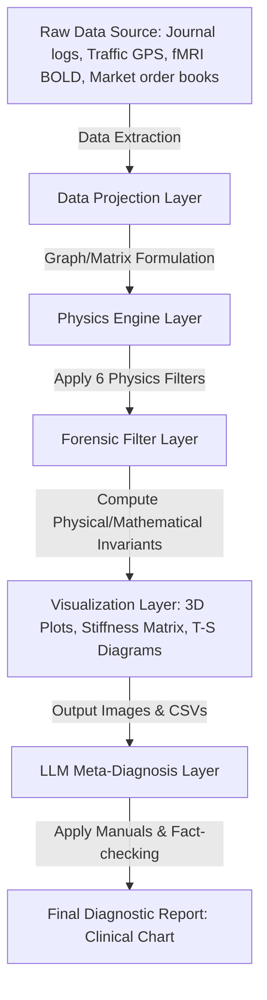

# 02. System Architecture & Operations Guide

Tensor-Link Utility (TLU) is not a standalone analysis tool, but an **"autonomous forensic platform"** that processes everything from data ingestion to physical translation, visualization, and automatic AI-agent diagnosis in an end-to-end manner.

This document is a system operations guide explaining TLU's core design philosophy, data pipeline, color theme engine, and simulation models.

---

## 🧭 Table of Contents

1.  [Pipeline Architecture](#1-pipeline-architecture)
2.  [Data Projection & Topology](#2-data-projection--topology)
3.  [Visualizer & Theme Engine](#3-visualizer--theme-engine)
4.  [Anomalous Data Generators](#4-anomalous-data-generators)
5.  [TDD & LQR Control](#5-tdd--lqr-control)

---

## 1. Pipeline Architecture

The overall data and diagnostic processing flow of TLU is defined as the following multi-layer pipeline:

### Roles of Each Pipeline Layer
1.  **Data Projection Layer:** Projects heterogeneous domain data into a generic graph structure of "nodes" and "edges (flow volume)."
2.  **Physics Engine Layer:** Computes metrics across six physical cores: Classical Stiffness, Thermodynamic Potentials, Information Manifolds, LQR Feedback, and Wave Coherence.
3.  **Visualization Layer:** Renders generated spatiotemporal data as intuitive PNG images such as 3D space ribbons, matrices, and T-S graphs.
4.  **LLM Meta-Diagnosis Layer:** An integrated LLM complies with the supreme meta-level prompt (`LLM_Diagnostic_Manual.md`) to automatically generate objective clinical charts in English backed by the physics engine's output.

---

## 2. Data Projection & Topology

The most prominent feature of TLU is its data projection algorithm, which projects any arbitrary data onto a closed graph that satisfies **"Double-Entry Bookkeeping"** and **"Kirchhoff's Conservation Law."**

### Domain-to-Physics Projection Rules
*   **Financial Ledger Domain:**
    *   **Nodes:** Account titles (Cash and Deposits, Accounts Receivable, Revenue, Cost of Goods Sold, etc.).
    *   **Edges:** Journal transaction amounts between accounts (moving mass of debit/credit).
*   **Urban Traffic Domain:**
    *   **Nodes:** Intersections.
    *   **Edges:** Number of vehicles passing through road links between intersections (conserved fluid mass).
*   **Financial Market Domain:**
    *   **Nodes:** User accounts (and trading target tickers).
    *   **Edges:** Flow volume of funds/stocks transferred upon order matching.
*   **Neural (fMRI) Domain:**
    *   **Nodes:** Functional brain regions (motor cortex, temporal lobe, etc.).
    *   **Edges:** Functional connectivity strength between brain regions (BOLD activity signal mass).

---

## 3. Visualizer & Theme Engine

The TLU visualization engine employs a sophisticated color system based on **HSL (Hue, Saturation, Lightness)** to provide a premium reader experience.

### Color Mapping & Physical Meaning
*   **🟢 Healthy Steady State (NORMAL - HSL 120-140):** Stable convection states and regions with zero conservation residuals. Calm, soothing emerald green.
*   **🟡 Recirculation / Over-Synchronization Warning (HIGH - HSL 45-60):** Areas where wash trading or bot orders have begun, causing the spectral radius to rise. Vivid amber/gold prompting caution.
*   **🔴 Mass Leakage / Functional Blockage (CRITICAL - HSL 0-15):** Extreme anomalies where conservation laws fail, such as cash embezzlement (mass deficit), cerebral infarction, or traffic gridlock. Intense carmine red signifying warning.
*   **3D Local Temperature Mapping (Thermal Gradient):** Renders temperature distribution (cold islands and hot islands) as a 3D gradient, spanning from absolute zero (blue) to medium temperatures (green) and high-friction/high-volatility areas (yellow/red).

---

## 4. Anomalous Data Generators

To verify development and test robustness, the TLU environment includes "Anomaly Injection Generators" that physically simulate real-world pathological events to generate dummy data.

### Representative Injection Algorithms & Timesteps

#### 1. Urban Traffic Deadlock Generator (`_0_0_generate_dummy_traffic.py`)
*   **Normal State (t=0 to 50):** Vehicles circulate randomly among 25 intersections based on routing probability (spectral radius $\rho = 1.00$, macro residual `0.00`, temperature remains stable).
*   **Anomaly Injection (t=51 / W52):** The outflow capacity of the intersection `23_四条烏丸` (Shijo-Karasuma) is suddenly forced to **5%** (simulating road construction or an accident).
*   **Physical Consequences (t=52 to 70):** Traffic backflow occurs, causing entropy to drop at the upstream intersection `21_四条室町` (Shijo-Muromachi). The flow volatility at `23_四条烏丸` (Shijo-Karasuma) vanishes, freezing its local temperature to `1.87`. A temperature gradient of `+65.31` is formed, and the system's total free energy decreases.

#### 2. Financial Market Collusion & Price Manipulation Generator (`_0_0_generate_dummy_market.py`)
*   **Normal State (t=0 to 38):** Time-series fluctuations caused by a whale (`USR_002`) selling off or retail investors (`USR_010`) panic selling.
*   **Anomaly Injection (t=39 / W40 and t=45 / W46):** High-speed matched orders (wash trading) between `USR_003` and `USR_004` at identical prices and volumes are forced 40 times consecutively at millisecond intervals.
*   **Physical Consequences (t=40 / W41):** Eigenvector loadings concentrate abnormally on these two accounts at `0.72` and `-0.68`, causing the PC1 explanation ratio to spike to **`99.67%`** (Stiffness Lock). Furthermore, the phase difference between the two accounts drops to zero (perfect synchronization), and the free energy skewness plummets to **`-2.72`**.

---

## 5. TDD & LQR Control

TLU is fully compliant with Test-Driven Development (TDD). When the simulator runs, assertions (programmatic validations) are executed against expected physical parameter ranges as thresholds.

Furthermore, for detected pathological anomalies, an LQR (Linear Quadratic Regulator) controller calculates the control inputs (pulses $u(t)$) required for treatment based on state-space models:

$$u(t) = -K_{lqr} \cdot X(t)$$

The effect of this control intervention is visualized as attractor convergence rates and error reduction rates before and after treatment (`control_error_convergence.png`), allowing human administrators to verify the validity of "treatment plans" in simulation space before applying them in the real world.
*   **Treatment Application Examples:**
    *   **Ledger Journal Validation:** Dampens the dynamic loading of the recirculation hub account to return the spectral radius to a safe zone ($\rho < 0.75$).
    *   **Signal Phase Offsets:** Adjusts traffic signal timing near bottlenecks to physically interfere with and cancel out deadlocked recirculation waves.
