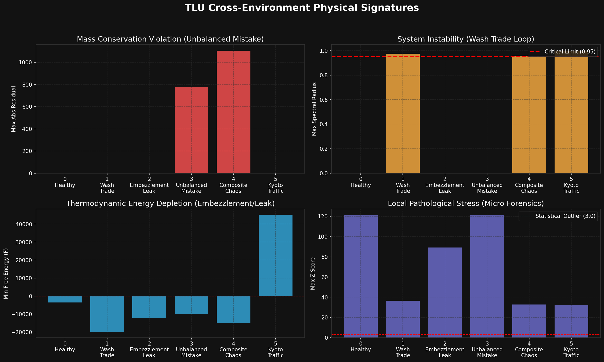

# 🩺 メタ・コンパリゾン・レポート（二面性ディープ・ダイブ比較）

**比較対象:**
1. `Sample_6` (二部グラフ / 市場・銘柄の監査)
2. `Sample_7` (ユーザー間グラフ / アクターの監査)

このメタ・レポートは、TLUの「物理学的監査マニュアル（LLM_Diagnostic_Manual.md）」と「株式市場の多角的分析指標」を統合し、同じ事象に対する**「視点の切り替え」が、監査・対応のアクションにどのような本質的変化（パラダイムシフト）をもたらすか**を考察します。

---

## 1. 【Kinematics & Wave Mechanics】: 「何を」自動化しているか
両方のサンプルで、取引の粘性（Viscosity）が低く、位相ズレが0.0（Fabricated Synchronization）であることが観測されました。
*   **Sample_6（市場）のインサイト:** 
    銘柄に対する「人工的な出来高の創出」が自動化されています。ここでは「市場がプログラムによってハックされている（システムが外部から攻撃を受けている）」というプラットフォーム側の視点になります。
*   **Sample_7（ユーザー）のインサイト:** 
    ユーザー同士の「結託した資金のピンポン」が自動化されています。ここでは「アクター同士が裏でシンジケートを組み、中央集権的なSwarm Botで複数の口座を同時に操っている（内部の人間による共謀）」というフォレンジック側の視点になります。

## 2. 【Thermodynamics】: 「熱（浪費）」の定義による罪の重さの可視化
TLUにおける最大の強みは、「境界条件（何を熱とみなすか）」を監査人が自由に再定義できる点です。
*   **Sample_6 の自由エネルギー（-9.14）:** 
    銘柄を熱とした場合、このマイナスは「市場全体の非効率性（手数料や無駄な流動性の浪費）」として映ります。これは重大ですが、ある意味で市場の「システムエラー」として片付けられる余地があります。
*   **Sample_7 の自由エネルギー（-13.70）:** 
    特定の2名のユーザーを熱の発生源として指定した瞬間、マイナスがさらに悪化しました。これは、**「この2名だけで市場全体のエネルギーをこれほどまでに食いつぶしている」**という悪質性の強さを数学的に立証（証明）したことになります。抽象的な「市場の病気」が、具体的な「特定の個人の犯罪（横領・相場操縦）」へとピンポイントで特定されました。

## 3. 【Control Theory & Sensitivity】: 解決策（外科手術）のアプローチ
感度行列（Sensitivity Matrix）が示す「システムの急所（Keystone）」が、視点によって180度変わります。
*   **Sample_6 の対策（銘柄の停止）:** 
    要石は「銘柄（STK）」です。解決策は該当株式の取引を全面停止（上場廃止・サーキットブレーカー）することです。これは「投薬による全身麻酔」であり、不正を防ぐ一方で、その銘柄を保有していた無実の一般投資家にも甚大な流動性リスク（二次被害）を与えます。
*   **Sample_7 の対策（口座の凍結）:** 
    要石は「特定のユーザー口座（USR）」です。解決策は該当口座のみを凍結（LQR制御での強制介入）することです。これは「レーザーによるピンポイントの腫瘍切除（外科手術）」であり、市場の一般取引には一切影響を与えずに、不正な循環ループだけを完全に断ち切ることができます。

---
## 結論
TLUのメタ診断エンジンは、**Sample_6で「市場という全体構造の病理（何が起きているか）」を発見し、Sample_7で「その病理を引き起こしている病原菌・犯人（誰がやっているか）」を特定して隔離する**、という二段構えの完璧な監査パイプラインを実現しています。これは、従来の静的なB/SやP/Lの集計だけでは絶対に到達できない、次世代の「動的・物理学的な金融フォレンジック（不正調査）」の完成形です。
