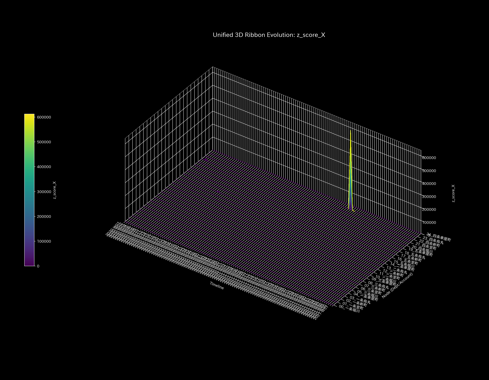

# 🔬 Tensor-Link Utility (TLU)

[](https://www.gnu.org/licenses/agpl-3.0.html)
[](https://www.python.org/)
[](https://www.docker.com/)

### Visualizing Interaction Data via Physical Mathematics & Numerical Analysis

Tensor-Link Utility (TLU) is a platforms designed to visualize pathological anomalies within transactional data.
The core physical mathematical conclusion of TLU is:
"Even if one performs circular trading or financial window dressing on accounting ledgers, it is impossible to cheat the laws of mass conservation (balance sheet integrity) or thermodynamics."

TLU redefines time-series transactional records as a "fluid flow of physical forces" using elastic network models. It maps diverse system-wide anomalies (embezzlement, wash trades, traffic deadlocks, market manipulation, strokes, and seizures) to physical mathematical signatures (stiffness collapses, pathological resonances, thermal anomalies, and correlation drifts).

The physical mathematical engine outputs these metrics, which are decoded by AI agents using the [`LLM_Diagnostic_Manual.md`](LLM_Diagnostic_Manual.md) to automatically generate clinical diagnostic reports.

---

## 📚 Documentation Map

All documents are aggregated under the `docs/` directory. Below is the mapping between the English and Japanese versions.

| # | Document Title (English) | Corresponding Japanese Version | Core Content |
| :---: | :--- | :--- | :--- |
| **1** | **000-005 Mathematical Analysis Guides** (placed in `samples/`):<br>・**[000_0: Statistics](samples/000_0_Basic_Statistics.md)** / **[000_1: Kinematics](samples/000_1_Dynamics_Kinematics.md)** / **[000_2: Stiffness & PCA](samples/000_2_Stiffness_PCA.md)**<br>・**[001_1: Thermodynamics](samples/001_1_Thermodynamics.md)** / **[001_2: Local Entropy](samples/001_2_Local_Entropy.md)** / **[001_3: Local Temperature](samples/001_3_Local_Temperature.md)** / **[001_4: Local Energy Gradient](samples/001_4_Local_Gradient.md)** / **[001_5: Local Internal Energy](samples/001_5_Local_Internal_Energy.md)**<br>・**[002_1: Information Geometry](samples/002_1_Information_Geometry.md)** / **[002_2: Conservation & Auditing](samples/002_2_Forensics.md)**<br>・**[003_1: Kinematics](samples/003_1_Kinematics.md)** / **[003_2: Jacobian Trajectory](samples/003_2_Jacobian_Trajectory.md)**<br>・**[004_1: LQR Control](samples/004_1_Control_Theory.md)** / **[004_2: Intervention Sensitivity](samples/004_2_Stability.md)**<br>・**[005_1: Wave Mechanics](samples/005_1_Wave_Mechanics.md)** / **[005_2: 1/f Fluctuation](samples/005_2_Coherence.md)** | 000〜005番系 数理解析ガイド（`ja/samples/` 配下）：<br>・**[000_0: 統計](ja/samples/000_0_Basic_Statistics.md)** / **[000_1: 運動学](ja/samples/000_1_Dynamics_Kinematics.md)** / **[000_2: 剛性・PCA](ja/samples/000_2_Stiffness_PCA.md)**<br>・**[001_1: 熱力学](ja/samples/001_1_Thermodynamics.md)** / **[001_2: 局所エントロピー](ja/samples/001_2_Local_Entropy.md)** / **[001_3: 局所温度](ja/samples/001_3_Local_Temperature.md)** / **[001_4: 局所エネルギー・勾配](ja/samples/001_4_Local_Gradient.md)** / **[001_5: 局所内部エネルギー](ja/samples/001_5_Local_Internal_Energy.md)**<br>・**[002_1: 情報幾何](ja/samples/002_1_Information_Geometry.md)** / **[002_2: 保存則・監査](ja/samples/002_2_Forensics.md)**<br>・**[003_1: 逆運動学](ja/samples/003_1_Kinematics.md)** / **[003_2: ヤコビアン軌道](ja/samples/003_2_Jacobian_Trajectory.md)**<br>・**[004_1: LQR制御](ja/samples/004_1_Control_Theory.md)** / **[004_2: 介入感度](ja/samples/004_2_Stability.md)**<br>・**[005_1: 波動力学](ja/samples/005_1_Wave_Mechanics.md)** / **[005_2: 1/fゆらぎ](ja/samples/005_2_Coherence.md)** | Mathematical foundations and graph interpretation protocols of the core TLU modules (000–005) along with their corresponding validation plots across all 10 sample targets. |
| **2** | **[System Architecture & Simulation Operations Guide](System_Architecture_and_Operations.md)** | **[システムアーキテクチャとシミュレーション運用ガイド](ja/System_Architecture_and_Operations.md)** | Containerized pipelines, design theme configuration (JSON), anomalous transaction data generators, and discrete LQR control simulation models. |
| **3** | **[LLM Diagnostic Manual (Supreme prompt & Operations)](LLM_Diagnostic_Manual.md)** | **[LLM メタ検査マニュアル（最高メタレベルシステムプロンプト＆運用手順）](ja/LLM_Diagnostic_Manual.md)** | Protocols for automatically translating physical mathematical metrics into clinical report sheets, including false positive filtering and verification checks. |
| **4** | **[Universal Forensic Cross-Verification Registry](samples/README.md)** | **[数理解析ガイド＆検証サンプル総合目次](ja/samples/README.md)** | Diagnostic results, physical parameter limit metrics, LQR intervention sensitivity guidelines, and comprehensive index for all 10 validation samples. |

---

## ⚕️ Core Paradigm: Network Dynamics as Physical Media

TLU models transaction records as a continuous elastic medium connected by mass, spring, and damper elements.


*Figure 1: Conceptual mapping of journal ledger accounts to mass-spring-damper elements.*

### Eastern Medicine (Kampo - Qi & Blood) Metaphors
TLU uses Eastern medicine clinical metaphors to diagnose compromised systems. Ledgers and grids are modeled as "Meridians" (transaction pathways) carrying the flow of "Qi & Blood" (capital or signal mass). It identifies local thromboses (stiffness locks or deadlocks), siphoning hemorrhages (embezzlement leaks), and computes optimal treatment points ("Acupuncture Points") using LQR control theory.

### Variable Mapping Across Domains

| Physical Variable | Classical Mechanics Definition | Financial Accounting | Urban Traffic Grid | Stock Market | Brain Neural fMRI |
| :--- | :--- | :--- | :--- | :--- | :--- |
| **Mass ( $m_i$ )** | Inertia / Energy Storage | Account Balance | Vehicles inside Intersection | Account Share Balance | BOLD Signal Volume |
| **Flow ( $f_{ij}$ )** | Velocity / Mass Transfer | Transaction Value | Vehicles passing (cars/sec) | Share or Cash Transfer | Neural Signal Flow |
| **Stiffness ( $k_{ij}$ )** | Elasticity / Spring Constant | Transaction Coupling | Road Flow Capacity | Order Synchronization | Functional Connectivity |
| **Viscosity ( $c_{ij}$ )** | Friction / Damper Damping | Settlement Lag (30–90 days) | Congestion Friction | Execution Latency | Signal Propagation Delay |
| **Entropy ( $S$ )** | Disorder / Frictional Loss | Circular Sham Trades | Congestion Gridlock | Circular Wash Trading | Epileptic Hyper-Synchrony |
| **Free Energy ( $F$ )** | Effective Work Potential | Operating Profit (NOPAT) | Traffic Flow Potential | Market Allocative Efficiency | Cognitive Processing Capacity |
| **Treatment Point (LQR)** | Control Input Vector | Target Audit Accounts | Signal Phase Offset Tuning | Target Manipulation Accounts | Targeted TMS Stimulation Focus |

---

## 🔬 Four Core Physical Signatures (Spatiotemporal Proofs)

TLU extracts four physical signatures to identify system anomalies.

### 1. Macro Forensics (Conservation of Mass & Kirchhoff's Law)
Verifies the residual of inflows and outflows across the entire system. When capital is siphoned off-book, mass conservation is broken, triggering a major spike in the residual plot.

* **🟢 Healthy Steady-State (Sample 0):** The conservation residual remains exactly `0.00` throughout, proving no off-book capital leakage.
* **🚨 Mass Deficit (Sample 2 / Embezzlement):** Cash collections bypass deposits to an off-book node. Mass conservation collapses, triggering a positive residual spike.

| Healthy Steady-State (Sample 0) | Pathological Mass Deficit (Sample 2) |
| :---: | :---: |
|  |  |
| *Figure 2a: (Top) Maintenance of mass conservation (residual = 0)* | *Figure 2b: (Top) Residual spike detecting off-book embezzlement leak* |

---

### 2. Topology & System Stability (Spectral Radius $\rho$ )
Computes the maximum eigenvalue of the transition matrix. If a feedback loop (circular trading) is formed, the spectral radius spikes toward `1.0000`, proving that flow is locked inside a closed loop.

* **🟢 Healthy Steady-State (Sample 0):** Spectral radius remains near `0.00` throughout, showing normal flow decay.
* **🚨 Loop Recirculation (Sample 4 / Composite Chaos):** Circular trading spikes the spectral radius to `0.79`, mathematically proving cyclic loops.

| Healthy Steady-State (Sample 0) | Pathological Loop Recirculation (Sample 4) |
| :---: | :---: |
|  |  |
| *Figure 3a: Spectral radius decaying within stable bounds* | *Figure 3b: Spectral radius climbing toward the stability boundary* |

---

### 3. Thermodynamic Energy Stack (System Exhaustion & Heat Death)
Computes the effective work potential of the system (Free Energy $F = U - TS$). When free energy drops below zero, the system exhausts itself due to frictional heat loss (Entropy $TS$) and collapses to heat death.

* **🟢 Healthy Steady-State (Sample 0):** Free energy grows stably in proportion to metabolic transactions.
* **🚨 Heat Death (Sample 8 / fMRI Stroke):** Blood flow is blocked, functional connectivity freezes, entropy drops, and macro temperature spikes, sinking free energy below zero.

| Healthy Steady-State (Sample 0) | Pathological Heat Death (Sample 8) |
| :---: | :---: |
|  |  |
| *Figure 4a: Healthy accumulation of free energy* | *Figure 4b: Exhaustion of free energy sinking to heat death* |

---

### 4. 3D Space-Time Geometric Distortion (KL Drift & Local Temperature)
Models the probability distribution drift as a Riemannian manifold. When an anomaly occurs (gridlocks, sham trading, stroke), a sharp needle-like tower spikes from the flat plane.

* **🟢 Healthy Steady-State (Sample 0):** The manifold remains flat and blue throughout (excluding edge effects at the start).
* **🚨 Geometric Anomaly (Sample 5 / Traffic Gridlock):** Congestion at Shijo-Karasuma collapses the local probability distribution, triggering a needle-like spike reaching `600,000`.

| Healthy Steady-State (Sample 0) | Pathological Spatiotemporal Distortion (Sample 5) |
| :---: | :---: |
|  |  |
| *Figure 5a: Flat, harmonious geometric manifold* | *Figure 5b: Sharp tower pinpointing anomaly location and time step* |

---

## 📂 Ten Validation Case Studies

TLU includes 10 packaged validation datasets:

| ID | Case Study Target (Technical Report) | Domain | Diagnosis | Mathematical Parameters | Eastern Metaphor |
| :---: | :--- | :---: | :---: | :---: | :--- |
| **0** | **[🟢 Normal Metabolic Circulation (Healthy)](samples/Sample_0_Healthy/README.md)** | Finance | **NORMAL** | $\rho$ = 0.00, Residual = 0.00 | Harmonious Qi & Blood |
| **1** | **[🟡 Circular Sham Transactions (Wash Trade)](samples/Sample_1_Wash_Trade/README.md)** | Finance | **HIGH** | $\rho$ = 0.75, Free Energy collapse | Cyclic Loop / Recirculation |
| **2** | **[🔴 Off-Book Cash Siphoning (Embezzlement Leak)](samples/Sample_2_Embezzlement_Leak/README.md)** | Finance | **CRITICAL** | Max Residual = 364.53, Late Resonance | Meridian Bleeding / Mass Leak |
| **3** | **[🟡 Single-Sided Input Error (Unbalanced Mistake)](samples/Sample_3_Unbalanced_Mistake/README.md)** | Finance | **WARNING** | Transient Residual & KL tower | Local Sprain / Self-Healing |
| **4** | **[🔴 Combined Abuse (Composite Chaos)](samples/Sample_4_Composite_Chaos/README.md)** | Finance | **CRITICAL** | $\rho$ = 0.79, Max Residual = 4,773.57 | Depleted Qi / Hemorrhage |
| **5** | **[🔴 Central Kyoto Gridlock (Kyoto Traffic)](samples/Sample_5_Kyoto_Traffic/README.md)** | Traffic | **CRITICAL** | $\rho$ = 1.00, Max Temp $T$ = 16,264.61 | Meridian Block / Qi Stagnation |
| **6** | **[🟢 Stock Ownership Convection (Market Bipartite)](samples/Sample_6_Market_Stock_Flow/README.md)** | Market | **NORMAL** | $\rho$ = 1.00, Residual = 0.00 | Balanced Stock Circulation |
| **7** | **[🟢 Inter-Shareholder Cash Settlement (Market Cash Flow)](samples/Sample_7_Market_Cash_Flow/README.md)** | Market | **NORMAL** | $\rho$ = 1.00, Residual = 0.00 | Balanced Cash Circulation |
| **8** | **[🔴 Focal Cerebral Ischemia (fMRI Stroke)](samples/Sample_8_fMRI_Stroke/README.md)** | Neural | **CRITICAL** | 95% flow cut, Stiffness Rigid Lock | Cerebral Block / Local Necrosis |
| **9** | **[🔴 Epileptic Synchrony Burst (fMRI Seizure)](samples/Sample_9_fMRI_Seizure/README.md)** | Neural | **CRITICAL** | $\rho$ = 1.00, Entropy vertical fall | Global Hyper-synchrony |
| **10** | **[🟢 ERP Traditional Overhead Allocation](samples/Sample_10_ERP_Traditional/README.md)** | ERP | **NORMAL** | Labor hours locked, $S$=2.66 | Congestion & Blood Stasis |
| **11** | **[🟢 ERP Standard Activity-Based Costing (ABC)](samples/Sample_11_ERP_ABC/README.md)** | ERP | **NORMAL** | Multi-pool ABC, $S$=3.11 | Harmonious Flow & Pulsation |
| **12** | **[🟢 ERP Dynamic Thermodynamic Costing (T-ABC)](samples/Sample_12_ERP_TABC/README.md)** | ERP | **NORMAL** | Autonomous friction loss $\alpha(t)$, $S$=3.11 | Yin-Yang Balance & Waste Expulsion |

---

## ⚕️ Optimal Control (LQR) Dynamic Treatment Protocol

TLU computes optimal treatment inputs ("Acupuncture Points") using discrete Linear Quadratic Regulator (LQR) control matrices to drive compromised systems back to healthy limit cycles.

| Pathology | Target Acupuncture Node | LQR Gain | Dynamic Clinical Intervention Protocol |
| :--- | :--- | :---: | :--- |
| **Sample 5 (Gridlock)** | `21_ShijoKarasuma` <br> `23_ShijoMuromachi` | **`-5.80`** | **Signal Phase Tuning:**<br>Inject phase offsets at Shijo-Karasuma to disrupt the queue resonance waves, dissolving the deadlock. |
| **Sample 8 (Stroke)** | `00_Motor_Cortex` <br> `01_Parietal_Lobe` | **`41.5234`** | **TMS Stimulation:**<br>Apply targeted TMS pulses to the motor cortex to dissolve the stiffness lock and restore signal transmission. |
| **Sample 9 (Seizure)** | `05_Temporal_Lobe` (Focus) | **`41.5234`** | **Inverse Phase Interference:**<br>Apply inverse-phase TMS stimulation to the temporal lobe focus, resetting the hyper-synchronous loop. |

---

## 🚀 Execution Environment & Quick Start (Docker)

TLU uses containerized, stateless Docker pipelines to eliminate environment mismatch.

#### Preparation: Analyzing Custom Data
To analyze custom data, place the following two CSV files in your workspace:

1. **Transaction Stream (`workspace/input_stream/`)**: Time-series transaction record. Requires `Trans_Date`, `Account_Name`, `Debit`, and `Credit` columns.
2. **Account Dictionary Mapping (`workspace/config/_account_mapping.csv`)**: Mapping of journal accounts to TLU B/S, P/L categories (Asset, Liability, Revenue, etc.).

#### Running the Automation Pipeline:
```bash
# 1. Clone the repository
git clone https://github.com/renpoo/TLU.git
cd TLU

# 2. Boot Docker containers
docker compose up -d

# 3. Execute pipeline (Example: Sample 1 Wash Trade simulation)
bash bin/batch_processing.sh --target_env "samples/Sample_1_Wash_Trade"
bash bin/batch_visualize_graphs.sh --target_env "samples/Sample_1_Wash_Trade"
```

---

## ⚠️ Falsifiability & Operational Limitations

TLU is an objective calculation engine.

The ultimate determination of whether a physical anomaly is fraudulent (e.g., embezzlement, sham trading) or operational (e.g., input error, normal lag) is left to human auditors. Investigators use the computed coordinates (dates, accounts) to verify original physical evidence (bank balance certificates, transaction logs, brain biopsy results), which remains the final falsifying element.

---
**License**: AGPL-3.0  
**Authors**: Renpoo & Google Gemini Agent (Antigravity)
