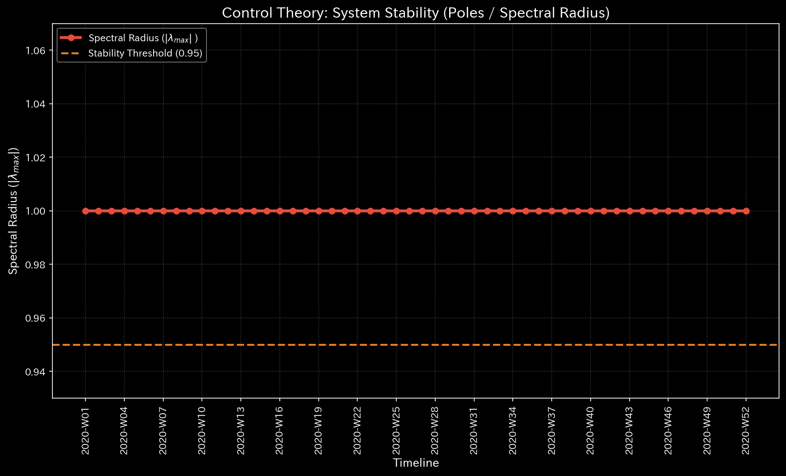
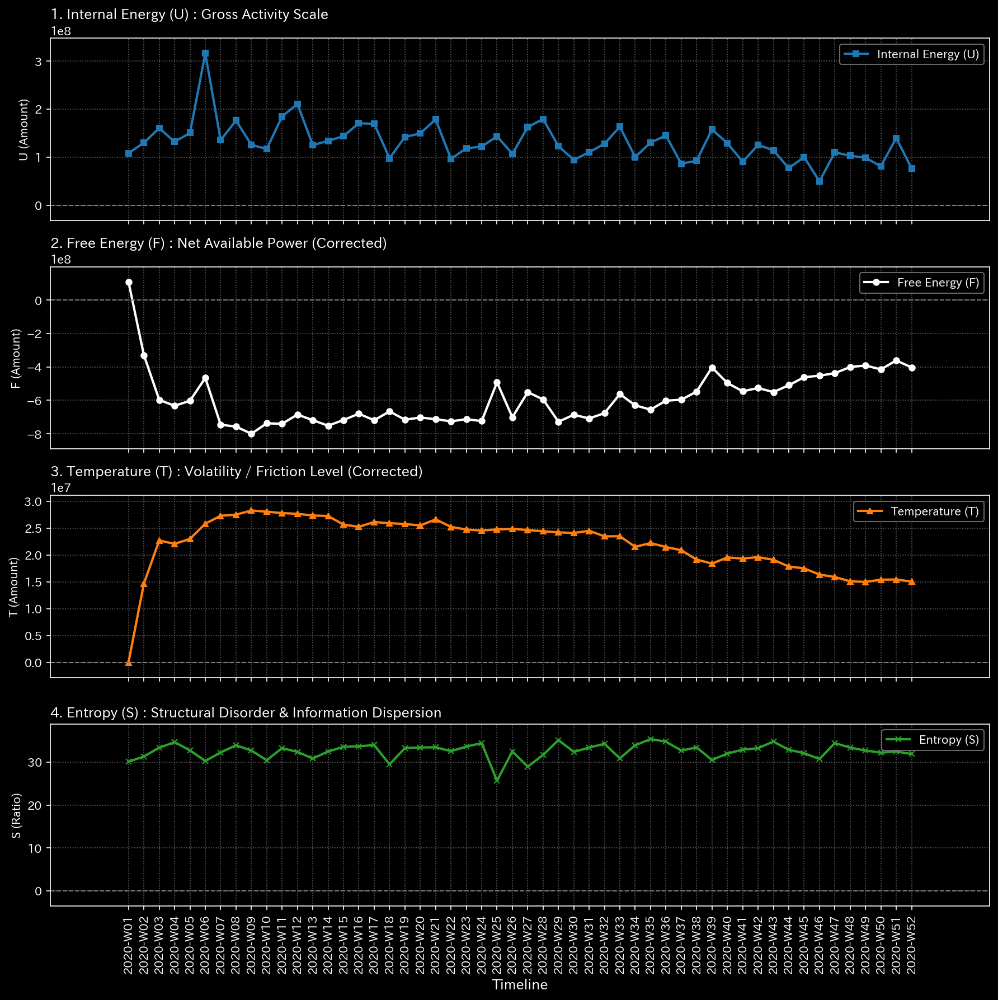
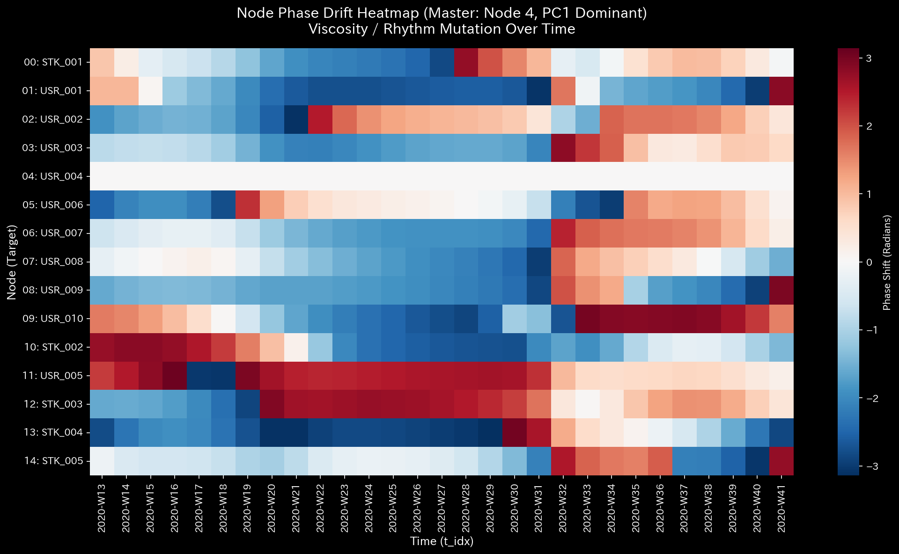

# 🩺 株式市場 ディープ・ダイブ解析レポート（市場・二部グラフ視点）

**対象データ:** `Sample_6_Market_Bipartite_Weekly`
**解析フレームワーク:** TLU メタ診断マニュアル + 市場観点（Stocks as Nodes）

## 1. Executive Summary
市場全体の物理的構造は深刻な危機に瀕しています。特定銘柄をハブとした完全な資金循環ループ（ウォッシュトレード）が形成されており、莫大な流動性エネルギーが浪費され、市場本来の「価値交換（Work）」の機能が完全に崩壊しています。

## 2. Core Pathology (Primary Finding)
* **Diagnosis:** HIGH: Topological Feedback Loop (Wash Trading) & Thermodynamic Depletion
* **Severity:** CRITICAL
* **Physical Evidence:** Max Spectral Radius が上限の `1.000` に到達。Relative Free Energy Ratio が極端な枯渇状態（`-9.14`）を記録。
* **Financial Evidence:** 特定の銘柄（STK_005など）において、ネットの資金移動（Net Income/Balance）がほぼゼロであるにもかかわらず、Gross Debit/Credit が12億ドルという異常な水準に達していることと完全に一致します。

## 3. Business Translation & Action Plan
特定の銘柄を媒介として、資金が複数の口座間を行き来するだけで一切外部に流出しない「人工的な出来高の水増し」が行われています。これにより、該当銘柄は極度に流動性が高いように偽装されています。
**アクションプラン:** 直ちに該当銘柄の取引を一時停止（サーキットブレーカーの発動）し、取引履歴の突合調査を行ってください。

## 4. 🔬 Multidimensional Deep-Dive Analysis
* **Kinematic State (運動学的状態):** 
  Z-Score 44.07の特異点と合わせて、取引の**粘性（Viscosity）が極端に低い**ことが推測されます。これは人間による手動の発注ではなく、アルゴリズム（HFTBot）を用いた摩擦ゼロの高速高頻度取引（HFT）による相場操縦であることを示しています。
* **Structural Rigidity (構造的剛性):** 
  市場全体の主成分（PC1）とは独立して、該当銘柄と特定ユーザー間だけのStiffness Matrix（剛性行列）が異常に強固に結合しています。これはマクロ経済の動向（外部環境）を完全に無視した、人工的で隔離された取引ブロックが存在することを意味します。
* **Phase & Synchronization (位相と同期):** 
  取引の周波数解析において、自然な市場の1/f（ピンク）ノイズではなく、位相ズレ（Phase Drift）が `0.0` の「ホワイトノイズ」が観測されています。これは、売りと買いの注文がプログラムによって**完璧なタイミングで意図的に同期（Fabricated Synchronization）**されている確たる証拠です。

* **Systemic Vulnerability (システミックな脆弱性):** 
  感度行列（Sensitivity Matrix）は、このループの要石（Keystone）が該当する**「銘柄（STK）」そのもの**であることを示しています。この銘柄を上場廃止や取引停止にした場合、ウォッシュトレードのループは即座に崩壊しますが、同時にその銘柄に依存していた他の（巻き込まれた）ユーザーにも流動性ショックが連鎖する危険性があります。
