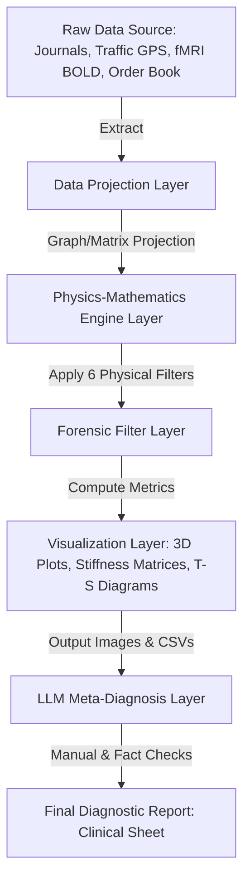

# 02. System Architecture & Simulation Operations Guide

Tensor-Link Utility (TLU) is a comprehensive diagnostic platform that handles everything from data ingestion, physical projection, visualization, to AI-driven meta-clinical checks. It is not just a single analysis tool.

This document serves as the system operations guide detailing TLU's design philosophy, data pipelines, color-theme engine, and simulation models.

---

## 🧭 Table of Contents

1. [Pipeline Architecture](#1-pipeline-architecture)
2. [Data Projection & Topology](#2-data-projection--topology)
3. [Visualizer Theme System](#3-visualizer-theme-system)
4. [Anomalous Data Generators](#4-anomalous-data-generators)
5. [TDD & LQR Control](#5-tdd--lqr-control)

---

## 1. Pipeline Architecture

TLU's transaction processing and inspection flow is defined as a multi-stage pipeline.

### Pipeline Layer Roles

1. **Data Projection Layer:** Projects heterogeneous time-series data into unified node-and-edge (flow volume) graph structures.
2. **Physics-Mathematics Engine Layer:** Applies 6 physical core calculations (Classical Stiffness, Thermodynamic Potential, Information Manifolds, LQR Feedback, Wave Coherence).
3. **Visualization Layer:** Renders the computed spatiotemporal data into diagnostic PNGs (3D trajectory ribbons, stiffness matrices, T-S plots).
4. **LLM Meta-Diagnosis Layer:** Decodes the physical mathematical outputs using the supreme meta-prompt ([`LLM_Diagnostic_Manual.md`](LLM_Diagnostic_Manual.md)) to automatically compile objective clinical diagnostic reports in Japanese.

---

## 2. Data Projection & Topology

TLU projects arbitrary ledger records onto a closed graph model. This projection strictly satisfies double-entry bookkeeping rules and Kirchhoff's current laws.

### Domain-to-Physics Mapping Rules

* **Accounting Ledger Domain:**
  * **Nodes:** Accounts (Cash, Accounts Receivable, Sales Revenue, COGS, etc.).
  * **Edges:** Transaction values moving between accounts (moving mass).
* **Urban Traffic Domain:**
  * **Nodes:** Road intersections.
  * **Edges:** Volume of vehicles flowing through road segments (fluid mass).
* **Financial Market Domain:**
  * **Nodes:** User accounts and traded asset tickers.
  * **Edges:** Share volume or cash value transferred.
* **Brain Neural (fMRI) Domain:**
  * **Nodes:** Brain Regions of Interest (ROIs) (Motor Cortex, Temporal Lobe, etc.).
  * **Edges:** Functional connectivity strength between regions (BOLD activity signal mass).

---

## 3. Visualizer Theme System

TLU's visualizer enforces visual consistency across different mathematical plots. It uses JSON theme configurations and distinct colormaps mapped to specific physical metrics.

### Colormap Mapping and Physical Rationale

* **Diverging Colormaps (`RdBu_r`, `coolwarm`, etc.)**:
  Used to display net flow values (inflow vs. outflow) or displacement from equilibrium. It captures two-way deviations from a zero baseline.
* **Sequential Colormaps (`inferno`, `magma`, `viridis`, etc.)**:
  Used to render continuous positive gradients such as Entropy, Local Temperature, and KL Drift.
* **Alert & Outlier Highlighting**:
  Healthy pathways are rendered in calm blues and greens. Outliers exceeding critical thresholds are highlighted in bright reds and magentas.

---

## 4. Anomalous Data Generators

The TLU repository packs synthetic generators to inject anomalies into baseline data, ensuring the robustness of the physical filters.

### Key Injection Algorithms & Timesteps

#### 1. Urban Traffic Gridlock Generator (`src/filters/_0_0_generate_dummy_traffic.py`)

* **Healthy Steady-State (t=0 to 50):** Cars circulate smoothly across 25 intersections. Spectral radius $\rho$ stays at `1.0000`, conservation residual is `0.00`, and temperature remains stable.
* **Anomaly Injection (t=51 / W52):** The outbound flow capacity of Shijo-Karasuma (`21_ShijoKarasuma`) is throttled by **95%**.
* **Physical Consequence (t=52 to 70):** Back-up queues form. Entropy drops at upstream Shijo-Muromachi. Flow volatility at Shijo-Karasuma drops to zero, freezing its temperature at `1.87`. A steep temperature gradient of `+65.31` forms, draining global free energy.

#### 2. Stock Market Collusion Generator (`src/filters/_0_0_generate_dummy_market.py`)

* **Healthy Steady-State (t=0 to 38):** Regular market volatility driven by whale selling (`USR_002`) and retail trading (`USR_010`).
* **Anomaly Injection (t=39 / W40 & t=45 / W46):** Colluding traders `USR_003` and `USR_004` execute 40 consecutive matched trades (equal price, equal size).
* **Physical Consequence (t=40 / W41):** Eigenvector PC1 loading concentrates heavily on `USR_003` (`0.72`) and `USR_004` (`-0.68`). The PC1 EVR locks at **`99.67%`**, capturing a severe stiffness lock. The phase difference between the two accounts drops to zero, and the free energy skewness decreases to **`-2.72`**.

---

## 5. TDD & LQR Control

TLU adopts Test-Driven Development (TDD). Every simulation checks physical metrics against preset thresholds.

When an anomaly is detected, a Linear Quadratic Regulator (LQR) controller computes the optimal control input vector $u(t)$ based on state-space equations:

$$u(t) = -K_{lqr} \cdot X(t)$$

The effect of the control input is verified by the attractor convergence speed and control error decay rate plot (`control_error_convergence.png`).

* **Control Examples:**
  * **Ledger Validation:** Dampens the dynamic loading on circular transaction hubs, pulling the spectral radius back into the safe zone ($\rho < 0.75$).
  * **Traffic Signal Phase Tuning:** Introduces signal offsets at bottleneck intersections to disrupt and cancel out gridlock queue waves.
