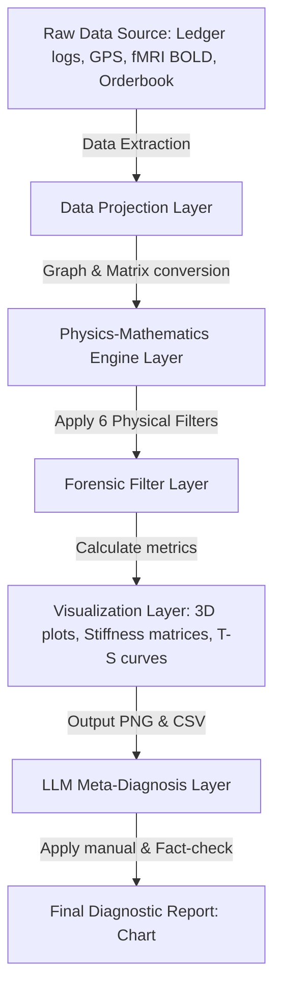

# 02. System Architecture & Simulation Operations Guide

Tensor-Link Utility (TLU) is a platform. It handles data ingestion, physical transformation, visualization, and automated AI analysis. TLU is not a single analysis tool.

This guide explains the system design of TLU. It covers the data pipeline, the visualizer theme engine, and the simulation models.

---

## 🧭 Table of Contents

1. [Pipeline Architecture](#1-pipeline-architecture)
2. [Data Projection & Topology](#2-data-projection--topology)
3. [Visualizer Theme System](#3-visualizer-theme-system)
4. [Anomalous Data Generators](#4-anomalous-data-generators)
5. [TDD & LQR Control](#5-tdd--lqr-control)

---

## 1. Pipeline Architecture

The TLU data pipeline is defined as a multi-layer pipeline.

### Role of Each Pipeline Layer

1. **Data Projection Layer:** Projects raw data into a graph structure of nodes and edges (flux).
2. **Physics-Mathematics Engine Layer:** Computes metrics using 6 physical filters. It calculates classical stiffness, thermodynamics, information manifolds, LQR feedback, and wave coherence.
3. **Visualization Layer:** Renders spatial-temporal data into PNG images. These include 3D ribbons, matrices, and T-S curves.
4. **LLM Meta-Diagnosis Layer:** Generates an objective diagnosis report using LLM. It uses the manual prompt [LLM_Diagnostic_Manual.md](LLM_Diagnostic_Manual.md) to interpret the physics engine data.

---

## 2. Data Projection & Topology

TLU projects data onto a closed graph. This algorithm satisfies double-entry bookkeeping rules and Kirchhoff's conservation laws.

### Domain Mapping Rules

* **Financial Domain (Ledgers):**
  * **Nodes:** Ledger accounts (e.g., Cash, Receivables, Revenue, Purchases).
  * **Edges:** Transaction amounts (moving mass).
* **Urban Traffic Domain:**
  * **Nodes:** Intersections.
  * **Edges:** Number of vehicles on road links (fluid mass).
* **Financial Market Domain:**
  * **Nodes:** USR accounts and tickers.
  * **Edges:** Volume of cash and shares traded.
* **Brain fMRI Domain:**
  * **Nodes:** Functional regions (e.g., Motor Cortex, Temporal Lobe).
  * **Edges:** Functional connectivity strength (BOLD signal mass).

---

## 3. Visualizer Theme System

TLU standardizes the style of all mathematical plots. It uses JSON files to manage theme colors. TLU maps specific colormaps to different physics metrics.

### Color Palette Allocation & Physical Meaning

* **Diverging Colormaps (e.g., `RdBu_r`, `coolwarm`):** Shows positive and negative net flux. Used to visualize deviations from a zero baseline.
* **Sequential Colormaps (e.g., `inferno`, `magma`, `viridis`):** Visualizes continuous gradients. Used for metrics like entropy, local temperature, and KL drift.
* **Anomaly Highlights:** Healthy data uses blue and green. Values exceeding critical thresholds are highlighted in red and pink.

---

## 4. Anomalous Data Generators

The TLU environment includes anomalous data generators. They create test datasets to evaluate model robustness.

### Injection Algorithms & Time Steps

#### 1. Urban Traffic Deadlock Generator (`src/filters/_0_0_generate_dummy_traffic.py`)

* **Normal State (t = 0 to 50):** Vehicles circulate through 25 intersections. The spectral radius $\rho$ = 1.00$ and the macro residual is `0.00`. Local temperature remains stable.
* **Anomaly Injection (t = 51 / W52):** The outflow capacity at `23_Shijo_Karasuma` is restricted to **5%**.
* **Physical Result (t = 52 to 70):** Traffic backflow begins. Entropy drops at the upstream `Shijo_Muromachi`. Flow volatility vanishes at `Shijo_Karasuma`. Its local temperature locks at `1.87`. A temperature gradient of `+65.31` forms. Total free energy decreases.

#### 2. Financial Market Collusion Generator (`src/filters/_0_0_generate_dummy_market.py`)

* **Normal State (t = 0 to 38):** Reflects organic trading. This includes liquidations by whale `USR_002` and retail trades by `USR_010`.
* **Anomaly Injection (t = 39 / W40 & t = 45 / W46):** Accounts `USR_003` and `USR_004` execute 40 matched orders. Trades use the identical price and volume.
* **Physical Result (t = 40 / W41):** Eigenvector loadings concentrate on `USR_003` (`0.72`) and `USR_004` (`-0.68`). The PC1 explanation ratio spikes to **`99.67%`**, causing a stiffness lock. The phase difference between them drops to zero. Free energy skewness plummets to **`-2.72`**.

---

## 5. TDD & LQR Control

TLU follows Test-Driven Development (TDD). The simulator verifies that metrics stay within expected parameter ranges.

When anomalies occur, a Linear Quadratic Regulator (LQR) controller calculates control inputs $u(t)$ based on a state-space model:

$$u(t) = -K_{lqr} \cdot X(t)$$

The effect of this control is visualized. It shows attractor convergence speed and error reduction rates (`control_error_convergence.png`).

* **Intervention Examples:**
  * **Ledger Validation:** Dampens dynamic loadings on loop hubs. This pulls the spectral radius back into a safe zone ( $\rho < 0.75$ ).
  * **Signal Phase Offset:** Adjusts traffic light offsets near bottlenecks. This cancels out deadlocked circulation waves.
