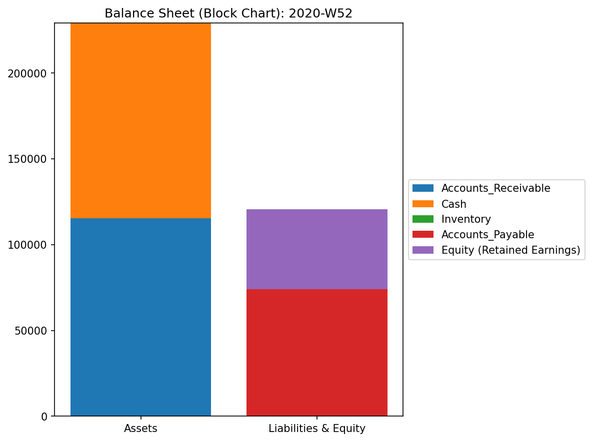
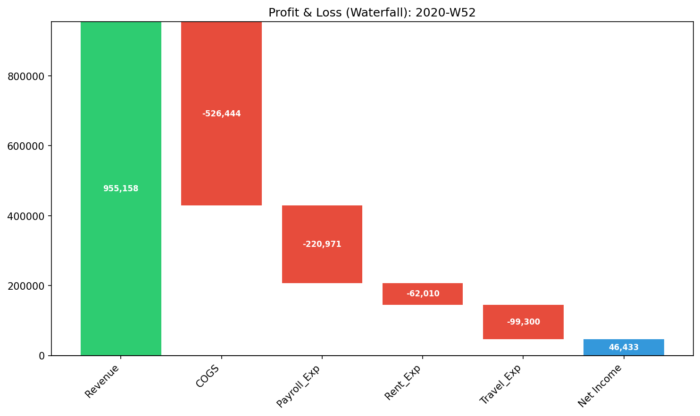
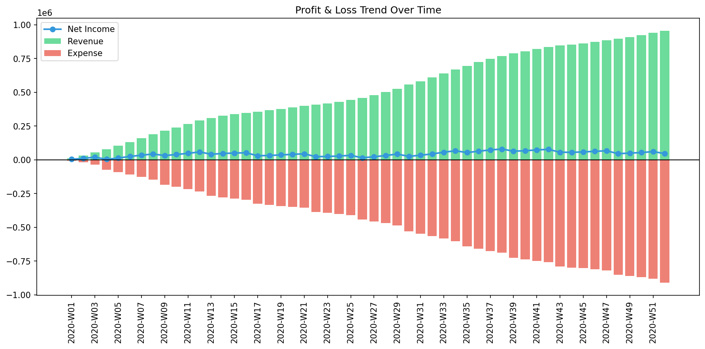

# 00. Financial Statements

Before projecting the raw journal data into the multi-dimensional physics space, TLU automatically generates standard Investor Relations (IR) style charts. These serve as your grounding baseline.

---

### 1. Balance Sheet Block Chart (`000_0_1__BS_Block_Total.png`)

* **📊 Visual Structure**: A traditional side-by-side stacked bar chart.
  * **Left Column**: Assets (Cash, Accounts Receivable, Inventory).
  * **Right Column**: Liabilities (Accounts Payable) + Equity (Retained Earnings).
* **📐 Accounting Theory**: The fundamental equation: $Assets = Liabilities + Equity$.
* **🚨 Anomaly Detection**:
  * Check the total height: If the left and right columns are not perfectly identical in height, the underlying double-entry journal data is mathematically broken (e.g., unbalanced debits/credits).
  * Check the Equity block: If the 'Retained Earnings' block extends *below* the zero line, the company has accumulated a net loss.
* **💼 Business Translation**: This is the ultimate snapshot of organizational health. Use this to verify that the raw data conforms to basic double-entry bookkeeping rules before trusting any advanced anomaly scores.

---

### 2. Profit & Loss Waterfall (`000_0_1__PL_Waterfall_Total.png`)

* **📊 Visual Structure**: A cascading step chart.
  * **Start (Green Bar)**: Total Sales Revenue pointing upward.
  * **Steps (Red Bars)**: Various expense categories (COGS, Payroll, Rent, Travel) pointing downward.
  * **End (Blue Bar)**: Net Income, floating to connect the final step to the baseline.
* **📐 Accounting Theory**: The flow of profitability: $Revenue - \sum Expenses = Net Income$.
* **🚨 Anomaly Detection**:
  * Look for disproportionately massive red steps.
  * Compare the size of the final blue bar (Net Income) to the initial green bar (Revenue) to visually gauge the profit margin.
* **💼 Business Translation**: Visualizes margin erosion. A sudden, massive red block (e.g., in Travel Expenses) compared to historical norms warrants an immediate audit of that specific department. It perfectly visualizes *how* the revenue was consumed.

---

### 3. Profit & Loss Trend (`000_0_1__PL_Trend.png`)

* **📊 Visual Structure**: A time-series bar and line chart.
  * **X-Axis**: Time (Weeks, Months, or Quarters, depending on your pre-aggregation settings).
  * **Y-Axis**: Monetary Value.
  * **Green Bars**: Revenue per period.
  * **Red Bars**: Expenses per period (plotted downwards from 0).
  * **Blue Line**: Net Income trend over time.
* **📐 Accounting Theory**: Tracking profitability momentum over the fiscal period.
* **🚨 Anomaly Detection**:
  * Look for the blue line (Net Income) dipping below the 0-axis into the negative zone.
  * Look for sudden, inexplicable spikes in the red expense bars during periods where the green revenue bars are stagnant.
* **💼 Business Translation**: Reveals seasonal volatility and structural fixed costs. If revenue dips but expenses remain rigid, the blue line will plunge, indicating an inflexible, high-risk operational structure.
