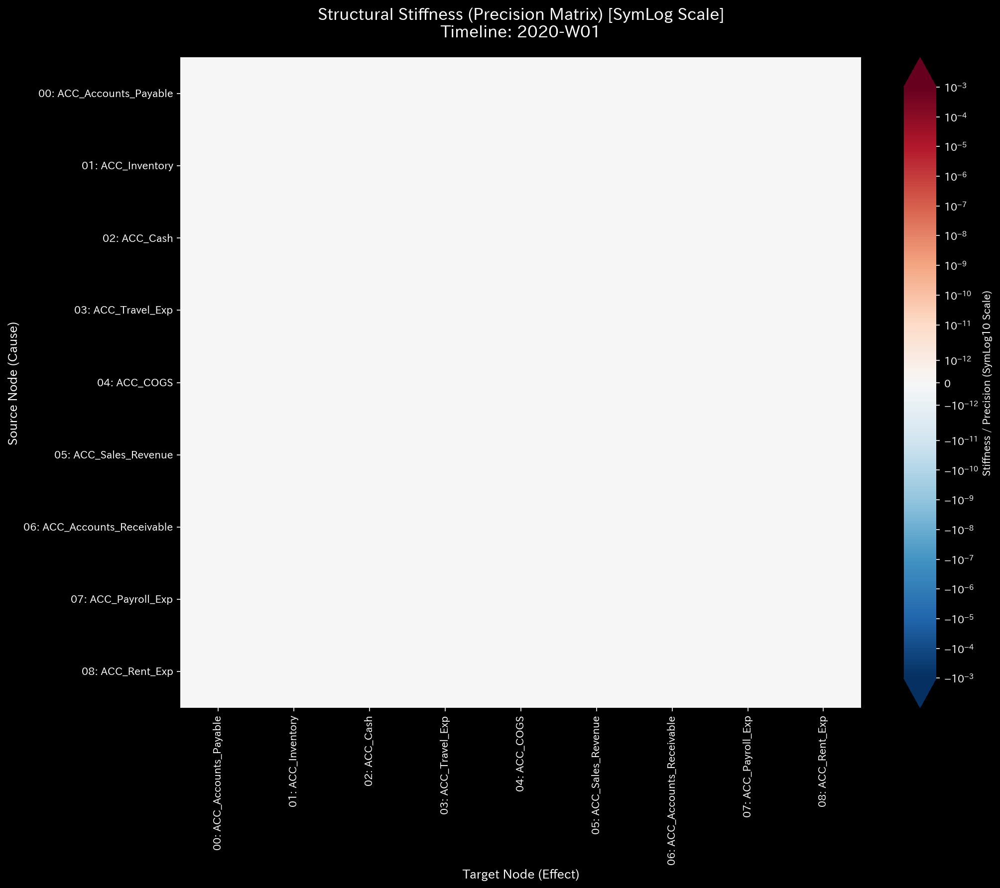
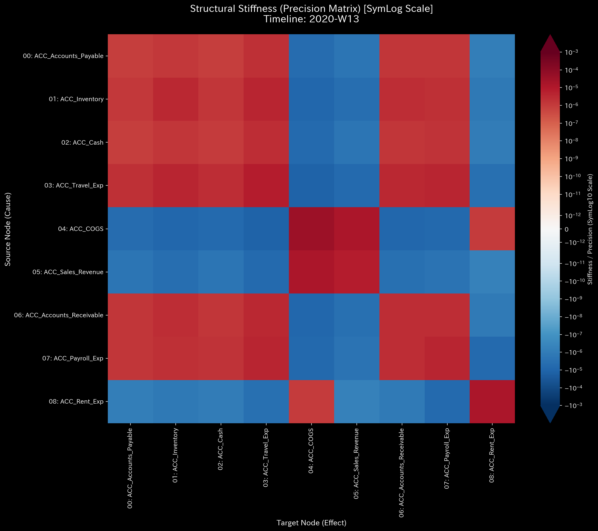
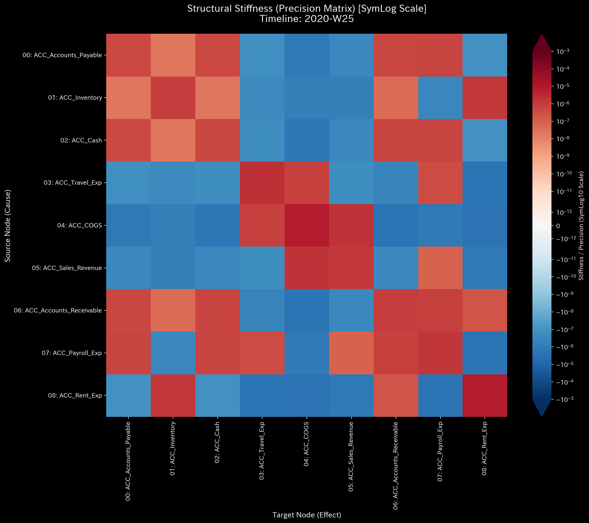
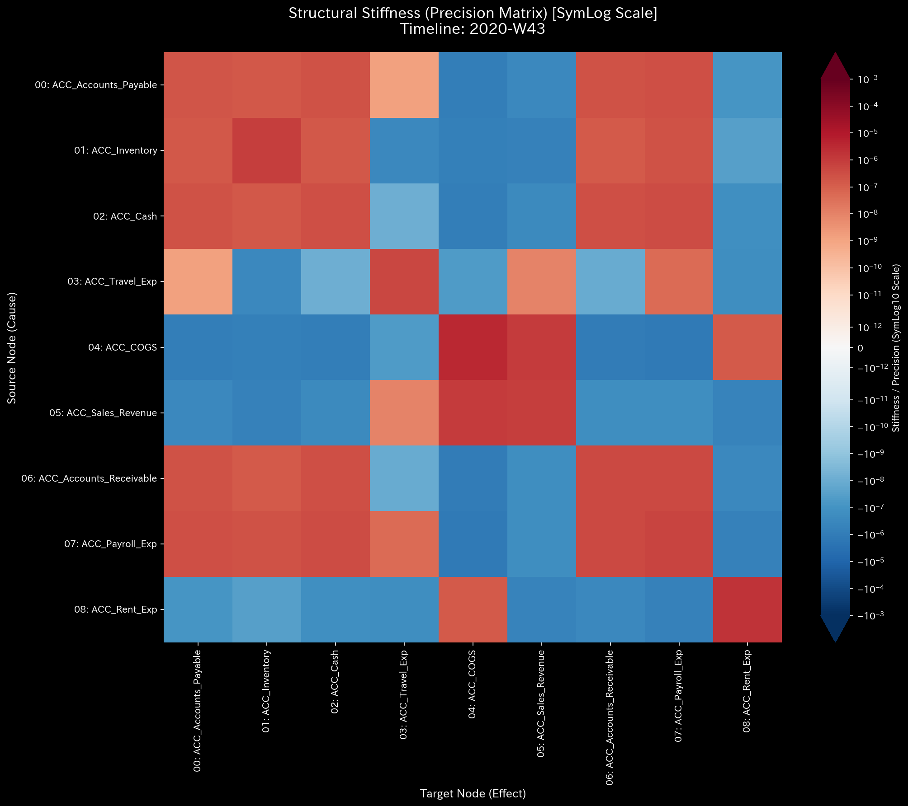

# 01. Classical Mechanics & Stiffness

Once the data is pre-processed, TLU projects the financial ledgers into a physics engine. This phase calculates the fundamental kinematic properties (Velocity, Acceleration) and the structural properties (Stiffness, Inertia, Viscosity) of the organization.

---

### 1. 3D Dynamics: Velocity (`000_1_1__3d_dynamics_velocity.png`)

* **📊 Visual Structure**: A 3D phase space graph. The axes represent the network's principal dimensions. The trajectory (the winding line) traces the *rate of change* (Velocity) of the money flow over time.
* **📐 Physics Theory**: The first derivative of the ledger flux. How fast is the volume of money moving through the accounts compared to the previous time step?
* **🚨 Anomaly Detection**:
  * **Healthy**: A stable, tight orbital cluster or a smooth, predictable spiral.
  * **Anomalous**: A sudden, violent jagged spike shooting far away from the central cluster.
* **💼 Business Translation**: A massive cash flow hemorrhage, an unexpected mass payment, or a sudden halt in sales. The organization's monetary flow velocity experienced a severe shock.

---

### 2. 3D Dynamics: Acceleration (`000_1_2__3d_dynamics_acceleration.png`)

* **📊 Visual Structure**: Similar to Velocity, but tracking the 3D trajectory of *Acceleration*.
* **📐 Physics Theory**: The second derivative of the ledger flux. Is the speed of money flow increasing or decreasing? This represents the net external force ($F_{ext}$) applied to the system.
* **🚨 Anomaly Detection**:
  * Extreme spikes or chaotic, wildly dispersed scatter plots.
* **💼 Business Translation**: Management interventions, external market shocks, or massive fraudulent injections. If velocity is speed, acceleration is someone aggressively slamming on the gas or the brakes.

---

### 3. Structural Stiffness Heatmap (`000_2_1__structural_stiffness.t.*.png`)

*Note: TLU generates a sequence of these images over time. You may need to flip through them like a flipbook.*

* **📊 Visual Structure**: A matrix (grid) heatmap. Rows and Columns represent different accounts. The color intensity of each cell represents the "Stiffness" between those two accounts.
* **📐 Physics Theory**: Hooke's Law ($K$). The "spring constant" or structural coupling between two nodes. It measures how deterministically one account reacts to another.
* **🚨 Anomaly Detection**:
  * **Collapse**: A cell that is historically dark (stiff) suddenly turns light or blank.
  * **Rupture/Short-Circuit**: An unexpected, glowing dark spot appears between two accounts that should have no relationship.
* **💼 Business Translation**:
  * **Collapse**: A broken business process. If the Sales $\to$ Accounts Receivable stiffness collapses, it means sales are being made, but receivables are no longer being generated in tandem (e.g., off-book sales, invoicing system failure).
  * **Rupture**: Unauthorized pathways. If Travel Expenses and Accounts Payable suddenly develop a massive stiffness, it indicates expenses are bypassing standard procedures and being dumped directly into liabilities (a classic kickback or embezzlement signature).

---

### 4. Principal Axes Ratio (`000_2_2__principal_axes_ratio.png`)

* **📊 Visual Structure**: A simple bar or line chart showing the ratio of variance captured by the top 3 principal components (PC1, PC2, PC3).
* **📐 Physics Theory**: Principal Component Analysis (PCA). It calculates how many dimensions the organization needs to operate.
* **🚨 Anomaly Detection**:
  * A sudden drop in the variance of PC2 or PC3, with PC1 shooting up to nearly 1.0 (100%).
* **💼 Business Translation**: The organization has lost its operational diversity. All money is being forced through a single bottleneck or pathway. This often happens during "Wash Trading" schemes, where all funds are cyclically pumped through a single, massive artificial transaction loop, drowning out normal, diverse business operations.
