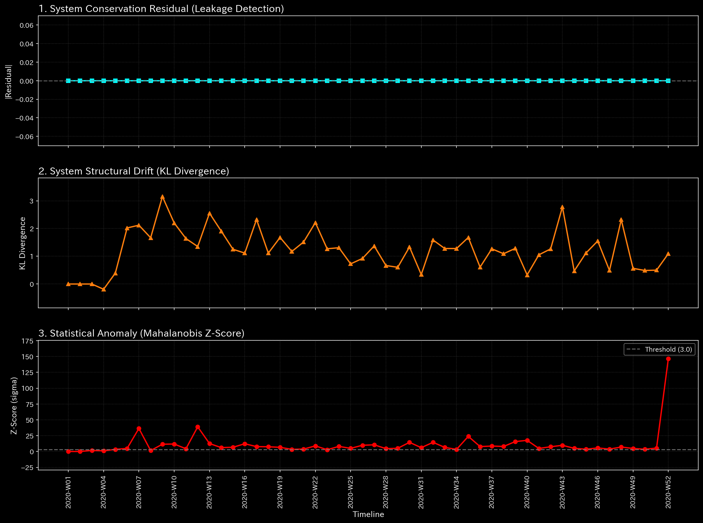
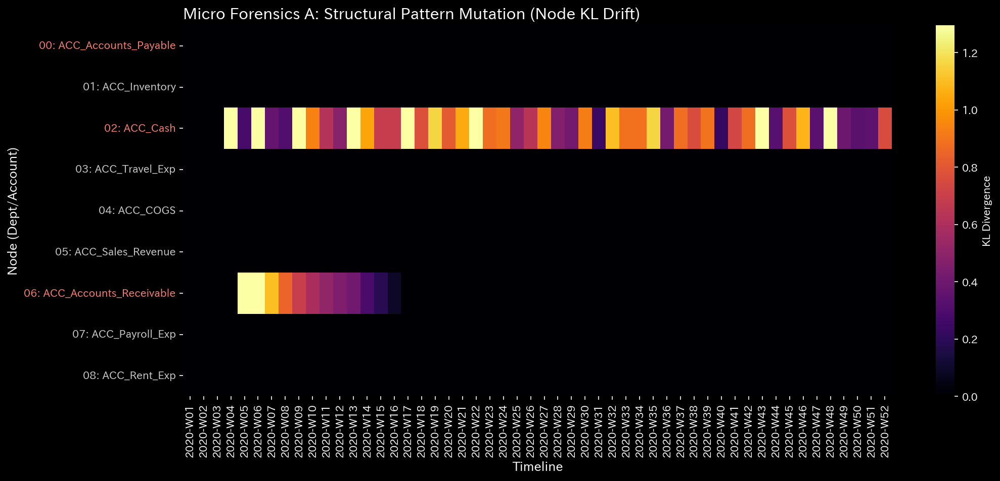
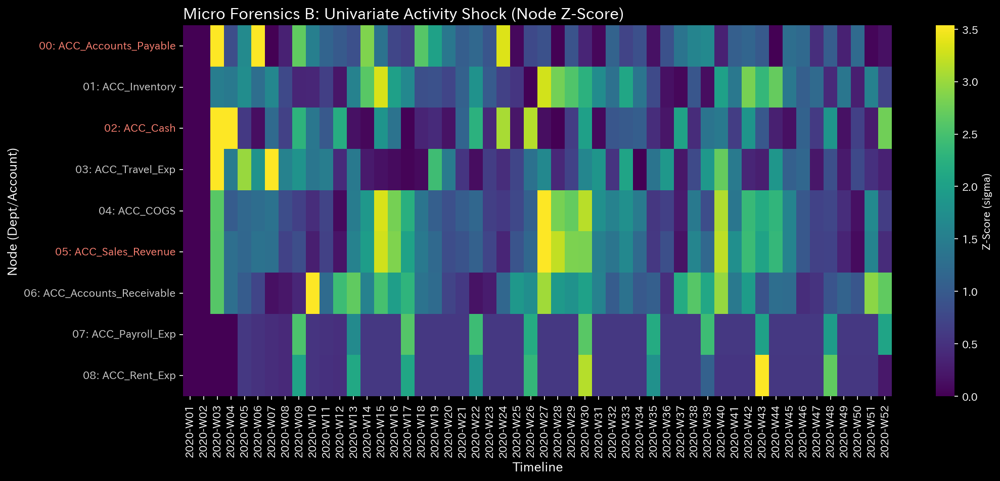
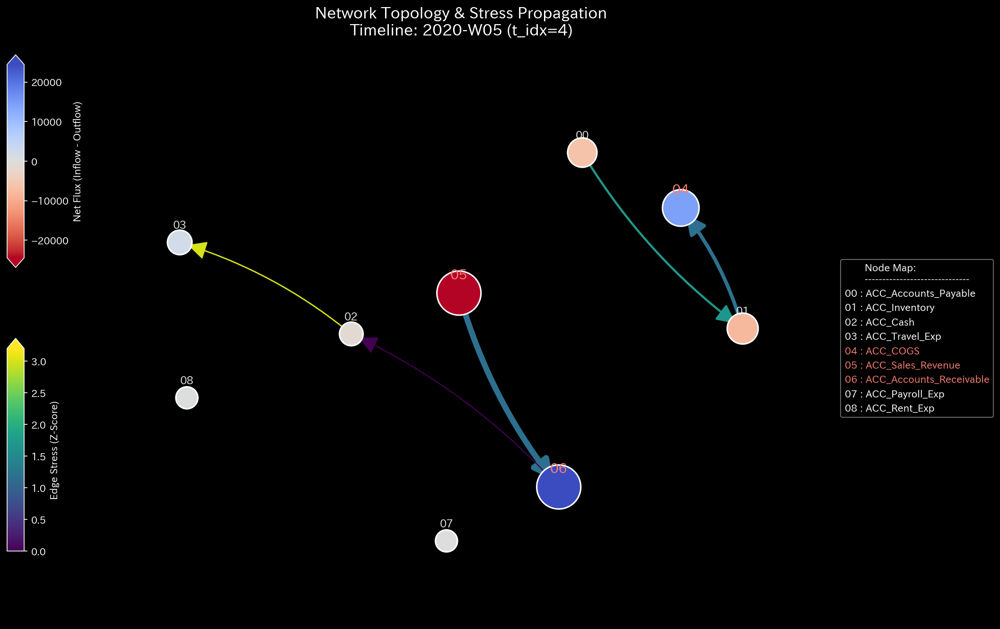
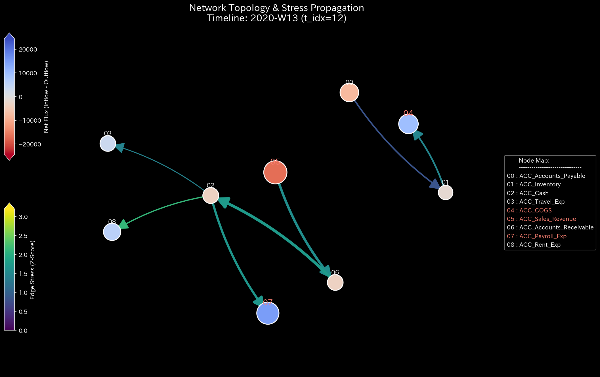

# 002. Info Geometry and Forensics

This is the most critical phase for **fraud detection and auditing**. By analyzing the shape (geometry) of the data distribution and strictly enforcing conservation laws, TLU detects hidden manipulation that traditional balancing methods miss.

---

### 1. Macro Forensics Z-Score (`002_2_1__macro_forensics_dashboard.png`)

* **📊 Visual Structure**: A line graph plotting the overall network "Z-Score" over time.
* **📐 Physics Theory**: Kirchhoff’s Current Law (Conservation of Energy). Money cannot be created or destroyed. The Z-Score mathematically measures the severity of any violation of this law across the entire ledger.
* **🚨 Anomaly Detection**:
  * A spike exceeding a Z-Score of **2.0** or **3.0**.
* **💼 Business Translation**: **A Broken Ledger**. Someone forced a journal entry where Debits do not equal Credits, or money was siphoned out of the system without a corresponding entry. This is the strongest mathematical proof of either a severe data-entry error or outright embezzlement.

### 2. Micro Z-Score / KL Drift Heatmaps (`002_2_2_1__micro_KL_drift_heatmap.png`, `002_2_2_2__micro_Z_Score_heatmap.png`)

* **📊 Visual Structure**: Matrix heatmaps. The X-axis is time, the Y-axis is specific accounts. Dark red/bright colors indicate high stress.
* **📐 Physics Theory**: Information Geometry (Kullback-Leibler Divergence). Measures how much the probability distribution of a specific account has unexpectedly mutated compared to its historical behavior.
* **🚨 Anomaly Detection**:
  * A specific account (e.g., `ACC_Payroll_Exp`) suddenly lighting up bright red at a specific time index $t$.
* **💼 Business Translation**: **Pinpointing the Fraudster**. While the Macro dashboard tells you a crime occurred, the Micro heatmap tells you exactly *which account* was manipulated. If Payroll lights up red, look for ghost employees or unauthorized bonus payouts.

### 3. Network Topology / Node-Link Diagrams (`002_1_2__network_topology.t.*.png`)

*Note: TLU generates a sequence of these images over time. You may need to flip through them like a flipbook.*

* **📊 Visual Structure**: A web of nodes (accounts) connected by lines (money flow). The thickness of the lines represents the volume of flow.
* **📐 Physics Theory**: Graph Theory. Visualizing the actual plumbing of the organization's finances.
* **🚨 Anomaly Detection**:
  * A node suddenly changing position wildly, or a thick red line appearing between two nodes that normally don't interact.
* **💼 Business Translation**: **Visualizing the Crime Scene**. You can physically see the flow of money being diverted. If a thick line suddenly connects "Inventory" directly to an unknown "Suspense Account," you are looking at a visual representation of inventory theft.

### 4. Manifold Dimensionality / Effective Rank (`002_1_3__manifold_dimensionality.png`)

* **📊 Visual Structure**: A line graph showing a single metric (Effective Rank) over time.
* **📐 Physics Theory**: Singular Value Decomposition (SVD). Calculates the true mathematical dimensionality of the network. A healthy organization requires multiple dimensions (Sales, Payroll, Inventory, etc.) to function.
* **🚨 Anomaly Detection**:
  * The dimensionality line suddenly plunging downwards (e.g., dropping from 8 dimensions down to 2).
* **💼 Business Translation**: **Artificial Centralization**. The organization's natural diversity has collapsed. All financial activity is being forced through a single bottleneck. This is a classic signature of **Wash Trading**, where fake transactions are looped rapidly through a single set of accounts to artificially inflate volume, starving the rest of the business.
