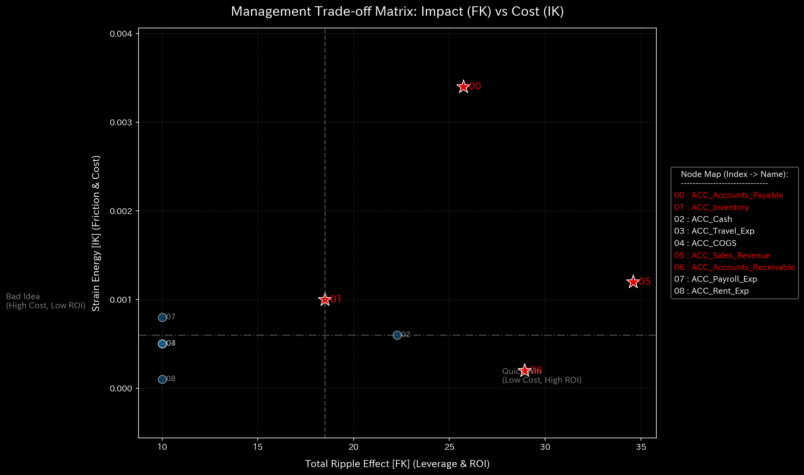

# 004_ControlTheory_and_Stability

This phase answers the question: "How do we steer this organization back to health without tearing it apart?" TLU uses advanced control systems engineering to calculate the optimal path forward and warns of impending structural collapse.

---

### 1. Control Error Convergence (`004_1_2__control_error_convergence.png`)

* **📊 Visual Structure**: A line graph mapping the mathematical "Error" (the distance between the current state and the target healthy state) over multiple calculation iterations.
* **📐 Physics Theory**: Linear-Quadratic Regulator (LQR). It simulates an autopilot trying to steer the company. This graph shows if the autopilot can successfully reach the destination.
* **🚨 Anomaly Detection**:
  * The line bounces wildly, spikes upwards, or flatlines high above zero without ever converging to the bottom.
* **💼 Business Translation**: **Uncontrollable Organization**. The organization's processes are so chaotic or deeply broken that even mathematical optimization cannot find a safe path back to health. Management interventions will likely fail or cause unintended side effects.

### 2. Control LQR Performance Space (`004_1_3__control_lqr_performance_space.png`)

* **📊 Visual Structure**: A 3D landscape or contour map showing the "Cost" of different intervention strategies.
* **📐 Physics Theory**: The LQR Cost Function ($J$). It maps out the trade-off between "How fast we fix the problem" vs. "How much organizational strain the fix will cause."
* **🚨 Anomaly Detection**:
  * A jagged, steep "canyon" landscape instead of a smooth, predictable bowl.
* **💼 Business Translation**: **High-Risk Interventions**. A steep landscape means that even a tiny mistake in management's intervention (e.g., cutting payroll by 12% instead of 10%) will cause catastrophic organizational strain and push the company into chaos.

### 3. System Stability / Spectral Radius (`004_1_2__system_stability.png`)

* **📊 Visual Structure**: A time-series line tracking a single metric (Spectral Radius). A critical red threshold line is usually drawn at **1.0**.
* **📐 Physics Theory**: Eigenvalue Analysis of the Transition Matrix. If the absolute value of the largest eigenvalue exceeds 1.0, the mathematical system is formally unstable and will diverge to infinity.
* **🚨 Anomaly Detection**:
  * The blue line pierces the 1.0 threshold and stays there.
* **💼 Business Translation**: **The Death Spiral**. The organization has entered an explosive, self-reinforcing feedback loop. This happens during severe **Wash Trading**, Ponzi schemes, or uncontrollable debt spirals. The system is feeding on itself and will mathematically self-destruct if external intervention is not applied immediately.

### 4. Trade-off Heatmap / Sensitivity Matrix (`004_2_1__sensitivity_matrix.png`, `004_2_2_1__tradeoff_heatmap.png`)

* **📊 Visual Structure**: Heatmaps showing how sensitive one variable is to changes in another.
* **📐 Physics Theory**: Partial derivatives. If I change $X$ by 1 unit, how much does $Y$ change?
* **🚨 Anomaly Detection**:
  * A sudden, bright color indicating extreme hypersensitivity where there used to be none.
* **💼 Business Translation**: **Fragility**. The organization has become hypersensitive to a specific factor. For example, if the matrix shows that Cash has become extremely sensitive to minor fluctuations in Travel Expenses, it means the company's liquidity buffer is gone, and even minor overspending will trigger a cash crisis.
