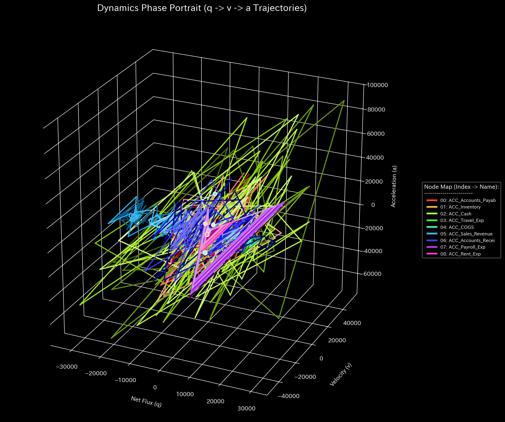

# 000_1: 運動学と動的状態空間 (Dynamics & Kinematics)

本ガイドは、Tensor-Link Utility (TLU) における運動学および動的状態空間分析モジュール（`000_1`）の各検証サンプルの出力と数値に基づく臨床解説をまとめたものです。

---

## 1. 3次元動的軌道リボン・位相空間プロット (`000_1_8__phase_portrait_3d.png` 等)
位置 $X$、速度 $\dot{X}$、加速度 $\ddot{X}$ から構築される3次元の位相空間軌道、または外力影響下の3次元力学特性（`000_1_6__3d_dynamics_external_force.png`）を示すグラフです。システムの動的安定性とカオス性を判別します。

#### 🟢 Sample 0 (正常代謝)
**臨床解説:**
軌道リボンが特定の安定アトラクター（リミットサイクル）へ安定的に収束しており、外部のショックを弾性的にいなして定常軌道を維持しています。

#### 🟡 Sample 1 (循環取引)
**臨床解説:**
軌道リボンが多次元的な広がりを失い、完全に平坦な二次元平面に押し潰された往復運動を繰り返しており、自由度の大幅な喪失（還流ロック）を証明します。

#### 🔴 Sample 2 (資金横領)
**臨床解説:**
簿外への資金流出により、系内の活動質量が失われたことで結合バネ剛性が破綻し、外部加振に対して10億スケールの病的共振（激しい発散）を起こしています。

#### 🟡 Sample 3 (入力ミス)
**臨床解説:**
仕訳入力ミスが発生した瞬間に軌道が平衡点から鋭く弾き飛ばされますが、還流等の病的構造はないため、翌期に正常アトラクターへ自律復元（自己治癒）します。

#### 🔴 Sample 4 (複合アノマリー)
**臨床解説:**
循環取引の強制同期と横領による質量散逸が同時に襲ったことで、アトラクターが完全に崩壊し、軌道は制御不能なカオス的無限発散へと突入しています。

#### 🔴 Sample 5 (京都交差点網)
**臨床解説:**
主要交差点の容量飽和（粘性ダンピングの無限大化）によって、状態の動的軌道が身動きの取れない「特異平面」に固定化され、渋滞デッドロックを示しています。

#### 🔴 Sample 8 (fMRI 脳梗塞)
**臨床解説:**
梗塞発生（$t=30$）の瞬間、運動野の活動質量（血流）が消滅し、軌道は別の低機能状態アトラクターへと不連続にジャンプ（相転移）して固定化されます。

#### 🔴 Sample 9 (fMRI てんかん発作)
**臨床解説:**
全脳領域が異常周波数にハックされた結果、3次元軌道リボンは複雑性をすべて失い、単一サイン波の単調な円軌道へと完全にフリーズ（過同期）しています。

