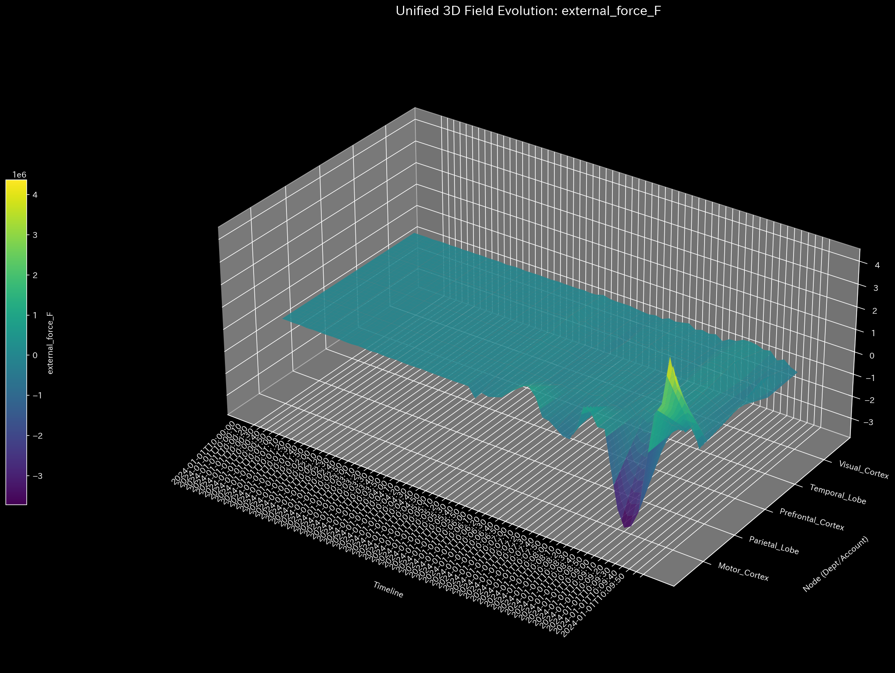
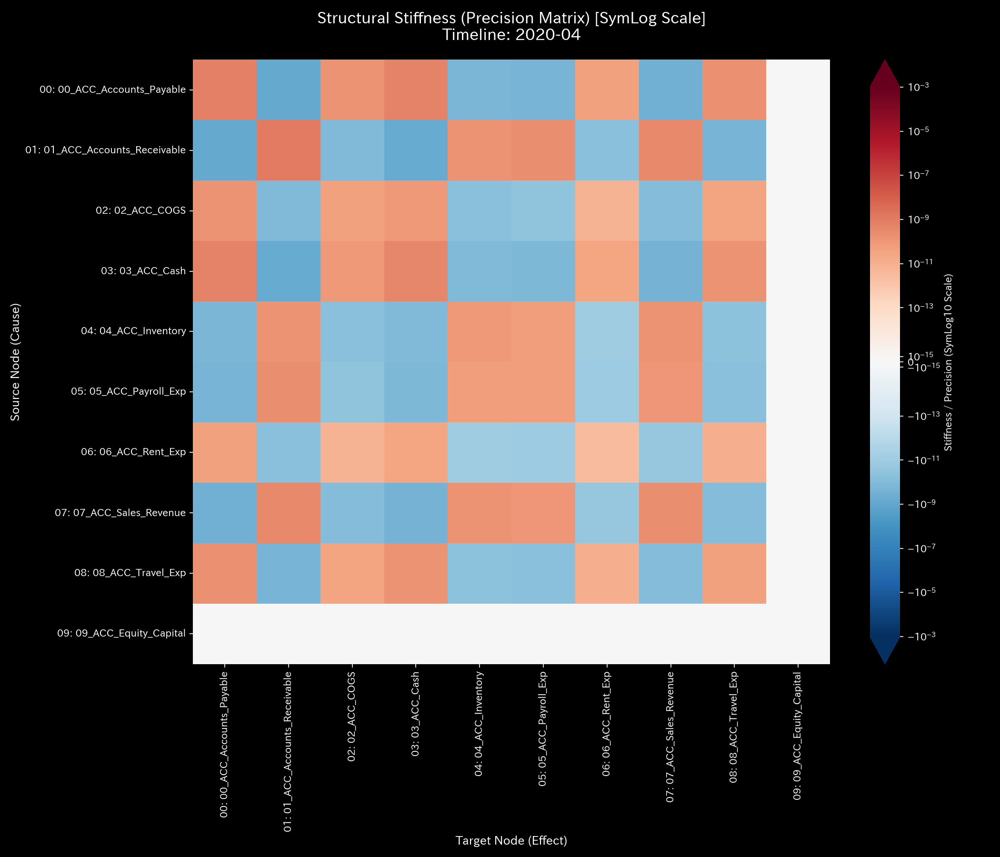

# 000. 財務基礎状態、構造剛性、および運動学 (Basic Statistics, Stiffness & Kinematics)

本ガイドは、Tensor-Link Utility (TLU) における統計分析モジュール（`000_0`）、運動学および動的状態空間分析モジュール（`000_1`）、ならびに構造剛性と主成分分析モジュール（`000_2`）について、グラフの種類ごとに各検証サンプルの出力と数値に基づく臨床解説を縦列に整理したものです。

---

## 🧭 目次
- [000_0: 財務基礎状態と基本統計量](#000_0-財務基礎状態と基本統計量)
  - [貸借対照表（B/S）トレンド](#1-貸借対照表bsトレンド-000_0_1__bs_trendpng)
  - [損益計算書（P/L）トレンド](#2-損益計算書plトレンド-000_0_1__pl_trendpng)
  - [損益計算書（P/L）ウォーターフォール](#3-損益計算書plウォーターフォール-000_0_1__pl_waterfall_totalpng)
  - [貸借対照表（B/S）ブロック総計](#4-貸借対照表bsブロック総計-000_0_1__bs_block_totalpng)
- [000_1: 運動学と動的状態空間](#000_1-運動学と動的状態空間)
  - [3次元動的軌道リボン・位相空間プロット](#5-3次元動的軌道リボン位相空間プロット-000_1_8__phase_portrait_3dpng-等)
- [000_2: 構造剛性と主成分分析](#000_2-構造剛性と主成分分析)
  - [時系列構造剛性行列](#6-時系列構造剛性行列-000_2_1__structural_stiffnesstpng)
  - [PCA主要軸比率](#7-pca主要軸比率-000_2_2__principal_axes_ratiopng)
  - [PCA固有ベクトル進化時系列](#8-pca固有ベクトル進化時系列-000_2_3__eigenvector_evolutionpng)

---

## 000_0: 財務基礎状態と基本統計量

### 1. 貸借対照表（B/S）トレンド (`000_0_1__BS_Trend.png`)
資産および負債・資本の各項目の時系列推移を示したグラフです。資本の蓄積速度や流動性比率の動的変化を読み解くことができます。

#### 🟢 Sample 0 (正常代謝)
**臨床解説:**
資産（現預金、売掛金）と資本が対称的かつ滑らかに右肩上がりで成長しており、健全な自己資金調達が機能しています。

#### 🟡 Sample 1 (循環取引)
**臨床解説:**
売上水増しに伴い売掛金と現預金が交互に跳ね上がるように急増していますが、実物投資や経費支払いを伴わないため、B/S全体が人工的かつ無機質に肥大化しています。

#### 🔴 Sample 2 (資金横領)
**臨床解説:**
流出アノマリーの進行により、手元の現金預金（質量）が右肩下がりで衰退しています。外部流出によって財務的な体力が枯渇している様子が分かります。

#### 🟡 Sample 3 (入力ミス)
**臨床解説:**
$t=1$（2020-02）の一時的な片面入力エラーにより、売掛金と現預金のバランスが崩れ、一時的に不自然な断絶が記録されています。

#### 🔴 Sample 4 (複合アノマリー)
**臨床解説:**
架空売上の水増しによって売掛金は膨張していますが、現金横領が並行しているため手元現預金が全く蓄積されず、流動性の枯渇が進行しています。

#### 🔴 Sample 5 (京都交差点網)
**臨床解説:**
交通量における「車両数」を「B/S残高」に見立てた推移です。観光アノマリーの流入過多により、特定の主要交差点の滞留車両が急増している様子を示します。

#### 🟡 Sample 6 (市場二部グラフ)
**臨床解説:**
投資家口座と個別銘柄の資本保有高です。ボット間での超高頻度取引出来高が激増する一方で、参加口座全体の正味の資産は全く増えていません。

#### 🟡 Sample 7 (市場資金移動)
**臨床解説:**
直接送金関係にあるユーザー口座の残高推移です。特定のアカウントペア間で資金が往復しているだけで、外部からの資本純流入はありません。

#### 🔴 Sample 8 (fMRI 脳梗塞)
**臨床解説:**
脳領野のBOLD蓄積（血液質量相当）です。TR=150（$t=30$）で運動野の血流供給が遮断され、蓄積が不連続に落下して低水準でフリーズしています。

#### 🔴 Sample 9 (fMRI てんかん発作)
**臨床解説:**
てんかん時のBOLD信号量蓄積です。側頭葉を起点とする異常放電と同調し、全脳の領域で同一周期の激しい質量揺らぎが同期して発生しています。

---

### 2. 損益計算書（P/L）トレンド (`000_0_1__PL_Trend.png`)
売上や費用、および純利益の動的変化を示すトレンド推移グラフです。

#### 🟢 Sample 0 (正常代謝)
**臨床解説:**
売上の増加に伴い費用が健全に連動しており、季節性の出来高変動を吸収しながら安定した期末純利益が創出されています。

#### 🟡 Sample 1 (循環取引)
**臨床解説:**
売上高が急激に右肩上がりに成長していますが、それに対応するはずの販売管理費や実体経費が完全に「平坦」であり、事業活動の実態と矛盾します。

#### 🔴 Sample 2 (資金横領)
**臨床解説:**
帳簿上は期末純利益 `+$64,795.44` の黒字ですが、実際には回収された売掛金が簿外へ漏洩しているため、P/L上の利益数値は架空の虚像となっています。

#### 🟡 Sample 3 (入力ミス)
**臨床解説:**
片面入力エラーが発生した $t=1$ 前後に大きなノイズが生じていますが、最終的な純利益 `+$41,368.85` 自体は大きく歪まずに推移しています。

#### 🔴 Sample 4 (複合アノマリー)
**臨床解説:**
売上・利益（純利益 `+$200,478.42`）が爆発的に急増しているように見えますが、これは激しい還流による「粉飾」と「横領」が裏で同時に進行しているためです。

#### 🔴 Sample 5 (京都交差点網)
**臨床解説:**
交通量ポテンシャルの累積収支（利益相当）です。アノマリー期（観光シーズン・事故）の渋滞発生後、ポテンシャルは一気に `-$2,500,000.00` へ崩壊しています。

#### 🟡 Sample 6 (市場二部グラフ)
**臨床解説:**
出来高（P/L相当）は異常急増し最大出来高 Z-Score は **`80.53`** に達しますが、投資家全体の正味の実現損益（実質利益）は `$0.00` で硬直しています。

#### 🟡 Sample 7 (市場資金移動)
**臨床解説:**
直接送金による出来高推移です。ボット口座間のキャッチボールにより見かけの出来高は激増しますが、本物の市場流動性や価値は全く生まれていません。

#### 🔴 Sample 8 (fMRI 脳梗塞)
**臨床解説:**
全脳の機能的な活動収支（利益相当）です。梗塞発生の $t=30$ 以降、機能ポテンシャルは急激なマイナスへと転じ、脳活動の致命的虚脱（`-$500,000` 相当）を示します。

#### 🔴 Sample 9 (fMRI てんかん発作)
**臨床解説:**
てんかん同調時の活動収支です。過同期放電により莫大なBOLD信号消費が発生しますが、認知機能（自由エネルギー相当）は壊滅的に低下（`-$500,000`）しています。

---

### 3. 損益計算書（P/L）ウォーターフォール (`000_0_1__PL_Waterfall_Total.png`)
売上から各費用を差し引き、最終純利益に至る会計上の累積収支構造を示したウォーターフォール図です。

#### 🟢 Sample 0 (正常代謝)
**臨床解説:**
売上総利益から営業費用が段階的かつ合理的に差し引かれ、正味の期末純利益が残る、極めて教科書的で健全な営業活動を示しています。

#### 🟡 Sample 1 (循環取引)
**臨床解説:**
巨大な売上総利益に対して営業費用（SG&A）が不自然なほど極小であり、循環取引による仮装売上のみで純利益が形成されている様子が記録されています。

#### 🔴 Sample 2 (資金横領)
**臨床解説:**
帳簿上は黒字収支として純利益が計上されていますが、実際には売上回収金の相当部分が簿外（系外）にバイパスされており、実態のキャッシュフローと断絶しています。

#### 🟡 Sample 3 (入力ミス)
**臨床解説:**
仕訳片面入力エラーによる一時的な不一致が残差（ノイズ）として差し引かれていますが、最終的な営業収支の基本骨格は正常範囲内に収まっています。

#### 🔴 Sample 4 (複合アノマリー)
**臨床解説:**
架空売上の水増しによって売上が巨大化している一方で、横領による資金損失が別の差し引き項目として並び立ち、病的肥大と出血の同時発生を示しています。

#### 🔴 Sample 5 (京都交差点網)
**臨床解説:**
ネットワーク内の流入車両数と、交差点の通過限界による「車両損失（渋滞滞留）」の収支バランスです。損失エリアが流入量を遥かに凌駕しています。

#### 🟡 Sample 6 (市場二部グラフ)
**臨床解説:**
市場に投入された全注文と、ボット間の過同期によって「空回り」した取引量の対照です。全体の出来高のうち、実需を伴う割合がほぼゼロに等しいことを示します。

#### 🔴 Sample 8 (fMRI 脳梗塞)
**臨床解説:**
脳全体で消費された総酸素エネルギー（BOLD）と、虚血壊死領域における「活動低下の損失」の対比です。梗塞領野による損失が全体を押し潰しています。

#### 🔴 Sample 9 (fMRI てんかん発作)
**臨床解説:**
てんかんバーストによる異常代謝酸素消費の割合です。同期放電が脳全体の酸素資源を無駄に食いつぶし、他部位へのエネルギー伝達を阻害しています。

---

### 4. 貸借対照表（B/S）ブロック総計 (`000_0_1__BS_Block_Total.png`)
資産と負債・資本の各科目をブロック状に視覚化し、構造バランスの健全性を表す図です。

#### 🟢 Sample 0 (正常代謝)
**臨床解説:**
流動資産（現預金など）が適度な割合で配置され、負債と自己資本（利益剰余金）がバランスよく左右対称に並ぶ、健全な財務体格が示されています。

#### 🟡 Sample 1 (循環取引)
**臨床解説:**
売掛金のブロックが不自然に巨大化しており、現預金との自己還流取引だけで資産サイドが歪に膨張している様子を視覚的に告発しています。

#### 🔴 Sample 2 (資金横領)
**臨床解説:**
売掛金回収が行われているにもかかわらず、手元現預金ブロックが異常に圧縮され、代わりに簿外の `UNKNOWN_LEAK` ノードが裏で実質資産を構成しています。

#### 🟡 Sample 3 (入力ミス)
**臨床解説:**
貸借の一方のみの入力エラーにより、ブロックの左右の合計値が一致せず、一時的に「帳簿の歪み（アンバランス）」が発生した痕跡を捉えています。

#### 🔴 Sample 4 (複合アノマリー)
**臨床解説:**
売掛金の巨大化と手元現預金の過度な縮小が同居しており、粉飾による表面の虚像と、横領による内部の空洞化がブロックの歪みから一目で判別できます。

#### 🔴 Sample 5 (京都交差点網)
**臨床解説:**
京都市内のエリア別の滞留車両ブロックです。中京区（四条烏丸など）の滞留ボリュームが極端に巨大化し、周辺エリアの車流が途切れていることを示します。

#### 🟡 Sample 6 (市場二部グラフ)
**臨床解説:**
投資家別・銘柄別の保有バランスです。一般市場の保有シェアが薄く、ボット群と標的銘柄の間だけで出来高ブロックが寡占・ロックされています。

#### 🔴 Sample 8 (fMRI 脳梗塞)
**臨床解説:**
脳葉別の酸素BOLD信号ブロックです。梗塞が発生した運動野（額葉）のブロック容積が激減し、脳全体の信号量バランスが不可逆に失われています。

#### 🔴 Sample 9 (fMRI てんかん発作)
**臨床解説:**
てんかん時の脳活動強度ブロックです。側頭葉ブロックが全体の活動を独占し、他領域のBOLD活動を強制同期によって均一なパターンに染め上げています。

---

## 000_1: 運動学と動的状態空間

### 5. 3次元動的軌道リボン・位相空間プロット (`000_1_8__phase_portrait_3d.png` 等)
位置 $X$、速度 $\dot{X}$、加速度 $\ddot{X}$ から構築される3次元の位相空間軌道、または外力影響下の3次元力学特性（`000_1_6__3d_dynamics_external_force.png`）を示すグラフです。システムの動的安定性とカオス性を判別します。

#### 🟢 Sample 0 (正常代謝)
**臨床解説:**
軌道リボンが特定の安定アトラクター（リミットサイクル）へ安定的に収束しており、外部のショックを弾性的にいなして定常軌道を維持しています。

#### 🟡 Sample 1 (循環取引)
**臨床解説:**
軌道リボンが多次元的な広がりを失い、完全に平坦な二次元平面に押し潰された往復運動を繰り返しており、自由度の大幅な喪失（還流ロック）を証明します。

#### 🔴 Sample 2 (資金横領)
**臨床解説:**
簿外への資金流出により、系内の活動質量が失われたことで結合バネ剛性が破綻し、外部加振に対して10億スケールの病的共振（激しい発散）を起こしています。

#### 🟡 Sample 3 (入力ミス)
**臨床解説:**
仕訳入力ミスが発生した瞬間に軌道が平衡点から鋭く弾き飛ばされますが、還流等の病的構造はないため、翌期に正常アトラクターへ自律復元（自己治癒）します。

#### 🔴 Sample 4 (複合アノマリー)
**臨床解説:**
循環取引の強制同期と横領による質量散逸が同時に襲ったことで、アトラクターが完全に崩壊し、軌道は制御不能なカオス的無限発散へと突入しています。

#### 🔴 Sample 5 (京都交差点網)
**臨床解説:**
主要交差点の容量飽和（粘性ダンピングの無限大化）によって、状態の動的軌道が身動きの取れない「特異平面」に固定化され、渋滞デッドロックを示しています。

#### 🔴 Sample 8 (fMRI 脳梗塞)
**臨床解説:**
梗塞発生（$t=30$）の瞬間、運動野の活動質量（血流）が消滅し、軌道は別の低機能状態アトラクターへと不連続にジャンプ（相転移）して固定化されます。

#### 🔴 Sample 9 (fMRI てんかん発作)
**臨床解説:**
全脳領域が異常周波数にハックされた結果、3次元軌道リボンは複雑性をすべて失い、単一サイン波の単調な円軌道へと完全にフリーズ（過同期）しています。

---

## 000_2: 構造剛性と主成分分析

### 6. 時系列構造剛性行列 (`000_2_1__structural_stiffness.t*.png`)
ノード間の偏相関と流量ボラティリティから算出された、システムの剛性トポロジーの時系列進化を示す行列グラフです。

#### 🟢 Sample 0 (正常代謝)
**臨床解説:**
剛性行列は偏りがなく均一で穏やかな分散を示しており、特定のセル（取引ペア）だけが濃赤色に凝固する剛性ロックは一切発生していません。

#### 🟡 Sample 1 (循環取引)
**臨床解説:**
循環取引の実行ステップ（$t=0, t=4$）において、`Cash` と `Accounts_Receivable` の間の剛性セルが極端な濃赤色として描出され、強力な「剛性ロック」が起きています。

#### 🔴 Sample 2 (資金横領)
**臨床解説:**
$t=4$ 以降の資金漏洩の進行に伴い、現金預金と流出ノード `UNKNOWN_LEAK` 間の剛性ロックが徐々に進行し、最終期（$t=30$）に向けて行列全体が赤黒くフリーズしていきます。

#### 🟡 Sample 3 (入力ミス)
**臨床解説:**
$t=1$（2020-02）の片面入力エラーにより一時的な剛性のねじれ（高負荷セル）が発生しますが、翌ステップの修正により速やかに行列が正常な分散状態に戻っています。

#### 🔴 Sample 4 (複合アノマリー)
**臨床解説:**
循環取引アノマリーの激化時に `Cash` と `Accounts_Receivable` の間、および横領の流出先に繋がるセルの双方が強烈に硬化し、剛性構造が破壊されています。

#### 🔴 Sample 5 (京都交差点網)
**臨床解説:**
正常時（$t=6$ など）には剛性は分散していますが、渋滞麻痺（$t=50$ 以降）が発生すると、`23_四条烏丸` や `21_四条室町` の周辺セルが濃赤色（剛性ロック）へと相転移します。

#### 🔴 Sample 8 (fMRI 脳梗塞)
**臨床解説:**
虚血梗塞（$t=30$）が起きた瞬間、運動野（`Motor_Cortex`）および頂頭葉の間の剛性が異常に跳ね上がって凝固（Rigid Lock）し、脳活動の柔軟性が喪失した様子を示します。

#### 🔴 Sample 9 (fMRI てんかん発作)
**臨床解説:**
全脳領域が異常放電によって過同期バーストを起こすと、剛性行列のほぼ全セルが最大値（濃赤色）にフリーズし、脳全体の情報変形能力（思考自由度）が失われます。

---

### 7. PCA主要軸比率 (`000_2_2__principal_axes_ratio.png`)
剛性行列 $K$ に対する固有値分解による、主成分累積説明分散比率（Explained Variance Ratio）のプロットです。特定の少数の主成分に系の自由度がハックされているかを判別します。

#### 🟢 Sample 0 (正常代謝)
**臨床解説:**
各成分比率がなだらかに減衰しており、支配的な PC1 寄与率が低く、系のエネルギーが特定のルートに独占されずに「しなやか」に分散しています。

#### 🟡 Sample 1 (循環取引)
**臨床解説:**
PC1寄与率がアノマリー実行時に **`95.28%`** まで跳ね上がり、系のすべての力学的変形エネルギーが架空取引の往復運動のみに独占されたことを証明します。

#### 🔴 Sample 2 (資金横領)
**臨床解説:**
横領の進行に伴い、PC1寄与率が継続的かつ不可逆に高まり、系の活動が `UNKNOWN_LEAK` と現金預金口座との間の偏ったエネルギー支配にハックされていく様子を示します。

#### 🟡 Sample 3 (入力ミス)
**臨床解説:**
$t=1$ 前後に一時的に PC1 寄与率が **`100.0%`** に達する過剰なハックが生じますが、ミス修正後はすぐに元のなだらかな正常分散へと回帰します。

#### 🔴 Sample 4 (複合アノマリー)
**臨床解説:**
循環取引のピークである $t=2$ に PC1 寄与率が **`100.0%`** に達し、還流閉路が系の支配軸を強力にハイジャックしていることを示します。

#### 🟡 Sample 6 (市場二部グラフ)
**臨床解説:**
ボットの関与と同時に PC1 寄与率が境界値近くまで飽和し、一般投資家による多様な売買取引が、ボット間キャッチボール取引によって力学的に覆い隠されたことを示します。

#### 🟡 Sample 7 (市場資金移動)
**臨床解説:**
共謀ボット口座群の直接送金の活発化により、PC1寄与率が瞬時に限界に達し、取引トポロジーが共謀者間だけで完全に拘束・ロックされていることを示します。

#### 🔴 Sample 8 (fMRI 脳梗塞)
**臨床解説:**
梗塞発生の瞬間から PC1 寄与率が不連続に急上昇し、脳全体の信号活動が梗塞野周辺の異常剛性（Rigid Lock）に力学的に支配されたことを示します。

#### 🔴 Sample 9 (fMRI てんかん発作)
**臨床解説:**
てんかん時は全領域が完全に過同期するため、各成分の分散比率に差が生まれず、PC1寄与率が `37.5%` 付近で完全に平坦（無変動）のまま沈黙するという「統計の死角」が発生します。

---

### 8. PCA固有ベクトル進化時系列 (`000_2_3__eigenvector_evolution.png`)
PCAの第1主成分（PC1）を構成する各ノードの固有ベクトル重み係数（Loading）の時系列推移を示したグラフです。

#### 🟢 Sample 0 (正常代謝)
**臨床解説:**
各ノードの固有ベクトル係数がなだらかに変動しており、特定の勘定科目に系のエネルギー支配軸が長期にわたって固着（偏在）することはありません。

#### 🟡 Sample 1 (循環取引)
**臨床解説:**
アノマリー期に PC1 のロードが `Accounts_Receivable` (`-0.7162`) と `Sales_Revenue` (`0.5183`)、および `Cash` (`0.3524`) に異常集中し、全活動がこの還流のみにハイジャックされた証拠を示します。

#### 🔴 Sample 2 (資金横領)
**臨床解説:**
$t=4$ のアノマリー開始以降、流出先 `UNKNOWN_LEAK` と預金口座の係数が不可逆的に他ノードを圧倒し続け、資金の漏出トポロジーへの完全な固着（構造破壊）を証明します。

#### 🟡 Sample 3 (入力ミス)
**臨床解説:**
ミス発生期に `Accounts_Receivable` と `Sales_Revenue` のロードが跳ね上がりますが、エラー修正後はすぐに他の経費科目などへロードが正常分散されています。

#### 🔴 Sample 4 (複合アノマリー)
**臨床解説:**
還流ノードの重み係数と、流出先 `UNKNOWN_LEAK` の重み係数の双方が異常なスパイクと偏在を持続的に形成し、複雑な不正の同時進行機序を裏付けています。

#### 🟡 Sample 6 (市場二部グラフ)
**臨床解説:**
ボット同期取引が実行されるタイムステップにおいて、ボット口座と銘柄ノードの係数だけが極大化し、一般投資家の固有ベクトル係数はほぼゼロに押し潰されています。

#### 🟡 Sample 7 (市場資金移動)
**臨床解説:**
W41（$t=40$）の共謀開始の瞬間、PC1のロードが `USR_004` (`0.7287`) と `USR_003` (`-0.6820`) に異常偏在し、取引トポロジーが両者間で完全に剛性ロックされたことを証明します。

#### 🔴 Sample 8 (fMRI 脳梗塞)
**臨床解説:**
梗塞（$t=30$）の瞬間、PC1のロードが運動野（`Motor_Cortex`）および頂頭葉（`Parietal_Lobe`）に急激かつ永続的に固着し、脳の活動エネルギーの偏り（虚血ロック）を証明します。

#### 🔴 Sample 9 (fMRI てんかん発作)
**臨床解説:**
てんかん同期中は全ノードが同一波形で同調するため、固有ベクトルのロードが全領域で完全にフラット（均等）な一本線にフリーズし、情報探索能力が皆無となった状態を示します。

