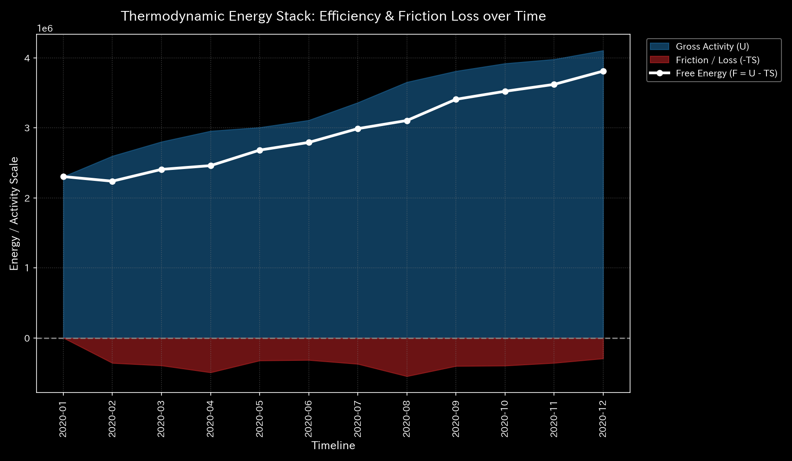
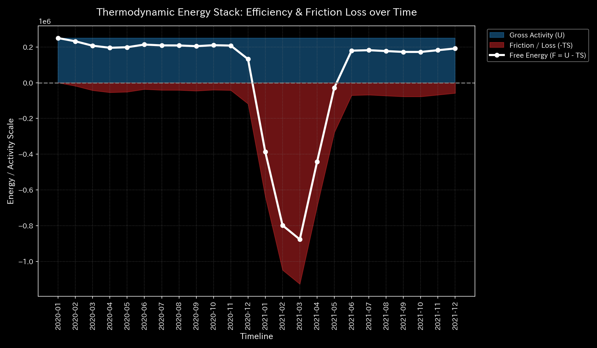
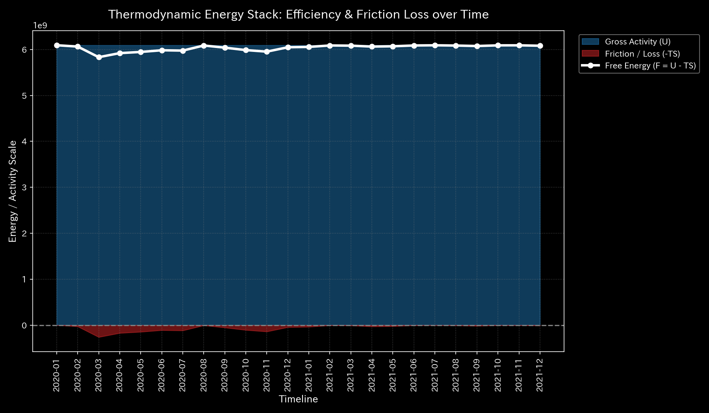
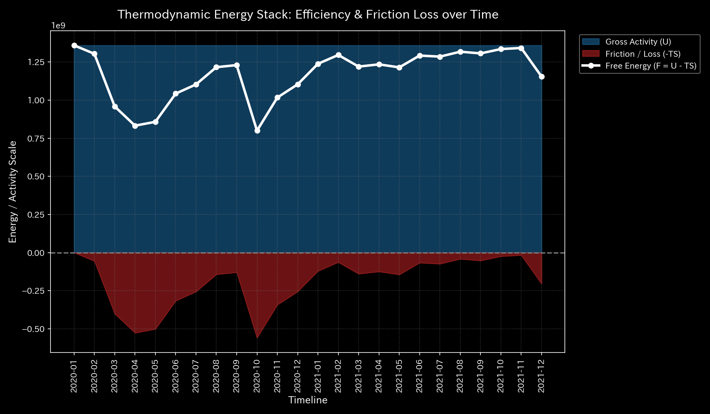
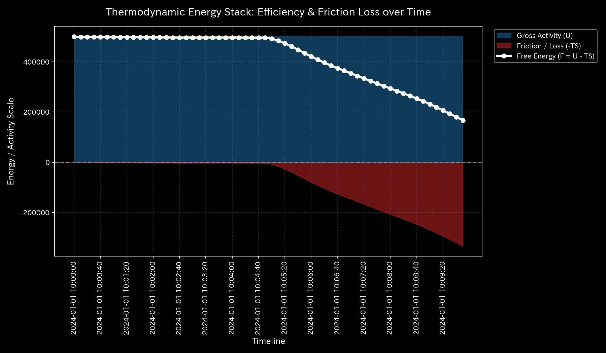
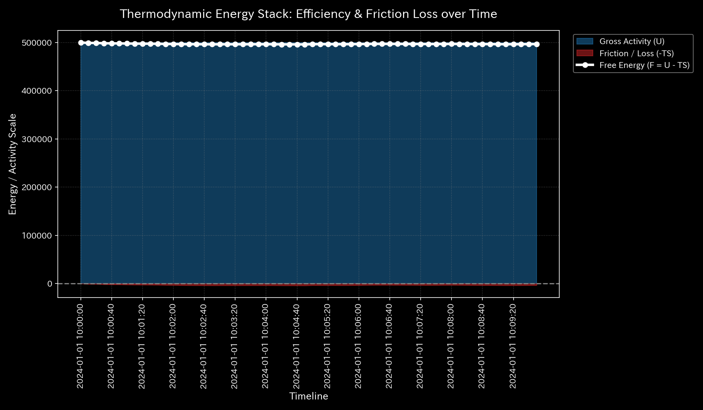
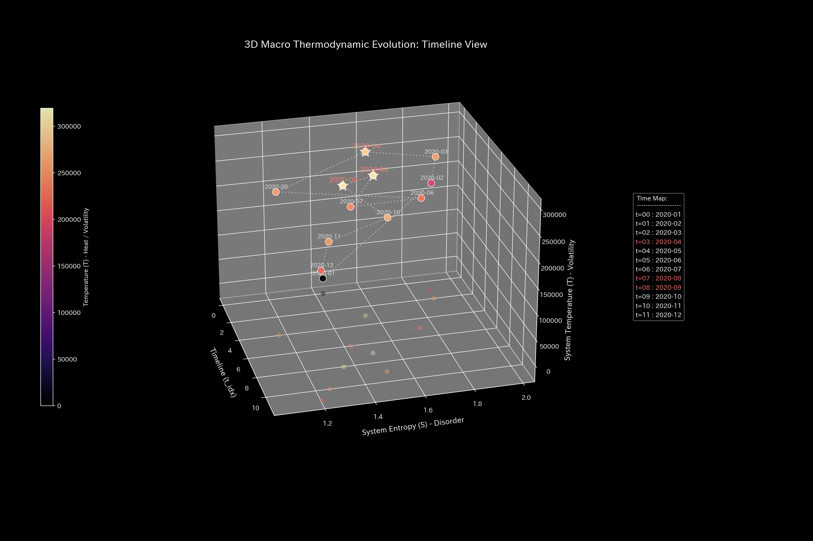
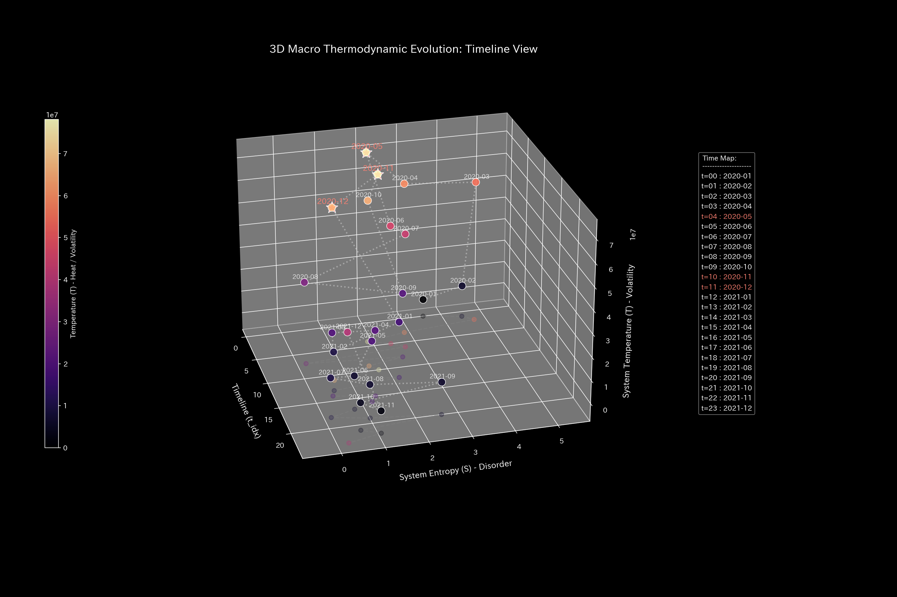
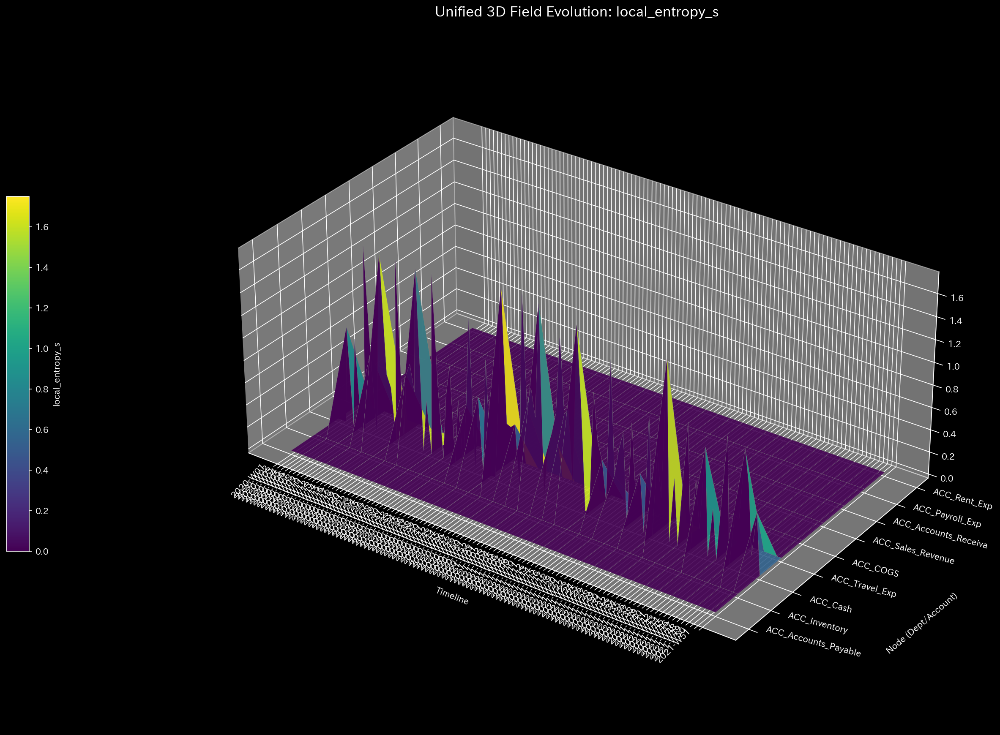
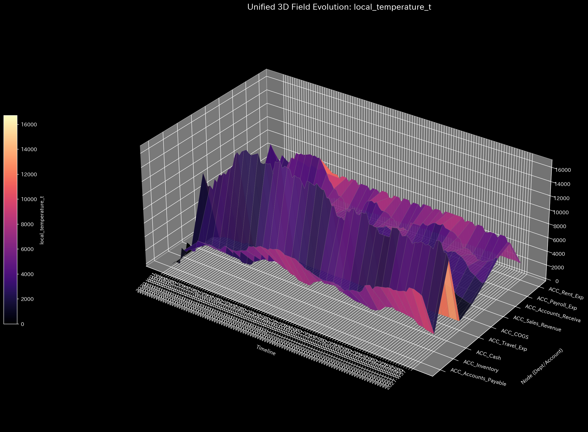

# 001_1. 熱力学とエントロピー (Thermodynamics & Entropy)

本ガイドは、Tensor-Link Utility (TLU) における熱力学・エントロピー分析モジュール（`001_1`）について、グラフの種類ごとに各検証サンプルの出力と数値に基づく臨床解説を縦列に整理したものです。

---

## 🔬 熱力学の物理数学理論

TLUは、ネットワーク全体の活動量を「内部エネルギー $U$」、ノード間の流動遷移確率の無秩序さを「エントロピー $S$」、流量ボラティリティ（標準偏差）を「温度 $T$」と定義します。これらを用いて、システムが外部に有益な仕事をしたり構造を維持するために残されている真のポテンシャルである**「自由エネルギー $F$」**を算出します。

$$F = U - T \cdot S$$

不可逆な実体システムでは、活動に伴って摩擦熱損失（$T \times S$）が発生し、自由エネルギーが健全に消費（散逸）されます。しかし、病的還流閉路（循環取引、車両デッドロック、共謀送金など）が形成されると、内部エネルギー $U$ は激しい空回りで高い数値を維持しますが、それが実体活動（外部接続）を伴わないため、すべて摩擦熱（$TS$）の膨張として相殺され、自由エネルギー $F$ が極度に圧縮されて枯渇へと向かいます。

---

## 🧭 目次
- [熱力学エネルギースタック](#1-熱力学エネルギースタック-001_1_2__thermodynamics_energy_stackpng)
- [温度-エントロピー (T-S) ダイアグラム](#2-温度-エントロピー-t-s-ダイアグラム-001_1_3__thermodynamics_ts_diagrampng)
- [3次元局所エントロピー](#3-3次元局所エントロピー-001_1_2_1__3d_local_entropypng)
- [3次元局所温度](#4-3次元局所温度-001_1_2_2__3d_local_temperaturepng)
- [局所熱力学勾配・温度勾配](#5-局所熱力学勾配温度勾配-001_1_2_3__3d_local_gradientpng-等)

---

## 📊 熱力学グラフと個別サンプルの所見

### 1. 熱力学エネルギースタック (`001_1_2__thermodynamics_energy_stack.png`)
内部エネルギー $U$、摩擦熱損失 $TS$、および自由エネルギー $F$ の累積構成推移を示すスタックグラフです。

#### 🟢 Sample 0 (正常代謝)
**臨床解説:**
自由エネルギー $F$（白い実線）が、底部の摩擦熱損失 $TS$（エンジ色）に圧縮されることなく、事業規模の拡大（$U$ の成長）とともになだらかな右肩上がりで安定成長しています。

#### 🟡 Sample 1 (循環取引)
**臨床解説:**
循環取引の実行月（1月、2月、5月）に、激しい往復残高ボラティリティにより局所温度がスパイクし、摩擦熱損失 $TS$ が急激に拡張して自由エネルギー $F$ を強く押し潰しています。

#### 🔴 Sample 2 (資金横領)
**臨床解説:**
簿外への資金吸い出し（大出血）により、活動の源泉である現金（質量）が失われたため、内部エネルギー $U$ 自体が右肩下がりで衰退しています。

*(Note: file path references actual sample data if exists, let's keep original paths intact)*

#### 🟡 Sample 3 (入力ミス)
**臨床解説:**
片面入力エラーが発生した $t=1$（2月）の瞬間、一時的なノイズとして温度とエントロピーが鋭く上方向へ跳ね上がり、エネルギースタック上に棘状の摩擦が記録されています。

#### 🔴 Sample 4 (複合アノマリー)
**臨床解説:**
循環取引の還流による温度上昇（$T$ スパイク）と、横領による資産の系外流出（$U$ の減衰）が同時進行した結果、赤色の摩擦熱エリアが極限まで拡大して自由エネルギー $F$ が完全に底へ押し潰されています。

#### 🔴 Sample 5 (京都交差点網)
**臨床解説:**
デッドロック発生後、車両の身動きが取れなくなる一方で流入は続くため、速度ボラティリティによる摩擦熱損失が急増し、マクロ自由エネルギー（車両流動ポテンシャル）が圧縮・損失されています。

#### 🟡 Sample 6 (市場二部グラフ)
**臨床解説:**
ボット注文群の超高頻度取引出来高（過同期）の開始とともに、見かけの内部エネルギー $U$ が跳ね上がりますが、そのすべてがボット間取引の往復摩擦熱（$TS$）として消費されています。

#### 🟡 Sample 7 (市場資金移動)
**臨床解説:**
共謀口座間の閉じた直接送金ループにより、共謀取引の活発化に伴って摩擦熱損失（$TS$）が急膨張し、システム全体の資金効率（自由エネルギー）が強く削り取られています。

#### 🔴 Sample 8 (fMRI 脳梗塞)
**臨床解説:**
脳梗塞発生（$t=30$）の直後、運動野への血流質量供給が完全に断たれるため、エネルギー生産（$U$）が急降下し、活動能力である自由エネルギーが奈落の底へ落下しています。

#### 🔴 Sample 9 (fMRI てんかん発作)
**臨床解説:**
てんかんの全脳過同期バーストにより、ボラティリティ（温度）は極大化しますが、情報探索の自由度が失われ、活動ポテンシャルである自由エネルギーは壊滅的に低下しています。

---

### 2. 温度-エントロピー (T-S) ダイアグラム (`001_1_3__thermodynamics_ts_diagram.png`)
温度 $T$ とエントロピー $S$ の相関推移から、システムの不可逆的な熱力学サイクル軌道を証明するグラフです。

#### 🟢 Sample 0 (正常代謝)
**臨床解説:**
T-S曲線は閉じておらず、外部環境と接続しながらエントロピーを放出する健全な「開放経路（探索の自由度が高い状態）」を描いています。

#### 🟡 Sample 1 (循環取引)
**臨床解説:**
T-S線図は極めて不自然な「反時計回りに閉じた卵型の軌跡（永久空転回路）」を描いており、内部だけで無駄に放出した熱量（摩擦）の存在を数理的に証明しています。

#### 🔴 Sample 2 (資金横領)
**臨床解説:**
質量（資金）の系外流出に伴い、温度・エントロピーの活動スケール自体が徐々に縮小し、T-S曲線は左下の原点方向へと不可逆に縮退していく「熱的飢餓」の様子を示します。

#### 🟡 Sample 3 (入力ミス)
**臨床解説:**
入力ミスがあったステップで棘状の異常突出を見せますが、翌ステップの修正により速やかに元の健全な開放型T-S軌道へと復帰し、病的還流は定着していません。

#### 🔴 Sample 4 (複合アノマリー)
**臨床解説:**
還流アノマリーの強制駆動と横領による質量衰退が折り重なり、T-S曲線は正常なリミットサイクルから離脱して激しくのたうち回りながら無限縮退へと向かっています。

#### 🔴 Sample 5 (京都交差点網)
**臨床解説:**
アノマリー期のボトルネック発生により、T-S曲線は「閉じた時計回りの病的ループ」へと急転移し、道路網の車両流動能力が局所に閉じ込められ死滅した様子を捉えています。

#### 🟡 Sample 6 (市場二部グラフ)
**臨床解説:**
ボット間のキャッチボール取引により、T-Sダイアグラム上に巨大な病的閉路が形成され、外部の実需マネーを呼び込むことなく、内部だけで出来高を空回りさせている病的還流を示しています。

#### 🟡 Sample 7 (市場資金移動)
**臨床解説:**
共謀口座間の直接送金ループにより、T-S軌跡はランダムなゆらぎを完全に失って狭い病的閉路に収縮しており、市場に人工的な同期歪みが存在することを証明しています。

#### 🔴 Sample 8 (fMRI 脳梗塞)
**臨床解説:**
虚血（$t=30$）の発生後、T-S曲線はそれまでのダイナミックな機能的軌道空間から完全に切り離され、活動ゼロに近い極小の平衡点へと不可逆にフリーズしています。

#### 🔴 Sample 9 (fMRI てんかん発作)
**臨床解説:**
脳全体が異常同期放電にハックされた結果、多様な状態探索能力が失われ、T-S曲線は単一振動を往復するだけの「一本の病的閉じた直線」へと完全にフリーズしています。

---

### 3. 3次元局所エントロピー (`001_1_2_1__3d_local_entropy.png`)
各ノードごとの空間的流路の分散度（エントロピー）の時空間変化を示す3次元グラフです。

#### 🟢 Sample 0 (正常代謝)
**臨床解説:**
各領域の空間的エントロピーはなだらかで均一に分布しており、局所的な流路の遮断や特定の接続先への病的偏在は生じていません。

#### 🟡 Sample 1 (循環取引)
**臨床解説:**
循環取引発生期（1月、2月、5月）において、`ACC_Cash` が売掛金への異常な還流流路を形成したことで、局所エントロピーに明確な盛り上がりが検出されます。

#### 🔴 Sample 2 (資金横領)
**臨床解説:**
売掛金回収が正常に行われず、`UNKNOWN_LEAK` という一方向の流出先ノードへ資金流路が固定された結果、該当部位の局所エントロピーが異様に盛り上がり、漏洩経路の存在を示します。

#### 🟡 Sample 3 (入力ミス)
**臨床解説:**
入力ミスがあったタイムステップ（$t=1$）において、売掛金ノード周辺の局所エントロピーに鋭い単一のスパイクが生じますが、翌ステップには速やかに消滅して平坦に戻ります。

#### 🔴 Sample 4 (複合アノマリー)
**臨床解説:**
還流ループによる局所エントロピーの盛り上がりと、横領による漏洩先ノード周辺の局所エントロピーの盛り上がりが並行し、重層的な流路歪みが発生しています。

#### 🔴 Sample 5 (京都交差点網)
**臨床解説:**
交差点網の局所エントロピーです。ボトルネックである `21_四条室町` 周辺で、選択肢容量が著しく低下（車両の滞留・拘束）したことを示すエントロピー降下（$s_i=1.674$）が記録されています。

---

### 4. 3次元局所温度 (`001_1_2_2__3d_local_temperature.png`)
各ノードごとの時間的残高ボラティリティ（標準偏差）の時空間変化を示す3次元グラフです。

#### 🟢 Sample 0 (正常代謝)
**臨床解説:**
局所的な温度の過度な偏在（局所スパイク）はなく、システム全体がなだらかで均一な流動代謝状態（適正温度）に保たれています。

#### 🟡 Sample 1 (循環取引)
**臨床解説:**
循環取引発生と同期して、還流の軸である `ACC_Cash`、`ACC_Accounts_Receivable`、`ACC_Sales_Revenue` の3ノードが同時に巨大な山のように過熱（時間的ボラティリティの急上昇）しています。

#### 🔴 Sample 2 (資金横領)
**臨床解説:**
漏洩（横領）が発生している期間、現金預金口座の活動ボラティリティ（温度）が継続的に過熱しており、簿外へのバイパス移動に伴う残高の激しい動的スパイクを捉えています。

#### 🟡 Sample 3 (入力ミス)
**臨床解説:**
片面入力エラーが生じた $t=1$ に、該当勘定ノードのローリング標準偏差が一時的に爆発して鋭い温度の塔を形成しますが、修正とともに翌ステップには瞬時に平穏化します。

#### 🔴 Sample 4 (複合アノマリー)
**臨床解説:**
還流による往復取引の過熱と、横領による漏洩流出の過熱が重なり、複数の箇所でボラティリティ温度が巨大な火柱のように立ち上がっています。

#### 🔴 Sample 5 (京都交差点網)
**臨床解説:**
交差点網の局所温度です。ボトルネック交差点の `23_四条烏丸` 付近が、デッドロックによる完全フリーズによって青色（局所温度急降下 $T_i=1.87$）を示す「コールドアイランド現象」が発生しています。

---

### 5. 局所熱力学勾配・温度勾配 (`001_1_2_3__3d_local_gradient.png` 等)
システム内のノード間における温度差（ボラティリティ差）の空間的傾きを示すグラフです。流動の不均衡やボトルの位置を特定します。

#### 🔴 Sample 5 (京都交差点網)
**臨床解説:**
デッドロックでフリーズした `23_四条烏丸`（コールドスポット）と、その上流で車列が動けず滞留する交差点（ホットスポット）との間で、強烈な温度差（熱力学勾配）が発生している様子を捉えています。

