# 002. 情報幾何学と相対保存則 (Information Geometry & Forensics)

本ガイドは、Tensor-Link Utility (TLU) における情報幾何学分析モジュール（`002_1`）および会計・物流フォレンジック監視モジュール（`002_2`）について、グラフの種類ごとに各検証サンプルの出力と数値に基づく臨床解説を縦列に整理したものです。

---

## 🔬 情報幾何学と質量保存則の理論

閉鎖型の実体ネットワークにおいては、キルヒホッフの第一法則（電流則＝質量保存則）が厳密に成立します。あるノードに入力される総流量と、流出する総流量の差分を**「保存残差 (Conservation Residual)」**または**「相対漏洩率 (Relative Leak Ratio)」**と定義します。

$$Residual_i = \sum Flux_{in} - \sum Flux_{out}$$

正常な会計記帳や物理的流通では、ダブルエントリー（借貸平均）の制約下にあるため、この残差値は常に `0.00` となります。もしこの値が正の値として長期にわたって検知された場合、説明のつかない質量（資金・車両）がシステム外へバイパス流出（簿外横領、大出血）していることを物理的に証明します。

さらに、システムの状態確率分布の変位（構造変化の勢い）を、情報多様体上の距離尺度である**「KLダイバージェンス（KL Divergence Drift）」**として測定します。これにより、従来の統計Zスコア（Z-Score）が「茹でガエル現象（モデルの病的ベースライン学習）」によって沈黙する局面でも、構造の断裂（相転移）を鋭く検知します。

---

## 🧭 目次
- [ネットワーク・トポロジー時系列](#1-ネットワークトポロジー時系列-002_1_2__network_topologytpng)
- [マクロ・フォレンジック監視ダッシュボード](#2-マクロフォレンジック監視ダッシュボード-002_2_1__macro_forensics_dashboardpng)
- [3次元局所KL Drift](#3-3次元局所kl-drift-002_2_2_1__3d_micro_kl_driftpng)
- [3次元局所Z-Score](#4-3次元局所z-score-002_2_2_2__3d_micro_z_score_xpng)

---

## 📊 情報幾何学・トポロジーグラフと個別サンプルの所見

### 1. ネットワークトポロジー時系列 (`002_1_2__network_topology.t*.png`)
システム内のノード間における取引量や物理的流量を太いエッジで表現し、トポロジーの時系列進化を示した有向グラフです。

#### 🟢 Sample 0 (正常代謝)
**臨床解説:**
取引流量（エッジ）は各期を通して均等に分散・循環しており、特定の閉路が不自然に太く固定化されるようなトポロジーの偏りはありません。

#### 🟡 Sample 1 (循環取引)
**臨床解説:**
アノマリー開始の $t=0$ および $t=4$ において、`ACC_Cash` (現預金) と `ACC_Accounts_Receivable` (売掛金) の間に、極太の双方向還流エッジが直結して現れています。

#### 🔴 Sample 2 (資金横領)
**臨床解説:**
アノマリーの進行に伴い、`Accounts_Receivable` から `UNKNOWN_LEAK` という簿外の吸い出し先ノードへ向かって資金がバイパス流出する、太い一方向のエッジが常態化しています。

#### 🟡 Sample 3 (入力ミス)
**臨床解説:**
$t=1$（2020-02）の片面入力エラーが生じた際、売掛金ノードの引き当て側のみが太く接続されますが、翌期にミスが修正されると、トポロジーは通常時の分散した接続状態に戻ります。

#### 🔴 Sample 4 (複合アノマリー)
**臨床解説:**
循環取引の「双方向の架空還流エッジ」と、資金横領による「`UNKNOWN_LEAK` へのバイパス流出エッジ」がトポロジー上に同時に直結しており、極めて不自然な二極化を示しています。

#### 🔴 Sample 5 (京都交差点網)
**臨床解説:**
渋滞デッドロック（$t=51$）の発生後、ボトルネックである `23_四条烏丸` や `21_四条室町` の周辺エッジが極端に太く凝固（車両の滞留固着）し、周辺道路のエッジは白く消滅しています。

#### 🟡 Sample 6 (市場二部グラフ)
**臨床解説:**
市場二部グラフにおいて、共謀するボットアカウントと標的の銘柄ノードを結ぶ有向エッジが異常膨張し、市場全体の自律的な注文エッジを物理的に覆い隠しています。
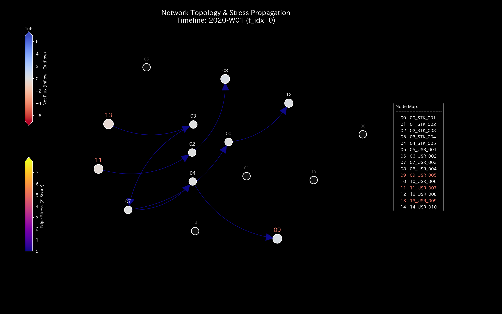
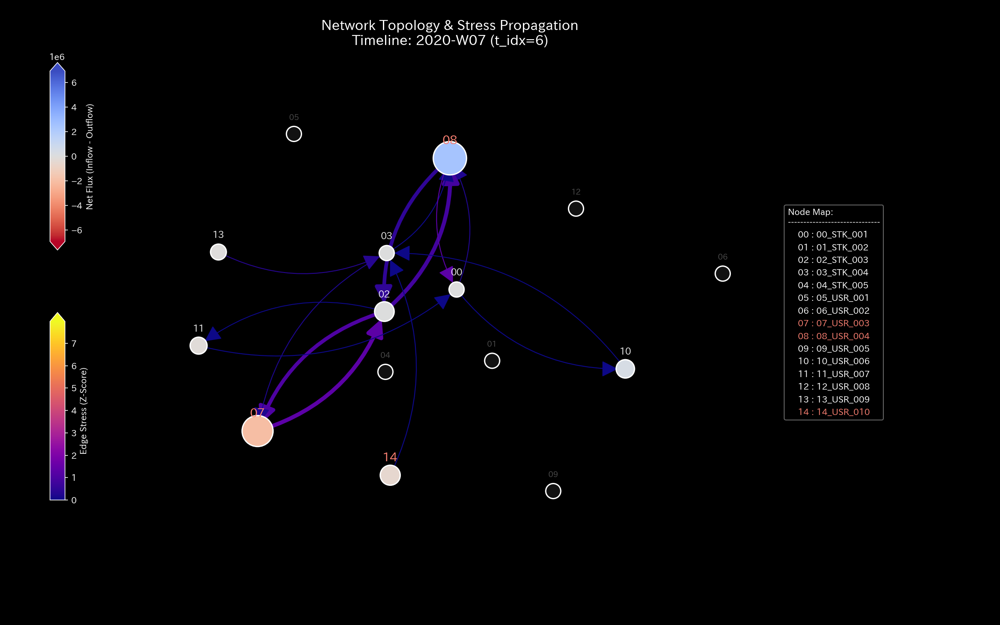

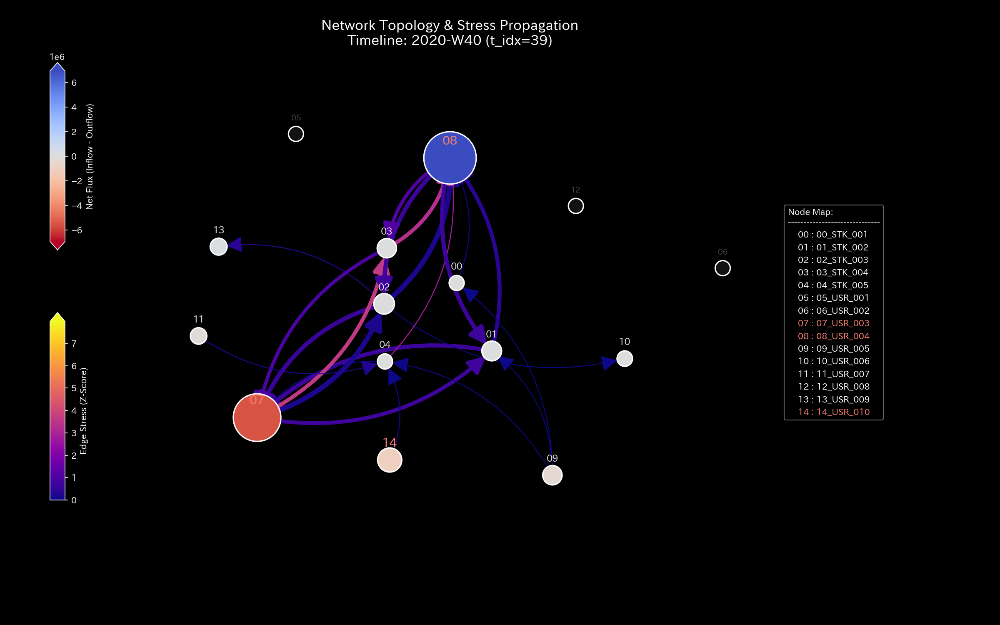
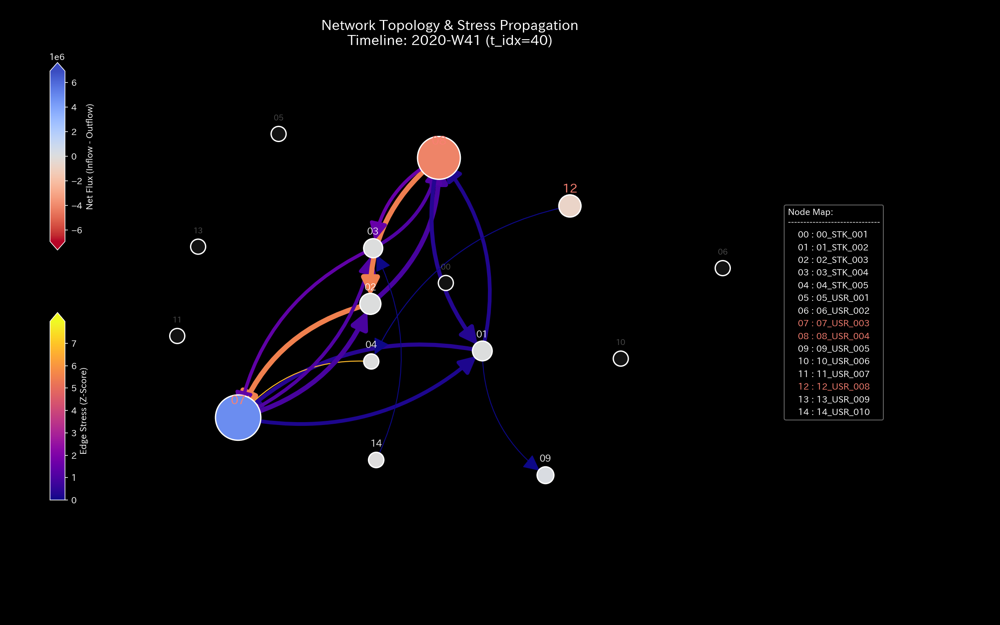

#### 🟡 Sample 7 (市場資金移動)
**臨床解説:**
W41の共謀開始の瞬間、`USR_003` と `USR_004` の間に資金がキャッチボールされる極太の往復エッジが突然直結し、長期間にわたってこの間だけで流動性が拘束されている様子を示します。

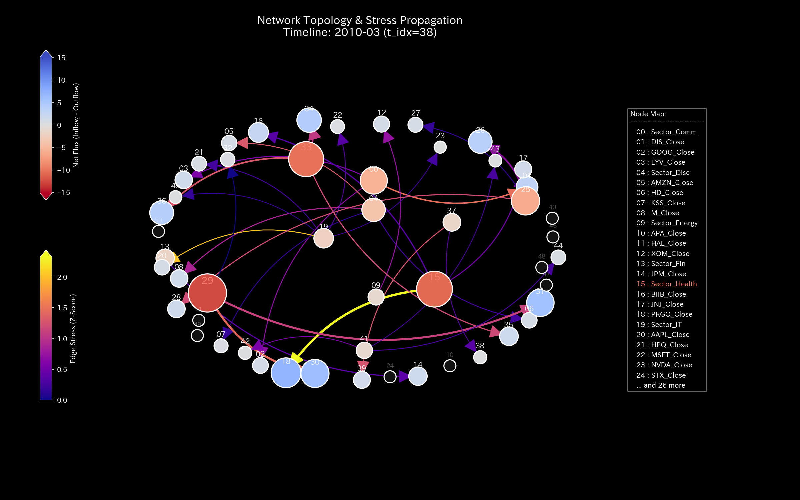
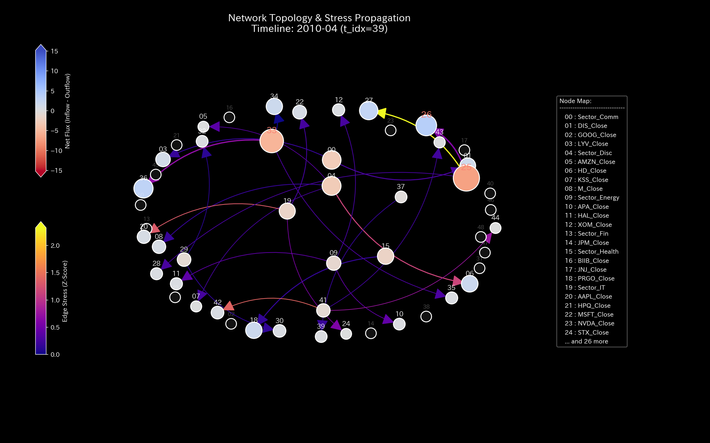
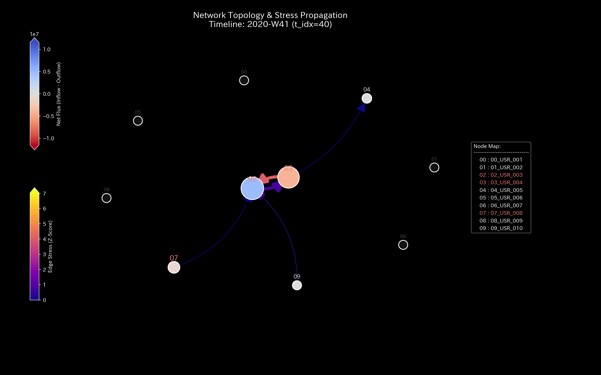

#### 🔴 Sample 8 (fMRI 脳梗塞)
**臨床解説:**
梗塞（$t=30$）が起きた瞬間から、梗塞野（運動野）へ流入・流出するすべての機能的結合エッジがブラックアウト（消失）し、梗塞によるトポロジー断裂が視覚化されています。

#### 🔴 Sample 9 (fMRI てんかん発作)
**臨床解説:**
てんかん同調バーストの発生に伴い、脳領野全体のBOLD活動エッジが極太の「過同期パターン」へと変質し、全脳が同一の振動キャッチボールにハックされています。

---

### 2. マクロフォレンジック監視ダッシュボード (`002_2_1__macro_forensics_dashboard.png`)
キルヒホッフの第一法則に基づく「保存残差」の時系列変化を示した、監査・フォレンジックダッシュボードです。

#### 🟢 Sample 0 (正常代謝)
**臨床解説:**
保存残差（漏洩率）は全期間を通して完全に `0.00` の一本線を維持しており、簿外への資金流出がない健康な財務代謝状態であることを表しています。

#### 🟡 Sample 1 (循環取引)
**臨床解説:**
架空取引が活発に行われていますが、借方と貸方の合計は記帳ルール上常に一致しているため、保存残差は **`0.00`** で正常判定となっています。

#### 🔴 Sample 2 (資金横領)
**臨床解説:**
アノマリー期に売掛金の回収が簿外の `UNKNOWN_LEAK` ノードへバイパスされたことで、保存残差（赤線）が最大 **`364.53`** 急上昇し、簿外流出（大出血）が発生していることを証明します。

#### 🟡 Sample 3 (入力ミス)
**臨床解説:**
$t=1$（2020-02）の片面記帳ミスによって、マクロダッシュボード上に **`906.29`** の巨大な単発の保存残差警告が立ち上がりますが、翌期に修正され再びゼロに戻ります。

#### 🔴 Sample 4 (複合アノマリー)
**臨床解説:**
横領アノマリーの活発化に伴い、マクロ保存残差が最大 **`4,773.57`** に急上昇し、激しい警告の赤線が露出しています。

#### 🔴 Sample 5 (京都交差点網)
**臨床解説:**
交通流の流入量と流出量の差分です。デッドロック発生後も、流入量に対する流出の残差収支は綺麗にゼロ（渋滞でただ留まっているだけ）であることを示します。

#### 🔴 Sample 8 (fMRI 脳梗塞)
**臨床解説:**
脳領域間のBOLD信号質量残差です。虚血により血液質量が遮断されていますが、血液が物理的に脳外へ消失したわけではないため、残差自体は `0.00` です。
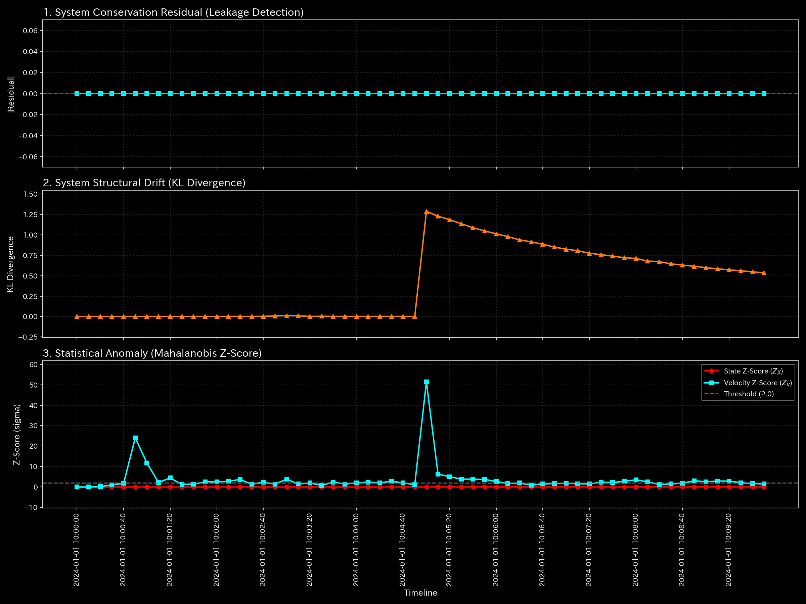

#### 🔴 Sample 9 (fMRI てんかん発作)
**臨床解説:**
てんかん時のBOLD信号量残差です。全脳が過同期放電で激しく振動していますが、総質量は脳内に留まっているため、残差は `0.00` のまま推移します。

---

### 3. 3次元局所KL Drift (`002_2_2_1__3d_micro_kl_drift.png`)
情報多様体上における状態確率分布の変位（KLダイバージェンス）の時間・空間（各ノード）推移を示す3次元グラフです。構造変化の勢いを捉えます。

#### 🟢 Sample 0 (正常代謝)
**臨床解説:**
KL Drift の時空間分布は、極端な突起（スパイク）を見せることなく、全期を通じて低水準で平穏に推移しています。

#### 🟡 Sample 1 (循環取引)
**臨床解説:**
循環取引が激化するタイムステップ（1月、2月、5月）において、対象の還流ノードに沿って情報幾何学的な「変位の盛り上がり」が立ち上がっています。

#### 🔴 Sample 2 (資金横領)
**臨床解説:**
横領の開始以降、`UNKNOWN_LEAK` と関連預金口座の周辺において、時間軸に沿って不可逆的に高まる巨大な「情報空間の絶壁」が形成されています。

#### 🟡 Sample 3 (入力ミス)
**臨床解説:**
片面入力エラーが生じた $t=1$（2020-02）の瞬間、`Accounts_Receivable` に **`20.68`**、`Cash` に **`5.01`** に達する極めて鋭い「針状の単一スパイク」が屹立しています。

#### 🔴 Sample 4 (複合アノマリー)
**臨床解説:**
架空取引による同期駆動と横領による漏洩流路の双方から、時間的・空間的に屹立する巨大な「情報幾何学的城壁」が形成されています。

#### 🔴 Sample 5 (京都交差点網)
**臨床解説:**
渋滞デッドロック（$t=51$）の発生の瞬間、ボトルネックである四条烏丸の座標に、時間軸に沿って急激に直立する巨大な「KL Drift のスパイクの壁」がそびえ立ちます。
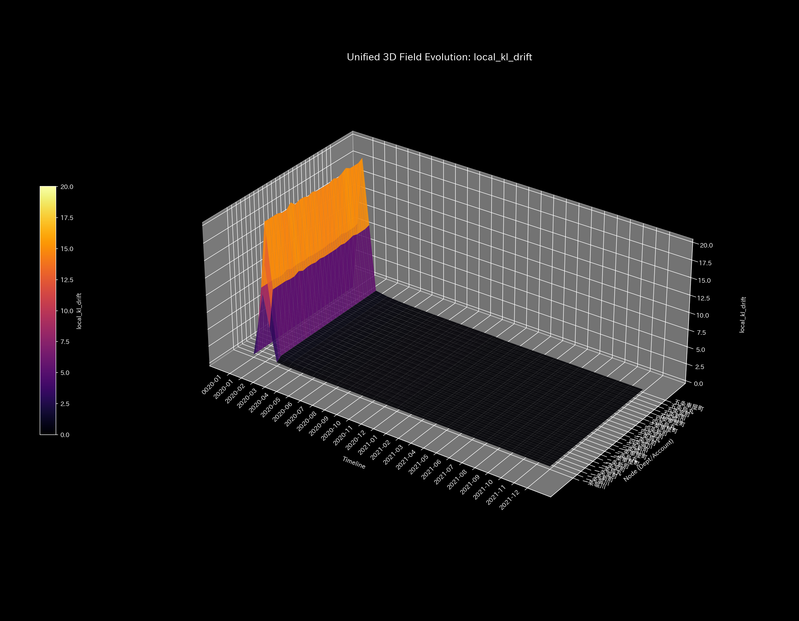

#### 🟡 Sample 6 (市場二部グラフ)
**臨床解説:**
ボットの同期取引が開始されるタイムステップにおいて、共謀ボットアカウントと標的銘柄の交差点に沿って鋭い「情報幾何学的スパイクの壁」が立ち上がっています。
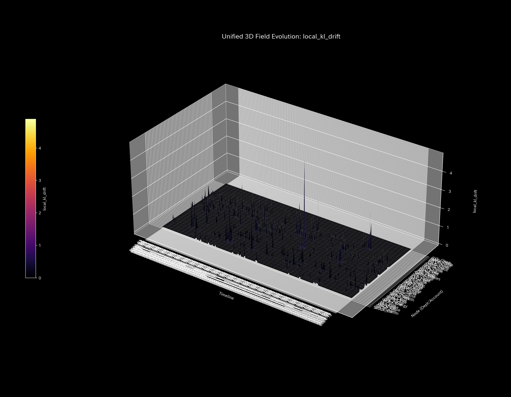

#### 🟡 Sample 7 (市場資金移動)
**臨床解説:**
W41の共謀開始の瞬間、`USR_003` と `USR_004` の口座に対応する情報座標に、時間軸に沿って屹立する鋭い「幾何学的な城壁」が現出し、共謀関係を暴露します。

#### 🔴 Sample 8 (fMRI 脳梗塞)
**臨床解説:**
梗塞（$t=30$）の発生の瞬間、運動野（`Motor_Cortex`）の座標を中心に、情報多様体上を突き刺すような巨大な「KL Drift の崖」が直立し、壊死領域を特定します。
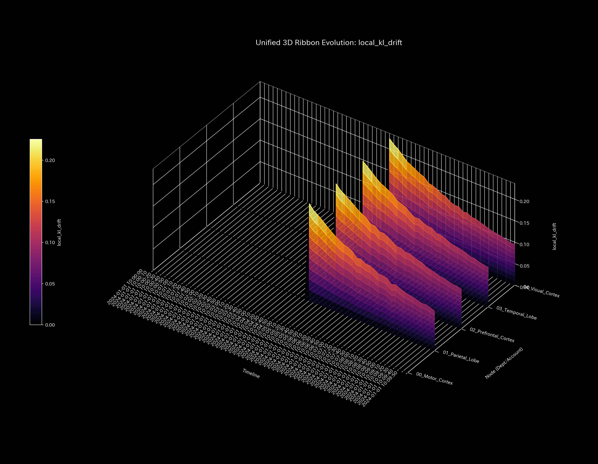

#### 🔴 Sample 9 (fMRI てんかん発作)
**臨床解説:**
てんかんバーストの発生とともに、側頭葉から脳全域へ向かって情報幾何学的な「過同期の津波（巨大な変位の壁）」が波及し、全脳がハックされた様子を捉えています。

---

### 4. 3次元局所Z-Score (`002_2_2_2__3d_micro_z_score_X.png`)
伝統的な統計モデルに基づく、各ノードごとの Z-Score の時間・空間推移を示す3次元グラフです。情報幾何指標（KL Drift）との対比に使用します。

#### 🟢 Sample 0 (正常代謝)
**臨床解説:**
季節変動の取引集中期（7月）に、一時的な Z-Score の盛り上がり（最大 `4.14`）が見られますが、残差や剛性の異常はなく正常です。

#### 🟡 Sample 1 (循環取引)
**臨床解説:**
循環取引により売掛金や出来高 Z-Score がアノマリー期に最大 `3.87` まで上昇しますが、後半は病的還流がベースラインとして学習され、Z-Score が平坦化する「茹でガエル現象」が観察されます。

#### 🔴 Sample 2 (資金横領)
**臨床解説:**
流出の開始初期に一時的な Z-Score の盛り上がり（`3.82`）が生じますが、漏洩が常態化すると Z-Score は平坦化し沈黙するため、情報幾何指標との併用が必須となります。

#### 🟡 Sample 3 (入力ミス)
**臨床解説:**
入力ミスが生じた瞬間に、該当の売掛金・現金勘定の Z-Score が **`5.29`** まで急峻な槍状に跳ね上がりますが、翌期には速やかに完全に消滅します。

#### 🔴 Sample 4 (複合アノマリー)
**臨床解説:**
循環取引の超同期月には最大 `3.42` の Z-Score 上昇を検知しますが、横領による資金枯渇と混ざり合うことで、ベースライン学習が進み警告が沈黙しがちになります。
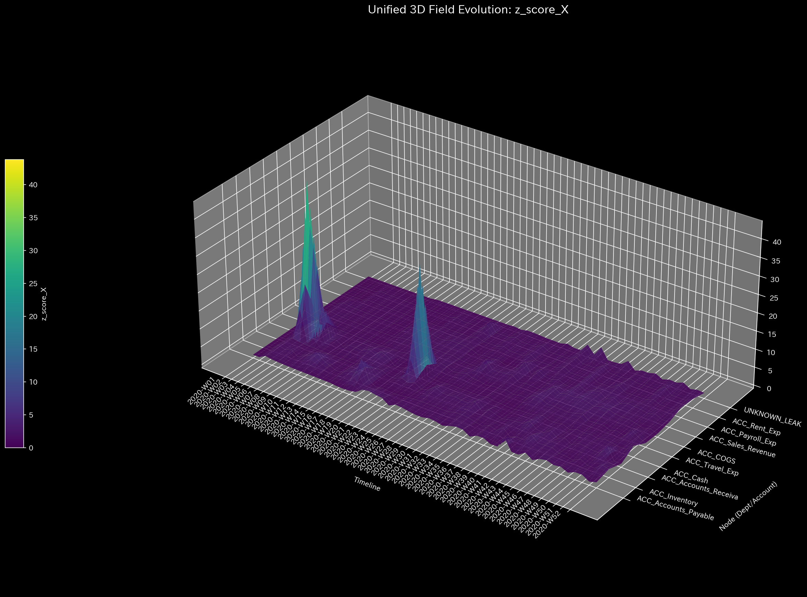

#### 🔴 Sample 5 (京都交差点網)
**臨床解説:**
完全なデッドロック状態に移行した後は、車両が完全に停止して動かないため、時間的な変動（ボラティリティ）がなくなり、Z-Score は **`0.00`** へと完全に平坦化（沈黙）します。

#### 🟡 Sample 6 (市場二部グラフ)
**臨床解説:**
ボット同期取引が実行される月において、Z-Score は最大 **`3.39`** に達しますが、同期取引が長期間続くとモデルが汚染され、Z-Score は警告を発しなくなります。
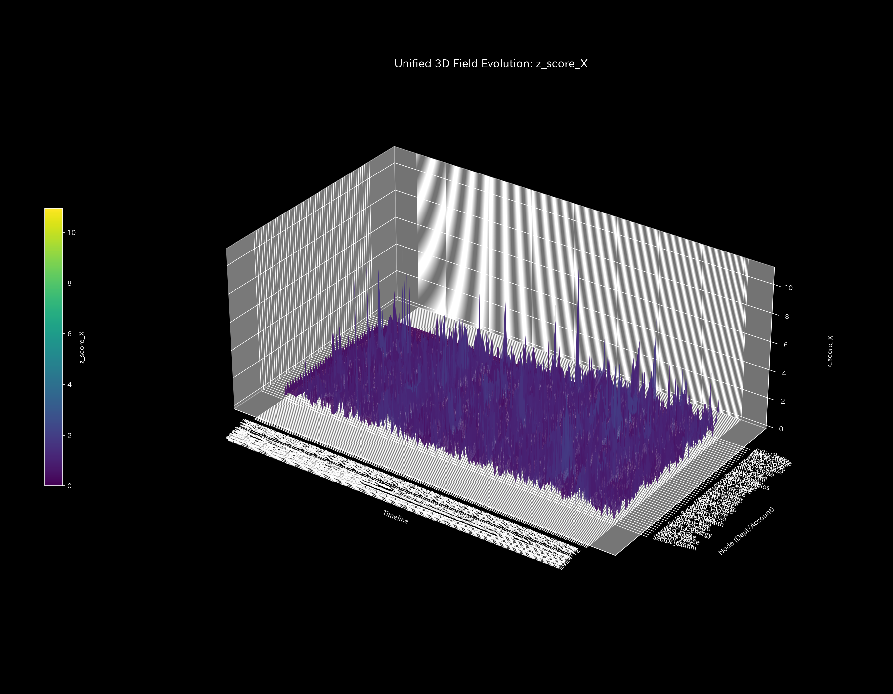

#### 🟡 Sample 7 (市場資金移動)
**臨床解説:**
共謀直接送金の開始時にボット口座周辺で最大 **`3.39`** の Z-Score スパイクを検出しますが、時間経過とともに Z-Score はベースラインに順応して平らになってしまいます。
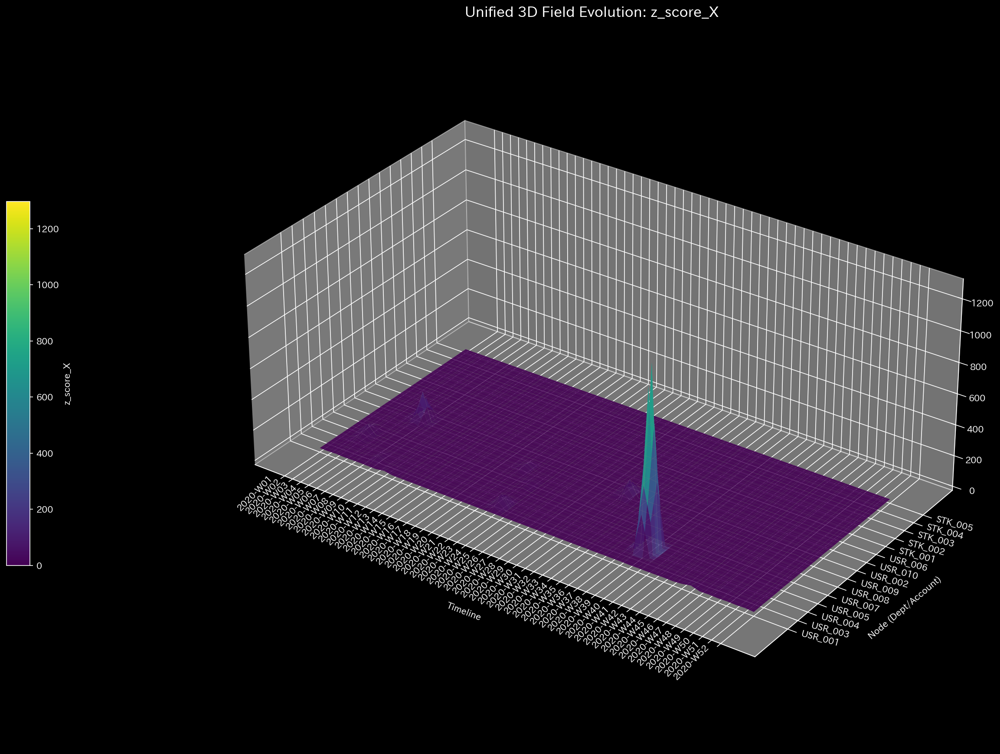

#### 🔴 Sample 8 (fMRI 脳梗塞)
**臨床解説:**
梗塞（$t=30$）が起きた直後の血液減少時に、わずかな変動を検知して極小の Z-Score（`0.07`）が立ち上がりますが、その後は活動停止状態（無変動）となるため、Z-Score は完全に沈黙します。

#### 🔴 Sample 9 (fMRI てんかん発作)
**臨床解説:**
てんかん発作発生時に Z-Score は一時的に沈黙（変動が極めて規則的なサイン波に固着してボラティリティが一定になるため）する、統計モデル特有の致命的な死角を示しています。

