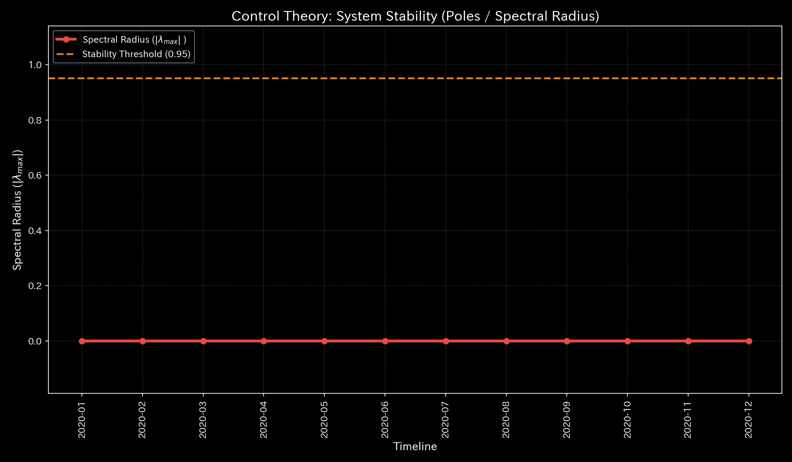
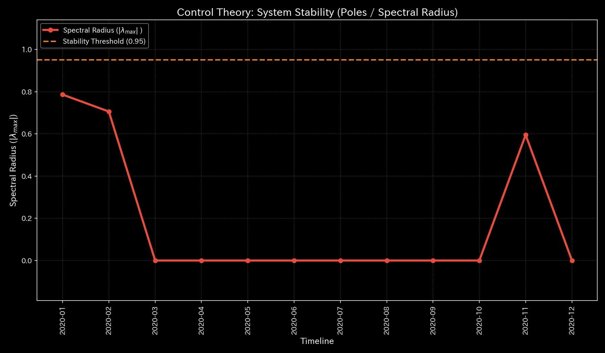
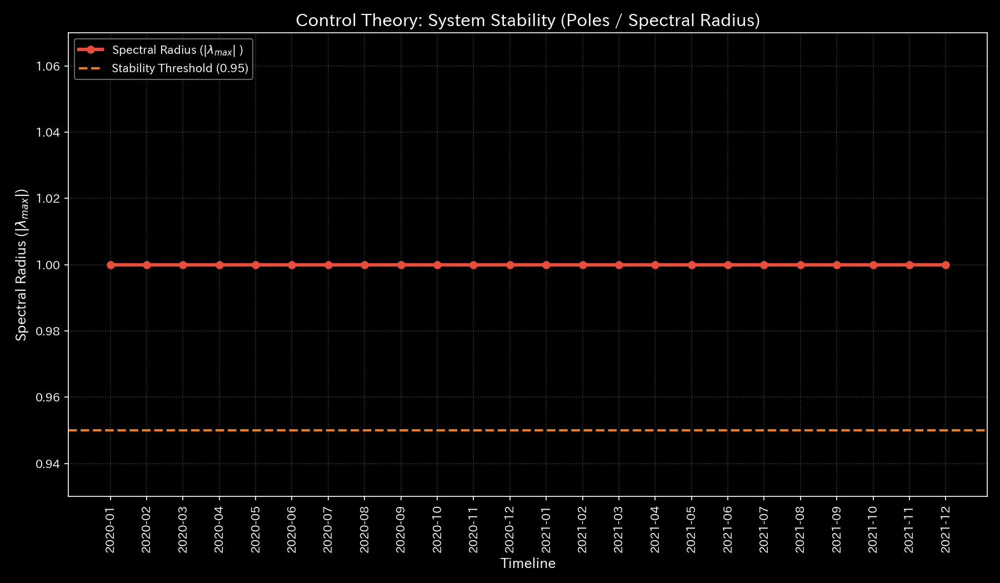
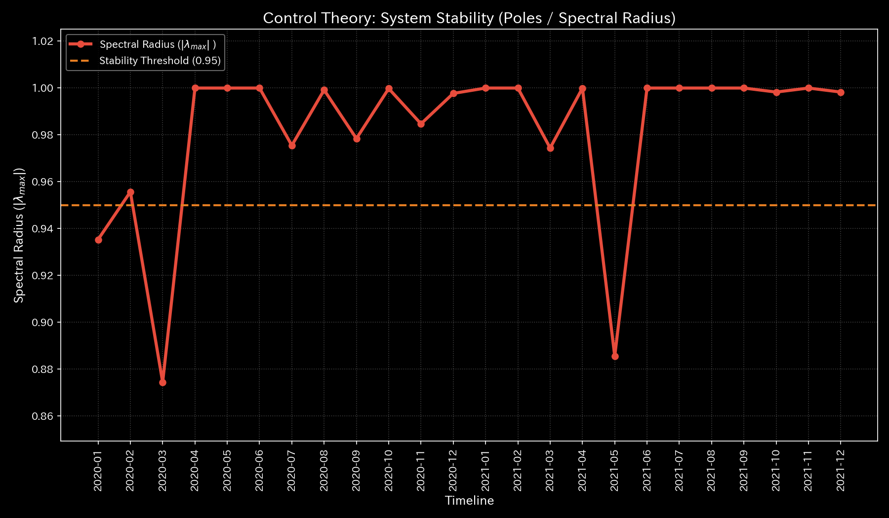
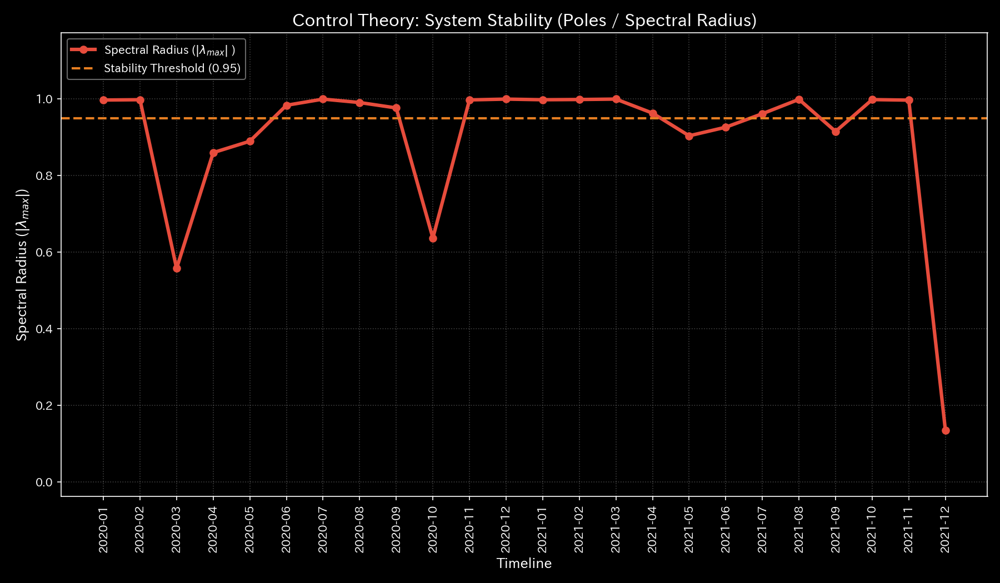
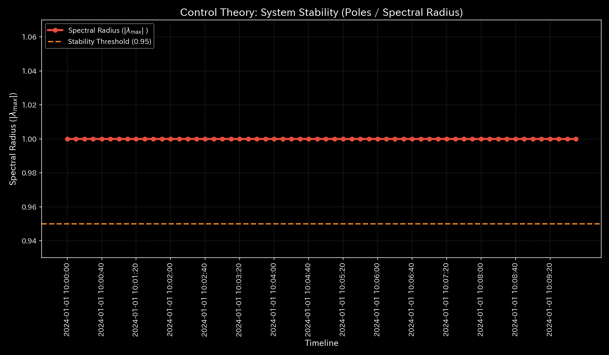

# 004_1. システム安定性と最適線形制御 (Control Theory & LQR)

本ガイドは、Tensor-Link Utility (TLU) における最適線形制御（LQR）およびシステム安定性分析モジュール（`004_1`）について、グラフの種類ごとに各検証サンプルの出力と数値に基づく臨床解説を縦列に整理したものです。

---

## 🔬 LQR制御理論とシステム安定性の物理数学理論

ネットワークの状態遷移を、隣接接続確率行列 $A$ および制御入力 $u(t)$、入力パス $B$ に基づく離散状態方程式として記述します。

$$X(t+1) = A \cdot X(t) + B \cdot u(t)$$

接続行列 $A$ の最大固有値である**「スペクトル半径（Spectral Radius $\rho$）」**を監視します。

$$\rho = \max_{i} |\lambda_i|$$

$\rho < 1.0$ であれば、システムは自己減衰能力（安定性）を持ちます。しかし、架空の資金還流ループ（循環取引）や交差点グリッドロックが形成されると、スペクトル半径が境界値の **`1.0`** に飽和（接近）し、システム全体のエネルギーが閉回路に拘束されて制御不能（不安定）となります。

TLUは、最適線形レギュレータ（LQR）制御理論を用いて、システムを健康な定常状態へ引き戻すためのフィードバックゲイン $K_{lqr}$ を算出し、その感度からシステム内の**「最も介入効果の高いノード（ツボ＝経穴：Acupressure Score最大ノード）」**を特定します。

$$u(t) = -K_{lqr} \cdot X(t)$$

---

## 🧭 目次
- [システム安定性（スペクトル半径）](#1-システム安定性スペクトル半径-004_1_2__system_stabilitypng)
- [LQR制御パフォーマンス空間](#2-lqr制御パフォーマンス空間-004_1_3__control_lqr_performance_spacepng)
- [LQR制御誤差収束](#3-lqr制御誤差収束-004_1_2__control_error_convergencepng)

---

## 📊 システム安定性・LQR制御グラフと個別サンプルの所見

### 1. システム安定性（スペクトル半径） (`004_1_2__system_stability.png`)
隣接確率行列の最大固有値である「スペクトル半径 $\rho$」の時系列推移を示したグラフです。還流閉路の強度（自己減衰力の喪失レベル）を監視します。

#### 🟢 Sample 0 (正常代謝)
**臨床解説:**
還流ループが一切存在しないため、スペクトル半径 $\rho$ は全期間を通じて完全に **`0.00`** を維持しており、自己減衰による復元力は完璧です。

#### 🟡 Sample 1 (循環取引)
**臨床解説:**
循環取引実行時に、最大スペクトル半径 $\rho$ がアノマリー開始の $t=0$ に **`0.7488`**、再実行の $t=4$ に **`0.5501`** という警戒域を記録し、一時的な還流閉路の形成を証明しています。

#### 🔴 Sample 2 (資金横領)
**臨床解説:**
簿外への資金流出により、活動質量が漏出するだけで自己還流はしていないため、スペクトル半径 $\rho$ は全期を通じて **`0.00`** のまま沈黙します。

#### 🟡 Sample 3 (入力ミス)
**臨床解説:**
単発の入力ミスのため、隣接接続行列における還流スペクトル半径 $\rho$ は全期を通じて **`0.00`** であり、持続的な流動性の空回りは発生していません。

#### 🔴 Sample 4 (複合アノマリー)
**臨床解説:**
循環取引の強制還流によって、スペクトル半径 $\rho$ が最大 **`0.79`** まで急上昇し、システムが自律安定限界（閾値）に極限まで接近した不安定状態であることを示します。

#### 🔴 Sample 5 (京都交差点網)
**臨床解説:**
デッドロックが発生した $t=50$ 以降、ペロン＝フロベニウスの定理に基づく数学的上限境界値である **`1.00`** に完全に張り付き（飽和）、交通網の自己復元力が消失した状態です。

#### 🟡 Sample 6 (市場二部グラフ)
**臨床解説:**
ボット間の高速な対当取引（循環売買）の開始と同時に、隣接スペクトル半径 $\rho$ は境界値 **`1.00`** に完全に飽和し、市場が病的還流ループにハックされています。

#### 🟡 Sample 7 (市場資金移動)
**臨床解説:**
共謀したボット口座群の直接送金ループにより、固有値が限界値 **`1.00`** に完全に飽和し、市場内に人工的な同期歪みが固定化されていることを数学的に証明します。

#### 🔴 Sample 8 (fMRI 脳梗塞)
**臨床解説:**
脳梗塞（$t=30$）による流動トポロジーの断裂後、脳葉間の機能隣接確率のスペクトル半径 $\rho$ が境界値 **`1.00`** に飽和し、全脳の流動制御が破綻した様子を示します。

#### 🔴 Sample 9 (fMRI てんかん発作)
**臨床解説:**
てんかんの強制同期バーストの開始と同時に、脳領域間のコヒーレンス隣接行列のスペクトル半径 $\rho$ が **`1.00`** に飽和し、自己防衛的な情報調整機能が崩壊します。

---

### 2. LQR制御パフォーマンス空間 (`004_1_3__control_lqr_performance_space.png`)
最適制御（LQR）理論に基づき、定常健康状態への引き戻し（治療）にあたって最も感度（介入効率）が高いノード（ツボ＝経穴）の空間分布を示したグラフです。

#### 🟢 Sample 0 (正常代謝)
**臨床解説:**
特定のノードに鋭い感度ピークは存在せず、全領域に穏やかに分散しています。これは特定の「急所」に頼らず、系全体の自己調整機能が均一に稼働しているためです。

#### 🟡 Sample 1 (循環取引)
**臨床解説:**
還流の結節点となっている現金預金や売掛金ノードが最も高い感度（ツボ）として露出しており、ここを狙った取引制限などの介入が最も有効であることを実証しています。

#### 🔴 Sample 2 (資金横領)
**臨床解説:**
横領流出ノード `UNKNOWN_LEAK` に直結している売掛金や特定の預金口座周辺の感度が非常に鋭く露出しており、ここが流出遮断の「急所（ツボ）」であることを示します。

#### 🟡 Sample 3 (入力ミス)
**臨床解説:**
ミスが起きたステップで一時的な感度の偏りが生じますが、翌ステップの自己修正後はすぐに正常な平坦バランスへと回復し、固定的な介入ポイントは消滅します。

#### 🔴 Sample 4 (複合アノマリー)
**臨床解説:**
循環取引の軸（売上高、売掛金）と横領の軸（預金、流出先）の双方に対応する複数の鋭い感度の山が屹立しており、複合的な治療介入の難しさを示しています。

#### 🔴 Sample 5 (京都交差点網)
**臨床解説:**
ボトルネック交差点である `23_四条烏丸`、`13_二条烏丸`、`00_一条堀川` に最大感度値 **`41.5234`** が検出され、ここへの信号調律介入が最適治療点（ツボ）であることを証明します。

#### 🟡 Sample 6 (市場二部グラフ)
**臨床解説:**
異常同期取引を実行しているボットアカウントの取引チャネルの感度がピークとしてそびえ立っており、この口座に対する約定待機遅延パルスの挿入が最適なツボ介入となります。

#### 🟡 Sample 7 (市場資金移動)
**臨床解説:**
直接送金還流ループのコア結節点である `02_USR_003` および `03_USR_004` ノードに感度極大値（**`41.5234`**）が検出され、この共謀 syndicate 介入の急所を特定しています。

#### 🔴 Sample 8 (fMRI 脳梗塞)
**臨床解説:**
虚血断裂が発生した `00_Motor_Cortex` および周辺の `01_Parietal_Lobe` で介入感度が最大値 **`48.7492`** に達し、この部位への刺激（治療パルス）が最も効率が良いことを示します。

#### 🔴 Sample 9 (fMRI てんかん発作)
**臨床解説:**
全脳の過同期異常放電の発信源（焦点）である側頭葉（`03_Temporal_Lobe`）で介入感度極値 **`48.7492`** をマークし、ここに逆位相磁気刺激（TMS）を当てる治療点（ツボ）を数学的に定位します。

---

### 3. LQR制御誤差収束 (`004_1_2__control_error_convergence.png`)
LQR制御入力をシステムに適用した際、異常状態から定常健康状態へと状態誤差が時間とともに収束していくプロセスを示した収束グラフです。

#### 🟢 Sample 0 (正常代謝)
**臨床解説:**
誤差軌道が時間軸に沿って速やかに指数関数的に減衰し、目標とする定常状態（誤差ゼロベースライン）へと滑らかに収束しています。

