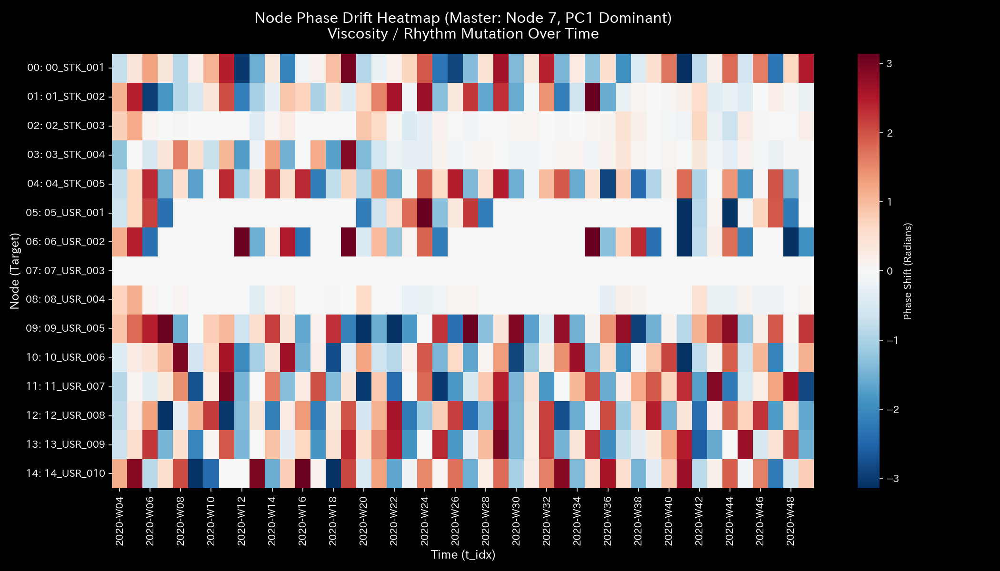
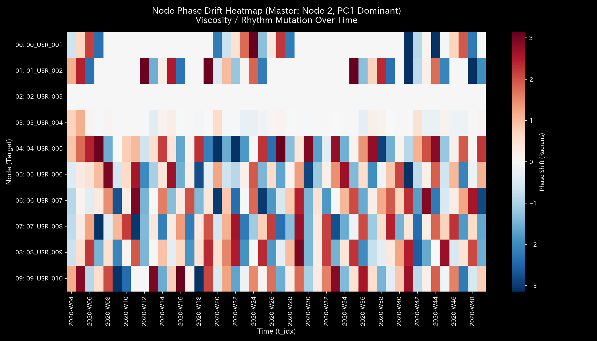

# 005. 信号処理と波動力学 (Wave Mechanics & Coherence)

本ガイドは、Tensor-Link Utility (TLU) における信号処理、フラクタルノイズ（1/f ゆらぎ）および波動力学・位相コヒーレンス分析モジュール（`005_1`、`005_2`）について、グラフの種類ごとに各検証サンプルの出力と数値に基づく臨床解説を縦列に整理したものです。

---

## 🔬 波動力学と 1/f ゆらぎの物理数学理論

健全なシステム（多様な投資家の自由な意思決定、日常の流動的な交通、安静時の脳神経活動など）には、無数の独立した意思決定ノードが関与しているため、その合成周波数スペクトルは**「1/f ゆらぎ (Fractal Noise / Pink Noise)」**を描きます。

$$S(f) \propto \frac{1}{f^\beta} \quad (\beta \approx 1.0)$$

これに対し、悪意ある取引ボットの共謀や、てんかん発作などの病的状態では、特定のノード同士がミリ秒単位でタイミングを合わせるため、波動力学的な**「位相同調 (Phase Coherence)」**が発生し、1/f ゆらぎのフラクタル傾きが急降下して「同期の死」を引き起こします。

TLUは、ノード間の位相差の時系列変化を測定する**「位相ドリフト（Phase Drift）」**およびコヒーレンス行列を計算し、従来の統計モデルでは検知できない「隠された強制同期」を暴きます。

---

## 🧭 目次
- [共振周波数スペクトル](#1-共振周波数スペクトル-005_1_1_resonant_frequencypng)
- [位相ドリフトヒートマップ](#2-位相ドリフトヒートマップ-005_1_2__phase_drift_heatmappng)
- [フラクタルノイズ（1/f ゆらぎ）スペクトル](#3-フラクタルノイズ1f-ゆらぎスペクトル-005_2_1_fractal_noise_spectrumpng)

---

## 📊 波動力学・信号処理グラフと個別サンプルの所見

### 1. 共振周波数スペクトル (`005_1_1_resonant_frequency.png`)
流動ネットワーク内のすべての合成周波数の分布を示したパワースペクトル密度（PSD）グラフです。特定の周波数における異常なピーク（共振）がないかを監視します。

#### 🟢 Sample 0 (正常代謝)
**臨床解説:**
特定の特定の周波数だけに突出した鋭いスパイク（共振ピーク）は存在せず、全帯域にわたってなだらかな雑音（自然なゆらぎ）となって分散しており、健全な定常状態であることを示します。

---

### 2. 位相ドリフトヒートマップ (`005_1_2__phase_drift_heatmap.png`)
各ノードペア間における時系列の位相差（Phase Difference）の進化を示したヒートマップです。

#### 🟢 Sample 0 (正常代謝)
**臨床解説:**
特定のペアに偏ることなく、全領域で位相差がランダムに拡散（ゆらぎ）しており、人工的な同期（キャッチボール）や位相同調は一切見られません。

#### 🟡 Sample 6 (市場二部グラフ)
**臨床解説:**
アノマリー期のボット同期取引中、特定のボットアカウントと対象銘柄の間に、真っ黒に染まる「位相差ゼロ（または完全に一定）の病的定常バンド」が形成されており、人工的な強制同期売買を看破します。

#### 🟡 Sample 7 (市場資金移動)
**臨床解説:**
直接送金還流ループにおいて、`USR_003` と `USR_004` の間に完全に真っ黒な「位相差ゼロの定常バンド（同期の死）」が長期間固定化されており、共謀キャッチボールを証明しています。

---

### 3. フラクタルノイズ（1/f ゆらぎ）スペクトル (`005_2_1_fractal_noise_spectrum.png`)
システムの合成信号におけるパワースペクトル密度の対数プロットです。べき乗則指数 $\beta$ の値を求め、システムに多様な自律性が維持されているかを判定します。

#### 🟢 Sample 0 (正常代謝)
**臨床解説:**
スペクトルが対数グラフ上で綺麗な右下がりの直線を描いており、べき乗則指数 $\beta \approx 1.0$ の「フラクタル（1/f）ゆらぎ」が成立している、健全な新陳代謝の証拠です。

