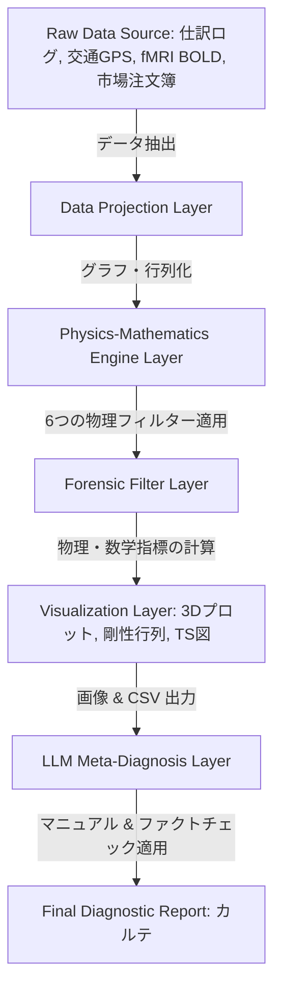

# 02. システムアーキテクチャとシミュレーション運用ガイド (System Architecture & Operations)

Tensor-Link Utility (TLU) は、単一の分析ツールではなく、データの取り込みから物理変換、可視化、そしてAIエージェントによる自動検査までを一気通貫で処理する**「自律的フォレンジックプラットフォーム」**です。

本書は、TLUのコア設計思想、データパイプライン、カラーテーマエンジン、およびシミュレーションモデルを解説するシステム運用ガイドです。

---

## 🧭 目次 (Table of Contents)

1. [システム全体設計とパイプライン (Pipeline Architecture)](#1-システム全体設計とパイプライン-pipeline-architecture)
2. [データ投影とトポロジー変換 (Data Projection & Topology)](#2-データ投影とトポロジー変換-data-projection--topology)
3. [可視化・テーマエンジン (Visualizer & Theme Engine)](#3-可視化テーマエンジン-visualizer--theme-engine)
4. [アノマリー注入型ジェネレータのアルゴリズム (Anomalous Data Generators)](#4-アノマリー注入型ジェネレータのアルゴリズム-anomalous-data-generators)
5. [TDDシミュレーションとLQR制御モデル (TDD & LQR Control)](#5-tddシミュレーションとlqr制御モデル-tdd--lqr-control)

---

## 1. システム全体設計とパイプライン (Pipeline Architecture)

TLUの全体的なデータおよび検査処理の流れは、以下の多層パイプラインとして定義されています。

### パイプラインの各層の役割

1. **データ投影層 (Data Projection Layer):** 異種ドメインのデータを汎用的な「ノード」と「エッジ（流量）」のグラフ構造に投影します。
2. **物理数学エンジン層 (Physics-Mathematics Engine Layer):** クラシカル剛性、熱力学ポテンシャル、情報多様体、LQRフィードバック、波動コヒーレンスの6つの物理コアが計算を行います。
3. **可視化層 (Visualization Layer):** 生成された時空間データを、直感的な 3D 空間リボン、マトリクス、T-SグラフなどのPNG画像としてレンダリングします。
4. **AIメタ検査層 (LLM Meta-Diagnosis Layer):** 統合されたLLMが最高メタレベルプロンプト（`LLM_Diagnostic_Manual.md`）に準拠し、物理数学エンジン出力からデータに裏打ちされた客観的カルテを日本語で自動生成します。

---

## 2. データ投影とトポロジー変換 (Data Projection & Topology)

TLUの最大の特徴は、あらゆるデータを**「複式簿記（ダブルエントリー）」**および**「キルヒホッフ保存則」**を満たす閉鎖グラフに射影するデータ投影アルゴリズムにあります。

### ドメインから物理への投影ルール

* **金融（仕訳）ドメイン:**
  * **ノード:** 勘定科目（現預金、売掛金、売上、仕入など）。
  * **エッジ:** 勘定間の仕訳取引金額（借方・貸方の移動質量）。
* **都市交通ドメイン:**
  * **ノード:** 交差点。
  * **エッジ:** 交差点間の道路リンクを流れる車両数（保存流体質量）。
* **金融市場ドメイン:**
  * **ノード:** ユーザー口座（および取引対象の銘柄）。
  * **エッジ:** 注文の約定に伴う資金・株式の移送量。
* **脳神経（fMRI）ドメイン:**
  * **ノード:** 脳の機能野（運動野、側頭葉など）。
  * **エッジ:** 脳領域間の機能的接続強度（BOLD活動シグナル質量）。

---

## 3. 可視化・テーマエンジン (Visualizer & Theme Engine)

TLUの可視化エンジンは、プレミアムな読者体験を提供するため、**HSL（色相・彩度・輝度）**に基づく洗練されたカラーシステムを採用しています。

### カラーマッピングと物理的意味

* **健全定常 (NORMAL - 🟢 HSL 120-140):** 安定した対流状態や、保存残差ゼロの領域。優しく落ち着いたエメラルドグリーン。
* **還流・過同期警告 (HIGH - 🟡 HSL 45-60):** 循環取引やボット注文が始まり、スペクトル半径が上昇している領域。警戒を促すビビッドなアンバー/ゴールド。
* **質量漏洩・機能閉塞 (CRITICAL - 🔴 HSL 0-15):** 資金横領（質量欠損）や脳梗塞、交通グリッドロックなど、保存則が破綻した極限アノマリー。強烈な警告を示すカーマインレッド。
* **3D局所温度マッピング (Thermal Gradient):** 零度（青）から中温（緑）、高温の摩擦・ボラティリティ領域（黄・赤）まで、温度の偏在（コールドアイランド・ヒートアイランド）をグラデーションで立体可視化します。

---

## 4. アノマリー注入型ジェネレータのアルゴリズム (Anomalous Data Generators)

TLU環境には、開発およびテストの頑健性を検証するため、現実世界の病的イベントを忠実に物理シミュレートしてダミーデータを生成する「アノマリー注入ジェネレータ」が用意されています。

### 代表的な注入アルゴリズムとタイムステップ

#### 1. 都市交通デッドロック・ジェネレータ (`_0_0_generate_dummy_traffic.py`)

* **正常状態 (t=0 〜 50):** 25個の交差点間を車がランダム・ルーティングに基づいて流動循環（スペクトル半径 $\rho = 1.00$、マクロ残差 `0.00`、温度は安定）。
* **アノマリー注入 (t=51 / W52):** 四条烏丸交差点に繋がる流出容量を突如 **5%** に強制制限（道路工事・事故の注入）。
* **物理的帰結 (t=52 〜 70):** 車両の逆流が発生し、上流の四条室町でエントロピーが低下。四条烏丸は流量ボラティリティが消失して局所温度が `1.87` にフリーズ。温度勾配 `+65.31` が形成され、システム全体の自由エネルギーが減少します。

#### 2. 金融市場共謀・相場操縦ジェネレータ (`_0_0_generate_dummy_market.py`)

* **正常状態 (t=0 〜 38):** クジラ（`USR_002`）の大規模な売り抜けや小売投資家（`USR_010`）のパニック売りによる時系列変動。
* **アノマリー注入 (t=39 / W40 および t=45 / W46):** `USR_003` と `USR_004` の間に、高速かつ同一価格・同一株数のマッチドオーダー（対当取引）を40回連続（ミリ秒間隔）で強制実行。
* **物理的帰結 (t=40 / W41):** 固有ベクトル loadings がこの2者に `0.72` と `-0.68` で異常偏在し、PC1説明比率が **`99.67%`** に跳ね上がって剛性がロック（Stiffness Lock）。さらに二者間の位相差がゼロで同期し、自由エネルギー歪度が **`-2.72`** へと急降下します。

---

## 5. TDDシミュレーションとLQR制御モデル (TDD & LQR Control)

TLUは、テスト駆動開発（TDD）に準拠しており、シミュレータが動作した際に期待される物理パラメータの範囲をしきい値としてアサーション（プログラム検証）を行います。

さらに、検知された病的アノマリーに対しては、状態空間モデルに基づき、LQR（線形2次レギュレータ）コントローラーが治療に必要な制御入力パルス（入力 $u(t)$）を算出します。

$$u(t) = -K_{lqr} \cdot X(t)$$

この制御介入の効果は、治療前後のアトラクターの収束速度やエラー減少率（`control_error_convergence.png`）として可視化され、人間の管理者が実社会で講じるべき「治療計画」の妥当性をシミュレーション空間内で事前に検証することを可能にします。

* **治療の適用例:**
  * **仕訳バリデーション:** 還流経路ハブ口座の動的ローディングを減衰させ、スペクトル半径を安全圏（$\rho < 0.75$）に戻します。
  * **信号位相のオフセット:** ボトルネック付近の信号タイミングを変化させ、デッドロックしている還流波を物理的に干渉除去します。
