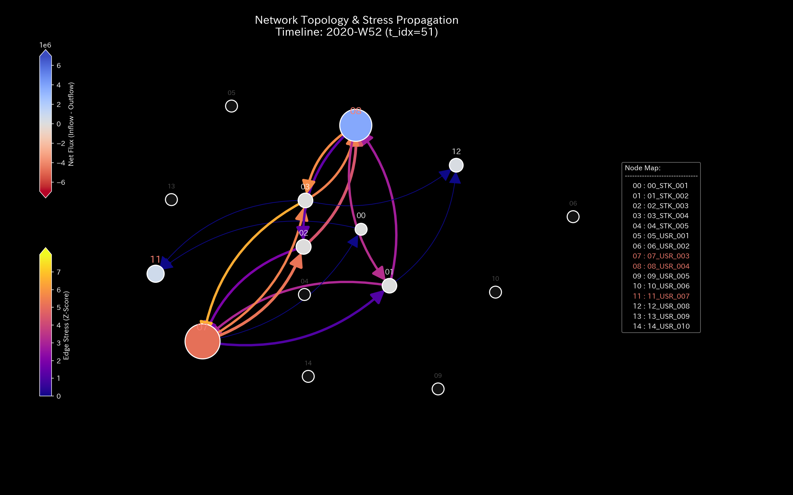
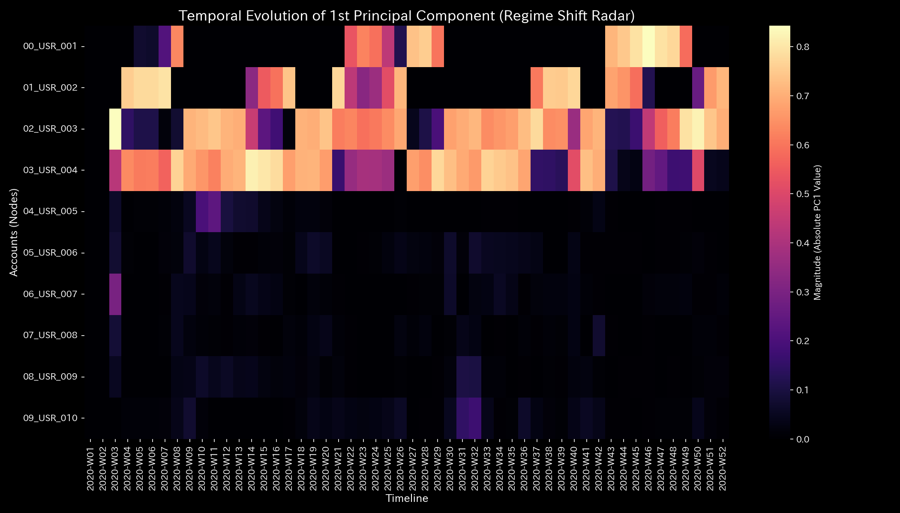

# 03. 株式市場分析とコンプライアンス監査ルール (Market Forensics & Compliance)

株式市場は、ミリ秒単位で膨大な注文（オーダーブック）が更新され、複数の共謀アカウントが複雑に入り交じる、最もフォレンジック難度の高いネットワークの一つです。

本書は、株式市場ドメインに特化した**「二部グラフ投影（銘柄-ユーザー）」**および**「直接投影（ユーザー-ユーザー）」**という2つの力学的レンズを用いて、相場操縦（仮装売買、対当取引、ボット循環取引）を看破するための監査・監視プロトコルです。

---

## 🧭 目次 (Table of Contents)

1. [市場フォレンジックの二面性 (Dual Projections)](#1-市場フォレンジックの二面性-dual-projections)
2. [銘柄-ユーザー二部グラフ分析 (Bipartite Graph Rules)](#2-銘柄-ユーザー二部グラフ分析-bipartite-graph-rules)
3. [ユーザー間直接グラフ分析 (User Direct Graph Rules)](#3-ユーザー間直接グラフ分析-user-direct-graph-rules)
4. [コンプライアンス監視・トリアージプロトコル (Compliance Audit Protocol)](#4-コンプライアンス監視・トリアージプロトコル-compliance-audit-protocol)

---

## 1. 市場フォレンジックの二面性 (Dual Projections)

株式取引ログ（約定ログ）は、そのままでは「誰が誰と共謀しているか」「どの銘柄が操縦されているか」が多次元のノイズに埋もれて見えません。TLUは、同一の生ログから以下の2つの対照的なグラフを抽出し、立体投影します。

```text
                     【約定ログ (Raw Trades)】
                               │
       ┌───────────────────────┴───────────────────────┐
       ▼ (銘柄を左、ユーザーを右に配置)                 ▼ (銘柄を捨て、口座間の直接資金移送に射影)
【二部グラフ投影 (Bipartite)】                 【ユーザー間直接グラフ投影 (Direct User)】
       │                                               │
       ├──► 目的: 「操縦された銘柄」の特定               ├──► 目的: 「共謀シンジケート(人物)」の特定
       └──► 実証: Sample 6 (Market Bipartite)          └──► 実証: Sample 7 (Market Users)
```

この2つの視点を重ね合わせることで、銘柄側の出来高偽装（Sample 6）と、ユーザー側の裏取引による資金移動（Sample 7）の両面から相場操縦の全体像を包囲します。

---

## 2. 銘柄-ユーザー二部グラフ分析 (Bipartite Graph Rules)

### 🔬 監査の視点 (Auditing Perspective)

二部グラフ（Bipartite Graph）では、左ノードに「銘柄（Stocks）」、右ノードに「ユーザー（Users）」を配置し、約定注文をエッジとして接続します。

#### 主要なアノマリー署名

1. **最大スペクトル半径の飽和 ($\rho = 1.00$):**
    特定のボット集団と特定銘柄の間で閉じた取引ループが完成すると、固有値スペクトル半径が限界値である **`1.00`** に張り付きます。これは、外部の一般投資家の取引が締め出され、閉鎖回路内で注文が空回りしているシグナルです。
2. **エッジ応力の消失 (Edge Stress = `0.00`):**
    正常な市場では、多数の参加者による注文がぶつかり合うため、各エッジ（取引経路）には力学的な緊張（Edge Stress）が張られています。しかし、ボット同士が裏で同期して注文をキャッチボールしている場合、注文の不確実性がゼロとなり、エッジストレスが極限の **`0.00`** へと崩壊します。
    * *参照:* 二部グラフ検証（Sample 6）では、特定のボット群と操縦銘柄の接続剛性が異常凝固する一方、エッジストレスが `0.00` に沈み込み、トポロジーの緊張が消え失せる「虚無の還流」が捉えられています。

    
    *図: [Sample 6 ネットワークトポロジー(t=51)](../../samples/Sample_6_Market_Bipartite_Weekly/readme_plots/002_1_2__network_topology.t.00051.png) — 特定銘柄と複数のボット口座（`USR_003`/`USR_004`等）の間で強固に結合された、閉鎖的な取引還流構造。*

---

## 3. ユーザー間直接グラフ分析 (User Direct Graph Rules)

### 🔬 監査の視点 (Auditing Perspective)

直接グラフ（Direct User Graph）では、中間にある株式という媒介ノードをすべて捨象し、口座間の「実質的な資金の往復移動」のみをエッジとして接続します。

#### 主要なアノマリー署名

1. **固有ベクトル進化の剛性ロック (PCA Stiffness Lock):**
    共謀アカウントが対当取引を発生させた瞬間、主成分分析（PCA）のPC1寄与率がほぼ100%（Sample 7では **`99.67%`** ）に跳ね上がります。この時、PC1の固有ベクトル loadings が共謀口座（`USR_003` と `USR_004`）に異常集中し、他の健全な取引関係を力学的に圧倒・拘束（Stiffness Lock）している様子が検出されます。

    
    *図: [Sample 7 固有ベクトル進化図](../../samples/Sample_7_Market_Users_Weekly/readme_plots/000_2_3__eigenvector_evolution.png) — 共謀取引開始（W41/t=40）の瞬間、PC1ローディングが両口座に異常偏在（剛性ロック）します。*

2. **静穏期におけるPC2への「退避」の看破:**
    共謀者が監査の目を盗むため、一時的に循環取引を休止（静穏期）させることがあります。このとき、PC1の loadings からは彼らの姿が消えますが、物理数学エンジンは彼らが **PC2（第2主成分）** の中に loadings **`-0.6965`** と **`0.6921`** （具体的には `t=42 / 2020-W43`）として依然として強固に退避・潜伏している「共謀の残存」を暴きます。
3. **自由エネルギー歪度の重大な崩壊:**
    循環取引が市場全体の流動性をハイジャックし、外部の正常な投資機会を締め出すと、システム全体の自由エネルギー分布が一方に偏り、自由エネルギー歪度（F-Skewness）が **`-2.72`** のようなマイナスの極値へと急激に偏向します。

---

## 4. コンプライアンス監視・トリアージプロトコル (Compliance Audit Protocol)

コンプライアンス担当者は、市場監視システムから警告アラートが発生した際、以下の手順で物理パラメータを「比較衡量（トリアージ）」し、不正取引を確定させなければなりません。

### 🚨 トリアージ・フロー

```text
【Z-Score 警告発報 (Z > 3.0)】
           │
           ├──► 物理残差 (System Conservation Residual) ＞ 0.00 ?
           │     ├──► YES: 🔴 CRITICAL (システム外への簿外資金漏洩 / 横領アノマリー)
           │
           └──► スペクトル半径 (Spectral Radius) ≧ 0.95 ?
                 ├──► NO: 🟢 NORMAL (季節的・一時的な取引急増による統計的偽陽性として棄却)
                 └──► YES: 🟡 HIGH (還流ロックの検出。以下の波動解析へ移行)
                             │
                             └──► 特定ペアの位相コヒーレンス ≈ 1.0 & 位相差 ≈ 0.0 ?
                                   ├──► NO: 正常な取引循環 (ゲートウェイノードの混雑)
                                   └──► YES: 🔴 CRITICAL (超高速Matched Orders / 相場操縦確定)
```

### 反証物理原本の請求ルール

病的共謀アノマリー（Matched Orders）を確定した際、監査部門は当事者に対して以下の「データ境界の外側にある客観的物理証拠原本」の提示を義務付けます。

1. **SWIFT / 銀行API取引履歴原本:** 帳簿上の往復約定ではなく、実際の独立した銀行口座間で同額のリアルタイム資金清算が実行されていたことの金融機関による証明。
2. **IP/MACアドレス接続ログ原本:** 取引を実行した各口座の取引端末が、物理的に独立した場所・インフラから独立した意思決定で発注されていたことの通信ログ証明。
