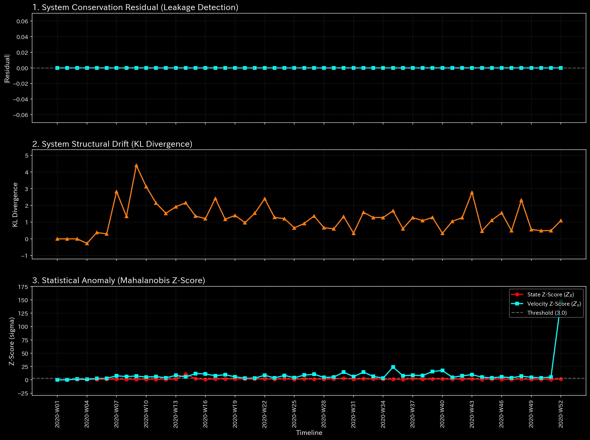

# Tensor-Link Utility (TLU)

TLUは、企業の財務データや取引ネットワークに潜む「構造的な不正」や「異常」を、**物理数学（Physical Mathematics）**のアプローチを用いて検知・可視化する高度な監査システムです。
出力される高次元な解析データは、LLM（ChatGPTやClaudeなど）と連携させることで、専門的な「AI自動監査レポート」を生成するための基盤として機能します。

## 従来の会計システムが抱える限界

従来の複式簿記システムは、「借方と貸方が常に一致する」ことを前提としています。そのため、意図的な循環取引（ウォッシュトレード）や、帳尻だけを合わせた巧妙な不正操作が行われた場合、表面上のデータから実態を見抜くことは数学的に困難です。

TLUは、データを「流体」や「エネルギーの波」として捉え直すことで、この問題を解決します。表面的な帳尻合わせに惑わされず、資金の流れの「不自然な滞留」や「異常な循環」を物理数学の法則（連続体力学など）を用いて計算し、隠されたリスクを浮き彫りにします。

## 🤖 AIによるメタ診断（AI Autonomous Auditing）

TLUの最大の価値は、単なる可視化ツールではなく、**LLM（大規模言語モデル）のための「物理演算エンジン」**として機能する点にあります。

付属の [LLMメタ診断マニュアル](docs/LLM_Diagnostic_Manual.md) を読み込ませて数理解析結果データを分析させることで、あらゆるLLMが「プロの監査役」として機能します。AIは、TLUが出力した物理数学に基づいた指標（スペクトル半径や自由エネルギーなど）と、従来の財務諸表（B/S、P/L）を照らし合わせ、ハルシネーション（AIの幻覚）を起こすことなく、監査法人レベルのより客観的なレポートを自動生成します。

## 理論的背景：なぜ「物理数学」を用いるのか

会計データに対して物理数学モデルを適用することについて、「企業は物理的な質量や摩擦を持っていない」という批判があるかもしれません。しかし、TLUが利用しているのは物理学そのものではなく、**物理現象を記述するために発展した「物理数学」という強力な数学的抽象化**です。

TLUは、企業の取引ネットワークを「個別の質量（資金規模）」と「バネ（取引関係）」と「ダンパー（時間的遅延）」が連結されたネットワークとみなして計算します。

* **質量（Inertia）：** 特定の口座や部門が持つ、資金の滞留規模や変化への強さ。
* **剛性（Stiffness / バネ）：** 「売上」から「売掛金」が発生するような、取引経路の構造的な強さや確実性。
* **粘性（Viscosity / 摩擦）：** 資金回収の遅延や、手続きによる時間的な摩擦。

このネットワークに対して運動方程式を適用することで、「外部からのショック（不正や市場の変化）」が組織内にどう波及し、どこで目詰まりを起こすかを正確に計算・検知します。企業がニュートン力学に従うわけではなく、物理数学のモデルを超高感度な「異常検知センサー」として活用しているのです。

---

## 主要な可視化ダッシュボードの解説

TLUは、複雑な数理解析の結果を直感的なダッシュボードとして出力します（ダーク、ライト、カラーブラインド対応テーマを完備しています）。

### 1. マクロ・フォレンジック・ダッシュボード（システム全体の異常検知）

システム全体の「質量保存の法則」の違反や、統計的なカオス状態を検知します。

* **Residual（質量漏れ）：** システムから資金が不自然に消滅・発生していないか（横領や架空計上）を検知します。
* **Z-Score：** 取引ネットワーク全体の統計的な異常度（ショック）を示します。


### 2. 3D マイクロ・フォレンジック（局所的な異常箇所の特定）

マクロな波のうねりと、ミクロな異常（鋭いスパイク）を同時に視覚的に把握するための3Dサーフェスグラフです。

* **Z-Score 3D Surface:** 平坦なネットワーク上に、突如として「明るい黄緑色（Yellow-Green）」の鋭いピークが出現した場合、その特定の口座・日付において強烈な異常（不正操作など）が発生していることをピンポイントで特定します。


### 3. システム安定性（スペクトル半径と循環取引の検知）

* **Spectral Radius（スペクトル半径）:** 取引ネットワーク内に「閉じたループ（循環取引）」が形成されていないかを監視します。赤色の軌跡線が1.0のオレンジ色の閾値線に近づく、あるいは突き抜けた場合、システムが人為的な取引ループによって異常膨張していることを数学的に証明します。


### 4. 熱力学エネルギー・スタック（組織の疲弊と資金の枯渇）

* **自由エネルギー（Free Energy）:** 組織が健全に活動するための「余力」を示します。白色の線（自由エネルギー）が急降下している場合、不正や無駄な摩擦によってシステムが機能不全に陥っていることを視覚的に証明します。


---

## 実行環境と利用手順（Quick Start）

TLUはDockerコンテナとして完全に隔離された環境で動作します（ホストOSを汚染しません）。データの不整合を検知した場合は直ちに処理を停止する「Fail-Fast」思想に基づいて設計されており、誤ったデータに基づく経営判断を物理的に防ぎます。

### 事前準備

対象となるデータは `workspace/` ディレクトリ内に配置します。

1. **入力データ (`workspace/input_stream/`):** 会計ソフト等から出力された、時系列の仕訳データ（CSV形式）。
2. **勘定科目マッピング (`workspace/config/_account_mapping.csv`):** 固有の勘定科目名を、TLUの内部カテゴリ（Asset, Liability等）に紐付ける辞書データ。

### 実行コマンド

```bash
# 1. リポジトリのクローン
git clone https://github.com/renpoo/TLU.git
cd TLU

# 2. Docker環境の起動
docker compose up -d

# 3. パイプラインの全自動実行（サンプルデータの生成からグラフ描画まで）
bash bin/batch_generate_dummy_journal_data.sh
bash bin/batch_processing.sh
bash bin/batch_visualize_graphs.sh

# 4. AIメタ診断レポートの確認
cat workspace/output_data/_99_diagnosis_report.md
```

## サンプルデータについて

TLUには、実務における異常パターンをシミュレートした「独立したサンプルデータ」が同梱されています（`samples/` ディレクトリ）。各サンプルには、どのような異常（循環取引、横領など）が含まれているかを解説した詳細な診断レポート（`README.md`）が用意されています。

* `Sample_0_Healthy` : 完全に健全なベースライン
* `Sample_1_Wash_Trade` : 循環取引（システム安定性の低下）
* `Sample_2_Embezzlement_Leak` : 資金の横領（自由エネルギーの枯渇）
* `Sample_3_Unbalanced_Mistake` : 仕訳ミス・帳簿操作（質量保存の破綻）
* `Sample_4_Composite_Chaos` : 全異常が混在したカオス状態
* `Sample_5_Kyoto_Traffic` : （対照実験用）空間的な交通ネットワーク
* `Sample_6_Market_Bipartite_Weekly` : 株式市場の監査（循環取引の検知）
* `Sample_7_Market_Users_Weekly` : トレーダー・ネットワークの監査（共謀関係の暴露）
* `Sample_8_fMRI_Stroke` : 生体ネットワークの監査（脳卒中の検知）
* `Sample_9_fMRI_Seizure` : 生体ネットワークの監査（てんかん発作の検知）

特定のサンプルのグラフを生成する場合は、以下のように `--target_env` を指定して実行します。

```bash
bash bin/batch_processing.sh --target_env "samples/Sample_1_Wash_Trade"
bash bin/batch_visualize_graphs.sh --target_env "samples/Sample_1_Wash_Trade"
```

## ドキュメント（Hub & Spoke）

より詳細な数学的ロジックや操作手順については、以下のドキュメント群（Spoke）をご参照ください。

* [01_System_Philosophy_and_Operations.md](docs/architecture/01_System_Philosophy_and_Operations.md)
* [02_Data_Topology_and_Projection.md](docs/architecture/02_Data_Topology_and_Projection.md)
* [03_Visualizer_and_Theme_Engine.md](docs/architecture/03_Visualizer_and_Theme_Engine.md)
* [LLM_Diagnostic_Manual.md](docs/LLM_Diagnostic_Manual.md)

---

# License: AGPL-3.0

このプロジェクトは数学的透明性を保証するための遺産です。コアロジックをオープンにし、コミュニティによる検証可能性を担保するために AGPL-3.0 ライセンスを採用しています。

# Built by Renpoo & Google Gemini

TLUは、XP（エクストリーム・プログラミング）およびTDD（テスト駆動開発）プロトコルに厳格に従って開発されており、すべてのコア数学関数は理論的なエッジケースに対して検証されています。
