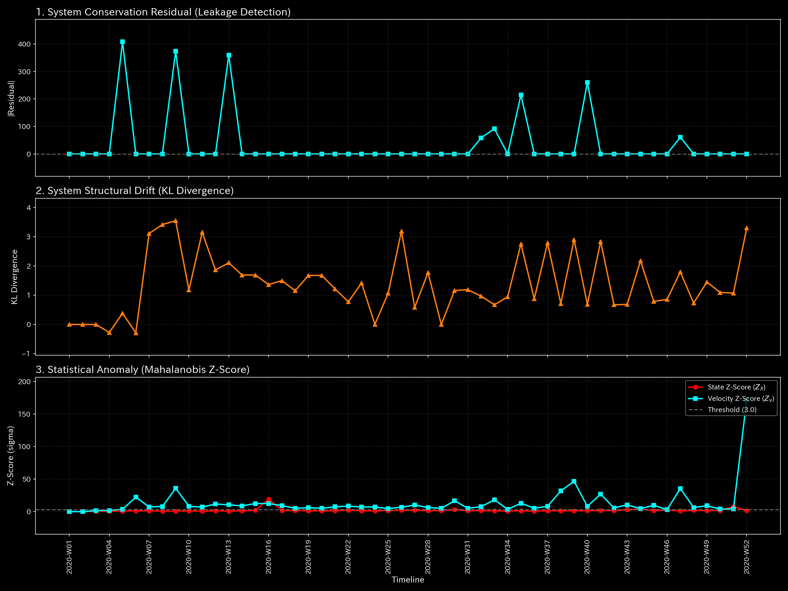
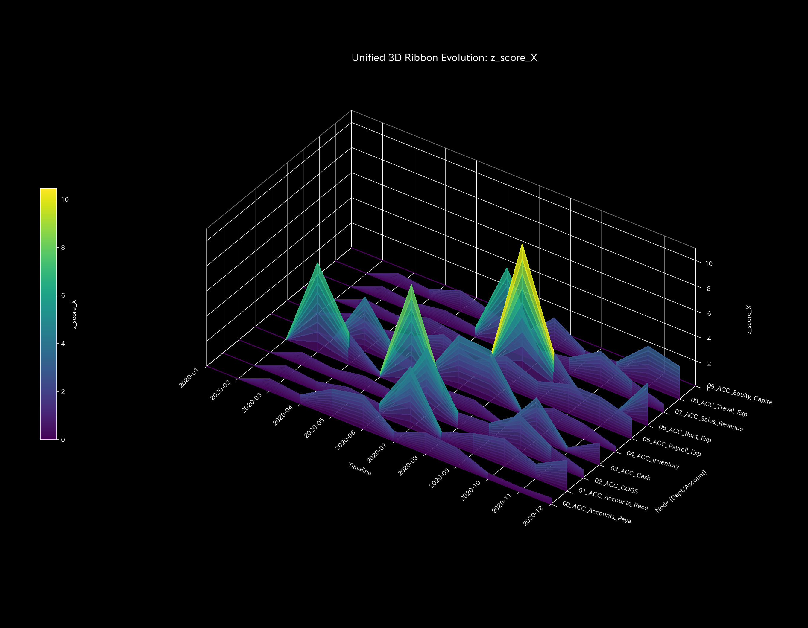

# Tensor-Link Utility (TLU)

## 🔬 結論：見えない「不正・劣化・崩壊」を物理法則で暴き出す

TLUの最大の結論は、**「表面上の帳尻合わせ（B/SやP/Lの粉飾）がいかに完璧であっても、『質量保存の法則』や『熱力学第二法則』といった普遍的な物理法則を欺くことは絶対に不可能である」**という証明です。

TLUは、金融取引、交通網、生体ネットワークなどのあらゆる複雑なデータ群を「流体」や「エネルギーの波」として再定義し、目に見えない不正（横領、循環取引）やシステム劣化（大渋滞、梗塞）を、客観的な**「物理的シグネチャ（剛性の崩壊、異常共振）」**として視覚化するメタ診断プラットフォームです。
出力された数学的証拠は、LLM（AI）によって解読され、専門家向けの実務的な「診断レポート」へと自動翻訳されます。

---

## 📚 TLU 公式ドキュメント ——目次——

TLUは、その数学的客観性と反証可能性を担保するため、厳格な階層構造を持ったドキュメント体系を備えています。監査人やエンジニアは、以下のディレクトリを参照してください。

* **[📂 AI メタ診断マニュアル (`LLM_Diagnostic_Manual.md`)](LLM_Diagnostic_Manual.md)**
  * AIがTLUの物理データをどのように読み解き、プロの監査レポートへと翻訳するかのプロトコル。
* **[📂 10のサンプル事例比較 (`samples/`)](samples/README.md)**
  * 正常なベースラインと、横領・循環取引・てんかん発作などの「病跡（異常）」を比較検証した実証レポート群。
* **[📂 グラフ解釈ガイド (`interpretations/`)](interpretations/README.md)**
  * 専門家が生成されたグラフを視覚的にどう読み解き、どう実務に適用するかの公式マニュアル。
* **[📂 物理・数学エンジン理論 (`physics/`)](physics/README.md)**
  * 運動学や熱力学が、なぜ・どのようにして異常を検知するのかを定義した数理的マニフェスト。
* **[📂 システム・アーキテクチャ (`architecture/`)](architecture/README.md)**
  * 再現性（誰がやっても同じ結果になること）を100%保証するためのパイプライン・コンテナ運用思想。

---

## 従来の限界と「物理数学」のアプローチ

なぜ、既存の監査ツールやダッシュボードでは不十分なのでしょうか？

### 従来の集計的アプローチの限界

従来のシステムは「借方と貸方が一致しているか」「売上が目標に達しているか」という「静的な結果」しか見ません。そのため、複数人が結託して帳尻を合わせた「循環取引（Wash Trade）」や、長年かけて少しずつ会社を蝕む「摩擦熱（過剰な非効率）」を見抜くことは数学的に困難です。

### 物理数学によるドメイン横断的解決

TLUは、バラバラのトランザクション・データ（仕訳帳など）を、**「バネとオモリで相互接続された、ひとつの弾性連続体（Mass-Spring-Damper ネットワーク）」**として見立てて計算します。これにより、局所的な異常（不正）が組織全体にどう波及（伝播）するかを、以下の「物理的特性」を用いて高精度にシミュレートできます。

* **質量 / 慣性 (Inertia):** 資金やリソースの滞留規模。質量が突然消滅すれば「横領や梗塞」を意味します。
* **剛性 (Stiffness):** 取引関係の確実性（バネの強さ）。これが失われればシステムは「絶対硬直」に陥ります。
* **粘性 (Viscosity):** 資金回収や業務プロセスの遅延（摩擦熱）。


TLUは、ニュートン力学、熱力学、情報幾何学、制御工学を横断的に適用し、これらを見えない「異常検知センサー」として活用します。

---

## 証拠となる4つのコア・シグネチャ

AIメタ診断エンジンが実査（フォレンジック）の根拠とする、代表的な4つの物理的・数学的視覚証明です。

> **⚠️ 読解の前提：数学的制約（エッジ・エフェクト）**
> TLUは「過去データの揺らぎ（分散）」を基準に異常を検知します。そのため、**計算開始直後（時間軸の最初）**は比較すべき過去データが存在しないため、ごく普通の取引でも「無限大の異常（巨大なスパイク）」として計算されてしまう**エッジ・エフェクト（数学的錯覚）**が必ず発生します。これはシステムのバグではなく、たとえば集計期間の開始時点と終了時点などの**データ不足による「不確実性」を正確に反映した仕様**です。グラフを読み解く際は、この初期スパイクを正しく考慮してください。

### 1. マクロフォレンジック（質量の保存と崩壊）

システム全体から「不自然に消滅・発生した資金（Residual）」がないかを監視します。帳簿外への資金流出が発生した場合、質量保存の法則が破綻し、強烈なスパイクとして検知されます。

【正常系の一例：サンプル 0 より】
> 📝 **読解:** 誤差（Residual）がゼロ付近のノイズレベルに収まっており、システム全体の「質量保存の法則」が完璧に守られています。

【異常系の一例：サンプル 2 より】
> 🚨 **異常の証明:** グラフ中央の強烈なマイナス方向へのスパイクは、帳簿外へ資金が不自然に消滅した「横領（漏出）」の瞬間を正確に捉えています。


### 2. 制御工学とシステム安定性（死の螺旋の検知）

**Spectral Radius（スペクトル半径）:** 取引ネットワーク内に「閉じたループ（循環取引）」が形成されていないかを監視します。赤色の軌跡線が1.0のオレンジ色の閾値線に近づく、あるいは突き抜けた場合、システムが人為的なループによって暴走（制御不能）していることを数学的に証明します。

【正常系の一例：サンプル 0 より】
> 📝 **読解:** 赤色の軌跡線（スペクトル半径）が常に 1.0 未満の安全圏を推移しており、組織の取引が自己収束（健全）していることを示しています。

【異常系の一例：サンプル 4 より】
> 🚨 **異常の証明:** 赤色の軌跡線が 1.0 の警戒線（オレンジ色）を突破して張り付いており、組織内で人工的な「循環取引」による暴走が発生していることを数学的に証明しています。


### 3. 熱力学エネルギー・スタック（組織の疲弊と熱的死）

**自由エネルギー（Free Energy）:** 組織が健全に活動するための「余力」を示します。白色の線がゼロ以下のマイナス圏へ沈み込んでいる場合、システムが活動すればするほど無駄な摩擦熱（エントロピー）を生み出す「熱力学的な死」に向かっていることを証明します。

【正常系の一例：サンプル 0 より】
> 📝 **読解:** 白色の線（自由エネルギー）が常にプラス圏を保ち、システムが仕事をするための「健全な余力」を残していることがわかります。

【異常系の一例：サンプル 6 より】
> 🚨 **異常の証明:** 自由エネルギー（白色の線）がゼロを割り込んでマイナス圏へ沈下し、過剰な取引（ウォッシュトレード等）による摩擦熱でシステムが「熱的な死」に陥っています。


### 4. 3D マイクロ・フォレンジック（発生座標のピンポイント特定）

**Z-Score & KL Drift 3D Surface:** 空間の幾何学的な歪みを計算し、**「何月何日の、どの特定の口座（ノード）」**で異常な操作が行われたのかを、鋭い黄緑色（Yellow-Green）のスパイクとしてピンポイントで刺し貫きます。

【正常系の一例：サンプル 0 より】
> 📝 **読解:** グラフ冒頭（一番奥側の縁）に「エッジ・エフェクト」による巨大なスパイク（数学的錯覚）が立っていますが、それ以降の空間全体はなだらかな青い波（通常の取引の揺らぎ）で構成されており、突発的な異常は存在しないことがわかります。

【異常系の一例：サンプル 5 より】
> 🚨 **異常の証明:** 平坦な空間を突き破る「黄緑色（Yellow-Green）の鋭いスパイク」が出現し、特定の日時・特定のノード（交差点）で発生した大梗塞をピンポイントで刺し貫いています。


---

## 🚀 実行環境とクイックスタート（TDDによる証明）

TLUは「フェイルファスト（データ異常時の即時停止）」と「ステートレスなコンテナ環境」によって、ローカル環境への依存性や人間のバイアスを完全に排除しています。

### 【重要】自社データで分析するための前提条件 (Prerequisites)

ご自身のデータで TLU を実行する場合、最低限以下の2つのファイルを用意し、`workspace/` 内に配置するだけで解析が開始されます。

1. **時系列のトランザクション・データ (`workspace/input_stream/`)**
   * 会計ソフト等から出力された生データ（CSV形式）。「日付 (Trans_Date)」「口座名/ノード名 (Account_Name)」「流入量 (Debit)」「流出量 (Credit)」の列が必要です。
2. **勘定科目マッピング辞書 (`workspace/config/_account_mapping.csv`)**
   * 独自の口座名を、TLUの標準カテゴリ（Asset, Liability, Revenue, Expense 等）に紐付けるための辞書ファイルです。（未定義の口座がある場合、システム実行時に自動でひな形テンプレートが追記・生成される補助機能が組み込まれています）
   * **⚠️ 重要な事実:** はっきり言って、このマッピングは**「初期段階（Phase 1）で従来のB/SとP/Lを生成するためだけ」**のものです。TLUのコアである「物理数学エンジン（Phase 3以降）」は、すべての名前を剥奪して純粋なテンソル空間で計算を行うため、**このマッピングの正確さが異常検知の精度に影響を与えることは一切ありません。**

### 全自動シミュレーションの実行手順

```bash
# 1. リポジトリのクローン
git clone https://github.com/renpoo/TLU.git
cd TLU

# 2. Docker環境の起動
docker compose up -d

# 3. パイプラインの全自動実行（Sample 1: 循環取引 のシミュレーション）
# ※ "samples/Sample_0_Healthy" に変更すると正常系のベースラインを確認できます
bash bin/batch_processing.sh --target_env "samples/Sample_1_Wash_Trade"
bash bin/batch_visualize_graphs.sh --target_env "samples/Sample_1_Wash_Trade"

# 4. AIメタ診断レポート（JSON/Markdown）の確認
cat workspace/output_data/_99_diagnosis_report.md
```

---

## ⚠️ 監査実務への適用（反証可能性とモデルの限界）

TLUは「システム内に質量欠損がある」「スペクトル半径が1.0に張り付いている」という**普遍的な物理数学的事実**を断定する最強の「証拠提示マシン（計算機）」です。

しかし、その異常が「意図的な犯罪（横領・粉飾）」なのか、「単なる入力ミスや正当なビジネス上の理由」なのかを最終判断するのはAIではありません。提示された物理的・幾何学的な座標（日時と口座）に基づき、請求書や約定ログなどの「現実世界の生データ（グラウンド・トゥルース）」を実査（追加検証）する人間の監査人こそが、最終的な「裁判官」なのです。

---
**License**: AGPL-3.0
**Built by**: Renpoo & Google DeepMind Agent (Antigravity)
