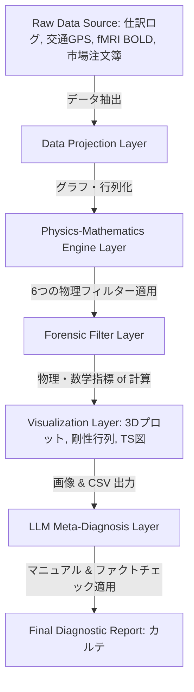

# 02. システムアーキテクチャとシミュレーション運用ガイド (System Architecture & Operations)

Tensor-Link Utility (TLU) は、データの取り込みから物理変換、可視化、AIエージェントによる自動検査までを処理するプラットフォームです。単一の分析ツールではありません。

本書は、TLUの設計思想、データパイプライン、カラーテーマエンジン、およびシミュレーションモデルを解説するシステム運用ガイドです。

---

## 🧭 目次 (Table of Contents)

1. [システム全体設計とパイプライン (Pipeline Architecture)](#1-システム全体設計とパイプライン-pipeline-architecture)
2. [データ投影とトポロジー変換 (Data Projection & Topology)](#2-データ投影とトポロジー変換-data-projection--topology)
3. [可視化のテーマ設定システム (Visualizer Theme System)](#3-可視化のテーマ設定システム-visualizer-theme-system)
4. [アノマリー注入型ジェネレータのアルゴリズム (Anomalous Data Generators)](#4-アノマリー注入型ジェネレータのアルゴリズム-anomalous-data-generators)
5. [TDDシミュレーションとLQR制御モデル (TDD & LQR Control)](#5-tddシミュレーションとlqr制御モデル-tdd--lqr-control)

---

## 1. システム全体設計とパイプライン (Pipeline Architecture)

TLUのデータおよび検査処理の流れは、多層パイプラインとして定義されています。

### パイプラインの各層の役割

1. **データ投影層 (Data Projection Layer):** 異種データをノードとエッジ（流量）のグラフ構造に投影します。
2. **物理数学エンジン層 (Physics-Mathematics Engine Layer):** 6つの物理コアが計算を行います。計算対象は、クラシカル剛性、熱力学ポテンシャル、情報多様体、LQRフィードバック、および波動コヒーレンスです。
3. **可視化層 (Visualization Layer):** 生成された時空間データをPNG画像としてレンダリングします。画像には 3D 空間リボン、マトリクス、T-Sグラフなどがあります。
4. **AIメタ検査層 (LLM Meta-Diagnosis Layer):** 統合されたLLMが客観的カルテを日本語で自動生成します。生成には最高メタレベルプロンプト（`LLM_Diagnostic_Manual.md`）を用います。物理数学エンジンの出力データに基づきます。

---

## 2. データ投影とトポロジー変換 (Data Projection & Topology)

TLUは、データを閉鎖グラフに射影します。この射影アルゴリズムは、複式簿記およびキルヒホッフ保存則を満たします。

### ドメインから物理への投影ルール

* **金融（仕訳）ドメイン:**
  * **ノード:** 勘定科目（現預金、売掛金、売上、仕入など）。
  * **エッジ:** 勘定間の仕訳取引金額（移動質量）。
* **都市交通ドメイン:**
  * **ノード:** 交差点。
  * **エッジ:** 道路リンクを流れる車両数（流体質量）。
* **金融市場ドメイン:**
  * **ノード:** ユーザー口座および取引対象の銘柄。
  * **エッジ:** 取引に伴う資金・株式の移送量。
* **脳神経（fMRI）ドメイン:**
  * **ノード:** 脳の機能野（運動野、側頭葉など）。
  * **エッジ:** 脳領域間の機能的接続強度（BOLD活動シグナル質量）。

---

## 3. 可視化のテーマ設定システム (Visualizer Theme System)

TLUの可視化機能は、数理解析グラフの視認性を統一します。JSONファイルによるデザインテーマ管理と、解析項目ごとのカラーマップを採用しています。

### 解析ごとのカラーパレットの使い分けと物理的意味

* **発散型カラーマップ (Diverging CMAPs: `RdBu_r`, `coolwarm` 等)**:
    ネット流量の正負や、目標からの差分を可視化します。基準（ゼロ）から二方向へ広がる変動に用います。
* **順序型カラーマップ (Sequential CMAPs: `inferno`, `magma`, `viridis` 等)**:
    エントロピー、局所温度、KL Driftなどの連続的なグラデーションを立体可視化します。
* **警告・異常値のハイライト配色**:
    健全なデータは青や緑で表現します。臨界閾値を超えた異常値は赤やピンクで強調表示します。

---

## 4. アノマリー注入型ジェネレータのアルゴリズム (Anomalous Data Generators)

TLU環境には、アノマリー注入ジェネレータが用意されています。開発とテストの頑健性を検証するためのダミーデータを生成します。

### 代表的な注入アルゴリズムとタイムステップ

#### 1. 都市交通デッドロック・ジェネレータ (`src/filters/_0_0_generate_dummy_traffic.py`)

* **正常状態 (t=0 〜 50):** 25個の交差点間を車が流動循環します。スペクトル半径 $\rho$ = 1.00$、マクロ残差 `0.00` です。温度は安定します。
* **アノマリー注入 (t=51 / W52):** 四条烏丸交差点の流出容量を **5%** に制限します。
* **物理的帰結 (t=52 〜 70):** 車両の逆流が発生します。上流の四条室町でエントロピーが低下します。四条烏丸は流量ボラティリティが消失します。局所温度が `1.87` に固定されます。温度勾配 `+65.31` が形成され、全体の自由エネルギーが減少します。

#### 2. 金融市場共謀・相場操縦ジェネレータ (`src/filters/_0_0_generate_dummy_market.py`)

* **正常状態 (t=0 〜 38):** クジラ（`USR_002`）の売り抜けや小売投資家（`USR_010`）の売りによる時系列変動です。
* **アノマリー注入 (t=39 / W40 および t=45 / W46):** `USR_003` と `USR_004` の間で対当取引を40回連続で実行します。取引は同一価格、同一株数です。
* **物理的帰結 (t=40 / W41):** 固有ベクトル loadings が `USR_003` に `0.72`、`USR_004` に `-0.68` 偏在します。PC1説明比率は **`99.67%`** になり、剛性がロック（Stiffness Lock）されます。二者間の位相差はゼロで同期します。自由エネルギー歪度は **`-2.72`** に減少します。

---

## 5. TDDシミュレーションとLQR制御モデル (TDD & LQR Control)

TLUは、テスト駆動開発（TDD）に準拠します。シミュレータ動作時に、期待される物理パラメータ範囲をしきい値として検証します。

検出された異常に対しては、LQR（線形2次レギュレータ）コントローラーが制御入力 $u(t)$ を算出します。状態空間モデルに基づきます。

$$u(t) = -K_{lqr} \cdot X(t)$$

この制御介入の効果は、治療前後のアトラクターの収束速度やエラー減少率（`control_error_convergence.png`）として可視化されます。

* **治療の適用例:**
  * **仕訳バリデーション:** 還流経路ハブ口座の動的ローディングを減衰させます。スペクトル半径を安全圏（$\rho < 0.75$）に戻します。
  * **信号位相のオフセット:** ボトルネック付近の信号タイミングを変化させます。デッドロックしている還流波を干渉除去します。
