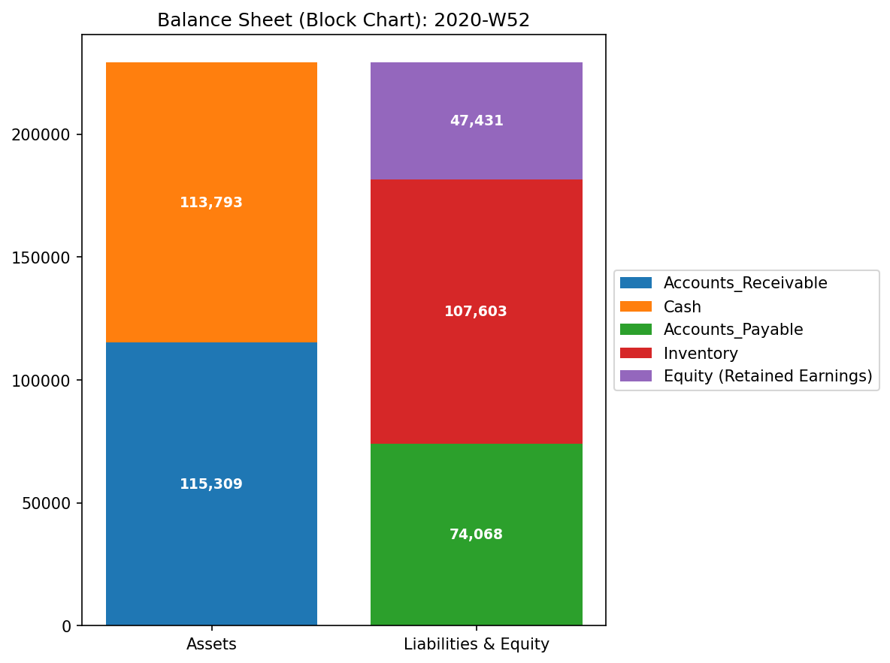
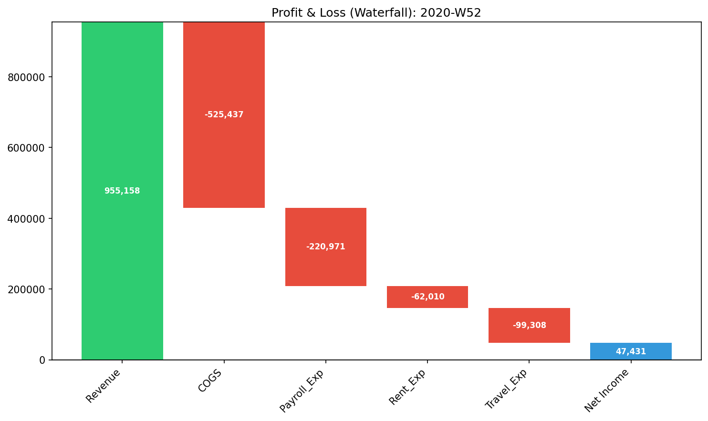
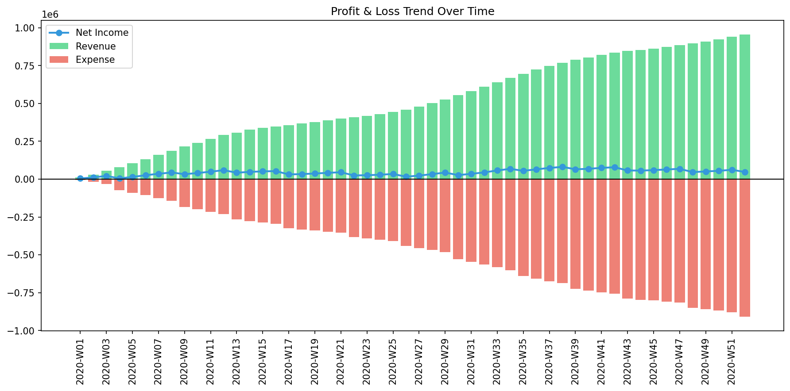

# 000_0. 財務諸表 (Financial Statements)

高度な物理数学を用いた解析（Phase 2）に入る前に、TLUは標準的なB/S（貸借対照表）およびP/L（損益計算書）の推移をダッシュボード化します。
これらは、システムが指摘した異常（アノマリー）を、現実のビジネス状況と照らし合わせるための「基準点（ベースライン）」として機能します。

---

### 1. 貸借対照表（B/S）ブロックチャート (`000_0_1__BS_Block_Total.png`)

* **📊 視覚的構造**: 伝統的な左右対比型の積み上げ棒グラフ。
* **📐 会計理論**: 基本方程式: $\text{資産} = \text{負債} + \text{資本}$。
* **🚨 異常の検知（マクロ・ミクロ）**:
  * **[マクロ] 左右の不一致:** 左右の棒グラフの高さが完全に一致していない場合、元となる仕訳データそのものが壊れています（借方・貸方の不一致、入力エラーなど）。
  * **[マクロ] 資本ブロックの沈み込み:** 利益剰余金（資本ブロックの一部）が「ゼロの線」より下へ伸びている場合、その企業は構造的に赤字（純損失）を累積し続けています。
* **💼 監査実務への応用**: 組織の健全性の究極のスナップショットです。高度な異常スコアを疑う前に、まずは生のデータが基本的な「複式簿記のルール」に従っているかを視覚的に検証してください。

---

### 2. 損益計算書（P/L）ウォーターフォール (`000_0_1__PL_Waterfall_Total.png`)

* **📊 視覚的構造**: 滝（カスケード）状のステップチャート。
* **📐 会計理論**: 収益性のフロー: $\text{収益} - \sum \text{費用} = \text{純利益}$。
* **🚨 異常の検知（マクロ・ミクロ）**:
  * **[ミクロ] 巨大な赤いステップ:** 他の費用項目と比べて、不釣り合いに巨大な「赤い費用ブロック（特定の経費のスパイク）」がないかを探します。
  * **[マクロ] 利益率の俯瞰:** 最初の緑のバー（収益）に対して、最後の青いバー（純利益）が極端に細くなっていないかを確認します。
* **💼 監査実務への応用**: 利益がどのように削り取られているか（浸食）を可視化します。特定の月に突如として巨大な赤い費用ブロックが現れた場合、その科目に絞った即時の監査（突発的な無駄遣いや不正の調査）が必要です。

---

### 3. 損益計算書（P/L）トレンド (`000_0_1__PL_Trend.png`)

* **📊 視覚的構造**: 時系列の棒グラフおよび折れ線グラフ。
* **📐 会計理論**: 複数期間にわたる収益性のモメンタムを追跡します。
* **🚨 異常の検知（マクロ・ミクロ）**:
  * **[マクロ] 純利益の沈み込み:** 青い線（純利益）が0軸を下回り、慢性的にマイナス圏に沈んでいないか（構造的な赤字）を確認します。
  * **[ミクロ] 費用スパイク:** 緑の収益バー（売上）が横ばい・低下している時期に、赤い費用バー（経費）だけが突如として跳ね上がっている（説明のつかないスパイク）箇所がないかを探します。
* **💼 監査実務への応用**: 季節的な変動と、構造的な固定費の重さを明らかにします。売上が落ち込んでいるのに費用が全く下がらない場合、極めて柔軟性がなくリスクの高い事業構造（固定費の重圧）に陥っていることを示します。
