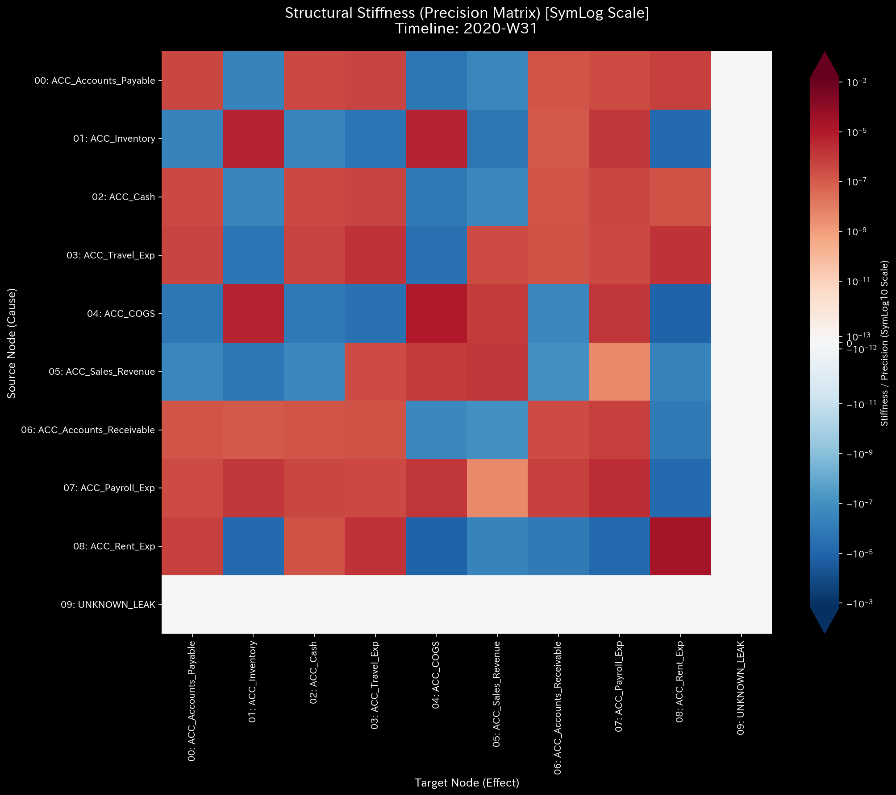
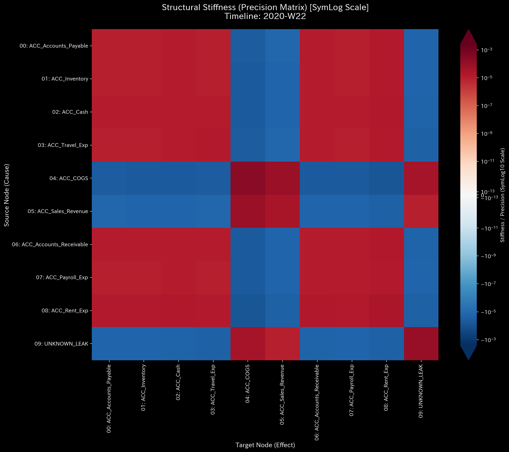
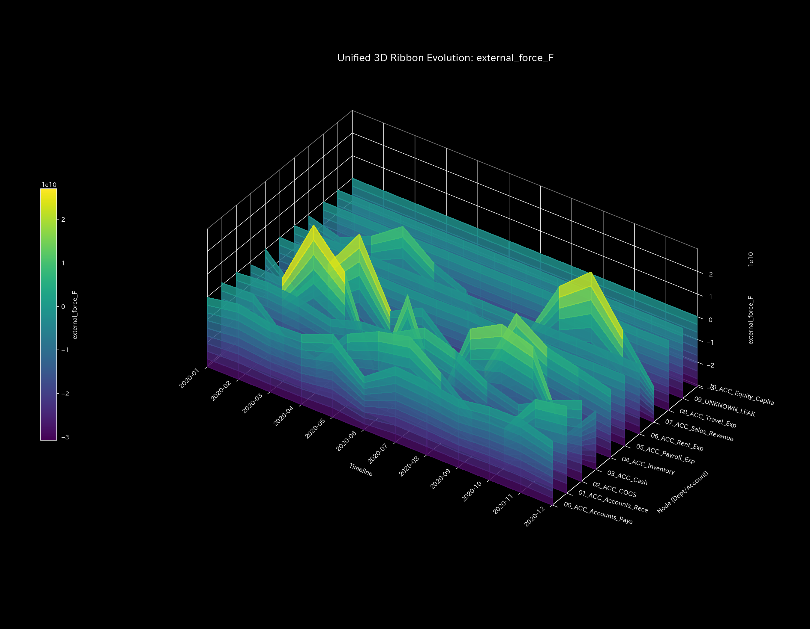

# 000. 古典力学および固体力学 (Classical Mechanics & Stiffness)

## 🔬 結論：システムは弾力性を保っているか、崩壊（硬直）しているか

本ドキュメントでは、対象となるネットワークを「無数のバネで繋がれた物理的な構造物」と見なし、その運動と構造的強度を評価する「古典力学・固体力学」アプローチを解説します。
ここでの結論は明確です。**「システムは外部からのショックに対して元の形に戻る『弾力性（Elasticity）』を維持しているか、それとも回復不可能な『絶対硬直（Rigid Lock）』や『崩壊』を引き起こしているか」**を診断します。

取引や信号のフローを「質量・速度・加速度」として捉えることで、帳簿やネットワークの裏に潜む「見えない強い力（悪意や物理的な欠損）」を浮き彫りにします。

---

## 🎨 全体像のデッサン：構造の剛性と崩壊（Structural Stiffness）

勘定科目間（あるいは交差点、脳部位間）の結びつきの強さを「バネ係数（剛性）」としてマトリックス化したものです。健全なネットワークは強い結びつき（赤色）を保ちますが、異常が発生するとこの構造が「相転移（崩壊）」を起こします。

### 【比較1】健全な弾力性（ベースライン）

* **Sample 0 (Healthy)**: 組織の主要な取引ルート（売上・売掛金・現金など）が強い赤色（強固なバネ）で結ばれています。多少の取引量のブレがあっても、この基本構造が年間を通じて維持されるのが「健全な弾力性」です。

### 【比較2】質量欠損による絶対硬直（横領）

* **Sample 2 (Embezzlement Leak)**: 簿外への資金流出（質量の消失）が続いた結果、本来赤色であるべきバネが完全に切れて空白（無色）化しています。資金が足りず、もはやシステムが元に戻れない「絶対硬直（Rigid Lock）」を引き起こした物理的証拠です。

### 【比較3】一時的な断裂と自己修復（ヒューマンエラー）

* **Sample 3 (Unbalanced Mistake)**: 経理担当者の単発の入力ミスにより、瞬間的にバネが引き伸ばされ（第21週の剛性の乱れ）、構造にストレスがかかります。しかし、システム全体の質量が失われたわけではないため、翌月には再び元の強固な構造（赤色）へと自己修復します（サスペンション機能）。

---

## 🔍 細部へのズームイン：目に見えない「力」の検知（3D Dynamics）

構造の崩壊（マクロ）を確認した後は、**「システムにどのような異常な力（加速度や外部ショック）が加わったのか」**をミクロな運動学の視点から特定します。

### 異常な外力のベクトル（3D External Force）

* **📊 視覚的構造**: 3D位相空間において、システムに加わった「外部からの力（External Force）」の軌跡を描きます。
* **🚨 異常の検知**: 健全な状態（Sample 0）では、軌跡は中央の原点付近に密集し、安定した球状のクラスターを形成します。しかし、**Sample 2（横領）** のようにシステムから突如として質量が消失（または異常注入）すると、その瞬間に中央のクラスターから遠く離れた空間へ、鋭く激しい「針（スパイク）」が射出されます。

---

## 🔬 反証可能性とモデルの限界（実務への適用）

古典力学アプローチは、「ネットワークの特定の箇所においてバネ（剛性）が断裂し、異常な力が発生した」という**物理的事象**を確実に捉えます。
しかし、剛性が崩壊した理由が「悪意ある内部犯行による資金の抜き取り」なのか、それとも「取引先企業の倒産による売掛金の突然の焦げ付き」なのかは、力学データだけでは判別できません。

剛性崩壊のタイミング（$t$）と異常な力のベクトル（スパイクの方向）が特定できれば、監査人は「第30週の、この特定の口座間フローに何らかの強大な外部ショックがあったはずだ」とアタリをつけ、ピンポイントで証憑（請求書や契約書）の突合調査（追加検証）を行うことができます。
