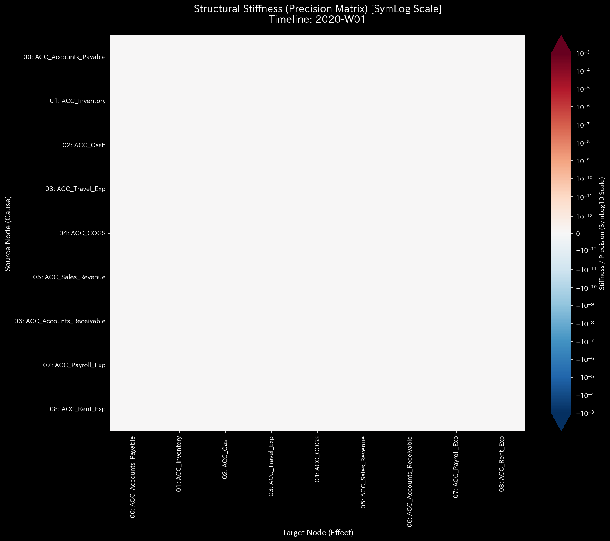
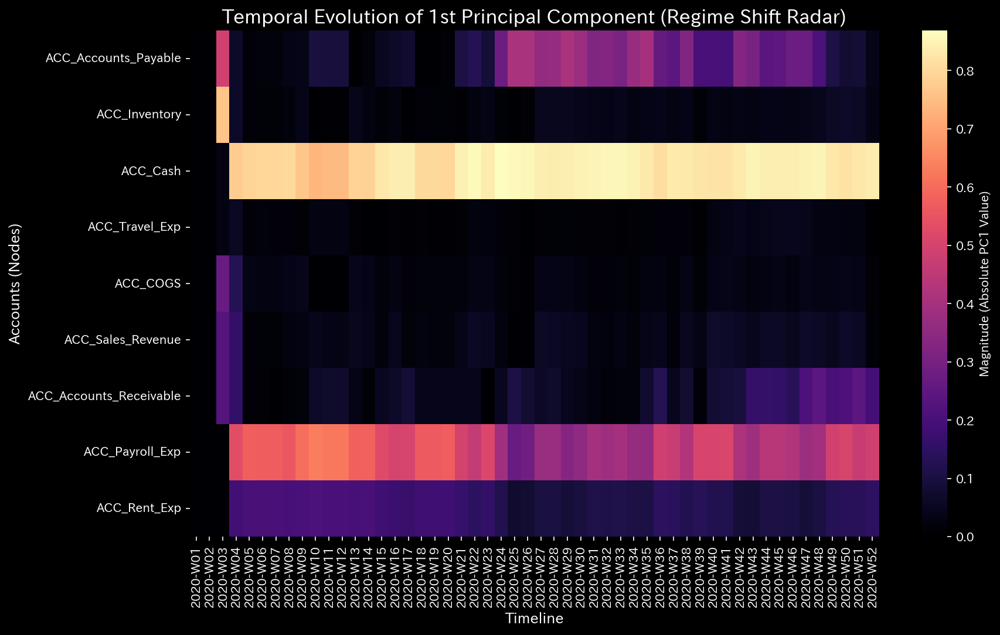

# 000. 古典力学および固体力学 (Classical Mechanics & Stiffness)

このフェーズでは、財務データを物理的なネットワークと見なし、「資金移動のスピード（速度・加速度）」や「取引先との結びつきの強さ（剛性）」を可視化します。

---

### 1. 3D ダイナミクス: 速度 (`000_1_1__3d_dynamics_velocity.png`)

* **📊 視覚的構造**: 3D位相空間グラフ。時間経過に伴う資金フローの「変化率（Velocity / 速度）」の軌跡を描きます。
* **🚨 異常の検知（マクロ・ミクロ）**:
  * **[マクロ] 正常なサイクルの塊:** グラフ中央の密集した軌跡（クラスター）は、毎月の給与支払いや定期的な売上といった「正常なビジネスサイクル」を表します。
  * **[ミクロ] 異常なスパイク:** その中央の塊から遠く離れて射出される、鋭く激しい「針（スパイク）」は、突発的な資金の激しい動きを示します。
* **💼 監査実務への応用**: **横領や大規模な資金流出の特定**。
  * *[具体例（Sample_2）]*: ダミー口座へ不正送金が行われると、本来活動履歴（質量）がない空間に突如として資金が投げ込まれるため、3D空間を異常な速度で吹き飛ぶ「単一の赤い点（スパイク）」として検知されます。

---

### 2. 3D ダイナミクス: 加速度 (`000_1_2__3d_dynamics_acceleration.png`)

* **📊 視覚的構造**: 「加速度（Acceleration）」の3D軌道。資金移動のペースが「どれくらい急激に変化したか（外からの強い力が加わったか）」を示します。
* **🚨 異常の検知（マクロ・ミクロ）**:
  * **[ミクロ] 極端なスパイク:** 突然の予期せぬ巨大な決済や、外部からの強制的な入金。
  * **[マクロ] 軌跡のカオス化:** 軌跡が広範囲に散らばり、中心の塊を形成しなくなった場合、組織全体が外部ショックで混乱していることを示します。
* **💼 監査実務への応用**: 経営陣の特命による急な支出、市場のショック、または外部からの大規模な不正資金の注入を検知します。

---

### 3. 取引関係の確実性（剛性ヒートマップ） (`000_2_1__structural_stiffness.t.*.png`)

* **📊 視覚的構造**: 勘定科目間の関係性を示すマトリックス・ヒートマップ。（深い青色＝関係性が薄い・独立している、鮮やかな赤色＝極めて強い連動性・バネのような結びつき）。
* **🚨 異常の検知（マクロ・ミクロ）**:
  * **[マクロ] 構造の崩壊:** これまで全体的に赤く強い剛性（結びつき）を保っていた取引ルート（例：売上と売掛金）が、特定の期間から突然空白（色なし）になった場合、業務プロセスが破綻（相転移）したことを意味します。
  * **[ミクロ] 異常なショート（破裂）:** 本来関係がないはずの2つの口座（交差点）に、突如として強い赤色（結びつき）が現れた場合、裏口ルートが形成されています。
* **💼 監査実務への応用**: **記帳漏れやキックバックの特定**。
  * *[具体例（Sample_3）]*: 売上と売掛金は通常強く連動（赤色）しますが、片方の記帳が漏れるとバネが引き伸ばされ、ヒートマップ上で剛性が「崩壊（空白化）」します。また、経費が承認プロセスを飛ばして直接負債に投げ込まれるような「異常なショート」は、資金着服の典型的なシグネチャです。

---

### 4. 組織の主要な動き（主軸比率） (`000_2_2__principal_axes_ratio.png`)

* **📊 視覚的構造**: 組織全体の資金フローのうち、「主要な大きな流れ（第1主成分: PC1）」がどれくらいの割合を占めているかを示す折れ線グラフ。
* **🚨 異常の検知（マクロ・ミクロ）**:
  * **[マクロ] 1.0への跳ね上がり:** PC1の割合が1.0（100%）に近づくということは、組織内の「多様な取引」が消滅し、システム内のすべてのお金が「単一の取引ルート」だけに強制的に押し込まれていることを意味します。
* **💼 監査実務への応用**: **循環取引の強力な証拠**。架空の売上を作るために、特定のルートで資金をぐるぐると回し続けると、組織の活動がそのループに支配され、この指標が極端に跳ね上がります。

---

### 5. 組織の支配権の推移（固有ベクトル進化ヒートマップ） (`000_2_3__eigenvector_evolution.png`)

* **📊 視覚的構造**: 横軸が時間、縦軸が口座のヒートマップ（暗黒色＝無関係、明るいオレンジ・白色＝その口座が組織全体の資金フローを「支配」している）。
* **🚨 異常の検知（マクロ・ミクロ）**:
  * **[マクロ] 水平方向のレジーム・チェンジ:** ある時期を境に、発光している（支配的な）口座の列が、全く別の列へと突然シフトした場合。
* **💼 監査実務への応用**: **ビジネスモデルの根本的な変化、または処理系の乗っ取り**。企業の主要な稼ぎ頭が変わったか、あるいは悪意ある第三者によって組織のメインの資金ルートが乗っ取られ、全く別の口座へ資金が流れるように構造が改ざんされた（相転移）ことを証明します。
