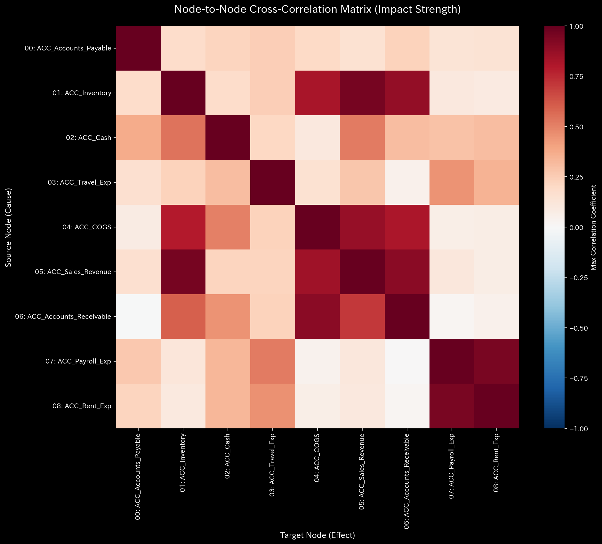

# 001. 熱力学とエントロピー (Thermodynamics and Entropy)

このフェーズでは、統計力学を財務元帳に適用します。お金を「エネルギー」として扱い、組織がそのエネルギーをどれほど効率的に使用しているか（仕事：Work）と、どれほどがカオス、摩擦、または貧弱なプロセスによって失われているか（エントロピー/熱：Entropy/Heat）を測定します。

---

### 1. 熱力学ダッシュボード (`001_1_1__thermodynamics_dashboard.png`)

* **📊 視覚的構造**: 複数のパネルからなるダッシュボード。主要なパネルには、T-S（温度 vs. エントロピー）線図と、グローバルな自由エネルギーのトレンドラインが含まれます。
* **📐 物理理論**: ヘルムホルツの自由エネルギー ($F = U - TS$) を計算します。これは、実際のビジネス上のタスク（仕事）を行うために利用可能な「有用な」金銭的エネルギーから、システム的なカオスによって失われたエネルギー ($T \times S$) を差し引いたものを測定します。
* **🚨 異常検出 (Anomaly Detection)**:
  * 自由エネルギー ($F$) の線に注目します。突然の急激な低下。
  * エントロピー ($S$) の線に注目します。持続的で説明のつかない上昇。
* **💼 ビジネスへの翻訳**: **深刻な運用上の非効率性**。組織は現金を燃やしていますが、その現金は構造化されたリターンを生み出していません。代わりに、お金はネットワーク全体にランダムに散らばっています（例: パニックによる調整されていない支出、蔓延する非構造的な経費、または横領など）。

### 2. T-S 線図 (`001_1_1__thermodynamics_ts_diagram.png`)

* **📊 視覚的構造**: X軸がエントロピー ($S$)、Y軸が温度 ($T$) である散布図。
* **📐 物理理論**: 時間経過に伴うシステムの熱力学的状態を可視化します。温度はトランザクションの変動の「ボラティリティ」または大きさを表します。
* **🚨 異常検出 (Anomaly Detection)**:
  * 軌道が **右上象限**（高温、高エントロピー）へと大きくドリフトしている。
* **💼 ビジネスへの翻訳**: ビジネスが極めてボラティリティが高く、かつ極めてカオス（無秩序）であること。トランザクションは大規模で不安定であり、認識可能な構造化されたプロセスがありません。これは、会社が財務のコントロールを失っていることのシグネチャ（兆候）です。

### 3. 局所熱力学 (`001_2_1__local_thermodynamics_dashboard.png`)

* **📊 視覚的構造**: *特定のアカウントごと*（ローカル・ノード）に、自由エネルギーとエントロピーを分解した棒グラフまたはヒートマップ。
* **📐 物理理論**: グローバルな熱力学的無駄（Waste）を、その熱を発生させている特定のノードへとマッピングして落とし込みます。
* **🚨 異常検出 (Anomaly Detection)**:
  * 特定の口座（例: `ACC_Travel_Exp（旅費交通費）` や `ACC_Accounts_Payable（買掛金）`）が、不釣り合いに巨大な赤いバー（高い局所エントロピー）を示している。
* **💼 ビジネスへの翻訳**: **リーク（漏れ）の特定**。グローバル・ダッシュボードは会社が効率性を出血させていることを教えてくれますが、このローカル・ダッシュボードは、*正確にどの部門または口座*がそのカオスを引き起こしているかを教えてくれます。それは内部統制が完全に機能しなくなった場所を浮き彫りにします。

### 4. ラグ・マトリックス ヒートマップ (`001_2_2__lag_matrix_heatmap.png`)

* **📊 視覚的構造**: 口座間の相関 / タイムラグの関係を示すマトリックス。
* **📐 物理理論**: ネットワークの遅延応答（時間的記憶）を計算します。
* **🚨 異常検出 (Anomaly Detection)**:
  * 歴史的に明確だった相関パターンの崩壊または曖昧化。
* **💼 ビジネスへの翻訳**: **壊れた因果関係の連鎖**。例えば、歴史的に現金（Cash）が売掛金（Accounts Receivable）に（短いラグを伴って）密接に追随していたのに、マトリックスが突然何の相関も示さなくなった場合、それは回収プロセスが現実から乖離してしまったことを意味します。現金が確実に売上に追随しなくなっているのです。
