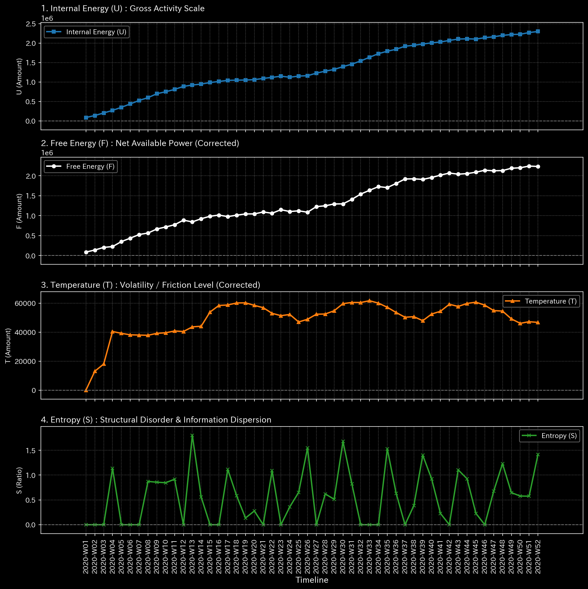
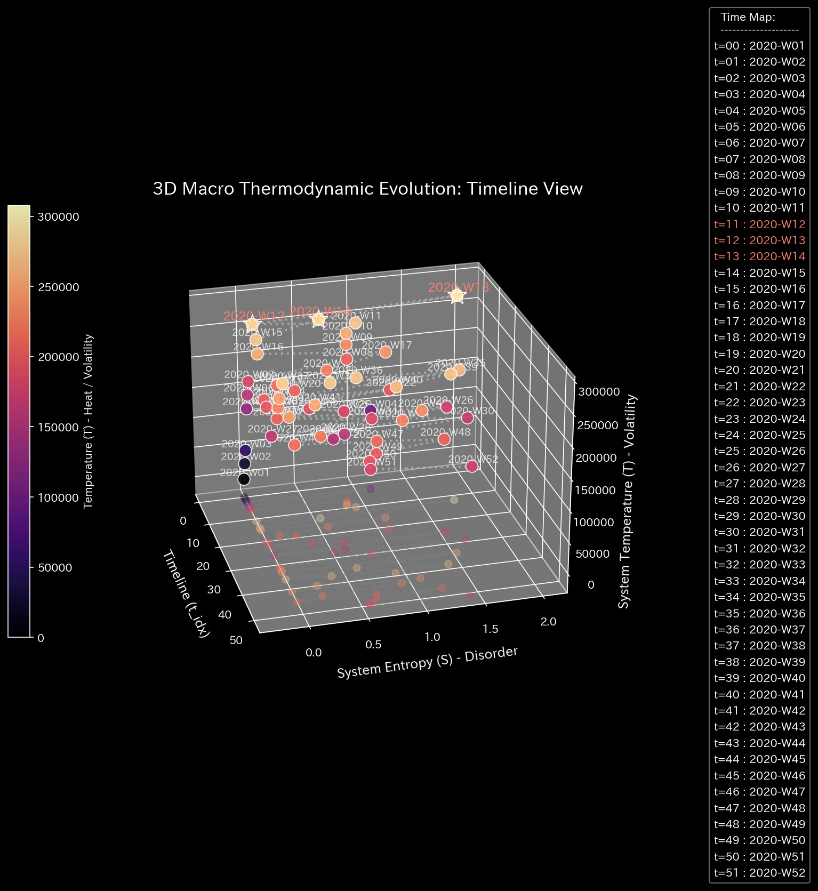
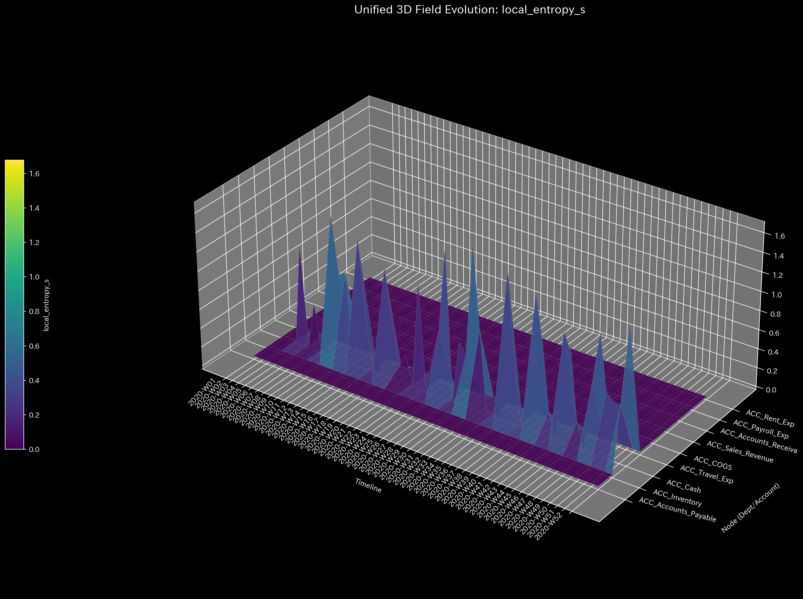
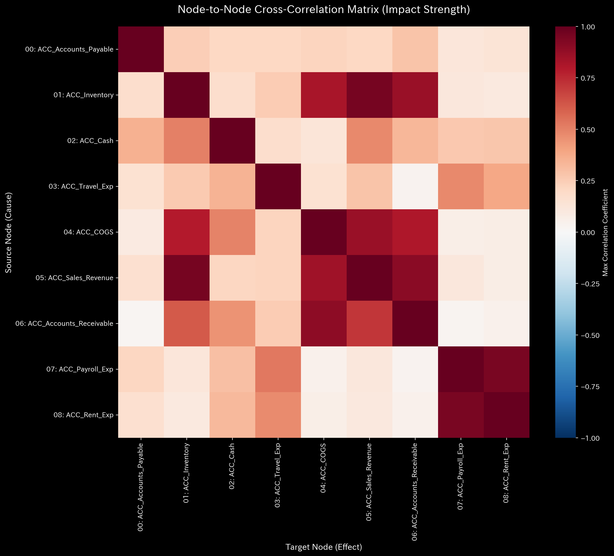

# 001. 熱力学とエントロピー (Thermodynamics and Entropy)

このフェーズでは、お金を「エネルギー」として扱い、企業という有機体がそのエネルギーをどれほど効率的に使用しているか（仕事）と、どれほどがカオス、粘性・摩擦、または貧弱なプロセスによって失われているか（エントロピー）を測定します。

---

### 1. 熱力学ダッシュボード (`001_1_1__thermodynamics_dashboard.png`)

* **📊 視覚的構造**: T-S線図と、グローバルな自由エネルギーのトレンドラインを含むダッシュボード。
* **📐 物理理論**: ヘルムホルツの自由エネルギー。利用可能な「有用な」金銭的エネルギーから、システム的なカオスによって失われたエネルギーを差し引いたものを測定します。
* **🚨 アノマリー検出 (Anomaly Detection)**:
  * 自由エネルギー ($F$) の突然の急激な低下。
  * エントロピー ($S$) の持続的で説明のつかない上昇。
* **💼 ビジネスへの翻訳**: **深刻な運用上の非効率性**。組織は現金を燃やしていますが、その現金は構造化されたリターンを生み出していません。お金はネットワーク全体にランダムに散らばっています（例: パニックによる調整されていない支出、蔓延する非構造的な経費、または横領・資金着服）。

### 2. T-S 線図 (`001_1_1__thermodynamics_ts_diagram.png`)

* **📊 視覚的構造**: X軸がエントロピー ($S$)、Y軸が温度 ($T$) である散布図。
* **📐 物理理論**: 温度はトランザクションのボラティリティを表します。
* **🚨 アノマリー検出 (Anomaly Detection)**:
  * 軌道が **右上象限**（高温、高エントロピー）へと大きくドリフトしている。
* **💼 ビジネスへの翻訳**: ビジネスが極めてボラティリティが高く、かつ極めてカオスであること。トランザクションは大規模で不安定であり、構造化されたプロセスがありません。会社が財務のコントロールを失っていることのシグネチャです。

### 3. 局所熱力学 (`001_2_1__local_thermodynamics_dashboard.png`)

* **📊 視覚的構造**: 特定のアカウントごとに、自由エネルギーとエントロピーを分解したヒートマップ。
* **📐 物理理論**: グローバルな熱力学的無駄を特定のノードへと射影します。
* **🚨 アノマリー検出 (Anomaly Detection)**:
  * 特定の口座が、高い局所エントロピーを示している。
* **💼 ビジネスへの翻訳**: **リーク（漏れ）の特定**。正確にどの部門または口座がそのカオスを引き起こしているかを教えてくれます。

### 4. ラグ・マトリックス ヒートマップ (`001_2_2__lag_matrix_heatmap.png`)

* **📊 視覚的構造**: 口座間の相関 / タイムラグの関係を示すマトリックス。
* **📐 物理理論**: ネットワークの遅延応答（粘性・時間的記憶）を計算します。
* **🚨 アノマリー検出 (Anomaly Detection)**:
  * 歴史的に明確だった相関パターンの崩壊。
* **💼 ビジネスへの翻訳**: **壊れた因果関係の連鎖**。現金が売掛金に密接に追随していたのに、マトリックスが突然相関を示さなくなった場合、回収プロセスが現実から乖離（相転移）してしまったことを意味します。
