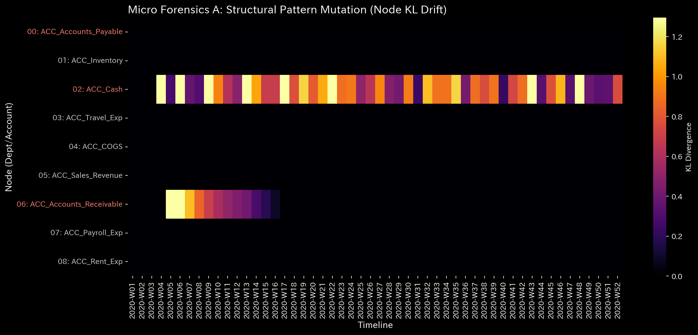
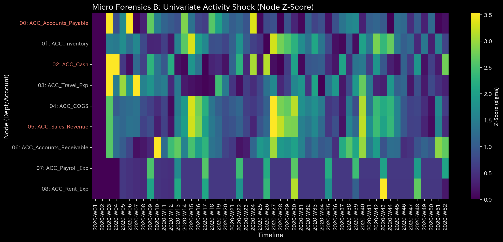

# 002. 情報幾何学とフォレンジック (Info Geometry and Forensics)

これは **メタ診断・フォレンジック** にとって最も重要なフェーズです。データ分布の形状（幾何学）を分析し、保存則を厳密に適用することで、TLU は従来の帳尻合わせの監査手法が見逃してしまうような隠れた改竄・捏造を検出します。

---

### 1. マクロ・フォレンジック Z-Score (`002_2_1__macro_forensics_dashboard.png`)

* **📊 視覚的構造**: 時間経過に伴うネットワーク全体の「Z-Score」をプロットする折れ線グラフ。
* **📐 物理理論**: エネルギー保存の法則。お金は無から生み出されたり、消滅したりすることはできません。
* **🚨 アノマリー検出 (Anomaly Detection)**:
  * Z-Score が **2.0** または **3.0** を超えるスパイク。
* **💼 ビジネスへの翻訳**: **壊れた元帳**。対応する仕訳なしに処理系からお金が吸い上げられました。これは資金着服（横領）や改竄の最も強力な数学的証拠です。

### 2. ミクロ Z-Score / KLドリフト ヒートマップ (`002_2_2_1__micro_KL_drift_heatmap.png`, `002_2_2_2__micro_Z_Score_heatmap.png`)

* **📊 視覚的構造**: マトリックス・ヒートマップ。濃い赤色は高いストレスを示します。
* **📐 物理理論**: 情報幾何学（KL ダイバージェンス）。
* **🚨 アノマリー検出 (Anomaly Detection)**:
  * 特定の口座が突然明るい赤色に点灯する。
* **💼 ビジネスへの翻訳**: **不正行為者の特定**。これこそが「静かな資金着服・改竄」を検出するための究極のツールです。幽霊社員や承認されていないボーナスの支払いを探してください。

### 3. ネットワーク・トポロジー / ノード-リンク図 (`002_1_2__network_topology.t.*.png`)

* **📊 視覚的構造**: 線（資金フロー）によって接続されたノードのウェブ。
* **📐 物理理論**: グラフ理論。
* **🚨 アノマリー検出 (Anomaly Detection)**:
  * 通常は相互作用しない2つのノードの間に太い赤い線が現れる。
* **💼 ビジネスへの翻訳**: **犯行現場の可視化**。資金が流用されている流れを物理的に「見る」ことができます。

### 4. 多様体の次元性 / 有効ランク (`002_1_3__manifold_dimensionality.png`)

* **📊 視覚的構造**: 時間経過に伴う単一の指標（有効ランク）を示すグラフ。
* **📐 物理理論**: 特異値分解 (SVD)。
* **🚨 アノマリー検出 (Anomaly Detection)**:
  * 次元数のラインが突然急降下する（相転移）。
* **💼 ビジネスへの翻訳**: **人為的な中央集権化**。組織の自然な多様性が崩壊しました。これは **循環取引** の典型的な兆候です。偽の取引が人工的にボリュームを膨らませている状態です。
