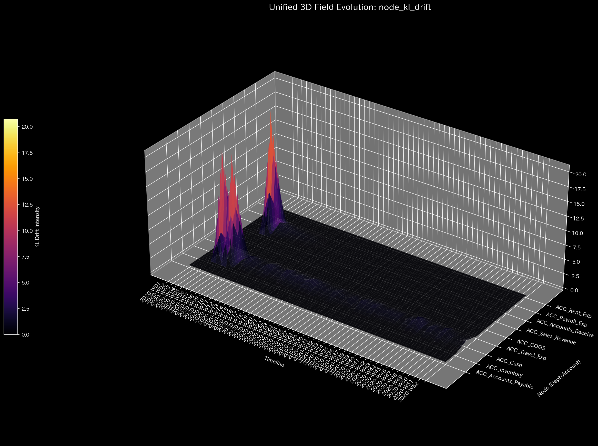

# 002. 情報幾何学とフォレンジック (Info Geometry and Forensics)

このフェーズは**「不正検知（フォレンジック）」の心臓部**です。データの形状の歪みを分析し、会計における「保存則（借方と貸方の一致）」を厳密に監視することで、従来の帳尻合わせの監査手法では見逃してしまうような、極めて巧妙な改ざんや資金着服（横領）を特定します。

---

### 1. 組織全体の不正検知（マクロ・フォレンジック Z-Score） (`002_2_1__macro_forensics_dashboard.png`)

* **📊 視覚的構造**: 時間経過に伴うネットワーク全体の「異常度（Z-Score）」を示す折れ線グラフ。
* **🚨 異常の検知（マクロ・ミクロ）**:
  * **[マクロ] Z-Scoreの巨大なスパイク:** 全体のZ-Scoreが「2.0」や「3.0」といった極端な数値を超えて跳ね上がる場合。
* **💼 監査実務への応用**: **システム全体の帳簿の崩壊**。
  * *[具体例（Sample_3/記帳漏れ・帳簿崩壊）]*: お金は無から生み出されたり、勝手に消滅したりしません（エネルギー保存則）。対応する仕訳（入力または出力）なしに資金が吸い上げられた場合、システム全体で原因不明の「質量の増減」が発生し、このZ-Scoreが天文学的な数値へと跳ね上がります。これは巨額の資金着服や、会計システムの致命的な欠陥の決定的な証拠です。

---

### 2. 静かな不正の特定（ミクロ Z-Score / KLドリフト 3D Surface） (`002_2_2_1__micro_KL_drift_3d_surface.png`, `002_2_2_2__micro_Z_Score_3d_surface.png`)

* **📊 視覚的構造**: 口座ごとの異常度を示す3D Surface ヒートマップ。暗い・青い平野（正常）の中に、明るい黄色や赤い山（異常）が隆起します。
* **🚨 異常の検知（マクロ・ミクロ）**:
  * **[マクロ] 平穏な地形:** グラフ全体が暗い色で波打っている状態は正常です。
  * **[ミクロ] 局所的な発光（スパイク）:** 全体が平穏な中で、特定の口座の特定の月だけが「突然明るく黄色・赤色に発光」して突き出ている場合。
* **💼 監査実務への応用**: **目立たない不正行為者（犯人）のピンポイント特定**。
  * *[具体例]*: 取引の「総額（ボリューム）」が同じでも、送金先をこっそりダミー会社に変更した場合、Z-Score（金額の異常）は反応しませんが、KLドリフト（構造の異常）のグラフには鋭い「黄色い針（スパイク）」が現れます。幽霊社員への給与支払いや、承認されていない架空経費の引き出しを探すための究極のセンサーです。

---

### 3. 不正ルートの可視化（ネットワーク・トポロジー） (`002_1_2__network_topology.t.*.png`)

* **📊 視覚的構造**: 口座（丸）と資金フロー（線）を結んだネットワーク図。異常なストレスがかかっている線は黄色〜赤色に発光します。
* **🚨 異常の検知（マクロ・ミクロ）**:
  * **[ミクロ] 異常なショートカット（赤い線）:** 通常は取引がないはずの2つの部署間に、突如として太く赤い線が現れる。
* **💼 監査実務への応用**: **犯行現場の可視化**。資金が不正に流用されている「裏ルート」を物理的なパイプとして視覚的に確認できます。

---

### 4. 組織構造の崩壊（多様体の次元性） (`002_1_3__manifold_dimensionality.png`)

* **📊 視覚的構造**: ネットワークの複雑さ（有効ランク）の推移を示す折れ線グラフ。
* **🚨 異常の検知（マクロ・ミクロ）**:
  * **[マクロ] 次元数の急降下:** 横ばいだったグラフが突然、滝のように急降下した場合（マクロな相転移）。
* **💼 監査実務への応用**: **循環取引による組織の人為的な中央集権化**。
  * *[具体例（Sample_1/循環取引）]*: 健全な組織は取引先が分散しているため次元数（多様性）が高く保たれます。しかし、架空の売上を特定のダミー会社群でぐるぐる回し始める（循環取引）と、組織内のすべてのお金がその「単一の不正ループ」に吸い込まれるため、ネットワークの多様性が一瞬にして崩壊（急降下）します。これは循環取引を暴く決定的な数学的証拠です。
