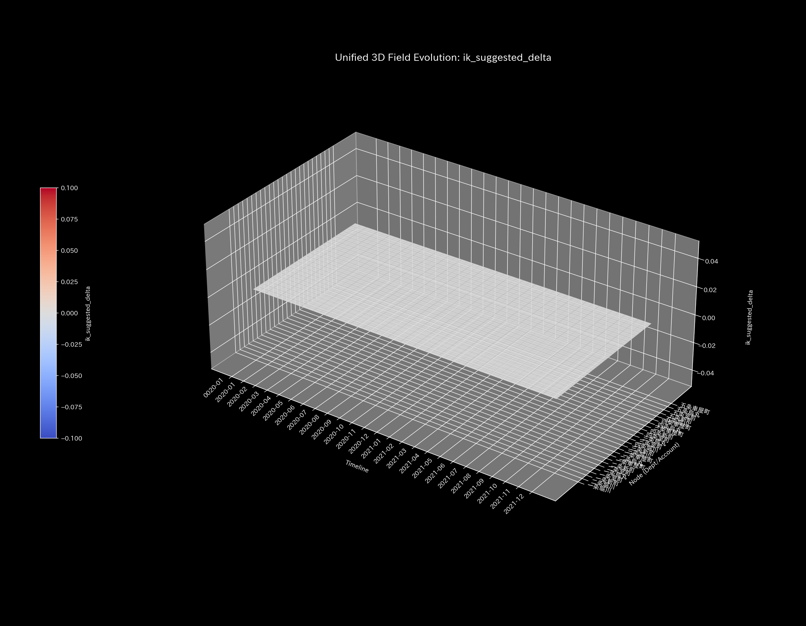
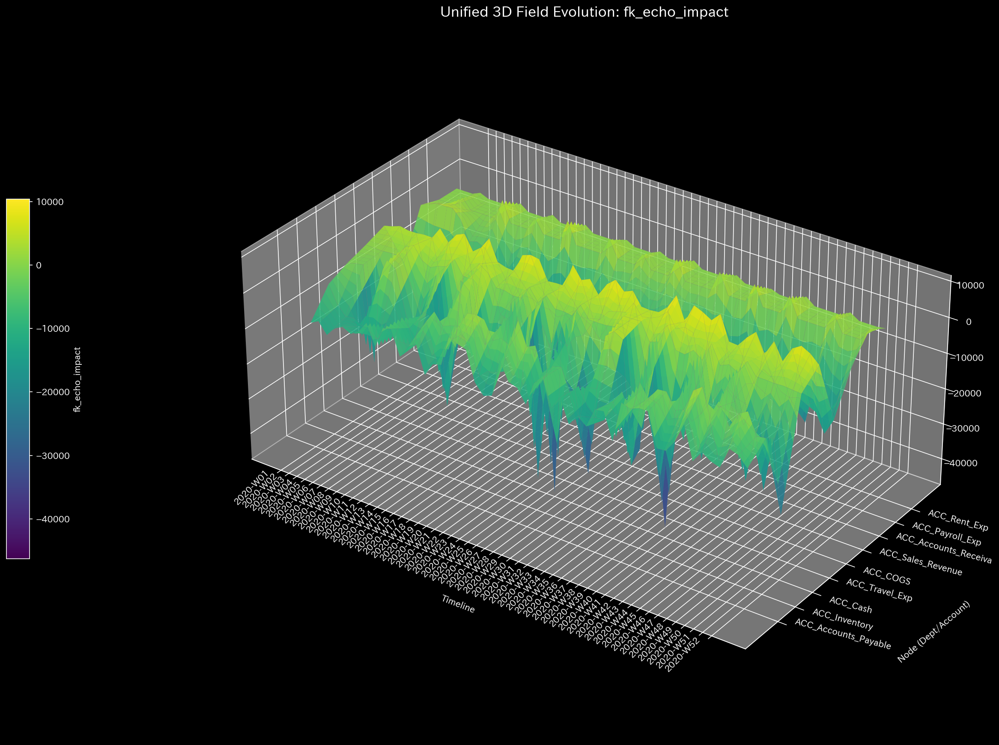

# 003. 応用運動学によるシミュレーション (Kinematics)

## 🔬 結論：設定された目標は物理的に達成可能か？

本ドキュメントでは、過去の異常を診断するフォレンジック（不正検知）から一歩踏み出し、経営陣の意思決定がもたらす「波及効果（Ripple Effects）」をシミュレートする「応用運動学（Kinematics）」のアプローチを解説します。
ここでの結論は、**「現在のシステム構造において、経営陣が設定した目標（KPIや到達地点）は物理的に達成可能か、それとも計算不可能な『空想の目標』に過ぎないか」**の証明です。

特定の口座に資金を投入した際の連鎖的な反応を計算する「順運動学（FK）」と、目標から逆算して必要な力を導き出す「逆運動学（IK）」を用いることで、組織のボトルネックや構造的な限界を明らかにします。

---

## 🎨 全体像のデッサン：目標からの逆算と物理的限界（3D Inverse Kinematics / IK）

到達したい「目標地点」から逆算して、ネットワークの各ノードにどのような力（資金・リソース）を加えるべきかを3Dベクトルとして描画します。

### 【比較1】自然で効率的な最適ルート（ベースライン）

* **Sample 0 (Healthy)**: システムの摩擦や粘性が低いため、計算エンジン（IKソルバー）は目標に到達するための「最も自然で、なだらかな最適ルート（短いベクトル）」を即座に見つけ出します。これは、現在の組織リソースで十分に目標達成が可能であることを示しています。

### 【比較2】デッドロックによる計算の発散と破綻（Kyoto Traffic）

*(※Sample 5: 慢性的なデッドロック状態での経路探索)*

* **Sample 5 (Kyoto Traffic)**: 物流における目的地への到達時間や、金融における売上目標をシミュレートした際、すべてのルートが「大渋滞（極めて高い摩擦と剛性）」で塞がれている場合があります。このとき、IKソルバーは目標に到達できず、天文学的に巨大な異常値（ベクトル）を発散させるか、計算自体に失敗（エラー）します。これは、**「現在の組織リソースとプロセスでは、経営陣が設定したKPIは物理的に達成不可能である」**ことを数学的に証明しています。

---

## 🔍 細部へのズームイン：波及効果と予期せぬボトルネック（3D Forward Kinematics / FK）

目標達成の可否（マクロ）を確認した後は、特定の部門に資金（力）を注入した際、組織の末端（ミクロ）にどのような「波及効果」が生じるかを順運動学でシミュレートします。

### 予期せぬスパイクの検知

*(上図：Sample 0 における正常な連鎖反応)*

* **📊 視覚的構造**: 特定の口座に力（資金）を加えたとき、他の口座がどれくらい移動（反応）するかを示す3D空間プロット。
* **🚨 異常の検知**: 正常な組織（Sample 0）では、営業部門への投資がなだらかに売上や現金の口座を押し上げます。しかし、組織の内部プロセスが脆い場合、本来無関係のはずの「特定の経費口座」や「買掛金（支払義務）」のノードに、予期せぬほど大規模で激しい変位（鋭いスパイク）が引き起こされます。これは成長のスピードを処理しきれないボトルネックの存在を事前に警告するものです。

---

## 🔬 反証可能性とモデルの限界（実務への適用）

運動学シミュレーションは、「現在のネットワーク構造（バネの強さと摩擦）を前提とした場合、この目標を達成するには無限大の力が必要である（物理的に不可能）」という**数学的帰結**を断定します。
しかし、その計算はあくまで「現在の構造」に基づいています。「業務プロセスの抜本的な改革（新しいAPIの導入や人員整理）」を行えば、バネの構造自体が変化し、不可能だった目標が達成可能になるかもしれません。

IKソルバーが発散（計算失敗）したという結果を受け取った際、経営コンサルタントや管理職は「現場に無理なハッパをかける」のではなく、「目標を達成するためには、現在の組織構造（トポロジー）そのものをどのように作り変えなければならないか」という根本的な議論（追加検証）へと移行すべきです。
