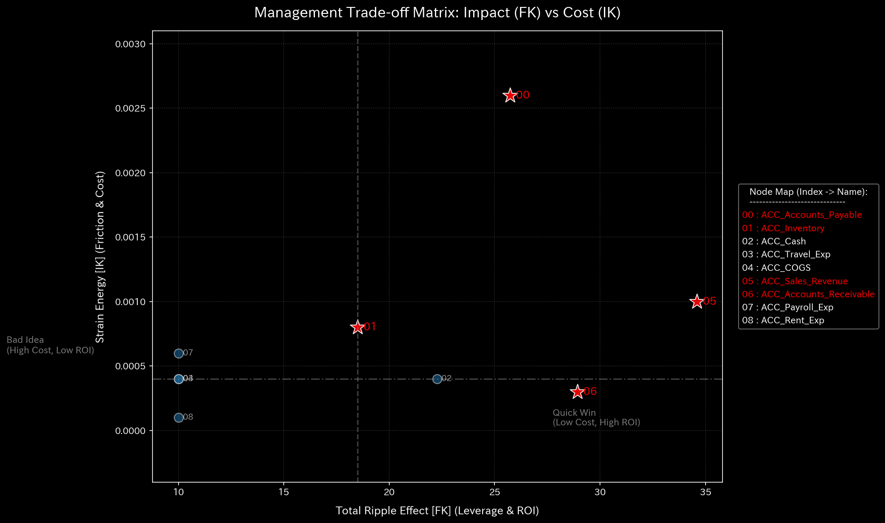

# 004. 制御工学と安定性 (Control Theory and Stability)

このフェーズは、「企業という有機体をバラバラに引き裂くことなく、どのようにして健全な状態へと操縦して戻すか？」という問いに答えます。TLU は最適な前進経路を計算し、差し迫った構造的崩壊を警告します。

---

### 1. 制御エラー収束 (`004_1_2__control_error_convergence.png`)

* **📊 視覚的構造**: 複数回の反復にわたる、エラーをマッピングした折れ線グラフ。
* **📐 物理理論**: 最適レギュレータ (LQR)。会社を操縦しようとする「オートパイロット」をシミュレートします。
* **🚨 アノマリー検出 (Anomaly Detection)**:
  * 線が激しくバウンドする、またはゼロよりはるかに高い位置でフラットラインになる。
* **💼 ビジネスへの翻訳**: **制御不能な組織**。組織のプロセスが極めてカオスであるため、数学的最適化でさえも健全な状態に戻るための安全な経路を見つけることができません。

### 2. LQR 制御パフォーマンス空間 (`004_1_3__control_lqr_performance_space.png`)

* **📊 視覚的構造**: 様々な介入戦略のコストを示す3Dランドスケープ。
* **📐 物理理論**: 「どれだけ早く問題を修正するか」vs「その修正が組織にどれだけのひずみ（粘性・摩擦）をもたらすか」というトレードオフ。
* **🚨 アノマリー検出 (Anomaly Detection)**:
  * ギザギザで急峻な「渓谷」のような風景。
* **💼 ビジネスへの翻訳**: **高リスクの介入**。介入におけるほんの小さなミスが、組織に壊滅的なひずみをもたらし、会社をカオスに突き落とすことを意味します。

### 3. スペクトル半径 / スペクトル半径 (`004_1_2__system_stability.png`)

* **📊 視覚的構造**: スペクトル半径を追跡する折れ線グラフ。
* **📐 物理理論**: 遷移行列の固有値解析。1.0 を超えた場合、数学的処理系は正式に「不安定」であり、無限大に発散します。
* **🚨 アノマリー検出 (Anomaly Detection)**:
  * 青い線が 1.0 の閾値を突き抜け、そのまま留まる。
* **💼 ビジネスへの翻訳**: **死の螺旋（Death Spiral）**。組織は爆発的で自己強化的なフィードバックループに突入しました。これは、深刻な **循環取引**、ポンジ・スキームの際に発生します。

### 4. トレードオフ・ヒートマップ / 感度行列 (`004_2_1__sensitivity_matrix.png`)

* **📊 視覚的構造**: 感度を示すヒートマップ。
* **📐 物理理論**: 偏微分。「もし $X$ を1単位変更した場合、$Y$ はどれだけ変化するか？」
* **🚨 アノマリー検出 (Anomaly Detection)**:
  * 極度の過敏性を示す突然の明るい色が現れる。
* **💼 ビジネスへの翻訳**: **脆弱性**。組織が特定の要因に対して過敏になっています。僅かな過剰支出であっても直ちにキャッシュ危機を引き起こすことを意味します。
