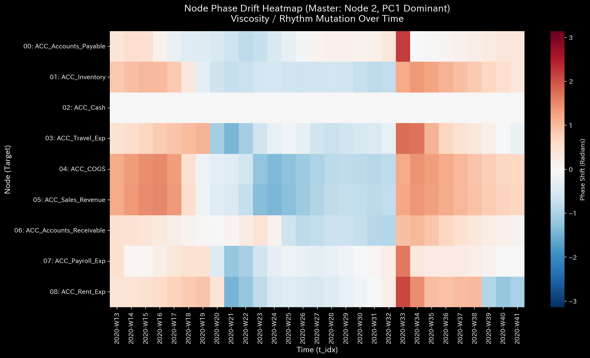
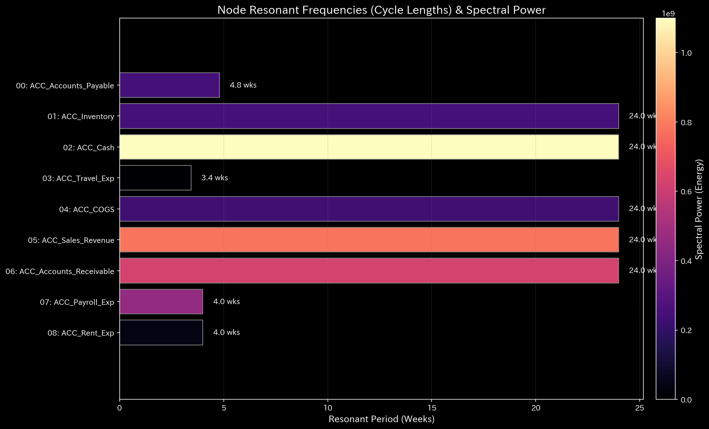
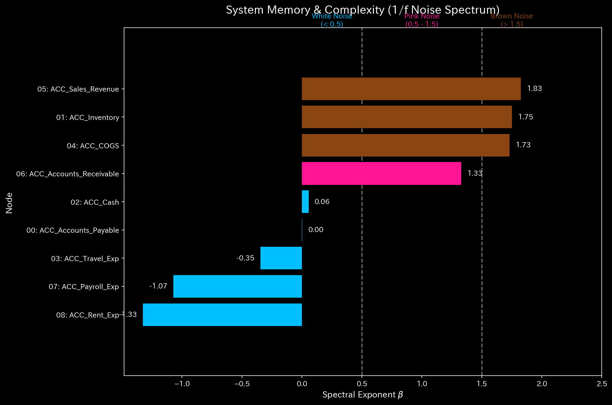

# 005. 信号とノイズ (Signals and Noise)

このフェーズは、元帳を振動する機械のように扱います。資金フローの周波数、ラグ（遅延・粘性）、およびノイズのスペクトルを分析することで、TLU は標準的な集計合計では完全に目に見えないような、深くシステム的な改竄・捏造を検出することができます。

---

### 1. 位相ドリフト・ヒートマップ (`005_1_2__phase_drift_heatmap.png`)

* **📊 視覚的構造**: マトリックス・ヒートマップ（カラーマップ『RdBu_r』を採用）。
* **📐 物理理論**: 相互相関信号処理。相関する2つの信号間の「タイムラグ（粘性）」を測定します。
* **🚨 アノマリー検出 (Anomaly Detection)**:
  * **赤** = ラグが伸びている（通常よりも停滞している）。
  * **青** = ラグが圧縮されている（通常よりも早く発生している）。
* **💼 ビジネスへの翻訳**: **深刻なキャッシュフローのボトルネック**。もし AR vs 現金 の線が突然赤色になった場合、それは「回収が遅くなっている」ことを意味します。現金の変換の実際の速度は停止に向かっており、流動性危機に対する強力な早期警戒として機能します。
* **💡 具体例（サンプル・データより）**:
  * **Sample_6 & Sample_9（捏造された同期/過剰同期）**: 健全な経済活動や生命活動には、必ず自然な「遅延（粘性）とゆらぎ」が存在します。しかし、期末に人間が手作業で帳尻を合わせるために複数口座の数値を同時にいじったり、市場で組織的な価格操縦が行われたりすると、本来独立しているはずの口座群の位相ドリフトが不自然に「0.0（完全な同時発生）」に揃います（過剰同期/Hypersynchrony）。これは「見えざる手（人為的介入）」による人工的な同期のシグネチャです。

### 2. 共振周波数 (`005_1_1__resonant_frequency.png`)

* **📊 視覚的構造**: 特定の周波数でのピークを示すスペクトル密度グラフ。
* **📐 物理理論**: フーリエ変換。組織の自然な「振動数」を特定します。
* **🚨 アノマリー検出 (Anomaly Detection)**:
  * 不自然な周波数に現れる予期せぬピーク。
* **💼 ビジネスへの翻訳**: **自動化された不正行為または処理系の乗っ取り**。プログラムされたボットや自動化された**資金着服（横領）**スクリプトが、正確な間隔でお金を吸い上げていることを強く示唆しています。

### 3. フラクタル・ノイズ・スペクトル (`005_2_1__fractal_noise_spectrum.png`)

* **📊 視覚的構造**: PSD の減衰を示す対数スケールの散布図。
* **📐 物理理論**: ピンクノイズ分析。健康なシステムはピンクノイズを示します。純粋なランダム性はホワイトノイズです。
* **🚨 アノマリー検出 (Anomaly Detection)**:
  * 減衰線の傾きが突然平坦になり、ピンクノイズからホワイトノイズへと変化する。
* **💼 ビジネスへの翻訳**: **データの改竄・捏造**。人間は「自然な分散」を偽装するのが下手です。もし損失を隠すために何千もの偽の仕訳を手動ででっち上げた場合、得られたデータは数学的に「ホワイトノイズ」のようになります。このグラフは、数値のテクスチャを見ることによってデータの**改竄・捏造**を捕捉します。
* **💡 具体例（サンプル・データより）**:
  * **Sample_6（手作業による捏造）**: 人間は「自然なゆらぎ（ピンクノイズ）」を偽装するのが極めて苦手です。もし監査をごまかすために数千ものダミー取引を手作業で適当に散らして入力した場合、得られたデータの周波数特性は数学的に純粋な「ホワイトノイズ（フラットな傾き）」になります。TLUは数字の大小ではなく「数字のテクスチャ（ノイズの質感）」を見ることで、手作業による改竄・捏造を決定的に捕捉します。
