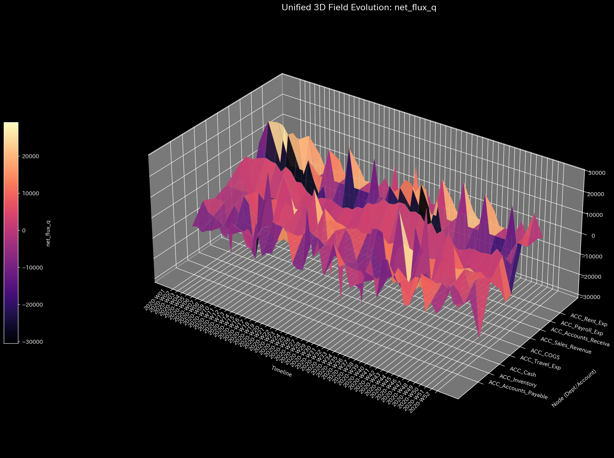
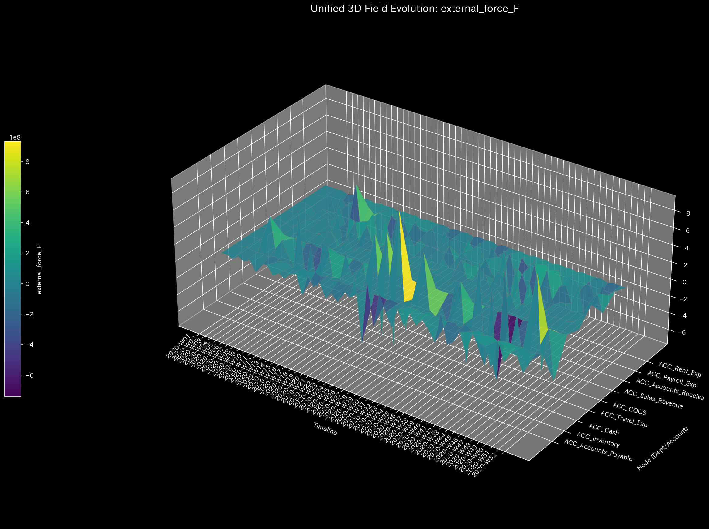
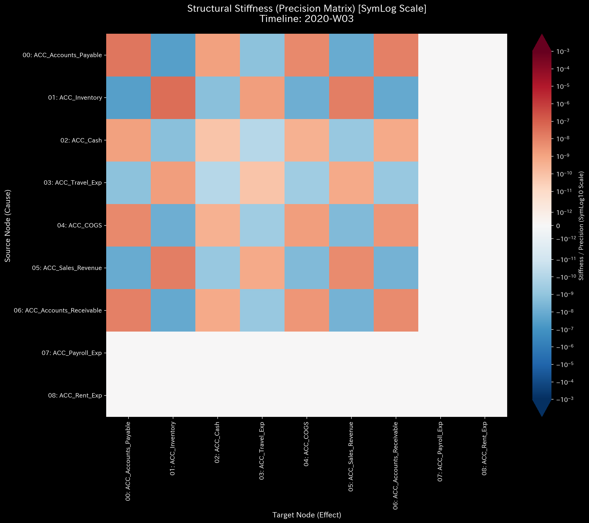
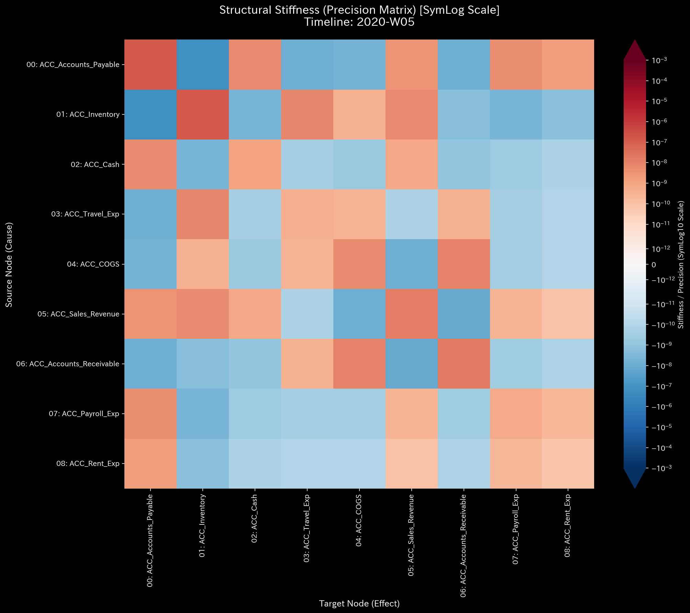
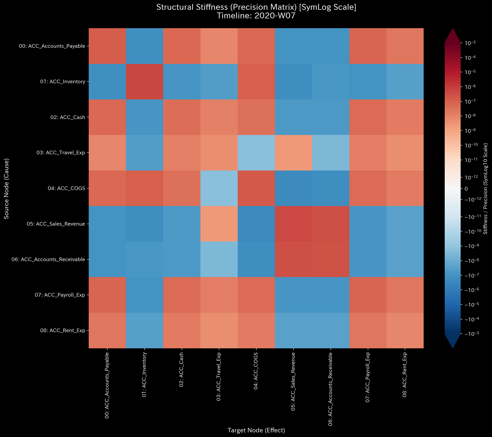
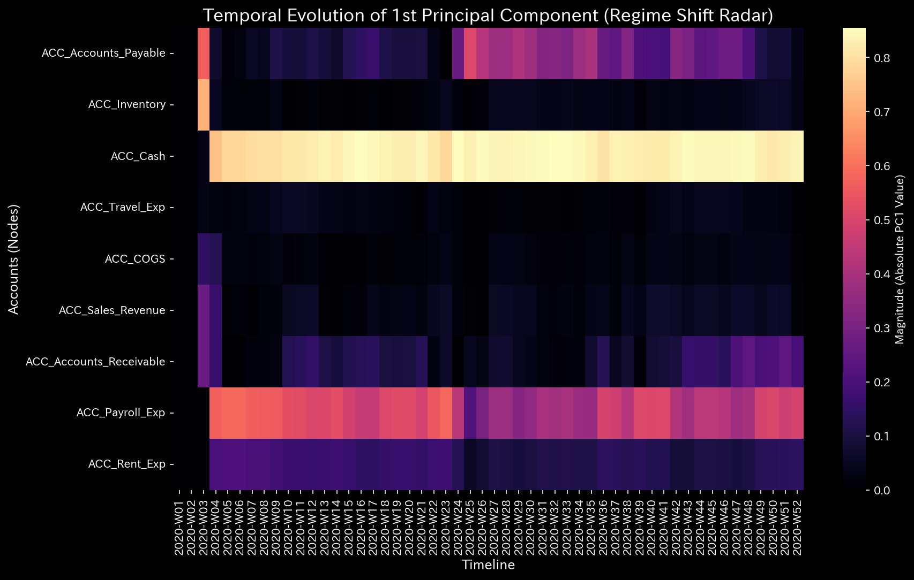

# 000. 古典力学および固体力学 (Classical Mechanics & Solid Mechanics)

> **"システムを動かす前に、それがどれほど重く、どれほど強固に結びついているかを理解しなければならない。"**

カテゴリ **000** は、Tensor-Link Utility (TLU) におけるその後のすべての分析の絶対的な基盤として機能します。これは未来を予測したり目標に向けて最適化したりすることを拒否し、代わりに厳密な「観察（Observation）」のみを目的としています。

ネットワークのノードを物理的な「質点（Point Masses）」として扱い、エッジを「バネ（Springs / 構造的制約）」として扱うことで、このパラダイムは過去のフロー・データから帰納的に導き出された固有の物理的特性（質量、摩擦、剛性）を計算します。

---

## 1. 位相空間の力学 (000_1_1)

*実装: `src/filters/_000_1_1_filter_dynamics_state.py`*

古典力学において、システムの状態は位相空間（Phase Space）における「位置」と「運動量」によって完全に記述されます。TLUは組織のフラックス（流量）をこれらの物理的等価物へと翻訳し、「特定の部門や口座の現在の状態を変化させることがどれほど困難であるか？」という根本的な問いに答えます。

### 運動の変数

* **位置 (q):** ノードに出入りする累積純フラックス（Net Flux）。
* **速度 (v):** 時間経過に伴う純フラックスの変化率（1次微分）。
* **加速度 (a):** 速度の変化率（2次微分）。

### 慣性と摩擦の定義

すべてのノードが変化に対して等しく反応するわけではありません。過去に大規模で安定していたコア部門は、機敏な周辺のチームよりもはるかに変化に抵抗します。

* **仮想質量 / 慣性 (M):** 絶対フラックスの歴史的平均として計算されます: `M = mean(|q(t)|)`。歴史的な活動ボリュームが大きいほど、ノードの「慣性（Inertia / 動かされることへの抵抗）」は大きくなります。
* **仮想粘性 / 摩擦 (C):** 速度のボラティリティの逆数として計算されます: `C = 1 / std(v(t))`。非常に安定して変化しない速度を示すノードは、それを引きずる高い「摩擦（Friction）」を持っているとモデル化されます。
* **外力残差 (F_ext):** 減衰を伴うニュートンの運動方程式（$F = M \cdot a + C \cdot v$）を使用して、TLU は現在観測されている運動を生み出すために、そのノードに作用しているに違いない未知の「外力（External Force）」を計算します。

## 2. 構造剛性と偏相関 (000_2_1)

*実装: `src/filters/_000_2_1_filter_structural_stiffness.py`*

位相空間力学が個々のノードに焦点を当てているのに対し、固体力学はそれらの間の接続の「剛性（Rigidity）」を調査します。ノードAを引っ張った場合、ノードBは瞬時に追随するでしょうか？それとも、接続が伸びてショックを吸収するでしょうか？

### 精度行列 (K)

TLU はネットワーク全体の速度変化の共分散行列を計算し、その安全な擬似逆行列を計算します。得られた逆共分散行列は **精度行列 (Precision Matrix: K)** として知られています。

* 精度行列の値が高いことは、2つのノード間の数学的に「硬い（Stiff）」関係を示しています。それらは剛体のように一緒に動き、片方へのショックが激しくもう片方へと伝達されることを意味します。

### 偏相関ピボット (Ver 8.0.0)

複雑なネットワークにおいて、単純な相関関係はしばしば欺瞞的です（疑似相関）。ノードAとノードBが両方とも増加しているからといって、それらが直接接続されているとは限りません。両方ともノードCによって駆動されているだけかもしれないからです。

真の構造的制約を分離するために、TLU は精度行列を **偏相関行列 (Partial Correlation Matrix)** へと正規化します：
`R_ij = -K_ij / sqrt(K_ii * K_jj)`

この正規化により、剛性は厳密な `[-1.0, 1.0]` 空間へと射影されます：

* **正の剛性（結合）:** 直接的で媒介のないリンク。それらは一緒に上昇し、下降します。
* **負の剛性（トレードオフ）:** 直接的なゼロサム制約。ここにエネルギーを投資すると、数学的にあちらからエネルギーが奪われます。
* **ゼロの剛性:** 表面上は相関しているように見えても、構造的には独立しています。

## 3. 主軸と分散次元 (000_2_2)

*実装: `src/filters/_000_2_2_filter_principal_axes.py`*

精度行列が個々のノードペア間の直接的な剛性を測定するのに対し、**主軸（PCA / 主成分分析）** は組織全体の動きの「マクロレベルの次元」を抽出します。

### 固有値と固有ベクトル

フラックス履歴の共分散行列を計算し、固有値分解を実行することで、TLUはネットワークの主成分（Principal Components）を特定します：

* **固有ベクトル（軸）:** 資源がまとまったブロックとして一緒に流れる主要な方向。
* **固有値（分散）:** 組織の総エネルギー（分散）のどれだけが各軸によって捉えられているか。
* **説明分散比（Explained Variance Ratio）:** 組織が高度に中央集権化されているか（例：第1主成分がすべての動きの80％を説明する）、それとも分散化されているか（分散が多くの次元に均等に広がっている）を示します。

#### 第1主成分 (PC1) の物理学

TLUのPCAは、口座の静的な残高や単純な累積合計を測定するものでは**ない**ことに注意することが極めて重要です。代わりに、それは **フラックスの微分（$dq$）の共分散** を計算します。

変化率（$dq = q_{t} - q_{t-1}$）を厳密に分析するため、第1主成分は数学的に組織の **「メイン・エンジン」** を分離します。どのアカウントが最も大規模で同期した変動を経験しているかを特定します（例：給与計算がスパイクした時、あるいは買掛金が清算された時、正確に同じタイミングで現金が減少する）。
第1主成分の固有ベクトルの進化をヒートマップとして可視化することで、TLU は（口座のラベルに依存することなく）背後にあるビジネスモデルを数学的にリバースエンジニアリングし、支配的なフローの軸が乗っ取られた場合の構造的な「レジーム・チェンジ」を瞬時に明らかにします。

これにより、リーダーシップは個々のノードの変動というノイズを排除し、組織を駆動する根本的な「要因（ファクター）」を理解することができます。

## 4. ビジネスへの示唆（Implications）

位相空間と構造剛性を可視化することで、リーダーシップは以下の問いに明確に答えることができます：

1. **どのイニシアチブが最も摩擦に直面するか？** (高 $M$、高 $C$ ノード)。
2. **組織の隠れたトレードオフはどこにあるか？** (負の偏相関)。
3. **システムに圧力をかけた場合、それは曲がるか、それとも壊れるか？** (ネットワーク全体の剛性)。
