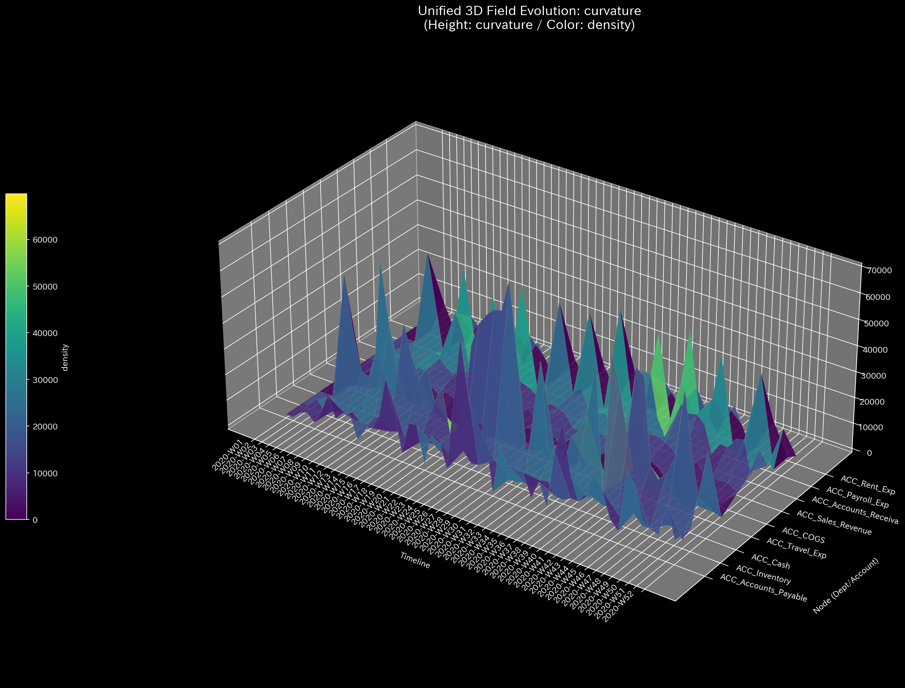
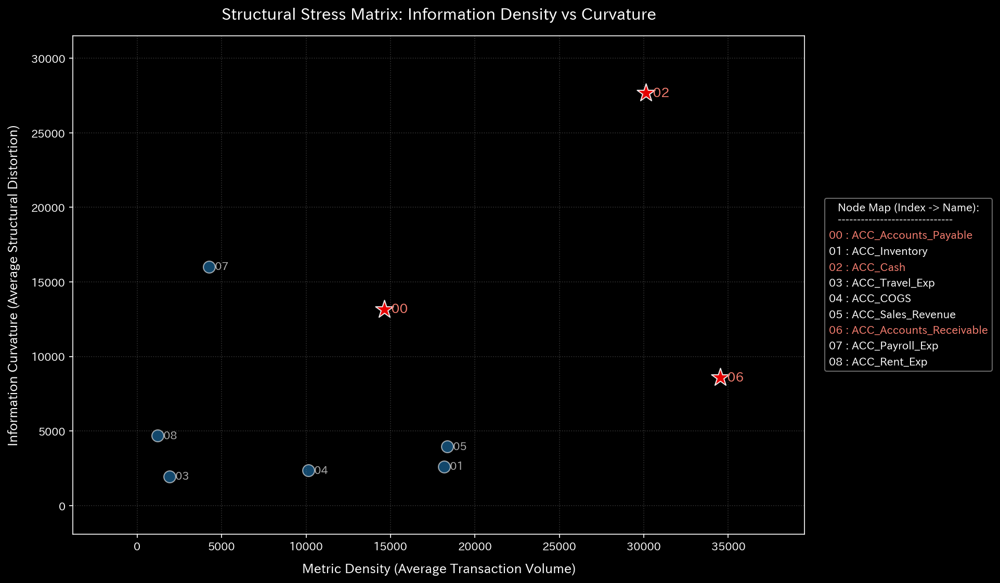

# 002. 情報幾何学およびフォレンジック (Information Geometry & Forensics)

> **"異常は単にボリュームが急増するだけではない。それはネットワークの構造そのものを歪める。"**

カテゴリ **002** は、TLUにおける監査、セキュリティ、および異常検出のレイヤーを表します。以前のレイヤーがデータを物理的な実体（質量やエネルギー）として扱っていたのに対し、このパラダイムは **「情報幾何学（Information Geometry）」** と **「統計的フォレンジック（Statistical Forensics）」** の領域へと移行します。

これはネットワークを「統計的多様体（Statistical Manifold）」——確率分布によって形作られた数学的「空間」——として扱います。この空間がどのように歪み、引き伸ばされ、あるいはシステム自身の保存則を破るかを測定することで、TLUは突発的なショックだけでなく、静かに進行する構造的なレジームシフト（体制転換）をも検出することができます。

---

## 1. 情報幾何学（多様体の歪み）

ネットワークはそのリソースをどのようにルーティング（経路指定）しているでしょうか？歴史的な配分割合を「確率分布」として扱うことで、組織全体を多次元の風景（ランドスケープ）としてマッピングすることができます。

### 情報曲率 (002_1_1)
*実装: `src/filters/_002_1_1_filter_info_curvature.py`*

一般相対性理論において質量が時空を曲げるように、活動の激しい集中は組織の多様体を歪めます。TLU は、局所的なボラティリティに対するフィッシャー情報計量（Fisher Information Metric）の変化率を測定することによって **情報曲率（Information Curvature）** を計算します。

* 3Dで可視化した場合、高い曲率は鋭い「ピーク」や急峻な「谷」として現れます。
* 曲率の突然のスパイクは、フラックス（流量）の不自然な集中、または深刻な停滞点を示しています——リソースが歴史的に存在しなかった場所にプールされ、局所的な重力の井戸（Gravity Well）を作り出しているのです。

### 位相幾何学的エッジストレス (002_1_2)
*実装: `src/filters/_002_1_2_filter_network_topology.py`*

曲率が「領域」を見るのに対し、このフィルターはそれらを接続する特定の「血管」を見ます。TLU は、あらゆる単一のエッジのフラックスを、その歴史的ベースラインと比較したローリング Z-Score に変換することで、**位相幾何学的なエッジストレス（Topological Edge Stress）** を計算します。

* これは、歴史的に前例のない負荷を運んでいる重要なバイパスや隠れたボトルネックを強調し、ノード自体がダウンする前に差し迫った「破裂（処理の失敗やサプライチェーンの崩壊）」を警告します。

### 多様体の次元性 (SVD) (002_1_3)
*実装: `src/filters/_002_1_3_filter_manifold_dimensionality.py`*

曲率が局所的なストレスポイントを特定するのに対し、**多様体の次元性（Manifold Dimensionality）** は特異値分解（SVD）を用いてネットワークのグローバルな構造的完全性を評価します。

* **有効ランク（Effective Rank）:** TLU は、遷移行列の有意な特異値の数を計算します。100ノードのネットワークが突然有効ランク5に低下した場合、多様体全体が「崩壊」したことを意味します。
* **過度な中央集権化の検出:** この崩壊は、リソースが多様なネットワーク全体を自然に流れるのではなく、ほとんどすべてのトラフィックが人為的にごく少数の支配的なハブを通るようにルーティングされていることを示しています（例：独占の形成、または物流網を凍結させる大規模な交通渋滞など）。

## 2. 統計的フォレンジックと保存則

フォレンジック（法医学的監査）は数学的な不変量（Invariants）に依存します。システムの基本的な法則が破られた場合、それがデータの破損であれ、市場の急変であれ、意図的な不正行為であれ、システムは異常のフラグを立てます。

### マクロ・フォレンジック：グローバルな番犬 (002_2_1)
*実装: `src/filters/_002_2_1_filter_macro_forensics.py`*

* **保存則のリーク ($L$):** 複式簿記や閉じたサプライチェーンのようなシステムでは、すべての流入と流出の合計は理論上ゼロになるはずです。TLUは、すべての純フラックスの絶対和を継続的に監視します。システムが定義された許容閾値を超えて質量を「漏出（Leak）」させた場合、直ちにエネルギー保存の法則の違反としてフラグを立てます。
* **グローバル KLダイバージェンス・ドリフト ($D_{KL}$):** カルバック・ライブラー情報量（KL Divergence）を使用して、TLU は現在のネットワーク全体の配分（アロケーション）分布を歴史的ベースラインと比較します。グローバル KL ドリフトのゆっくりとした着実な上昇は、組織が「レジームシフト（体制転換）」の最中にあることを意味します。総ボリュームが全く同じままであっても、根本的なオペレーティングモデルが変化しているのです。

### ミクロ・フォレンジック：ローカルな捜査官 (002_2_2)
*実装: `src/filters/_002_2_2_filter_micro_forensics.py`*

* **ローカル Z-Score スパイク:** TLU はすべての個別のノードに対して、マハラノビス距離に似た標準化スコアを計算します。これは伝統的な異常を捕捉します：ある部門が突然、標準から $3\sigma$ を超える支出をした場合などです。
* **ローカル KL ドリフト:** これこそが「静かな資金流用（Silent Diversion）」を検出するための究極のツールです。あるノードが依然として月に1万ドルを受け取り、1万ドルを支出しているとします（つまり、Z-Scoreは完全に正常です）。しかし、そのお金の*送信先*を突然変更した場合（例：ベンダーAへの支払いを停止し、すべてを新しいベンダーBにルーティングした場合）、ローカル KL ドリフトは激しくスパイクし、純粋なボリューム指標が完全に見逃してしまう異常を捉えます。

## 3. ビジネスへの示唆（Implications）

情報幾何学とフォレンジックを適用することで、リスクマネージャーや経営陣は以下の問いに答えることができます：

1. **静かなレジームシフトが起きているか？** (ボリュームの変化を伴わない高いKLドリフト)。
2. **システムはどこで壊れようとしているか？** (高いエッジストレスと曲率のピーク)。
3. **データの完全性は損なわれていないか？** (保存則リークのスパイクや、潜在的な不正またはデータ欠落を示唆する異常な局所分布)。
