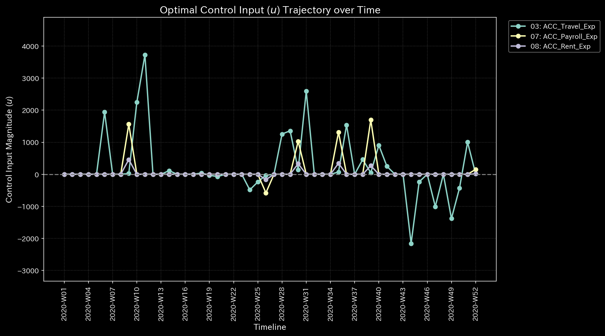
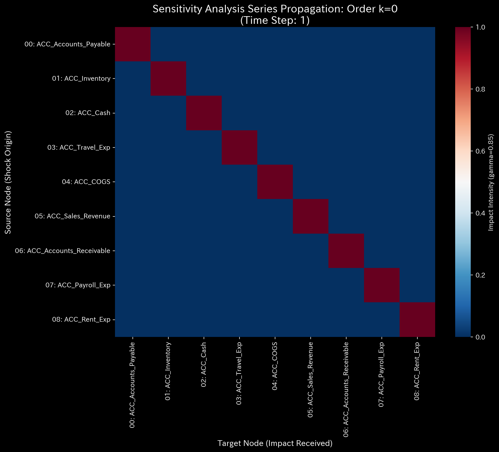
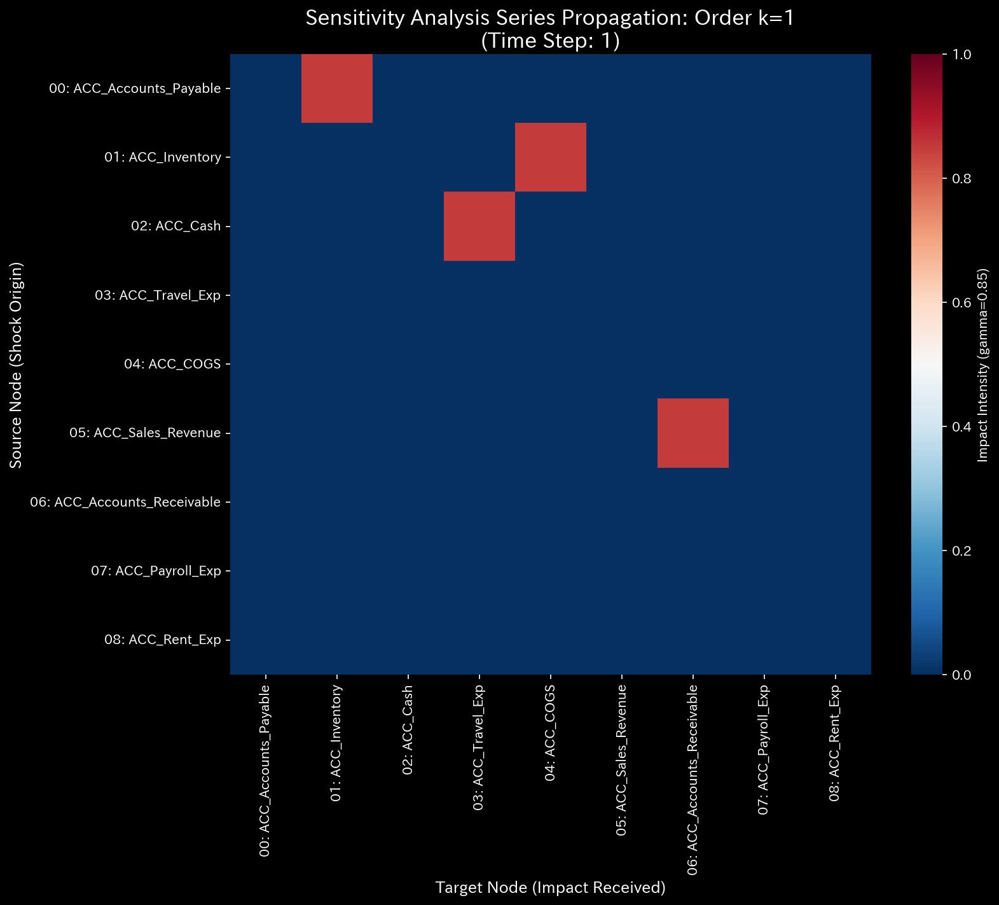
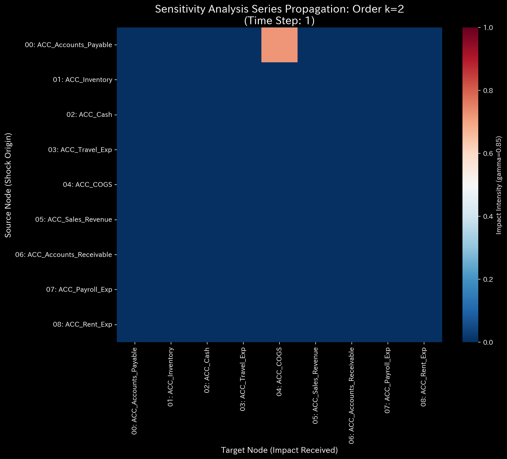
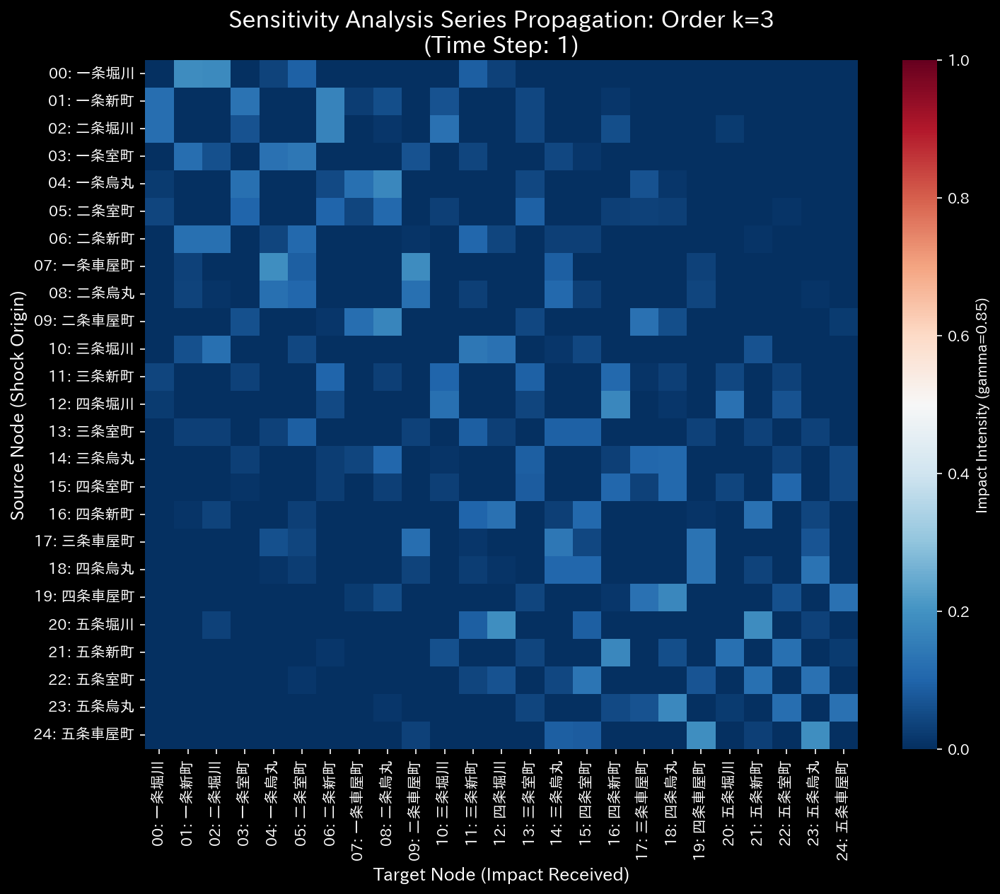
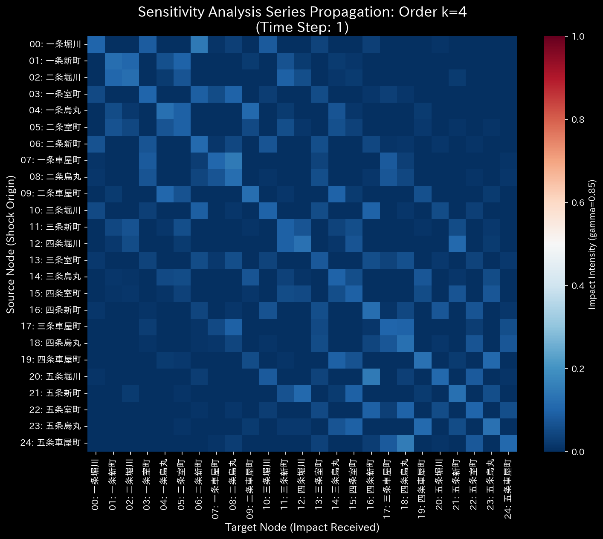
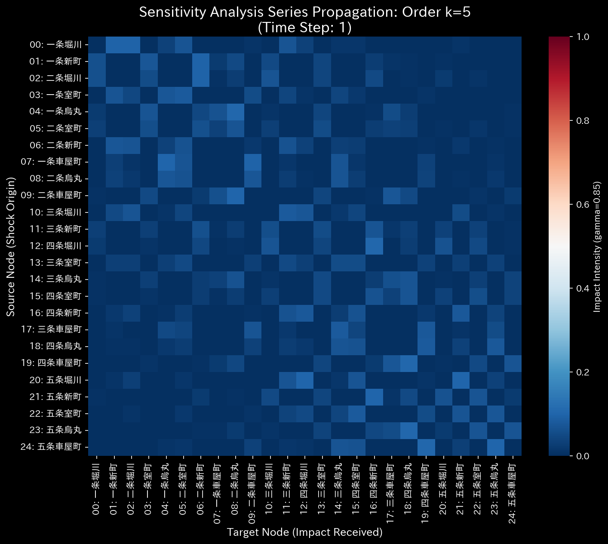

# 004. 制御工学およびシステム工学 (Control Theory & Systems Engineering)

> **"システムを単に観察することは、その気まぐれに服従することである。そのメカニズムを理解することは、その未来をシミュレートすることである。しかし、それを制御すること——それこそがエンジニアリングの本質である。"**

カテゴリ **004** は、Tensor-Link Utility (TLU) パイプラインの絶対的な集大成を表しています。カテゴリ000から003で明らかになった物理的特性（質量、剛性）、熱力学的健康度、幾何学的歪み、および因果経路を活用し、この最終レイヤーは戦略的リーダーシップに「数学的に最適な実行計画」を提供します。

これはシステムを、孤立した一回限りの目標探索（逆運動学）から、**継続的で動的な最適制御** と **システム全体の感度分析** の領域へと移行させます。

---

## 1. 最適制御理論と LQR (004_1_1)
*実装: `src/filters/_004_1_1_filter_control_theory.py`*

現実世界の組織は、一回の瞬間的なジャンプで目標に到達することはありません。介入は時間経過とともに継続的に適用され、システムが反応するのに合わせて調整されなければなりません。TLU はネットワーク全体を離散時間の **状態空間モデル (State-Space Model)** として定式化し、最適な介入軌道を解きます。

### 状態空間の定式化

$x(t+1) = A \cdot x(t) + B \cdot u(t)$

* **状態 ( $x(t)$ ):** ネットワーク内のすべてのノードの現在のステータス。
* **システム・ダイナミクス ($A$):** 歴史的ベースラインから導出された、システムの自然な遷移や自己回帰の傾向。
* **制御入力行列 ($B$):** どの特定のノードが「制御可能（Controllable）」であるかをマッピングします（例：R&Dに現金を注入することはできますが、「顧客の愛着」の増加を直接命令することはできません）。
* **介入 ( $u(t)$ ):** 時間 $t$ において制御可能なノードに加えられる、実際の労力、予算、または力。

### 最適レギュレータ (Linear-Quadratic Regulator: LQR)

システムを目標状態へと駆動する介入の完璧なシーケンス $u(t)$ を見つけるために、TLU は LQR を使用します。無限期間（Infinite-horizon）の二次コスト関数を最小化します：
$J = \sum ( x^T Q x + u^T R u )$

この方程式は、ビジネスにおける2つの根本的に対立する欲求のバランスをとります：

1. **緊急性のペナルティ ($Q$):** 組織が、現在の状態と目標状態の間の誤差（エラー）をどれほど激しく排除したいかを表す重み行列。
2. **倹約のペナルティ ($R$):** 介入そのものにかかるコスト、摩擦、または予算の限界を表す重み行列。

離散代数リカッチ方程式 (DARE: Discrete Algebraic Riccati Equation) を解くことで、TLU は最適なフィードバック・ゲイン $K$ を計算します。それはリーダーシップに、正確なマルチステップの軌道を提供します。すなわち、数学的な効率性をもって目標に到達するために、「正確にどのくらいの資源を」「どの特定のノードに」「どの特定のタイムステップで」割り当てるべきか、です。

### システム安定性とスペクトル半径 (004_1_2)
*実装: `src/filters/_004_1_2_filter_system_stability.py`*

最適制御を適用する前に、リーダーシップはシステムが本質的に安定しているかどうかを知らなければなりません。TLU は、遷移行列の **スペクトル半径 (Spectral Radius: 最大絶対固有値)** を計算することでこれを評価します。

* **トポロジー的安定性 (DAG):** リソースが厳密に一方向のみに流れる場合（有向非巡回グラフ：DAG）、スペクトル半径は正確に `0.0` のままです。システムは構造的に健全です。
* **サイクルの検出 (循環取引):** スペクトル半径が `0.0` を超えて急増した場合、ネットワーク内に閉ループまたはサイクル（例：A -> B -> C -> A）が形成されていることを数学的に証明します。財務データにおいて、これは **循環取引 (Wash Trading)** や再帰的な資金調達スキームの決定的なシグネチャ（痕跡）です。もし半径が `1.0` を超えた場合、システムは指数関数的な発散状態にあります。

## 2. システム感度行列 (004_2_1)
*実装: `src/filters/_004_2_1_filter_sensitivity.py`*

LQRが特定の目標のための外科用メスであるならば、**システム感度行列 (System Sensitivity Matrix)** は戦場全体を掃引するレーダースキャンです。究極のマネジメント上のトレードオフを見つけるために、すべての単一ノードにわたって網羅的でブルートフォース（総当たり）な感度分析を実行します。

### 波及効果 vs. ひずみのトレードオフ

TLU は自動的に各ノードに対して均一な仮想投資（$\Delta$）を1つずつ注入し、対立する2つの指標を計算します：

1. **波及効果 (FKベースのROI):** この特定の投資が、ノイマン・エコーを介してネットワーク全体にどれだけの総システム的フラックス（内部エネルギー）を生み出すか？
2. **ひずみエネルギー (IK/剛性ベースの摩擦):** 精度行列 ($K$) に基づいて、このノードが強制的に拡張されたとき、組織はどれだけの構造的な「痛み」や抵抗を経験するか？

### 戦略的マトリックス

波及効果（Y軸）に対してひずみ（X軸）をプロットすることで、TLU は決定的な戦略的ポートフォリオを生成します：

* **クイック・ウィン（高い波及効果、低いひずみ）:** 組織の自然なレバレッジ・ポイント。ここを押せば、ほぼゼロの内部抵抗で巨大なシステム的成長が得られます。
* **ヘビー・リフト（高い波及効果、高いひずみ）:** 非常に効果的ですが、政治的または構造的に痛みを伴います。これらを実行するには強力なリーダーシップとチェンジマネジメントが必要です。
* **悪いアイデア / 金食い虫（低い波及効果、高いひずみ）:** ここに変化を強いると、システム的な利益をほぼ全く生み出さずに、組織を引き裂くことになります。

## 3. ビジネスへの示唆（Implications）

制御工学とシステム工学を展開することで、経営幹部は以下の問いに答えることができます：

1. **我々の最適な実行ロードマップは何か？** (LQR: 四半期目標を達成するための、正確で段階的な予算配分計画)。
2. **もし投資できるのが100万ドルしかない場合、我々の究極のレバレッジ・ポイントはどこか？** (感度行列: 「クイック・ウィン」の象限を見つける)。
3. **前回の組織再編はなぜあのように見事に失敗したのか？** (「高いひずみ、低い波及効果」のゾーンにプロットされた介入を特定する)。
