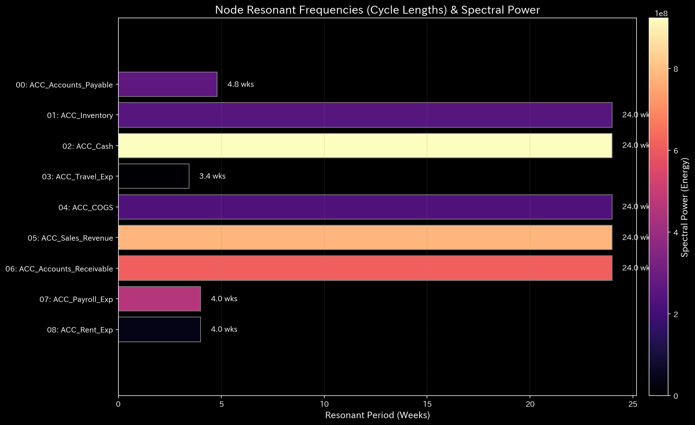
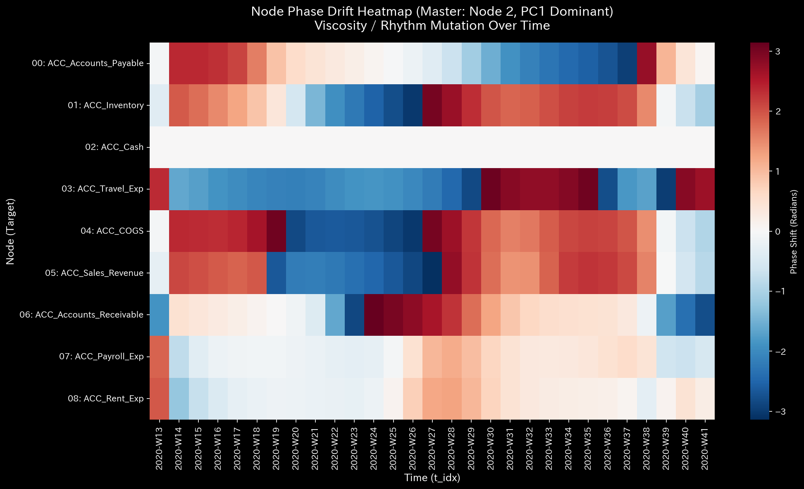
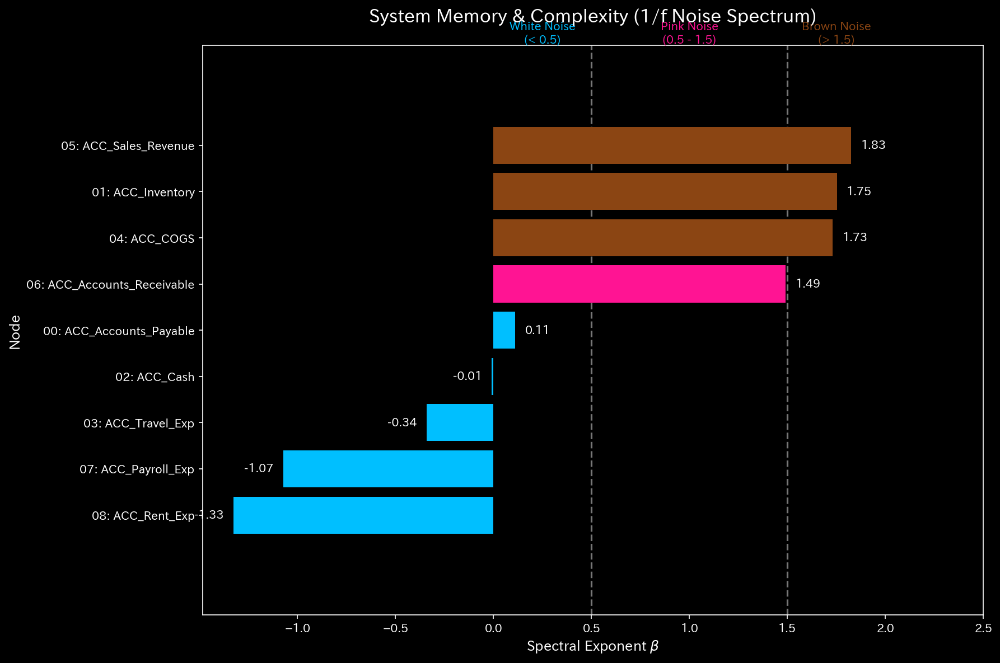

# 005. 信号処理と波動力学 (Signal Processing & Wave Mechanics)

> **"元帳は静的な数字のブロックではない。それは振動する機械である。異常を見つけるためには、その周波数に耳を傾けなければならない。"**

カテゴリ **005** は、これまでのカテゴリの空間的および熱力学的モデルから離れ、**「周波数領域分析（Frequency Domain Analysis）」** の領域へと入ります。

トランザクションの総ボリューム（質量）やネットワークの剛性（Stiffness）を見るのではなく、このパラダイムはリソースのフローを連続的で「振動する波（Waves）」として扱います。フーリエ変換、クロス・コヒーレンス、フラクタル・ノイズ分析といった高度な信号処理技術を適用することで、TLUは、標準的な集計合計を見ているだけでは完全に不可視である、深くシステム的なプロセスの変化、自動化されたボットの活動、またはデータの捏造を検出することができます。

---

## 1. 自己相関と共振周波数 (005_1_1)
*実装: `src/filters/_005_1_1_filter_resonant_frequency.py`*

すべての健康な組織は、自然な「心拍（Heartbeat）」や運用上のリズムを持っています。例えば、隔週の給与支払いサイクル、月末の請求のラッシュ、または四半期ごとの納税などです。TLU は自己相関とスペクトル分析を使用して、すべてのノードの **支配的な共振周波数（Dominant Resonant Frequency）** を見つけます。

* **支配的周波数:** そのノードが最も強く振動している特定の周期的なサイクル。
* **スペクトル・パワー:** 残りのノイズに対する、その特定の周波数の強度または強さ。

### ビジネスモデルの崩壊と人為的介入の検出
これは構造的な崩壊に対する早期警戒システムとして機能します。ある企業が「自社のビジネスモデルは安定している」と主張しているにもかかわらず、その共振周波数が「30日サイクル」（通常の請求）から混沌とした「14日サイクル」へと突然シフトした場合、それは早期回収を強いるキャッシュフローの危機を数学的に証明しています。さらに、巨大で予期せぬスペクトルのピークが不自然な周波数に現れた場合、それは機械のように正確な間隔で少額のお金を吸い上げる、プログラムされたボットや自動化された横領スクリプトの「指紋」です。

## 2. 位相シフトとコヒーレンス (005_1_2)
*実装: `src/filters/_005_1_2_filter_phase_shift_coherence.py`*

カテゴリ001が単純なタイムラグ相関を使用するのに対し、カテゴリ005はクロススペクトル密度を使用して、特定のターゲット周波数におけるノード間の **位相シフト（Phase Shift）** と **コヒーレンス（Coherence）** を評価します。

* **コヒーレンス:** 特定の周波数において、2つのノードの波形パターンが互いにどれほどよく一致しているかの指標（0から1までの値）。高いコヒーレンスは、2つの部門が完全に同期して動いていることを意味します。
* **位相シフト ($\Delta \phi$):** 2つのコヒーレントな波の間の角度の差（タイムラグ）。$-\pi$ から $+\pi$ までのラジアンで測定されます。

### PC1 オートマスター・トラッキング
データセットに依存しない「重心」を提供するために、TLU は数学的に第1主成分（PC1）を抽出し、システムの真の「メイン・エンジン」（例：現金、または最も混雑した交通の交差点）を特定します。その後、この鼓動する心臓に対する *他のすべてのノード* の位相ドリフト（Phase Drift）を計算します。

### 位相ドリフト・ヒートマップの読み方：粘性のレントゲン
ヒートマップは、時間経過（X軸）に対する位相シフトを可視化します。分岐カラーマップ（例：赤-白-青）を利用します。
* **白 (0 ラジアン):** メイン・エンジンとの完全な同期。遅延なし。
* **青 / 赤 ($+\pi$ / $-\pi$):** メイン・エンジンから遅れている、または先行している。色が濃いほど、遅延が半周期の位相反転に近いことを示します。

異常（「順序が狂うこと」）は、特定の色によって検出されるのではなく、**水平方向のカラー・バンド（帯）が、特定の時間インデックス ($t\_idx$) において突然その色相や強度をシフトさせること** によって検出されます：

* **パターンA（プロセスの崩壊）:** 歴史的に現金と同期していたノード（クリーンで連続した **白** のバンド）が、突然 **濃い青** に変わった場合。プロセスが分離（デカップリング）しています。例えば、売上は発生しているのに、回収が突然ストールし、巨大な組織的摩擦（粘性）が露呈しています。
* **パターンB（遅延の深刻化）:** 歴史的に固定された「1週間」の遅延で稼働していたノード（淡い **水色** のバンド）が、突然 **濃い青** に暗転した場合。既知のプロセスが危機的に悪化しています。
* **パターンC（ボット/アルゴリズムによる乗っ取り）:** 歴史的にノイズが多く、無関係であったノード（色がちらついている）が、突然完全に **白** に変わり、メイン・エンジンと完璧な同期をロックした場合。これは、循環取引（Wash Trading）のような人為的なメカニズムがその口座を強制的に乗っ取り、同期してボリュームを水増し（パンプ）していることを示唆しています。

## 3. フラクタル次元と 1/f ノイズ (005_2_1)
*実装: `src/filters/_005_2_1_filter_fractal_noise.py`*

すべてのランダム・ノイズが等しく作られているわけではありません。健康で自然なシステム（人間の組織、心拍、株式市場を含む）は、**ピンクノイズ ($1/f$)** として知られる複雑で自己相似的なフラクタル・パターンを示します。

TLU はパワースペクトル密度（PSD）の減衰を計算し、データの分散の「テクスチャ（質感）」を分類するために **スペクトル指数 ($\beta$)** を抽出します。

* **ホワイトノイズ ($\beta \approx 0$):** 純粋で無相関のランダム性。すべてのイベントは過去から完全に独立しています。
* **ピンクノイズ ($\beta \approx 1$):** フラクタルで長期記憶（long-memory）を持つプロセス。複雑な人間や有機的なシステムの証拠（ホールマーク）。
* **ブラウンノイズ ($\beta \approx 2$):** ランダム・ウォーク。短期的には高度に相関した動きですが、長期的には目的もなくドリフトします。

### 究極の捏造（Fabrication）検出器
人間は真のランダムな分散を生成するのが絶望的に下手であることで知られています。もし会計士が損失を隠すために何千もの偽の仕訳を手動ででっち上げたり、粗末な乱数ジェネレーターを使用してデータセットを水増ししたりした場合、得られたデータは数学的に「ホワイトノイズ」へと崩壊します。あるいは、自動化されたスクリプトが毎日全く同じ金額を注入した場合、それは不自然で硬直したスパイクを形成します。

ネットワークのフラクタル次元をマッピングすることで、TLU は総「金額」（帳尻を合わせるために簡単に偽造できる）を見るのではなく、数値の変動の「テクスチャ」が人間のグループによって自然に生成されたとすることは*物理的に不可能である*ことを証明することによって、データの捏造を捕捉します。

---

## 4. ビジネスへの示唆（Implications）

信号処理と波動力学を活用することで、アナリストは以下の問いに明確に答えることができます：

1. **自動化されたボットが我々のシステムを改ざんしていないか？** (不自然な共振周波数のスパイク)。
2. **我々のキャッシュ・コンバージョン・サイクルは密かに減速していないか？** (深刻なプロセスの摩擦を示す、位相ドリフト・ヒートマップ内のカラー・バンドの引き伸ばし/シフト)。
3. **この元帳は人為的に捏造されたものではないか？** (有機的なピンクノイズから人為的なホワイトノイズへの崩壊)。
