# 000. 財務基礎状態、構造剛性、および運動学 (Basic Statistics, Stiffness & Kinematics)

本ガイドは、Tensor-Link Utility (TLU) における統計分析、運動学、および構造剛性・PCAについて解説するものです。

---

## 000_0: 財務基礎状態と基本統計量

### 1. 財務状態の基本構造（貸借対照表 B/S & 損益計算書 P/L）
貸借対照表（B/S）をブロックのバランスとして視覚化した「B/Sブロック総計（`000_0_1__BS_Block_Total.png`）」と、売上から利益に至る利益構造を視覚化した「P/Lウォーターフォール（`000_0_1__PL_Waterfall_Total.png`）」を並べ、システムのマクロ構造の健全性を評価します。

#### 🟢 Sample 0 (正常代謝)
**臨床解説:**
資産（現預金など）と負債・自己資本が対称にバランスよく並び（B/S）、売上から費用が合理的に差し引かれて純利益が残る（P/L）、健全な基礎構造を示します。
- 
- 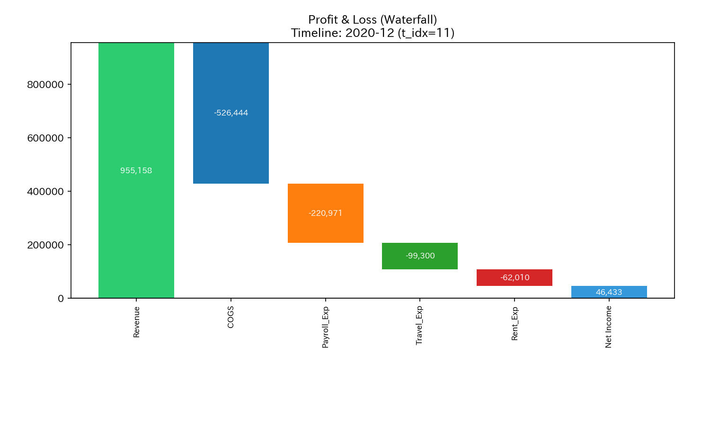

#### 🟡 Sample 1 (循環取引)
**臨床解説:**
売掛金が異常に肥大化しており（B/S）、P/Lでは莫大な売上高がある一方で費用が極小であることから、実体を伴わない循環取引による架空の利益創出であることが一目で分かります。
- 
- 

#### 🔴 Sample 2 (資金横領)
**臨床解説:**
売上金（P/L）は計上されていますが、回収された資金が簿外（系外）に漏洩しているため、手元現預金が異常に圧縮され（B/S）、その分ダミーの `UNKNOWN_LEAK` ノードが裏で実質資産を構成しています。
- 
- 

#### 🟡 Sample 3 (入力ミス)
**臨床解説:**
仕訳の貸借一方のみを入力した一時的エラーにより、B/Sの左右バランスが崩れて「帳簿の歪み（残差）」が生じていますが（B/S）、P/Lの営業収支の基本骨格は比較的正常に保たれています。
- 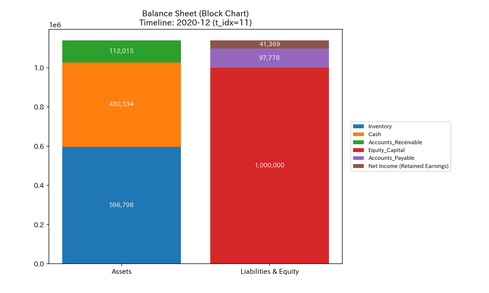
- 

#### 🔴 Sample 4 (複合アノマリー)
**臨床解説:**
架空売上の水増しによる売掛金膨張（B/S）と横領による資金流出（P/L損失項目）が同居しており、粉飾による肥大化と出血が同時に発生した、最も歪んだ状態を示します。
- 
- 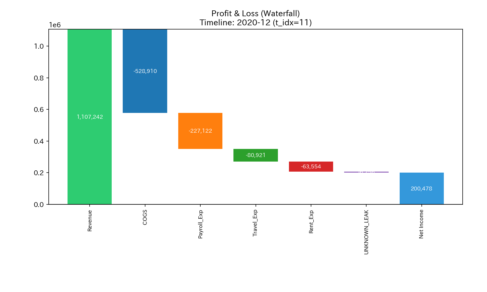

#### 🔴 Sample 5 (京都交差点網)
**臨床解説:**
車両数（B/S資産相当）の偏りと流入流出（P/L相当）です。主要交差点（中京区等）に滞留車両が極端に偏っており（B/S）、流動制限により流出ポテンシャルが崩壊しています（P/L）。
- 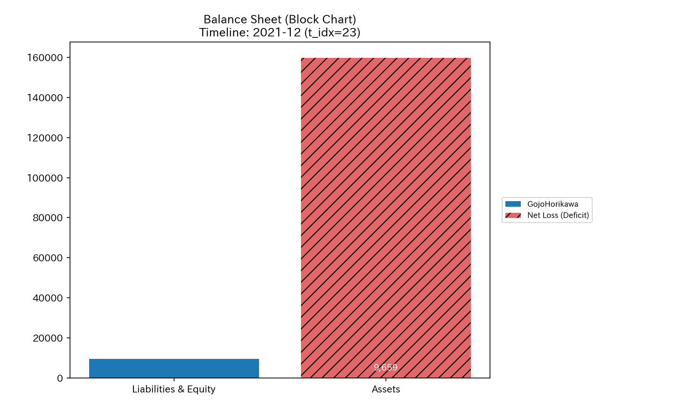
- 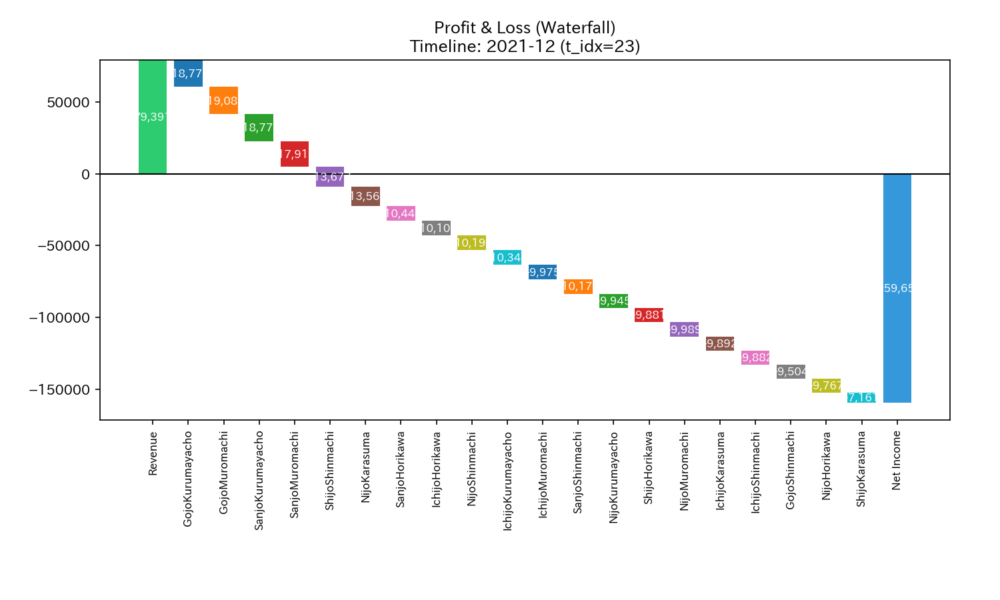

#### 🟢 Sample 6 (株券流体)
**臨床解説:**
投資家別・銘柄別の株券保有バランス（B/S）と出来高（P/L）です。出来高は非常に大きいものの（P/L）、実需を伴う株式のやり取り（実質保有変化）はほぼゼロであり、ボットによる安定的な対流を示します。
- 
- 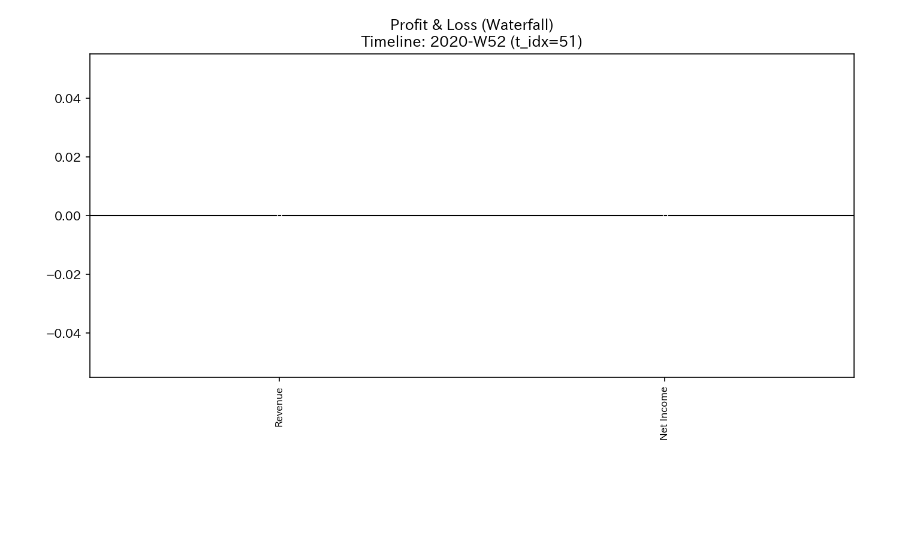

#### 🟢 Sample 7 (現金流体)
**臨床解説:**
ユーザー口座間の現金保有バランス（B/S）と直接送金の出来高（P/L）です。口座間での安定した取引媒介が行われており、一部のボット間送金で見かけの出来高が増えても、不整合残差はありません。
- 
- 

#### 🔴 Sample 8 (fMRI 脳梗塞)
**臨床解説:**
脳葉別の酸素BOLD信号量ブロック（B/S）と機能活動の収支バランス（P/L）です。梗塞発生（t=30）で運動野の信号が激減し（B/S）、機能損失エリアが脳全体の活動収支を大きくマイナスに引きずり下ろしています（P/L）。
- 
- 

#### 🔴 Sample 9 (fMRI てんかん発作)
**臨床解説:**
脳活動強度ブロック（B/S）と活動収支（P/L）です。側頭葉のバースト的活動が全体の酸素資源を独占し（B/S）、異常同調によって全体の認知機能ポテンシャルが損失しています（P/L）。
- 
- 

---

### 2. 時系列トレンド・ダイナミクス（B/S & P/L トレンド）
累積的な変動推移（`BS_Trend` / `PL_Trend`）と、各期間ごとの単期変動（`BS_Trend_Periodic` / `PL_Trend_Periodic`）を対比させ、システムの時系列ダイナミクスを分析します。

#### 🟢 Sample 0 (正常代謝)
**臨床解説:**
売上と費用が季節変動を伴いながらも安定的に連動し、期末純利益が累積的（Trend）かつ単期的（Periodic）に一定幅で成長を続ける、最も理想的な時系列パターンを示します。
- 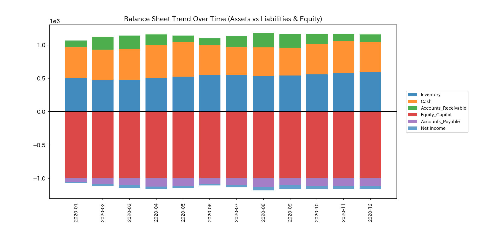
- 
- 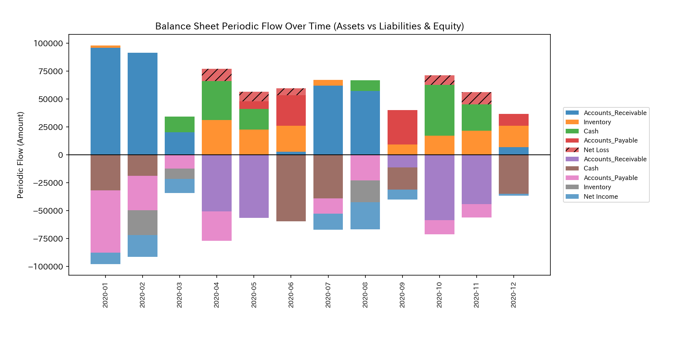
- 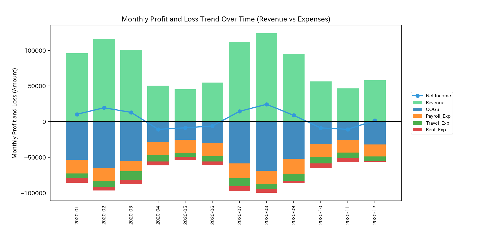

#### 🟡 Sample 1 (循環取引)
**臨床解説:**
売上・売掛金（B/S・P/L累積）が右肩上がりに異常膨張していくのに対し、実体的な営業費用は単期的（Periodic）にも完全に平坦であり、商取引の自然なボラティリティや季節変動が全く観測されない不自然さを示します。
- 
- 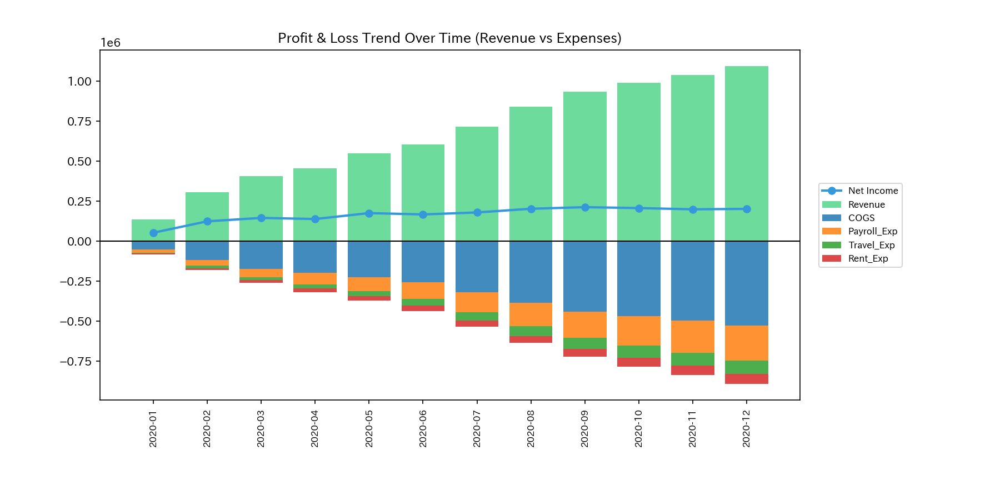
- 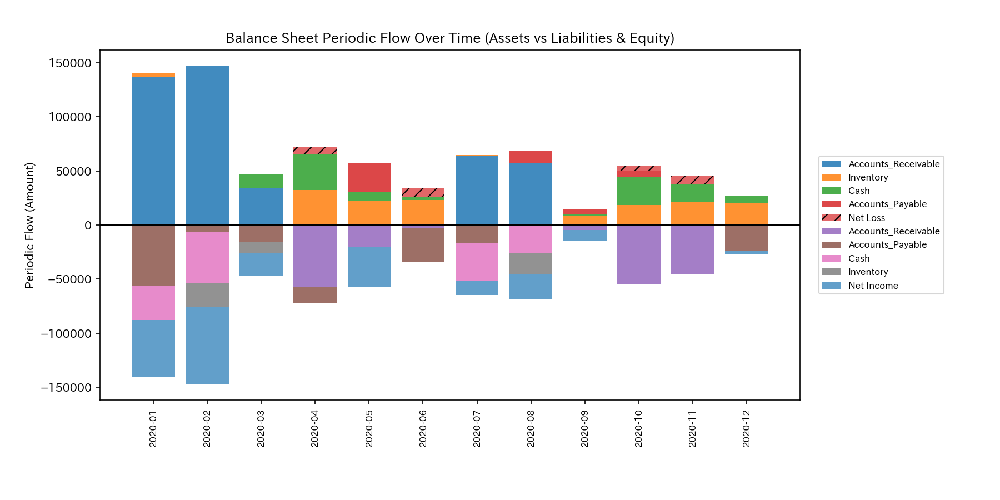
- 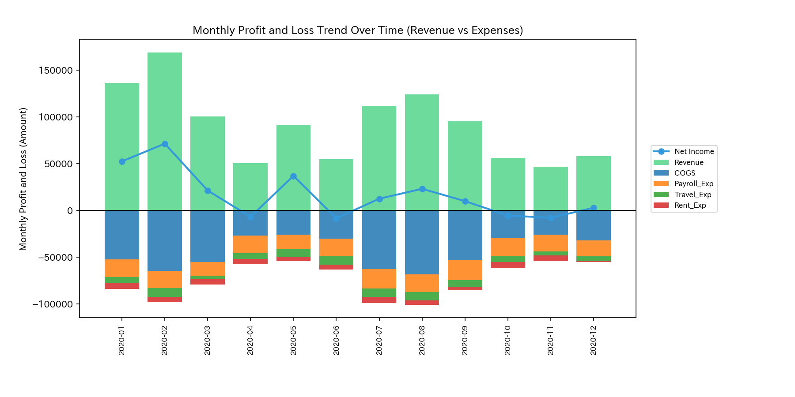

#### 🔴 Sample 2 (資金横領)
**臨床解説:**
累積のB/Sトレンドでは現預金が持続的に流出（減少）していますが、P/L上は黒字として累積（Trend）されています。しかし、期間ごとの増減（Periodic）を追うと、売掛金の回収タイミングにもかかわらず現預金の単期増分が極端に少なく、資産の簿外流出が期ごとに繰り返されている事実が明確に現れます。
- 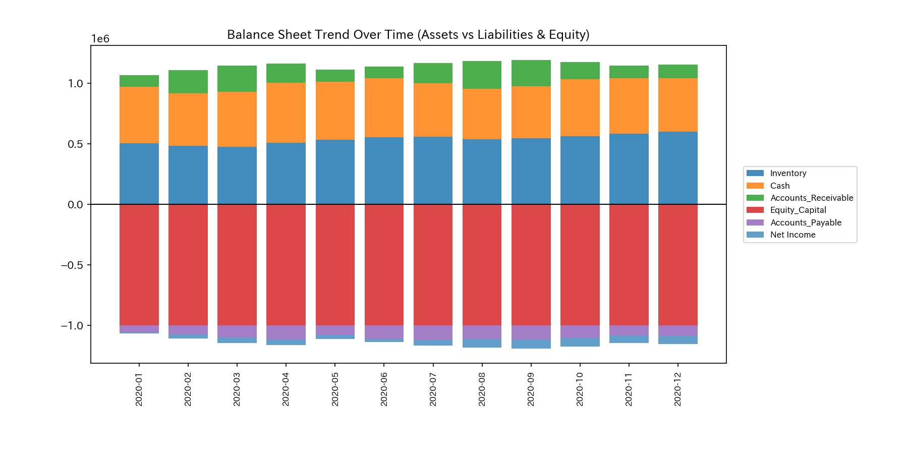
- 
- 
- 

#### 🟡 Sample 3 (入力ミス)
**臨床解説:**
$t=1$ (2020-02) において、貸借が不一致の一時的仕訳ミスが発生したため、同期のPeriodicトレンドにおいてB/SおよびP/Lに急激なノイズが発生します。しかし次期には速やかに修正され、累積（Trend）的にも一過性の変動として吸収されています。
- 
- 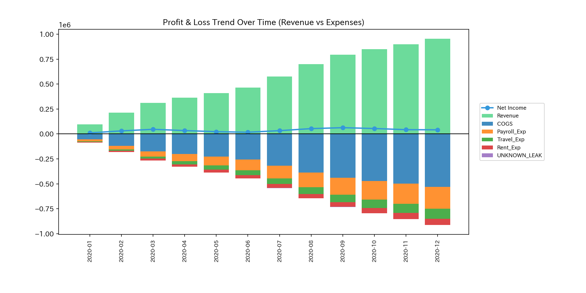
- 
- 

#### 🔴 Sample 4 (複合アノマリー)
**臨床解説:**
架空売上の水増しによる売掛金累積（B/S Trend）と利益累積（P/L Trend）が爆発的なグラフを描く裏で、期間ごと（Periodic）には多額の資金流出（横領による損失）が記録され、粉飾の累積効果と実際の資金出血の時系列対比が格好の材料となります。
- 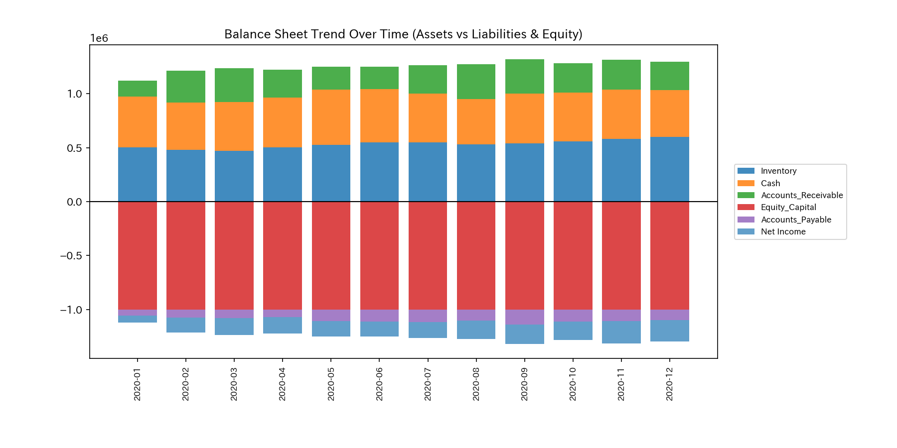
- 
- 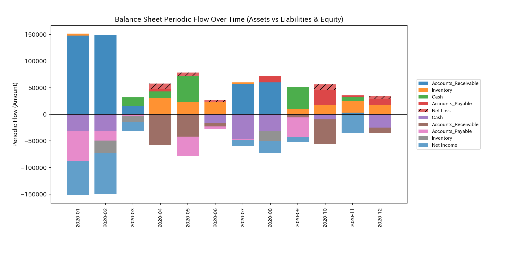
- 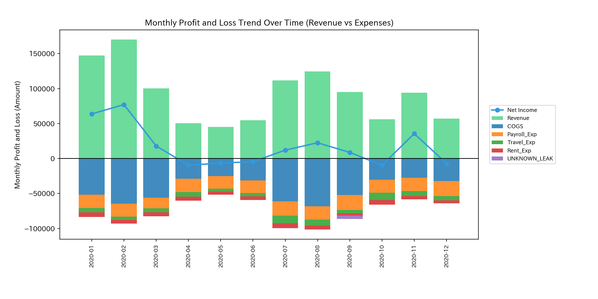

#### 🔴 Sample 5 (京都交差点網)
**臨床解説:**
観光シーズン等に伴う流入車両数（B/S相当）と通過損失（P/L相当）の推移です。アノマリーが発生した期において、車両数の急増（BS Trend）と同時に、単期（Periodic）の滞留損失が致命的に拡大し、システム全体の流動ポテンシャルが一気に低下（PL Trend）する過程を示します。
- 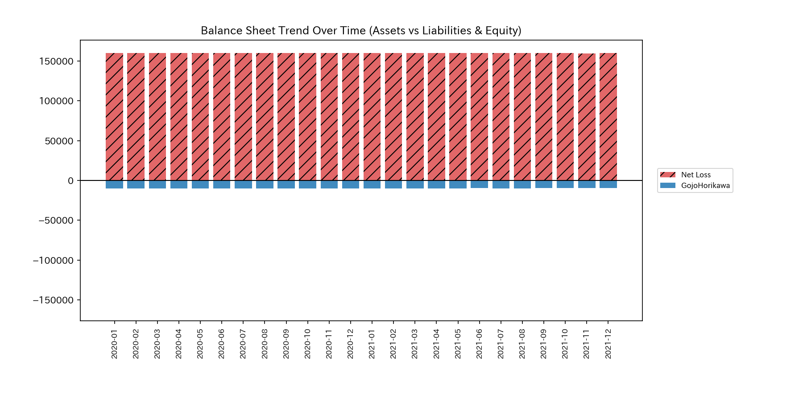
- 
- 
- 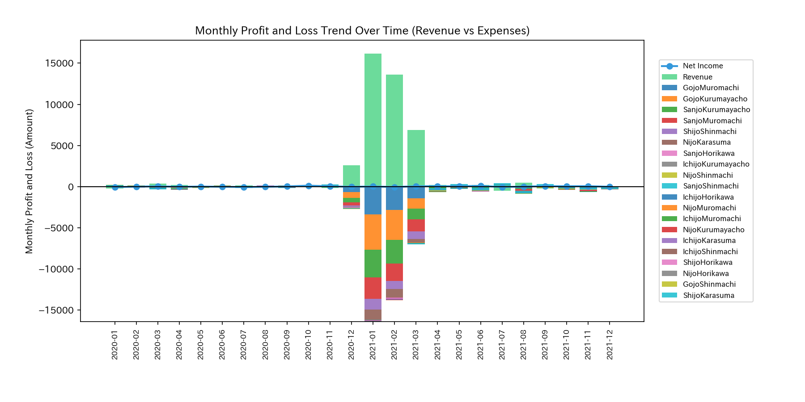

#### 🟢 Sample 6 (株券流体)
**臨床解説:**
保存則の下で稼働する株式市場の出来高と保有推移。累積取引量（P/L Trend）は急上昇する一方、期間ごと（Periodic）には安定した規則的対流が行われており、投資家間の保有バランス（B/S）も全期間を通じて安定限界内に収まっています。
- 
- 
- 
- 

#### 🟢 Sample 7 (現金流体)
**臨床解説:**
ユーザー間の決済フロー。取引量（P/L）および残高（B/S）の累積・単期推移の双方において、特定の期間での急激な偏りや断絶はなく、システム全体が健康な流動対流のもとでバランスを維持している様子が観察されます。
- 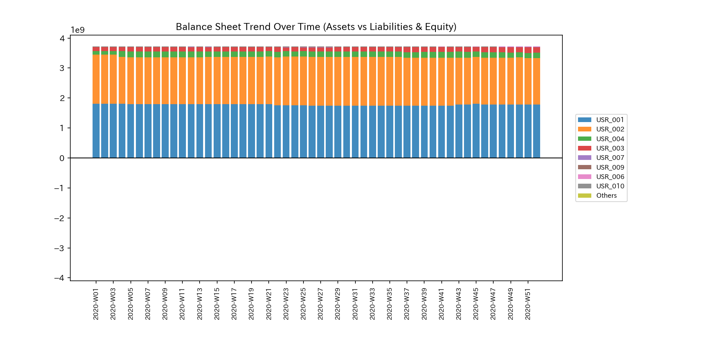
- 
- 
- 

#### 🔴 Sample 8 (fMRI 脳梗塞)
**臨床解説:**
脳梗塞が発生した TR=150 ($t=30$) の前後で、BOLD信号の累積蓄積（B/S Trend）および機能収支（P/L Trend）が急激なマイナス成長へと相転移します。単期（Periodic）の変動を見ると、梗塞期のタイミングで血流ポテンシャルが一過性に大暴落し、その後低レベルで平坦に推移する過程が明瞭に示されます。
- 
- 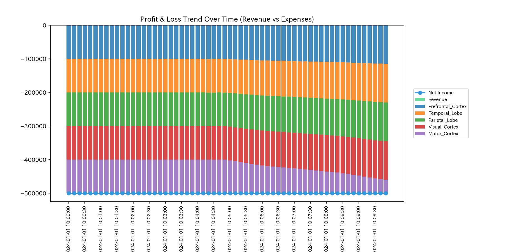
- 
- 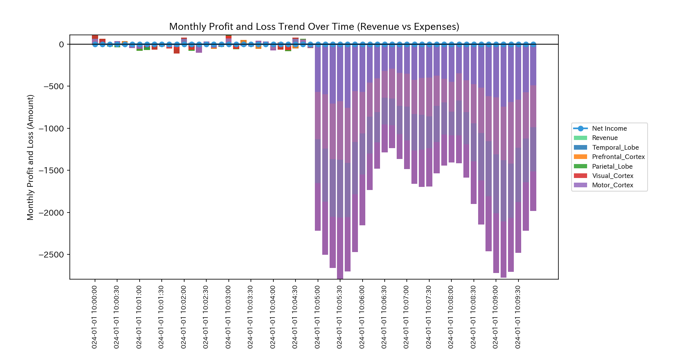

#### 🔴 Sample 9 (fMRI てんかん発作)
**臨床解説:**
てんかん同調時のBOLD信号強度の激しい振動。累積（Trend）では認知機能ポテンシャルが崩壊的に減少する一方で、単期（Periodic）の推移をみると、発作の周期に伴う極めて規則的で暴力的な脳活動強度の上下振動が同期して繰り返されています。
- 
- 
- 
- 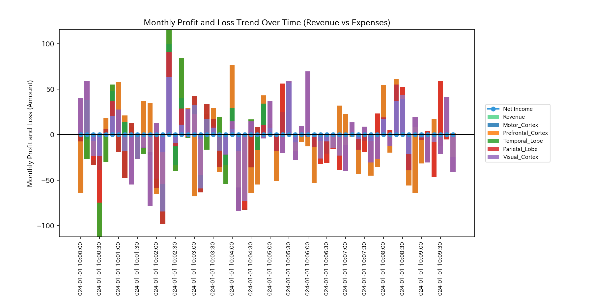
