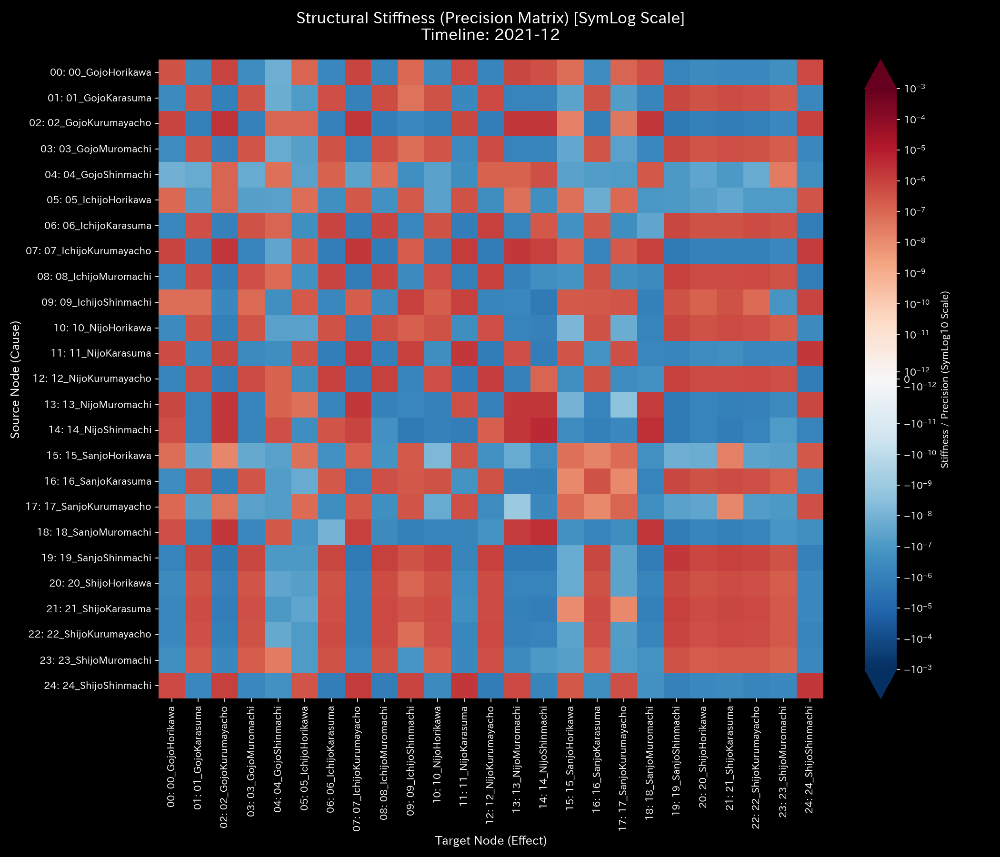

# 000_2. 構造剛性と主成分分析 (Stiffness & PCA)

本ガイドは、Tensor-Link Utility (TLU) における構造剛性・PCAについて解説します。

---

## 000_2: 構造剛性と主成分分析

### 6. 時系列構造剛性行列 (`000_2_1__structural_stiffness.t*.png`)

ノード間の偏相関と流量ボラティリティから算出された、システムの剛性トポロジーの時系列進化を示す行列グラフです。

#### 🟢 Sample 0 (正常代謝)

**臨床解説:**
剛性行列は偏りがなく均一です。特定のセル（取引ペア）だけが凝固する剛性ロックは発生していません。

- 
- 
- 

#### 🟡 Sample 1 (循環取引)

**臨床解説:**
循環取引が実行されます（ステップ $t=0, t=4$）。このとき、`Cash` と `Accounts_Receivable` の間の剛性セルが濃赤色になります。剛性ロックが発生しています。

- 
- 
- 
- 
- 

#### 🔴 Sample 2 (資金横領)

**臨床解説:**
$t=4$ 以降に資金漏洩が進行します。現金預金と流出ノード `UNKNOWN_LEAK` 間の剛性ロックが徐々に進行します。最終期（$t=11$）に向けて、流出アノマリーは沈黙したままです。

- 
- 
- 
- 
- 
- 

#### 🟡 Sample 3 (入力ミス)

**臨床解説:**
$t=1$（2020-02）に片面入力エラーが発生します。これにより一時的な剛性のねじれが発生します。翌ステップ（$t=2$）に自己修正されます。それ以降、最終期（$t=11$）まで行列は正常な分散状態を維持します。

- 
- 
- 
- 
- 

#### 🔴 Sample 4 (複合アノマリー)

**臨床解説:**
循環取引が激化します。このとき `Cash` と `Accounts_Receivable` の間のセルが硬化します。また、横領の流出先に繋がるセルが硬化します。剛性構造が破壊されています。

- 
- 
- 
- 
- 
- 

#### 🔴 Sample 5 (京都交差点網)

**臨床解説:**
正常時（$t=6$）には剛性が分散しています。渋滞麻痺が発生します（$t=18$ 以降）。このとき、`23_四条烏丸` や `21_四条室町` の周辺セルが濃赤色へ相転移します。剛性ロックが確認されます。

- 
- 
- 
- 
- 

#### 🔴 Sample 8 (fMRI 脳梗塞)

**臨床解説:**
虚血梗塞が起きます（$t=30$）。その瞬間、運動野（`Motor_Cortex`）および頂頭葉の間の剛性が異常に上昇します。そして凝固します。脳活動の柔軟性が喪失した状態を示します。

- 
- 
- 
- 

#### 🔴 Sample 9 (fMRI てんかん発作)

**臨床解説:**
異常放電による過同期バーストが発生します。剛性行列のほぼ全セルが最大値（濃赤色）にフリーズします。脳全体の情報変形能力（思考自由度）が失われます。

- 
- 
- 
- 

---

### 7. PCA主要軸比率 (`000_2_2__principal_axes_ratio.png`)

主成分累積説明分散比率（Explained Variance Ratio）のプロットです。特定の少数の主成分に系の自由度が支配されているかを判別します。

#### 🟢 Sample 0 (正常代謝)

**臨床解説:**
各成分比率がなだらかに減衰します。支配的な PC1 寄与率が低いです。系のエネルギーが分散しています。

- 

#### 🟡 Sample 1 (循環取引)

**臨床解説:**
PC1寄与率がアノマリー実行時に **`95.28%`** まで上昇します。系のすべての力学的変形エネルギーが架空取引の往復運動に独占されました。これを証明します。

- 

#### 🔴 Sample 2 (資金横領)

**臨床解説:**
横領が進行します。これに伴い、PC1寄与率が上昇します。系の活動が `UNKNOWN_LEAK` と現金預金口座との間の偏ったエネルギーに支配されます。その様子を示します。

- 

#### 🟡 Sample 3 (入力ミス)

**臨床解説:**
$t=1$ 前後に一時的に PC1 寄与率が **`100.0%`** に達します。ミスが修正されます。その後は元のなだらかな正常分散へと回帰します。

- 

#### 🔴 Sample 4 (複合アノマリー)

**臨床解説:**
循環取引のピーク（$t=2$）に PC1 寄与率が **`100.0%`** に達します。還流閉路が系の支配軸をハイジャックしています。

- 

#### 🟢 Sample 6 (株券流体)

**臨床解説:**
PC1寄与率は極めて低いです。特定の取引口座による支配はありません。エネルギーが分散していることを示します。

- 

#### 🟢 Sample 7 (現金流体)

**臨床解説:**
PC1寄与率は低水準で安定します。特定の口座群による流動性の拘束や剛性ロックはありません。

- 

#### 🔴 Sample 8 (fMRI 脳梗塞)

**臨床解説:**
梗塞が発生します。その瞬間から PC1 寄与率が急上昇します。脳全体の信号活動が梗塞野周辺の異常剛性（Rigid Lock）に支配されます。

- 

#### 🔴 Sample 9 (fMRI てんかん発作)

**臨床解説:**
てんかん時は全領域が同期します。そのため、各成分の分散比率に差が生まれません。PC1寄与率が `37.5%` 付近で平坦のまま推移します。

- 

---

### 8. PCA固有ベクトル進化時系列 (`000_2_3__eigenvector_evolution.png`)

PCAの第1主成分（PC1）を構成する各ノードの固有ベクトル重み係数（Loading）の時系列推移を示したグラフです。

#### 🟢 Sample 0 (正常代謝)

**臨床解説:**
各ノードの固有ベクトル係数がなだらかに変動します。特定の勘定科目に系のエネルギー支配軸が固着することはありません。

- 

#### 🟡 Sample 1 (循環取引)

**臨床解説:**
アノマリー期に PC1 のロードが集中します。該当ノードは `Accounts_Receivable` (`-0.7162`) 、 `Sales_Revenue` (`0.5183`)、および `Cash` (`0.3524`) です。全活動がこの還流にハイジャックされた証拠を示します。

- 

#### 🔴 Sample 2 (資金横領)

**臨床解説:**
$t=4$ にアノマリーが開始します。それ以降、流出先 `UNKNOWN_LEAK` と預金口座の係数が他ノードを圧倒します。資金の漏出トポロジーへの完全な固着（構造破壊）を証明します。

- 

#### 🟡 Sample 3 (入力ミス)

**臨床解説:**
ミス発生期に `Accounts_Receivable` と `Sales_Revenue` のロードが上昇します。修正されます。その後は他の経費科目などへロードが分散されます。

- 

#### 🔴 Sample 4 (複合アノマリー)

**臨床解説:**
還流ノードの重み係数が偏在します。また、流出先 `UNKNOWN_LEAK` の重み係数が偏在します。これらが持続的に形成されます。複雑な不正の同時進行を示します。

- 

#### 🟢 Sample 6 (株券流体)

**臨床解説:**
固有ベクトル係数は時間とともに分散して推移します。特定の口座や銘柄への異常なエネルギー固着はありません。

- 

#### 🟢 Sample 7 (現金流体)

**臨床解説:**
最終ステップ（$t=23$）に至るまで、PC1のロードは特定のユーザー口座に固着せず、全域に分散しています。

- 

#### 🔴 Sample 8 (fMRI 脳梗塞)

**臨床解説:**
梗塞が起きます（$t=30$）。その瞬間、PC1のロードが運動野（`Motor_Cortex`）および頂頭葉（`Parietal_Lobe`）に固着します。脳の活動エネルギーの偏り（虚血ロック）を示します。

- 

#### 🔴 Sample 9 (fMRI てんかん発作)

**臨床解説:**
てんかん同期中は全ノードが同一波形で同調します。固有ベクトルのロードが全領域でフラット（均等）な一本線にフリーズします。情報探索能力が皆無となった状態を示します。

- 
