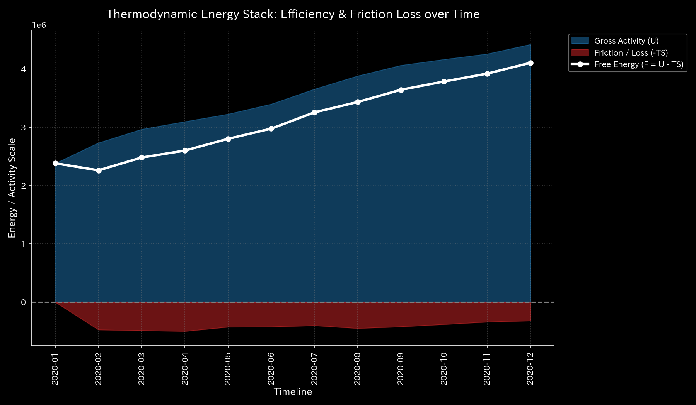
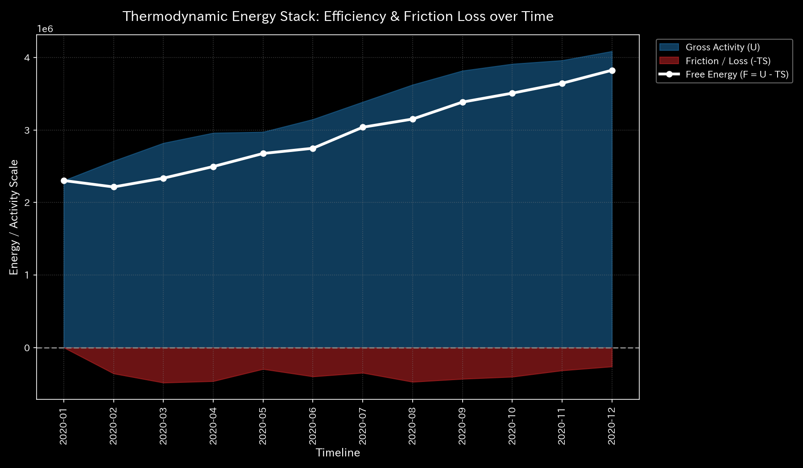
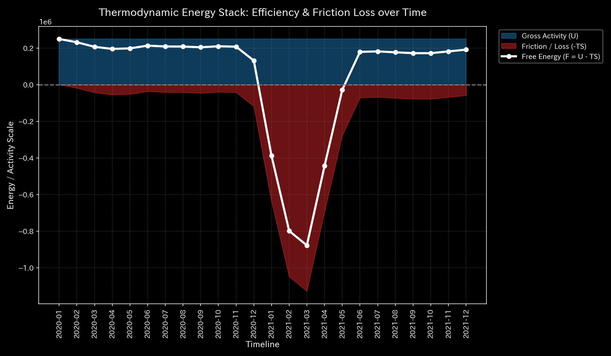
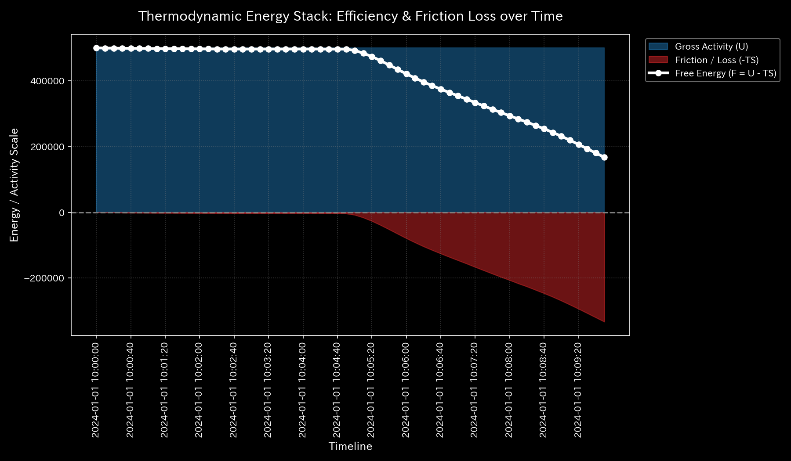
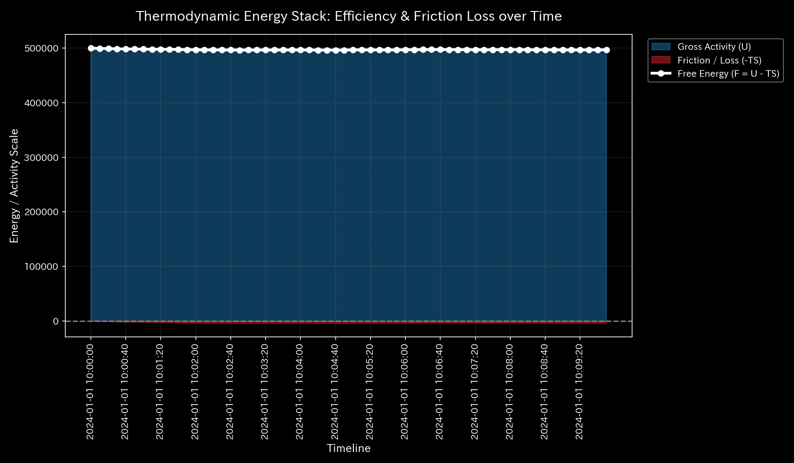
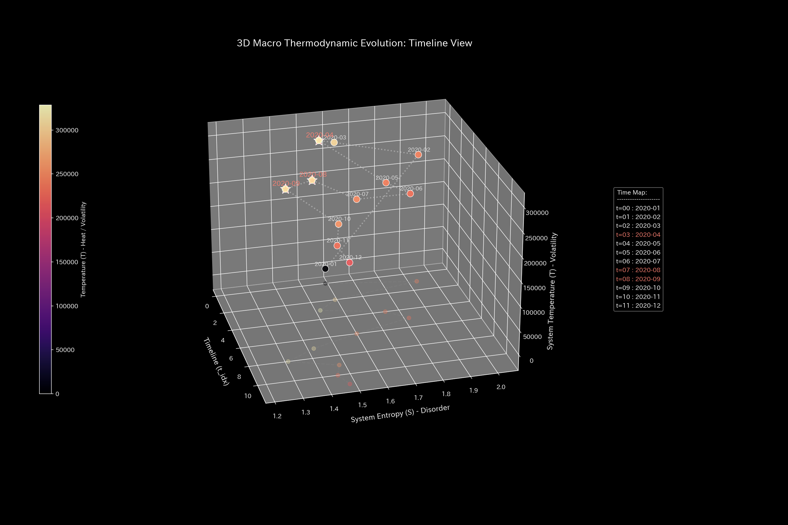
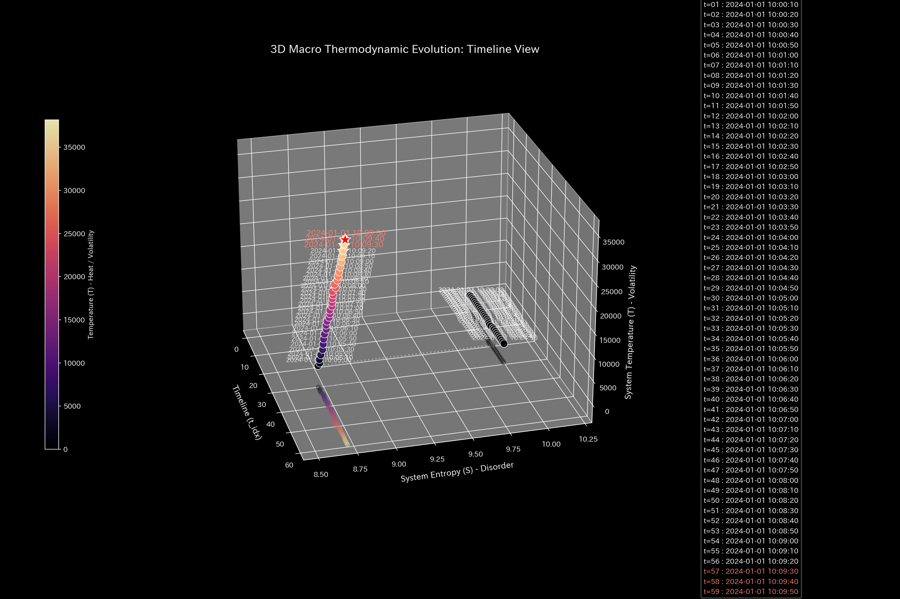

# 001. 熱力学とエントロピー (Thermodynamics & Entropy)

本ガイドは、Tensor-Link Utility (TLU) における熱力学・エントロピー分析モジュール（`001_1`、`001_2`）について解説します。

---

## 🔬 熱力学の物理数学理論

TLUは、活動量を「内部エネルギー $U$」、無秩序さを「エントロピー $S$」、ボラティリティを「温度 $T$」と定義します。これらを用いて、システムに残されている有効ポテンシャルである「自由エネルギー $F$」を算出します。

$$F = U - T \cdot S$$

正常なシステムでは、活動に伴って摩擦熱損失（$T \times S$）が発生し、自由エネルギーが健全に消費されます。病的還流閉路が形成されると、内部エネルギー $U$ は高い数値を維持します。しかし、実体活動を伴わないため、すべて摩擦熱（$TS$）の膨張として相殺されます。その結果、自由エネルギー $F$ が極度に圧縮されて枯渇します。

---

## 📊 マクロ熱力学グラフと個別サンプルの所見

### 1. 熱力学エネルギースタック (`001_1_2__thermodynamics_energy_stack.png`)

内部エネルギー $U$、摩擦熱損失 $TS$、および自由エネルギー $F$ の累積構成推移を示すスタックグラフです。

#### 🟢 Sample 0 (正常代謝)
**臨床解説:**
自由エネルギー $F$（白い実線）が安定成長しています。摩擦熱損失 $TS$（エンジ色）による圧縮はありません。
- 

#### 🟡 Sample 1 (循環取引)
**臨床解説:**
循環取引の実行月（1月、2月、5月）に、残高ボラティリティにより局所温度がスパイクします。摩擦熱損失 $TS$ が急激に拡張して自由エネルギー $F$ を押し潰しています。
- 

#### 🔴 Sample 2 (資金横領)
**臨床解説:**
資金の系外流出により、活動の源泉である現金（質量）が失われます。内部エネルギー $U$ 自体が右肩下がりで衰退しています。
- 

#### 🟡 Sample 3 (入力ミス)
**臨床解説:**
片面入力エラーが発生した $t=1$（2月）の瞬間、一時的なノイズとして温度とエントロピーが跳ね上がります。スタック上に摩擦が記録されています。
- 

#### 🔴 Sample 4 (複合アノマリー)
**臨床解説:**
還流による温度上昇と、横領による資産の系外流出が同時進行します。摩擦熱エリアが拡大し、自由エネルギー $F$ が底へ押し潰されています。
- 

#### 🔴 Sample 5 (京都交差点網)
**臨床解説:**
デッドロック発生後、車両の身動きが取れなくなる一方で流入は続きます。速度ボラティリティによる摩擦熱損失が急増します。マクロ自由エネルギー（流動ポテンシャル）が損失されています。
- 

#### 🟢 Sample 6 (株券流体)
**臨床解説:**
内部エネルギー $U$ は適正水準で安定します。摩擦熱損失 $TS$ も低く抑えられ、自由エネルギー $F$ はプラスの活動余力を維持しています。
- 

#### 🟢 Sample 7 (現金流体)
**臨床解説:**
対流に伴い、摩擦熱損失 $TS$ は穏やかに推移します。自由エネルギー $F$ が健全に確保され、システム全体の資金効率が維持されています。
- 

#### 🔴 Sample 8 (fMRI 脳梗塞)
**臨床解説:**
脳梗塞発生（$t=30$）の直後、運動野への血液供給が断たれます。エネルギー生産が急降下し、自由エネルギーが落下しています。
- 

#### 🔴 Sample 9 (fMRI てんかん発作)
**臨床解説:**
過同期バーストにより、ボラティリティ（温度）は極大化します。しかし、情報探索の自由度が失われ、自由エネルギーは壊滅的に低下しています。
- 

---

### 2. 温度-エントロピー (T-S) ダイアグラム (`001_1_3__thermodynamics_ts_diagram.png`)

温度 $T$ とエントロピー $S$ の相関推移から、不可逆的な熱力学サイクル軌道を示すグラフです。

#### 🟢 Sample 0 (正常代謝)
**臨床解説:**
T-S曲線は閉じていません。外部環境と接続しながらエントロピーを放出する開放経路を描いています。
- 

#### 🟡 Sample 1 (循環取引)
**臨床解説:**
T-S線図は閉じた卵型の軌跡（還流サイクル）を描きます。内部だけで無駄に放出した熱量（摩擦）の存在を数理的に証明しています。
- 

#### 🔴 Sample 2 (資金横領)
**臨床解説:**
質量（資金）の系外流出に伴い、温度・エントロピーの活動スケール自体が縮小します。T-S曲線は原点方向へと不可逆に縮退していきます。
- 

#### 🟡 Sample 3 (入力ミス)
**臨床解説:**
入力ミスがあったステップで異常突出を見せます。しかし、翌ステップの修正により開放型T-S軌道へと復帰し、病的還流は定着していません。
- 

#### 🔴 Sample 4 (複合アノマリー)
**臨床解説:**
還流アノマリーと横領による質量衰退が重なります。T-S曲線は正常軌道から離脱してのたうち回りながら無限縮退へと向かっています。
- 

#### 🔴 Sample 5 (京都交差点網)
**臨床解説:**
アノマリー期のボトルネック発生により、T-S曲線は閉じた時計回りの病的ループへ転移します。流動能力が局所に閉じ込められ機能停止した状態を示します。
- 

#### 🟢 Sample 6 (株券流体)
**臨床解説:**
T-Sダイアグラムは閉じた病的ループを形成しません。外部環境と接続した開放型対流プロセスを描いています。
- 

#### 🟢 Sample 7 (現金流体)
**臨床解説:**
T-Sダイアグラムは穏やかに揺らぎながら開放的な軌道を描きます。還流ロックや送金ループの同調歪みは検出されません。
- 

#### 🔴 Sample 8 (fMRI 脳梗塞)
**臨床解説:**
虚血（$t=30$）の発生後、T-S曲線は以前の軌道空間から完全に切り離されます。活動ゼロに近い極小の平衡点へと不可逆にフリーズしています。
- 

#### 🔴 Sample 9 (fMRI てんかん発作)
**臨床解説:**
脳全体が異常同期放電に支配された結果、多様な状態探索能力が失われます。T-S曲線は単一振動を往復するだけの閉じた直線へフリーズしています。
- 
