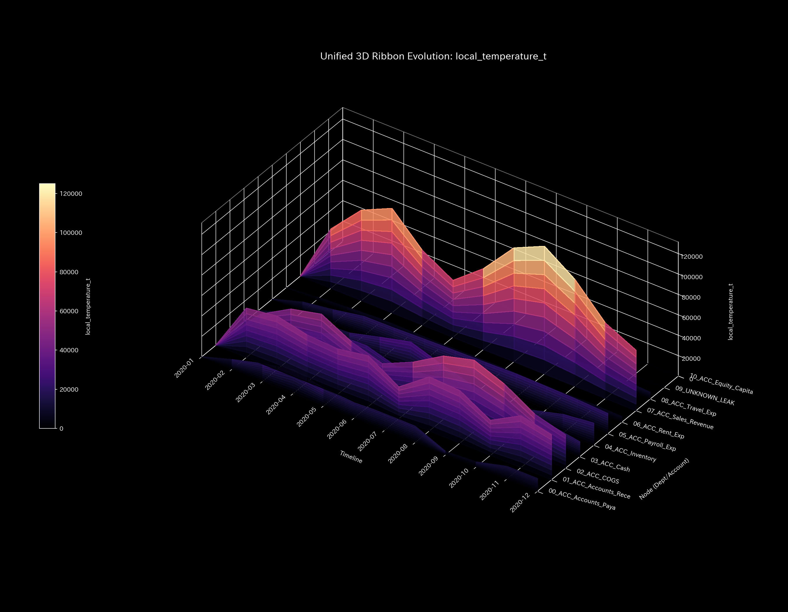

# 001. 熱力学とエントロピー (Thermodynamics & Entropy)

本ガイドは、Tensor-Link Utility (TLU) における熱力学・エントロピー分析モジュール（`001_1`、`001_2`）について、グラフの種類ごとに各検証サンプルの出力と数値に基づく臨床解説を縦列に整理したものです。

---

## 🔬 熱力学の物理数学理論

TLUは、ネットワーク全体の活動量を「内部エネルギー $U$」、ノード間の流動遷移確率の無秩序さを「エントロピー $S$」、流量ボラティリティ（標準偏差）を「温度 $T$」と定義します。これらを用いて、システムが外部に有益な仕事をしたり構造を維持するために残されている真のポテンシャルである**「自由エネルギー $F$」**を算出します。

$$F = U - T \cdot S$$

不可逆な実体システムでは、活動に伴って摩擦熱損失（$T \times S$）が発生し、自由エネルギーが健全に消費（散逸）されます。しかし、病的還流閉路（循環取引、車両デッドロック、共謀送金など）が形成されると、内部エネルギー $U$ は激しい空回りで高い数値を維持しますが、それが実体活動（外部接続）を伴わないため、すべて摩擦熱（$TS$）の膨張として相殺され、自由エネルギー $F$ が極度に圧縮されて枯渇へと向かいます。

---

## 📊 局所熱力学・エントロピーグラフと個別サンプルの所見

### 3. 3次元局所エントロピー (`001_1_2_1__3d_local_entropy.png`)
各ノードごとの空間的流路の分散度（エントロピー）の時空間変化を示す3次元グラフです。

#### 🟢 Sample 0 (正常代謝)
**臨床解説:**
各領域の空間的エントロピーはなだらかで均一に分布しており、局所的な流路の遮断や特定の接続先への病的偏在は生じていません。

#### 🟡 Sample 1 (循環取引)
**臨床解説:**
循環取引発生期（1月、2月、5月）において、`ACC_Cash` が売掛金への異常な還流流路を形成したことで、局所エントロピーに明確な盛り上がりが検出されます。

#### 🔴 Sample 2 (資金横領)
**臨床解説:**
売掛金回収が正常に行われず、`UNKNOWN_LEAK` という一方向の流出先ノードへ資金流路が固定された結果、該当部位の局所エントロピーが異様に盛り上がり、漏洩経路の存在を示します。

#### 🟡 Sample 3 (入力ミス)
**臨床解説:**
入力ミスがあったタイムステップ（$t=1$）において、売掛金ノード周辺の局所エントロピーに鋭い単一のスパイクが生じますが、翌ステップには速やかに消滅して平坦に戻ります。

#### 🔴 Sample 4 (複合アノマリー)
**臨床解説:**
還流ループによる局所エントロピーの盛り上がりと、横領による漏洩先ノード周辺の局所エントロピーの盛り上がりが並行し、重層的な流路歪みが発生しています。

#### 🔴 Sample 5 (京都交差点網)
**臨床解説:**
交差点網の局所エントロピーです。ボトルネックである `21_四条室町` 周辺で、選択肢容量が著しく低下（車両の滞留・拘束）したことを示すエントロピー降下（$s_i=1.674$）が記録されています。

### 4. 3次元局所温度 (`001_1_2_2__3d_local_temperature.png`)
各ノードごとの時間的残高ボラティリティ（標準偏差）の時空間変化を示す3次元グラフです。

#### 🟢 Sample 0 (正常代謝)
**臨床解説:**
局所的な温度の過度な偏在（局所スパイク）はなく、システム全体がなだらかで均一な流動代謝状態（適正温度）に保たれています。

#### 🟡 Sample 1 (循環取引)
**臨床解説:**
循環取引発生と同期して、還流の軸である `ACC_Cash`、`ACC_Accounts_Receivable`、`ACC_Sales_Revenue` の3ノードが同時に巨大な山のように過熱（時間的ボラティリティの急上昇）しています。

#### 🔴 Sample 2 (資金横領)
**臨床解説:**
漏洩（横領）が発生している期間、現金預金口座の活動ボラティリティ（温度）が継続的に過熱しており、簿外へのバイパス移動に伴う残高の激しい動的スパイクを捉えています。

#### 🟡 Sample 3 (入力ミス)
**臨床解説:**
片面入力エラーが生じた $t=1$ に、該当勘定ノードのローリング標準偏差が一時的に爆発して鋭い温度の塔を形成しますが、修正とともに翌ステップには瞬時に平穏化します。

#### 🔴 Sample 4 (複合アノマリー)
**臨床解説:**
還流による往復取引の過熱と、横領による漏洩流出の過熱が重なり、複数の箇所でボラティリティ温度が巨大な火柱のように立ち上がっています。

#### 🔴 Sample 5 (京都交差点網)
**臨床解説:**
交差点網の局所温度です。ボトルネック交差点の `23_四条烏丸` 付近が、デッドロックによる完全フリーズによって青色（局所温度急降下 $T_i=1.87$）を示す「コールドアイランド現象」が発生しています。

### 5. 局所熱力学勾配・温度勾配 (`001_1_2_3__3d_local_gradient.png` 等)
システム内のノード間における温度差（ボラティリティ差）の空間的傾きを示すグラフです。流動の不均衡やボトルの位置を特定します。

#### 🔴 Sample 5 (京都交差点網)
**臨床解説:**
デッドロックでフリーズした `23_四条烏丸`（コールドスポット）と、その上流で車列が動けず滞留する交差点（ホットスポット）との間で、強烈な温度差（熱力学勾配）が発生している様子を捉えています。

