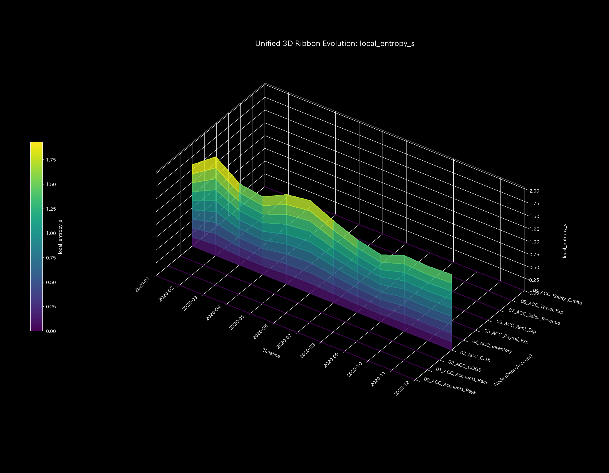
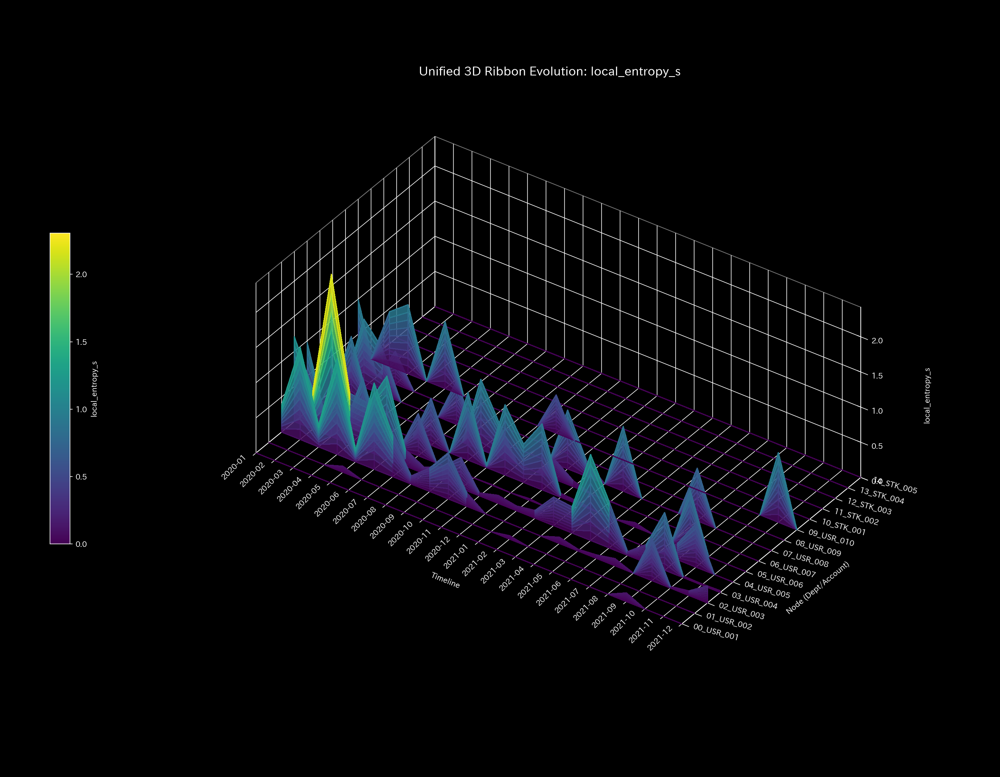
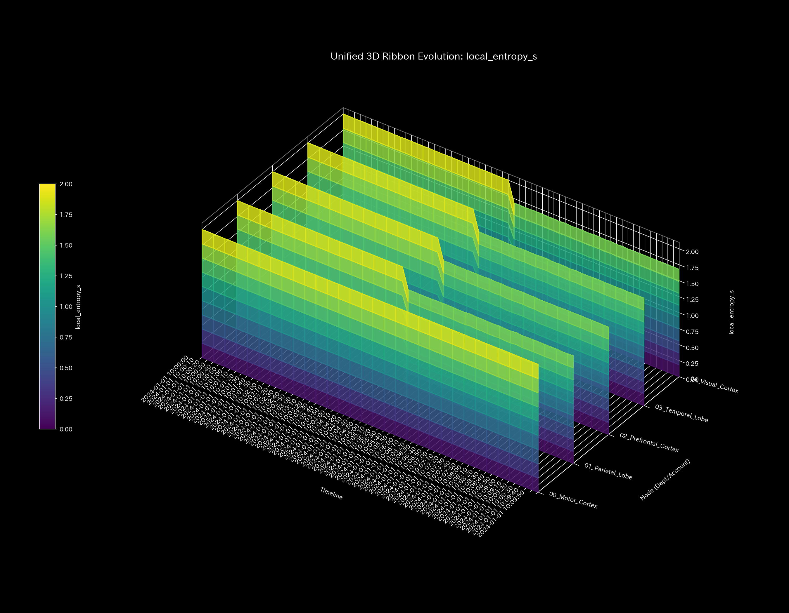
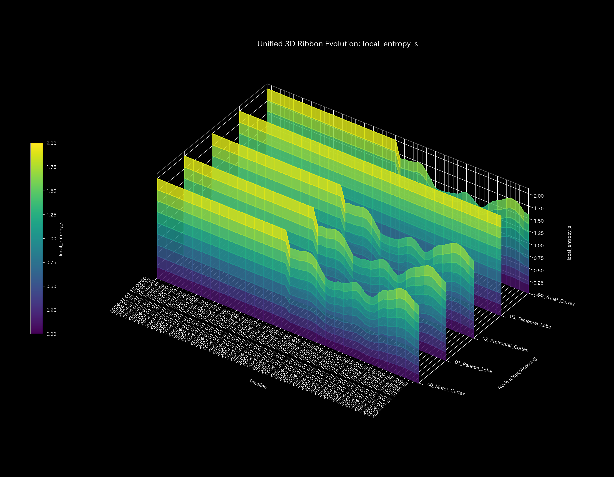

# 001_2. 局所エントロピー分析 (Local Entropy)

本ガイドは、Tensor-Link Utility (TLU) における「3次元局所エントロピー（`001_1_2_1__3d_local_entropy.png`）」について解説します。

---

## 🔬 物理数学理論：局所エントロピー $s_i$

TLUは、各ノード $i$ における無秩序さを「局所エントロピー $s_i$」と定義します。これは、ノードから流出する流量がどれだけ多様な接続先へ分散しているかを示す指標です。

$$s_i = -\sum_{j} P_{ij} \log P_{ij}$$

特定の接続先へ流路が固定されるか、あるいは流路が遮断された場合、エントロピー $s_i$ は低下します。

---

## 📊 3次元局所エントロピーと個別サンプルの所見

各ノードごとの空間的流路の分散度（エントロピー）の時空間変化を示す3次元グラフです。

#### 🟢 Sample 0 (正常代謝)
**臨床解説:**
各領域の空間的エントロピーは均一に分布しています。局所的な流路の遮断や偏在は生じていません。
- 

#### 🟡 Sample 1 (循環取引)
**臨床解説:**
循環取引発生期（1月、2月、5月）において、`ACC_Cash` が売掛金への還流流路を形成します。局所エントロピーに盛り上がりが検出されます。
- 

#### 🔴 Sample 2 (資金横領)
**臨床解説:**
`UNKNOWN_LEAK` という一方向の流出先ノードへ資金流路が固定されます。該当部位の局所エントロピーが盛り上がり、漏洩経路の存在を示します。
- 

#### 🟡 Sample 3 (入力ミス)
**臨床解説:**
入力ミスがあったタイムステップ（$t=1$）において、売掛金ノード周辺の局所エントロピーに鋭い単一のスパイクが生じます。翌ステップには消滅して平坦に戻ります。
- 

#### 🔴 Sample 4 (複合アノマリー)
**臨床解説:**
還流ループによる局所エントロピーの盛り上がりと、横領による漏洩先ノード周辺の局所エントロピーの盛り上がりが並行しています。重層的な流路歪みが発生しています。
- 

#### 🔴 Sample 5 (京都交差点網)
**臨床解説:**
ボトルネックである `21_四条室町` 周辺で、車両の滞留を示すエントロピー降下（$s_i=1.674$）が記録されています。
- 

#### 🟢 Sample 6 (株券流体)
**臨床解説:**
取引は対称的かつ安定して循環しています。局所エントロピーは時間・空間を通して均一かつ高い水準（約 $s_i=2.0$ 前後）で滑らかに維持されています。
- 

#### 🟢 Sample 7 (現金流体)
**臨床解説:**
特定の口座や還流ループに資金が滞留することはありません。多様な接続先へ流動性が分散されているため、局所エントロピーは高水準で安定しています。
- 

#### 🔴 Sample 8 (fMRI 脳梗塞)
**臨床解説:**
脳梗塞が発生する $t=30$ 以降、虚血壊死した運動野領域のBOLD信号活動ポテンシャルがほぼ完全に消失します。該当部位周辺の局所エントロピーが平坦化（空間的崩壊）します。
- 

#### 🔴 Sample 9 (fMRI てんかん発作)
**臨床解説:**
てんかんの過同期バースト期において、全脳の領域が極限まで同調します。すべての領域が同じパターンで強制同期されるため、エントロピーは極限まで低下し、グラフ全体が低いレベルで平坦化（フリーズ）します。
- 
