# 001_4. 局所エネルギー・勾配分析 (Local Energy & Gradient)

本ガイドは、Tensor-Link Utility (TLU) における局所熱力学ポートフォリオを説明します。対象は「3次元局所内部エネルギー」、「3次元局所温度勾配」、および「局所熱勾配散布図」です。各検証サンプルの出力と数値に基づく解説を記載します。

---

## 🔬 物理数学理論：規模（エネルギー）と摩擦（勾配）

TLUの局所熱力学ポートフォリオ分析は、各ノードの「活動規模」と「隣接部との不均衡（摩擦）」の相関を評価します。

### 1. 局所内部エネルギー $u_i$ (活動規模：Scale & Volume)

各ノード $i$ を通過する有向流量の絶対値和として定義されます。この値はノードの取引規模や活動量を表します。
$$u_i(t) = \sum_{j \in \text{neighbors}(i)} ( |F_{ji}(t)| + |F_{ij}(t)| )$$

### 2. 局所温度勾配 $\nabla T_i$ (熱摩擦：Friction & Force)

隣接するノード間における温度（活動ボラティリティ $T_i$）の空間的な傾き（空間差分）として定義されます。
$$\nabla T_i = \sum_{j \in \text{neighbors}(i)} W_{ij} (T_i - T_j)$$
この値が大きいほど、隣接領域との活動バランスが崩れています。流動インピーダンスの高い「境界」や「ボトルネック」の存在を示します。

### 3. 相関散布図 `local_thermo_gradient.png` (リスクとポートフォリオ)

横軸に局所内部エネルギー $u_i$ をとります。縦軸に局所温度勾配 $\nabla T_i$ をとります。各ノードの「規模」に対する「摩擦」をマッピングします。

* **健全なノード群**: 流量規模にかかわらず、温度勾配が低い領域（グラフの下部）にクラスタリングされます。
* **病的特異点 (星印でハイライト)**: 「高エネルギーかつ高勾配」の右上領域へと乖離します。システムの偏在や阻害要因を表します。

---

## 📊 個別サンプルの 3D リボン・散布図所見と臨床解説

#### 🟢 Sample 0 (正常代謝)

**臨床解説:**
全体が均一に活性化しています。特定のノードへの流量集中（エネルギー偏在）や活動差（温度勾配）は生じていません。散布図上ではすべてのノードが「低勾配」領域にクラスタリングされます。異常な特異点は検出されません。
* **3D 局所内部エネルギー:**
  * 
* **3D 局所温度勾配:**
  * 
* **局所熱勾配散布図:**
  * 

#### 🟡 Sample 1 (循環取引)

**臨床解説:**
循環取引が発生します。還流の主軸となる3つのノードの流量（内部エネルギー）が増加します。該当ノードは `ACC_Cash`, `ACC_Accounts_Receivable`, `ACC_Sales_Revenue` です。これらが山を形成します。それ以外の低活性な費用・負債口座との境界において、温度勾配が発生します。散布図では、これら3ノードが「高エネルギー・高勾配」の右上領域へ隔離プロットされます。
* **3D 局所内部エネルギー:**
  * 
* **3D 局所温度勾配:**
  * 
* **局所熱勾配散布図:**
  * 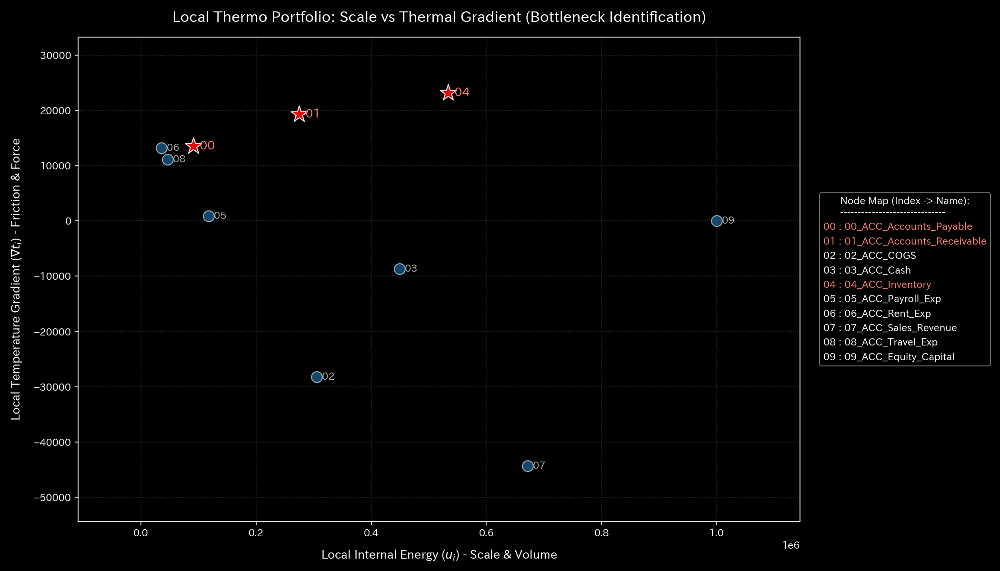

#### 🔴 Sample 2 (資金横領)

**臨床解説:**
横領期間中、預金口座およびバイパス流出先 (`UNKNOWN_LEAK`) の活動ボリューム（内部エネルギー）が上昇します。正常な回収流路から外れたバイパス接続部があります。その接続部との間で不連続な温度勾配が発生します。散布図上では、横領に関与するノード群が外れ値として特定されます。
* **3D 局所内部エネルギー:**
  * 
* **3D 局所温度勾配:**
  * 
* **局所熱勾配散布図:**
  * 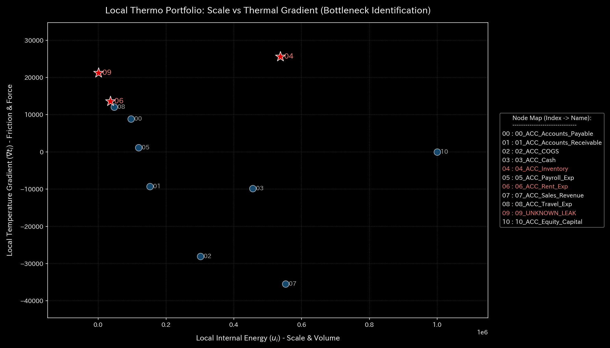

#### 🟡 Sample 3 (入力ミス)

**臨床解説:**
$t=1$ に片面入力エラーが発生します。貸借不一致を調整するための仮流量が生じます。これにより、該当勘定ノードに内部エネルギーと温度勾配のスパイクが発生します。翌ステップで修正されます。影響は局所的です。散布図では平均化されます。平穏な位置に留まります。
* **3D 局所内部エネルギー:**
  * 
* **3D 局所温度勾配:**
  * 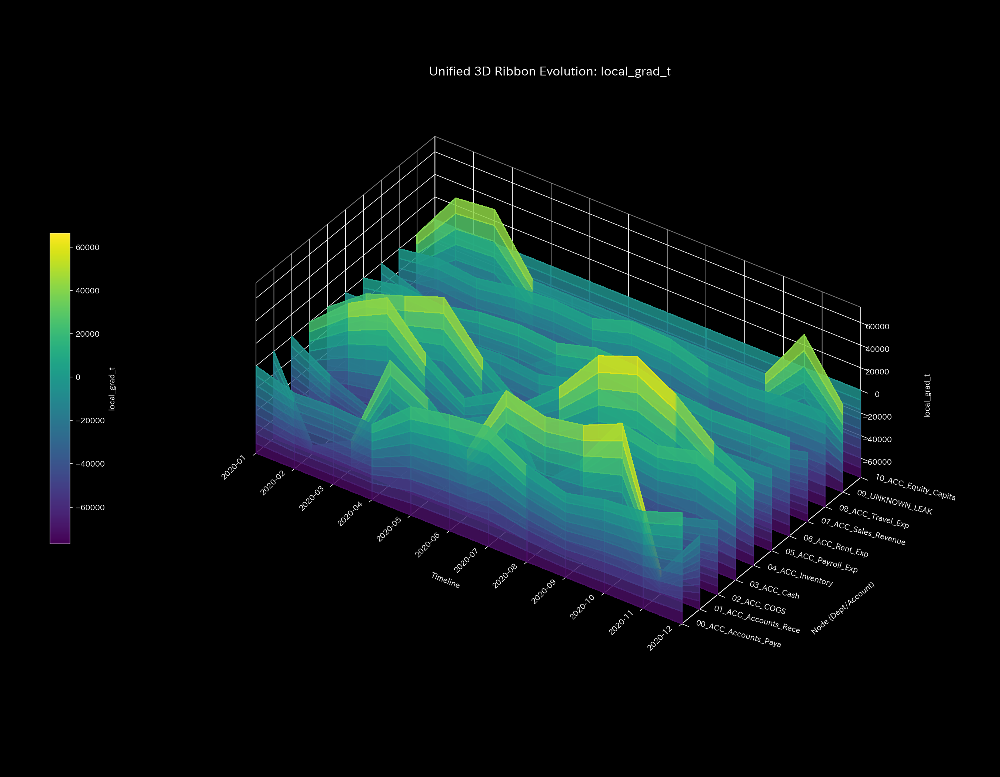
* **局所熱勾配散布図:**
  * 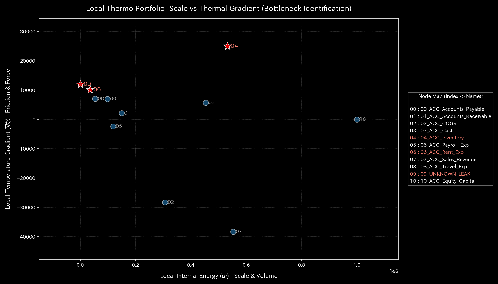

#### 🔴 Sample 4 (複合アノマリー)

**臨床解説:**
循環還流によるエネルギー増加が発生します。また、横領による漏洩流出が発生します。これらが別々の領域で並行します。複数の箇所でエネルギーと温度勾配のピークが発生します。散布図では複数のノード群が異なる方向へ外れ値として分裂プロットされます。多重アノマリーを示します。
* **3D 局所内部エネルギー:**
  * 
* **3D 局所温度勾配:**
  * 
* **局所熱勾配散布図:**
  * 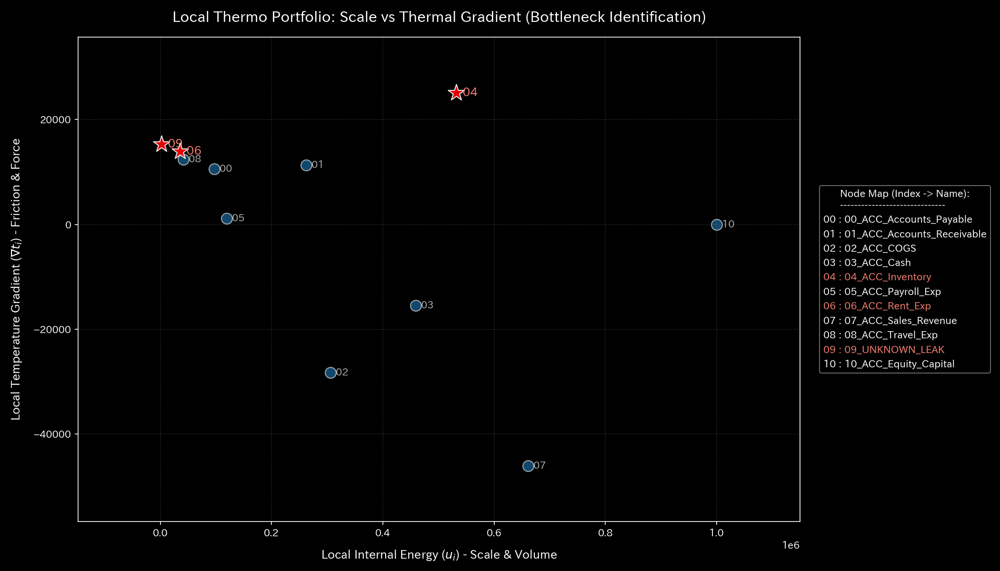

#### 🔴 Sample 5 (京都交差点網)

**臨床解説:**
`23_四条烏丸` 周辺がデッドロックでフリーズ（コールドスポット）します。その上流で車列が滞留する交差点（ホットスポット）があります。これらとの間で温度差（温度勾配）が発生します。散布図では、このボトルネック交差点が「高エネルギーかつ高勾配」の星印としてプロットされます。
* **3D 局所内部エネルギー:**
  * 
* **3D 局所温度勾配:**
  * 
* **局所熱勾配散布図:**
  * 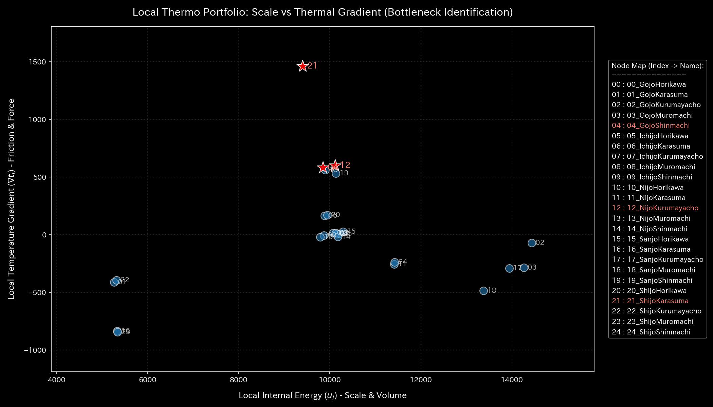

#### 🟢 Sample 6 (株券流体)

**臨床解説:**
USR間で対称的な循環取引が発生します。全体の内部エネルギーは高いレベルになります。エネルギーはUSR口座群へ均一に分散されます。そのため、空間的な温度差（勾配）は生じません。散布図上では、すべてのノードが「右下（高エネルギー・低勾配）」の領域に並びます。
* **3D 局所内部エネルギー:**
  * 
* **3D 局所温度勾配:**
  * 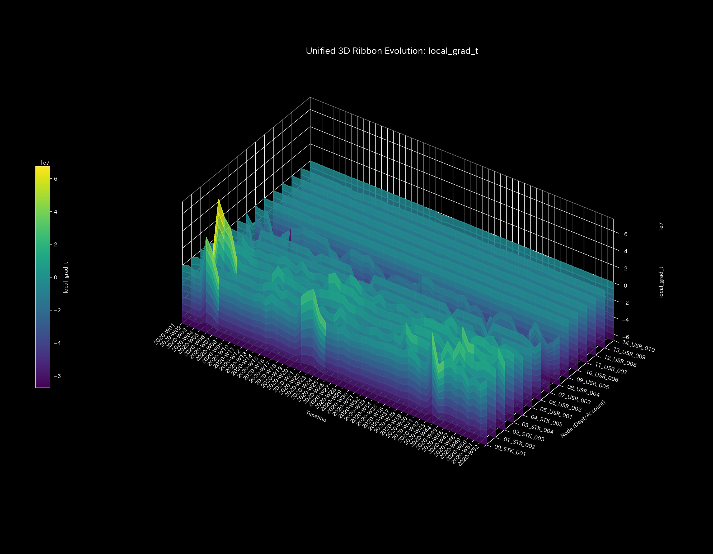
* **局所熱勾配散布図:**
  * 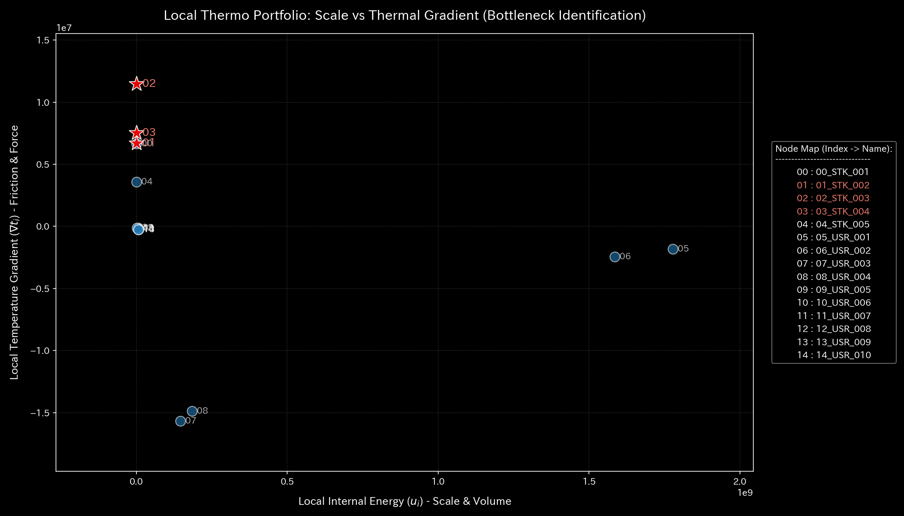

#### 🟢 Sample 7 (現金流体)

**臨床解説:**
一般ユーザー間の送送金・決済網です。エネルギーは全体に拡散しています。ボラティリティの偏りや断絶がないため、温度勾配は発生しません。散布図では、ノード群が低勾配かつ中程度のエネルギーの領域にクラスタを形成します。
* **3D 局所内部エネルギー:**
  * 
* **3D 局所温度勾配:**
  * 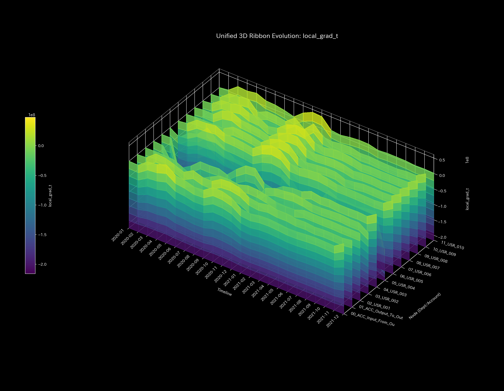
* **局所熱勾配散布図:**
  * 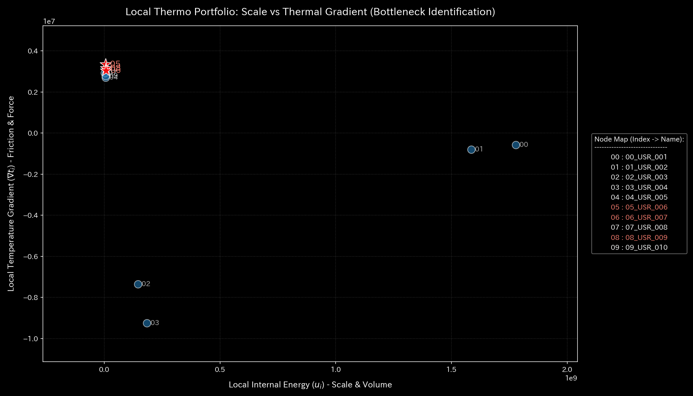

#### 🔴 Sample 8 (fMRI 脳梗塞)

**臨床解説:**
運動野領域が血流を失います。活動ボリューム（内部エネルギー）が低下し消失します。周辺の半影帯（ペナンブラ）では血流低下を代償するための過活動が生じます。壊死野と半影帯との境界があります。そこで温度勾配の壁が形成されます。散布図では、壊死野のノード群が低エネルギー方向へ配置されます。半影帯の境界ノード群は高勾配方向へ配置されます。
* **3D 局所内部エネルギー:**
  * 
* **3D 局所温度勾配:**
  * 
* **局所熱勾配散布図:**
  * 

#### 🔴 Sample 9 (fMRI てんかん発作)

**臨床解説:**
発作時に全脳過同期（過活動）が発生します。脳の全領域の活動流量（内部エネルギー）が上昇します。全脳が同じパターンで同期して過熱します。そのため、領域間の温度差（勾配）は消失します。散布図上では、すべてのノードが「高いエネルギーかつ低い勾配」の右下領域へフリーズ（同期束縛）されます。
* **3D 局所内部エネルギー:**
  * 
* **3D 局所温度勾配:**
  * 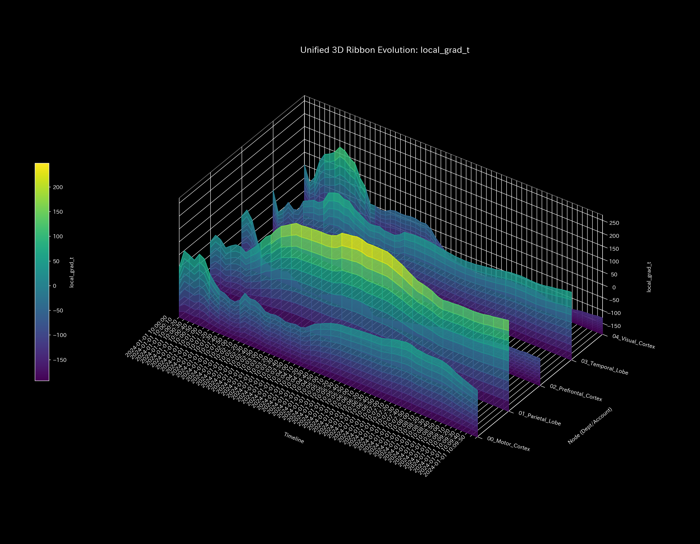
* **局所熱勾配散布図:**
  * 
