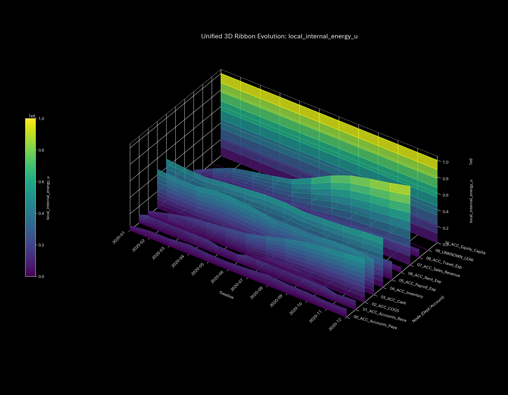
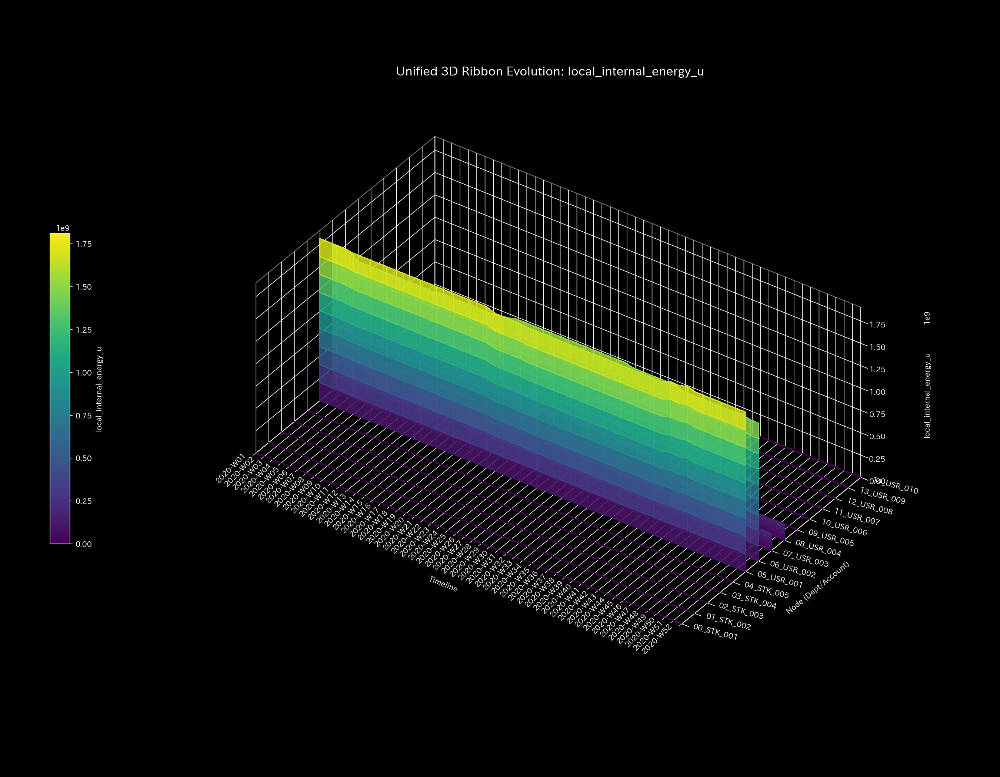
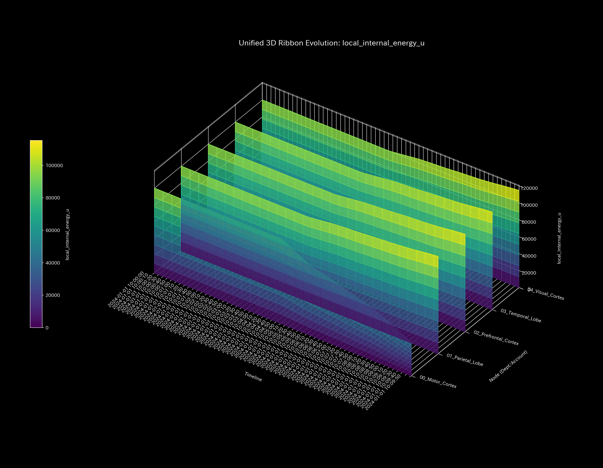

# 001_5. 局所内部エネルギー分析 (Local Internal Energy)

本ガイドは、Tensor-Link Utility (TLU) における「3次元局所内部エネルギー（`001_1_2_7__3d_local_internal_energy.png`）」について、各検証サンプルの出力と数値に基づく臨床解説を整理したものです。

---

## 🔬 物理数学理論：局所内部エネルギー $u_i$
TLUは、各ノード $i$ を通過する総流量（流入量と流出量の絶対値和）を「局所内部エネルギー $u_i$」と定義します。これは、ネットワークトポロジーにおけるノードの「**活動規模・ボリューム (Scale & Volume)**」を物理数学的に表現したものです。

$$u_i(t) = \sum_{j \in \text{neighbors}(i)} ( |F_{ji}(t)| + |F_{ij}(t)| )$$

ここで $F_{ij}(t)$ はノード $j$ からノード $i$ への有向流量です。システム全体の中で特定の経路や勘定、交差点に流量が集中すると、該当ノードの局所内部エネルギーが突出し、偏った「エネルギーの壁」を形成します。

---

## 📊 3次元局所内部エネルギーと個別サンプルの所見

各ノードごとの空間的流量規模（内部エネルギー）の時空間変化を示す3次元グラフです。

#### 🟢 Sample 0 (正常代謝)
**臨床解説:**
システム内の各領域に流量が均等に分散されており、特定のノードへの流量の異常集中や極端な過負荷は発生していません。エネルギーは平穏かつ適正な分布を維持しています。
- 

#### 🟡 Sample 1 (循環取引)
**臨床解説:**
循環取引の発生に伴い、往復還流の軸となる `ACC_Cash`、`ACC_Accounts_Receivable`、`ACC_Sales_Revenue` の3ノードに活動流量が集中し、他の一般経費口座などを圧倒する巨大なエネルギーの山（壁）が形成されます。
- 

#### 🔴 Sample 2 (資金横領)
**臨床解説:**
売掛金が正常回収されず、特定のバイパス口座 `UNKNOWN_LEAK` へと資金が一方通行で流出する期間中、漏洩元である預金口座および漏洩先ノードにエネルギーが偏在し、持続的な活動ボリュームの隆起として検出されます。
- 

#### 🟡 Sample 3 (入力ミス)
**臨床解説:**
片面入力エラーが生じた $t=1$ において、貸借不一致の整合性を保つための仮の調整流量が売掛金ノード周辺に発生するため、その瞬間だけ極めて高くて鋭い単一のエネルギーの塔が立ち上がりますが、翌ステップの修正とともに消失します。
- 

#### 🔴 Sample 4 (複合アノマリー)
**臨床解説:**
循環還流ループによるエネルギーの急上昇と、横領による漏洩流路のエネルギー偏在がネットワーク上の異なる領域で同時に発生します。これにより、複数の箇所でエネルギーの突出が並立し、重層的な流路歪みが可視化されます。
- 

#### 🔴 Sample 5 (京都交差点網)
**臨床解説:**
ボトルネックである `21_四条室町`・`23_四条烏丸` 周辺に車両の流入量および滞留が集中することにより、該当交差点ノード周辺の局所内部エネルギーが著しく上昇します。ネットワークのキャパシティ上限に達している領域が物理的に特定されます。
- 

#### 🟢 Sample 6 (株券流体)
**臨床解説:**
取引ボット群と少数の銘柄間で非常に高頻度かつ大ボリュームの対称取引が行われているため、システム全体の内部エネルギーは極めて高い水準にありますが、空間的にはボット口座群へ極めて平坦かつ対称的に分散されています。
- 

#### 🟢 Sample 7 (現金流体)
**臨床解説:**
一般ユーザー間の健全な送金・決済網。特定の還流ループや一部の滞留口座にエネルギーが偏在することなく、グラフ全体でなだらかな高活動エネルギーがネットワーク全体へ滑らかに拡散・維持されています。
- 

#### 🔴 Sample 8 (fMRI 脳梗塞)
**臨床解説:**
脳梗塞が発生する $t=30$ 以降、血流および活動が途絶した運動野領域の活動ポテンシャルが完全に消失します。この虚血壊死部位の局所内部エネルギーは絶対零度の平地のように不可逆に陥没（平坦化）し、活動の喪失範囲を明瞭に描き出します。
- 

#### 🔴 Sample 9 (fMRI てんかん発作)
**臨床解説:**
てんかん発作（過同期）の発生によって、全脳領域のBOLD信号活動が一斉に同調・暴走します。これにより、すべての領域のエネルギーが最高水準（全脳過活動状態）に押し上げられ、空間的なエネルギー差がほぼ完全に消失し、グラフ全体が高いレベルで一様に真っ平らにフリーズします。
- 
