# 002. 情報幾何学と相対保存則 (Information Geometry & Forensics)

本ガイドは、Tensor-Link Utility (TLU) における会計・物流フォレンジック監視モジュール（`002_2`）を説明します。各検証サンプルの出力と数値に基づく解説を記載します。

---

## 🔬 情報幾何学と質量保存則の理論

閉鎖型の実体ネットワークにおいては、キルヒホッフ of 第一法則（電流則＝質量保存則）が成立します。ノードに入力される総流量と流出する総流量の差分を「保存残差 (Conservation Residual)」または「相対漏洩率 (Relative Leak Ratio)」と定義します。

$$Residual_i = \sum Flux_{in} - \sum Flux_{out}$$

正常な会計記帳や物理的流通では、ダブルエントリー（借貸平均）の制約があります。この残差値は常に `0.00` となります。この値が正の値として長期にわたって検知された場合、質量（資金・車両）がシステム外へバイパス流出（簿外横領など）していることを証明します。

システムの状態確率分布の変位（構造変化の勢い）を、情報多様体上の距離尺度である「KLダイバージェンス（KL Divergence Drift）」として測定します。これにより、従来の統計Zスコア（Z-Score）が検知できない構造の断裂（相転移）を検知します。

---

## 📊 会計・物流フォレンジック監視グラフと個別サンプルの所見

### 2. マクロフォレンジック監視ダッシュボード (`002_2_1__macro_forensics_dashboard.png`)

キルヒホッフの第一法則に基づく「保存残差」の時系列変化を示す監査・フォレンジックダッシュボードです。

#### 🟢 Sample 0 (正常代謝)

**臨床解説:**
保存残差は全期を通じて `0.00` を維持します。システム外への漏洩はありません。構造ドリフト（KL）は、初期 $t=2$ に `1.61` となります。それ以外は低水準に落ち着きます。最終期 $t=11$ には `0.07` となります。統計 Z-Score は、取引集中期にあたる $t=6$ において状態 $Z_X$ が `4.14`、速度 $Z_v$ が `4.90` となりしきい値を超えます。残差やドリフトが上昇していないため、これは異常構造への相転移ではありません。正常な季節的ボラティリティの上昇を示します。

#### 🟡 Sample 1 (循環取引)

**臨床解説:**
還流取引（Wash Trade）のため、借方と貸方は一致します。システム外への資金漏洩を示す保存残差は全期を通じて `0.00` となります。統計 Z-Score は、状態 $Z_X$ が最大 `1.97`、速度 $Z_v$ が最大 `3.87` となりしきい値付近を推移します。顕著なアノマリーとしては検知されません。情報幾何指標の構造ドリフト（KL）は、還流経路が形成された初期段階（$t=2$）に `1.22` のピークを記録します。その後も取引パターンの歪みを捉え続けます。構造ドリフトが残差やZ-Scoreで検知できない還流取引を検知します。
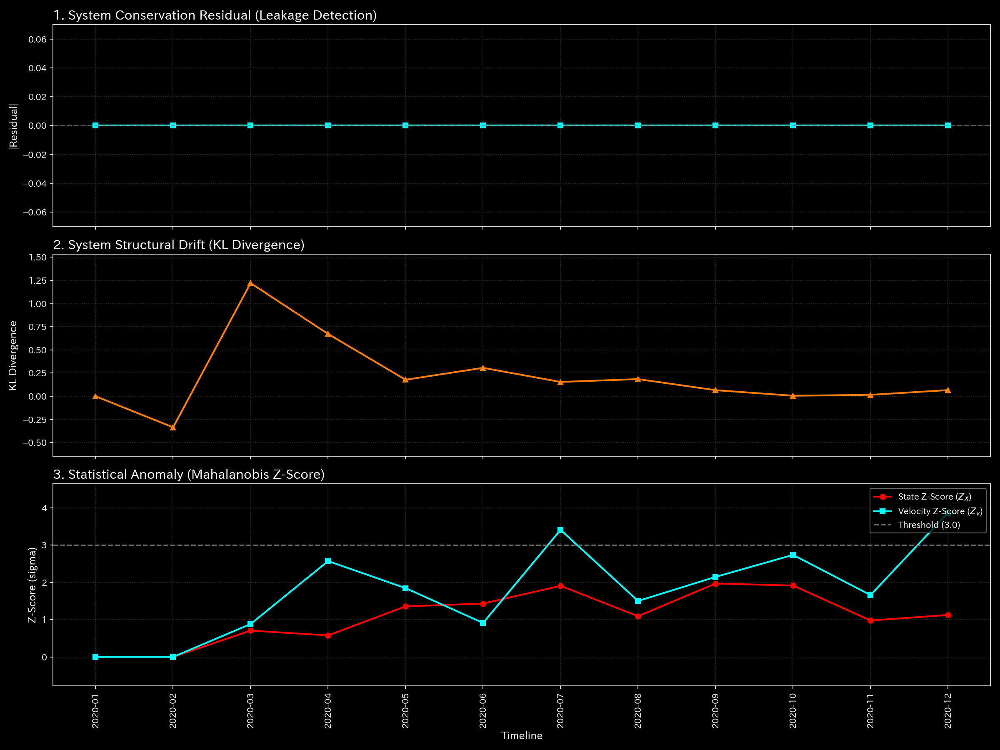

#### 🔴 Sample 2 (資金横領)

**臨床解説:**
`UNKNOWN_LEAK` への流出が始まった $t=1, 2$ に `307.30` から `359.73` の残差が検出されます。さらに $t=7, 8, 10$ にかけて最大 `364.53` に達する保存残差が記録されます。構造ドリフト（KL）は流出開始初期の $t=2$ に `1.18` まで上昇します。その後は流出パターンの固定化に伴い減衰します。統計 Z-Score は、初期 $t=6$ で最大値（$Z_X$=`3.82`, $Z_v$=`3.71`）となります。しかし、流出の当事期である $t=7$ や $t=8$ 以降は異常状態がベースラインとして学習されます。Z-Score は `0.65` から `1.00` 付近まで低下します。本サンプルでは、保存残差の追跡と初期の KL ドリフトが横領を検知します。

#### 🟡 Sample 3 (入力ミス)

**臨床解説:**
片面入力エラーが発生した $t=1, 2$（最大残差 `340.01`）および $t=10$（最大残差 `906.29`）において、保存残差がスパイクを形成します。エラーが手動修正されるため、翌ステップ（$t=3, 11$）には `0.00` に復帰します。構造ドリフト（KL）は初期エラー発生期（$t=2$）に `1.87` のスパイクを示します。統計 Z-Score も最大 `5.29` に上昇しますが、一過性で解消します。すべての指標が異常発生の瞬間のみ同期スパイクを見せ、次のステップで定常値に戻ります。この過渡的ダイナミクスは一過性の局所入力エラーとその後の自己修正を示します。
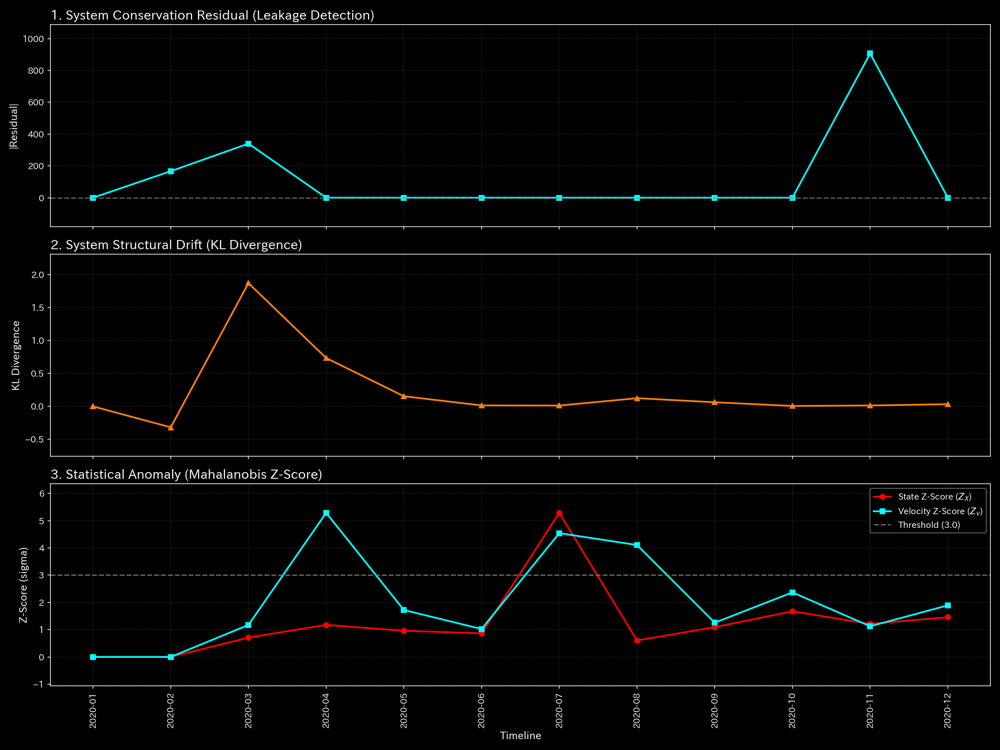

#### 🔴 Sample 4 (複合アノマリー)

**臨床解説:**
架空取引による同期駆動と簿外横領による資産消失が同時に進行します。横領の激化に伴い、$t=5$ から保存残差が発生します。$t=8$ には最大 `4,773.57` に達する残差スパイクが発生します。資金が外部へ流出している事実を示します。構造ドリフト（KL）は初期（$t=2$）に `1.59` となります。還流と漏洩による構造断裂を反映し、中盤以降も高水準で推移します。Z-Score は中盤 $t=6$ で速度 $Z_v$ が `3.42` となります。以降はモデル学習の汚染が進むため、最盛期の $t=8$ 以降も `1.52` 以下に沈黙します。保存残差と KL ドリフトの双方が機能し、この複合破綻の全容を示します。
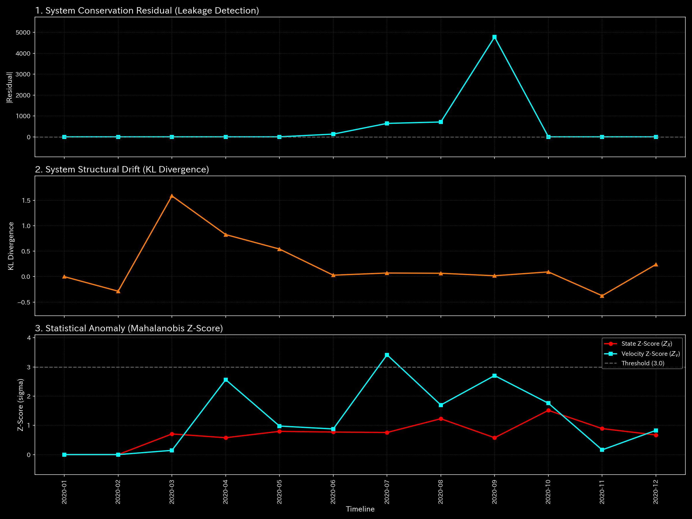

#### 🔴 Sample 5 (京都交差点網)

**臨床解説:**
車両が交差点内に滞留・固着しているため、保存残差は全期を通じて `0.00` となります。渋滞の相転移点となる $t=12$ において、構造ドリフト（KL）が `1.76`、統計 Z-Score が状態 $Z_X$=`7.25`、速度 $Z_v$=`9.86` を記録します。フリーズ状態に移行した $t=23$ には、車両の動きが消失するためボラティリティがゼロになります。統計 Z-Score は状態 $Z_X$=`0.62`、速度 $Z_v$=`0.43` へと低下します。この状態において、構造ドリフト（KL）のみが、主要交差点へのエッジの凝固と周辺の干上がりというトポロジーの偏在状態（フリーズ）を検出します。

#### 🔴 Sample 8 (fMRI 脳梗塞)

**臨床解説:**
虚血により運動野への流入・流出血液量が断裂されます。血液が脳外へ消失したわけではないため、保存残差は `0.00` となります。梗塞が発生した $t=30$ に、血液量の変化から速度 Z-Score ($Z_v$) が `51.44` のスパイクを示します。状態 Z-Score ($Z_X$) は最大でも `0.06` となり沈黙します。$t=30$ 以降、機能が停止した運動野は変動を失います。速度 $Z_v$ も平坦化して正常しきい値内に戻ります。構造ドリフト（KL）は、梗塞発生の $t=30$ に `1.29` へ上昇します。機能的結合の切断を反映し、最終期 $t=59$ に至るまで `0.54` 以上の高水準を維持します。構造ドリフトが脳組織の壊死と機能的切断の固定化を特定します。
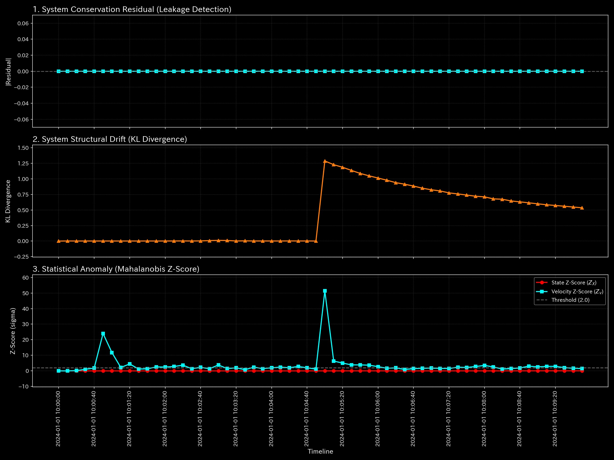

#### 🔴 Sample 9 (fMRI てんかん発作)

**臨床解説:**
全脳が過同期放電で自励振動します。総信号質量は脳内に留まるため、保存残差は全期を通じて `0.00` のままです。発作が開始する $t=30$ に、構造ドリフト（KL）は `1.33` へ上昇します。過同期のピークである $t=38$ に最大値 `1.77` に達します。脳全域のトポロジー変化を検知します。対照的に、状態 Z-Score ($Z_X$) は最大 `0.0001` となり反応しません。速度 Z-Score ($Z_v$) も発作期（$t \ge 30$）には `1.3` 前後に留まります。てんかん時のBOLD信号が規則的なサイン波に固着してブレが消えるため、統計モデルが定常状態と判定します。本サンプルは、統計アノマリー検出が検出できない過同期バーストを構造ドリフト（KL）が検知することを示します。
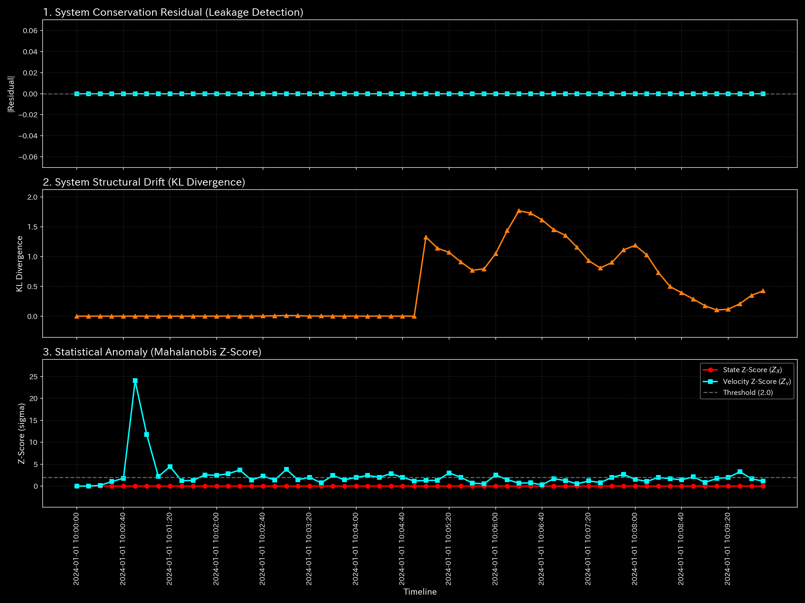

### 3. 3次元局所KL Drift (`002_2_2_1__3d_micro_kl_drift.png`)

情報多様体上における状態確率分布の変位（KLダイバージェンス）の時間・空間推移を示す3次元グラフです。構造変化の勢いを示します。

#### 🟢 Sample 0 (正常代謝)

**臨床解説:**
KL Drift の時空間分布はスパイクを見せることなく、全期を通じて低水準で推移しています。

#### 🟡 Sample 1 (循環取引)

**臨床解説:**
循環取引が発生するタイムステップ（1月、2月、5月）において、対象の還流ノードに変位が立ち上がります。

#### 🔴 Sample 2 (資金横領)

**臨床解説:**
横領の開始以降、`UNKNOWN_LEAK` と関連預金口座の周辺において、時間軸に沿って情報空間の変位が形成されます。
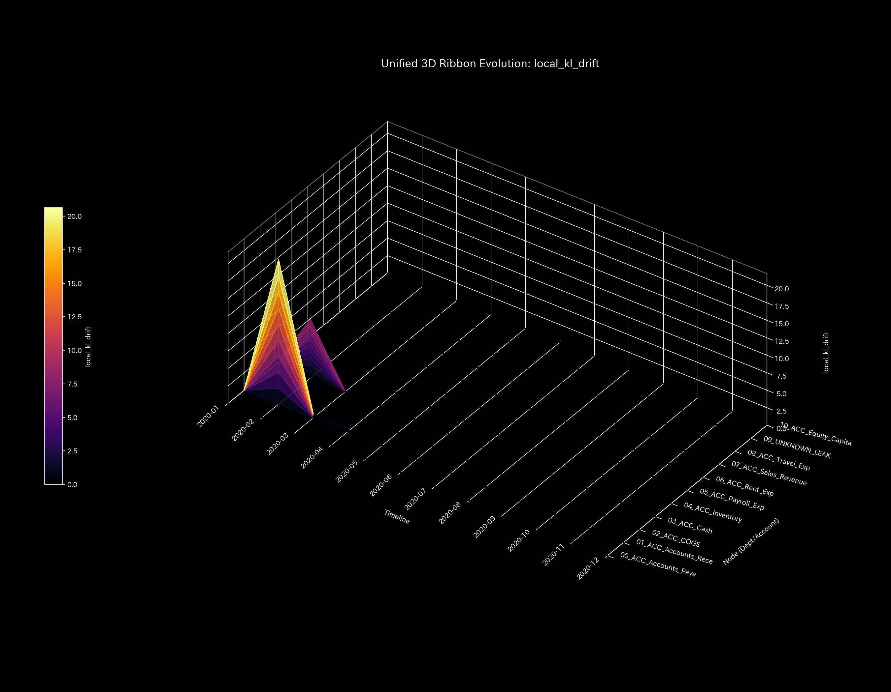

#### 🟡 Sample 3 (入力ミス)

**臨床解説:**
片面入力エラーが発生した $t=1$（2020-02）の瞬間、`Accounts_Receivable` に `20.68`、`Cash` に `5.01` のスパイクが発生します。
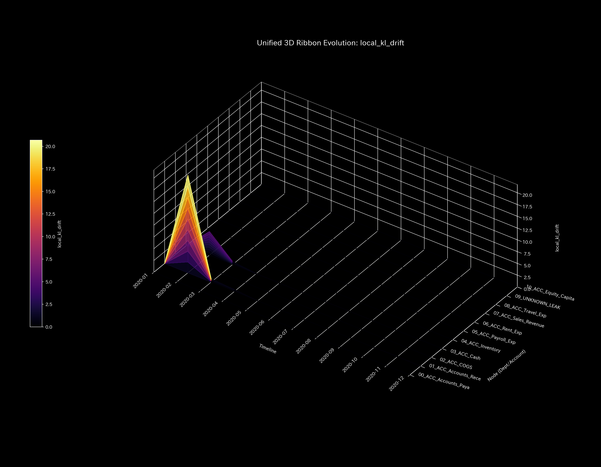

#### 🔴 Sample 4 (複合アノマリー)

**臨床解説:**
架空取引による同期駆動と横領による漏洩流路の双方から、時空間の変位が形成されます。

#### 🔴 Sample 5 (京都交差点網)

**臨床解説:**
渋滞デッドロックが発生します。ボトルネックである四条烏丸の座標に、時間軸に沿って KL Drift のスパイクが形成されます。

#### 🟢 Sample 6 (株券流体)

**臨床解説:**
KL Drift の時空間分布はスパイクを見せることなく、全期を通じて低水準で推移しています。

#### 🟢 Sample 7 (現金流体)

**臨床解説:**
KL Drift プロットには時間軸に沿って屹立するような変位はなく、安定した状態を維持しています。
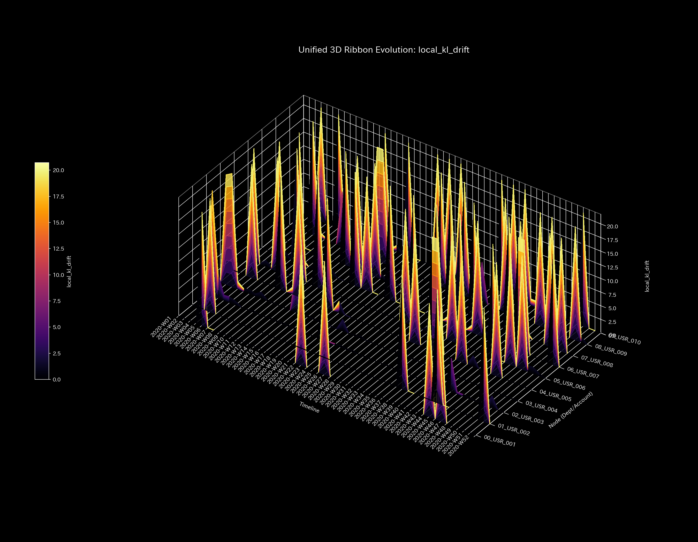

#### 🔴 Sample 8 (fMRI 脳梗塞)

**臨床解説:**
脳梗塞が $t=30$ に発生します。運動野（`Motor_Cortex`）の座標を中心に、情報多様体上に KL Drift の変位が発生し、壊死領域を特定します。

#### 🔴 Sample 9 (fMRI てんかん発作)

**臨床解説:**
てんかんバーストが発生します。側頭葉から脳全域へ向かって過同期の変位が波及します。全脳がハックされた状態を捉えています。
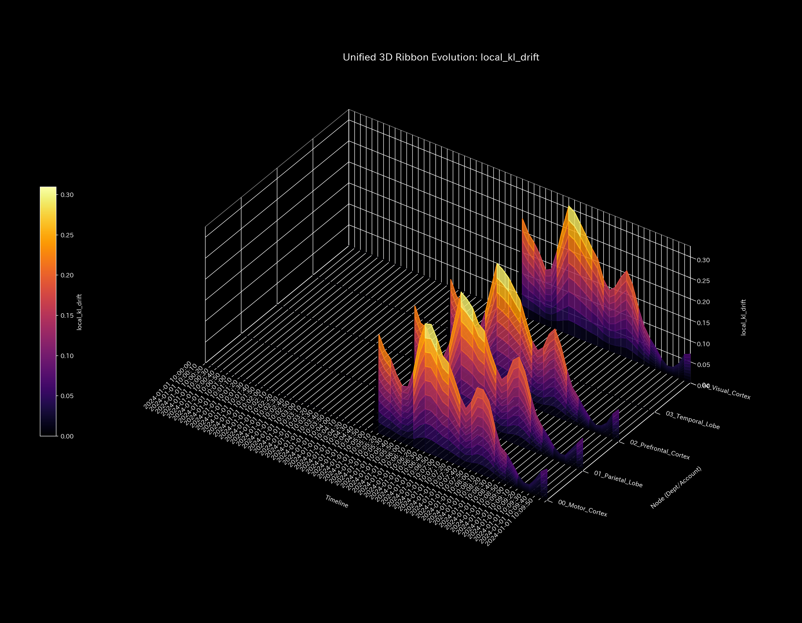

### 4. 3次元局所Z-Score (`002_2_2_2__3d_micro_z_score_X.png`)

統計モデルに基づく、各ノードごとの Z-Score の時間・空間推移を示す3次元グラフです。KL Drift との対比に使用します。

#### 🟢 Sample 0 (正常代謝)

**臨床解説:**
季節変動の取引集中期（7月）に、一時的な Z-Score の上昇（最大 `4.14`）が発生します。残差や剛性の異常はなく正常です。

#### 🟡 Sample 1 (循環取引)

**臨床解説:**
循環取引により Z-Score がアノマリー期に最大 `3.87` まで上昇します。後半は還流がベースラインとして学習されます。Z-Score が低下する現象が観察されます。
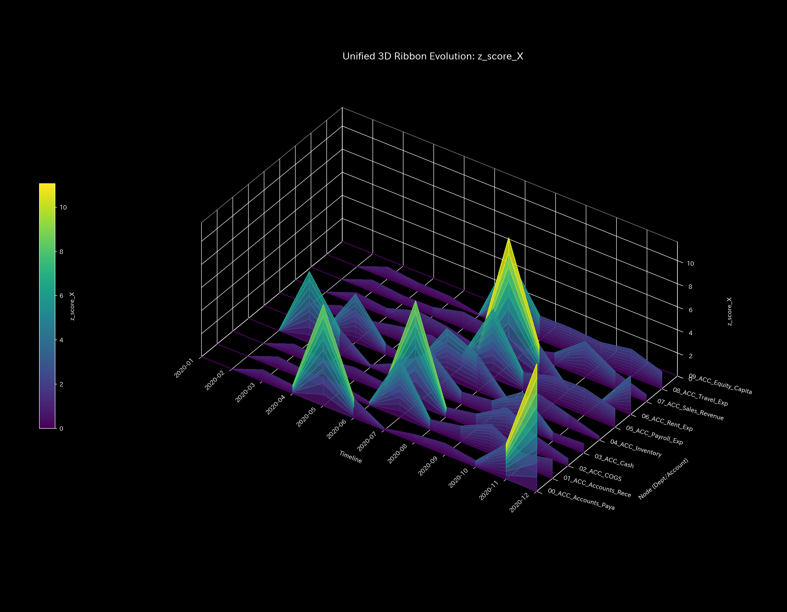

#### 🔴 Sample 2 (資金横領)

**臨床解説:**
流出の開始初期に一時的な Z-Score の上昇（`3.82`）が発生します。漏洩が常態化すると Z-Score は低下し沈黙します。情報幾何指標との併用が必要です。

#### 🟡 Sample 3 (入力ミス)

**臨床解説:**
入力ミスが発生した瞬間に、該当勘定の Z-Score が `5.29` まで上昇します。翌期には消滅します。
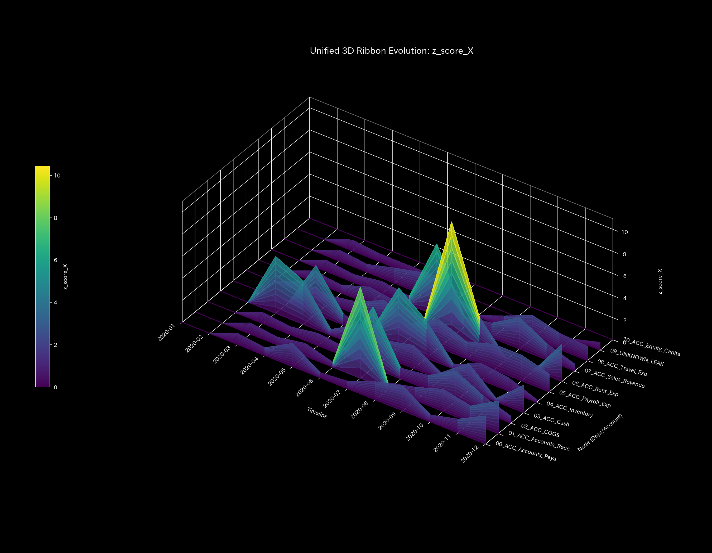

#### 🔴 Sample 4 (複合アノマリー)

**臨床解説:**
循環取引の同期月には最大 `3.42` の Z-Score 上昇を検知します。横領による資金枯渇と混ざり合うことで、ベースライン学習が進み警告が沈黙しやすくなります。

#### 🔴 Sample 5 (京都交差点網)

**臨床解説:**
デッドロック状態に移行した後は、車両が停止して動きません。時間的な変動（ボラティリティ）がなくなります。Z-Score は `0.00` へと平坦化します。

#### 🟢 Sample 6 (株券流体)

**臨床解説:**
期間を通じて Z-Score の過度な上昇はありません。モデル汚染による低下現象も確認されません。定常状態を維持しています。

#### 🟢 Sample 7 (現金流体)

**臨床解説:**
Z-Score のスパイクや低下による沈黙アノマリーは検出されません。統計的にも平穏に推移しています。

#### 🔴 Sample 8 (fMRI 脳梗塞)

**臨床解説:**
脳梗塞が $t=30$ に発生します。血液減少時に変動を検知して Z-Score が `0.07` に上昇します。その後は活動停止状態（無変動）となるため、Z-Score は沈黙します。

#### 🔴 Sample 9 (fMRI てんかん発作)

**臨床解説:**
てんかん発作発生時に Z-Score は沈黙します。変動が規則的なサイン波に固着してボラティリティが一定になるためです。統計モデルの死角を示しています。
しています。さらに $t=30$ 以降、機能が停止した運動野は変動を失うため、速度 $Z_v$ も速やかに平坦化して正常しきい値内へ沈黙します。しかし、構造ドリフト（KL）のみは梗塞発生の $t=30$ に `1.29` へ急上昇した後、機能的結合の不可逆な切断を反映し、最終期 $t=59$ に至るまで `0.54` 以上の高水準に高止まりし続けます。Z-Score の一過性の反応と永続的な沈黙の裏で、構造ドリフトが「脳組織の壊死と機能的切断の固定化」を時間軸上で正確に特定しています。

#### 🔴 Sample 9 (fMRI てんかん発作)

**臨床解説:**
全脳が過同期放電で激しく自励振動しているものの、総信号質量は脳内に留まるため、保存残差は全期を通じて `0.00` のままです。発作（同調バースト）が開始する $t=30$ に構造ドリフト（KL）は `1.33` へ跳ね上がり、過同期のピークである $t=38$ に最大値 `1.77` に達し、脳全域がハックされていくトポロジー崩壊を持続的に検知します。対照的に、状態 Z-Score ($Z_X$) は最大 `0.0001` と完全に無反応であり、速度 Z-Score ($Z_v$) も発作期（$t \ge 30$）には `1.3` 前後にとどまっており、伝統的なボラティリティ監視手法は全く反応していません。これは、てんかん時のBOLD信号が極めて規則的なサイン波に固着してブレが消えるため、伝統的な統計モデルが「定常的で極めて静穏な状態」と誤認する致命的な死角によるものです。本サンプルは、伝統的な統計アノマリー検出が完全に無力化する中、構造ドリフト（KL）のみが過同期バーストを鋭敏かつ持続的に看破できることを示しています。

### 3. 3次元局所KL Drift (`002_2_2_1__3d_micro_kl_drift.png`)

情報多様体上における状態確率分布の変位（KLダイバージェンス）の時間・空間（各ノード）推移を示す3次元グラフです。構造変化の勢いを捉えます。

#### 🟢 Sample 0 (正常代謝)

**臨床解説:**
KL Drift の時空間分布は、極端な突起（スパイク）を見せることなく、全期を通じて低水準で平穏に推移しています。

#### 🟡 Sample 1 (循環取引)

**臨床解説:**
循環取引が激化するタイムステップ（1月、2月、5月）において、対象の還流ノードに沿って情報幾何学的な「変位の盛り上がり」が立ち上がっています。

#### 🔴 Sample 2 (資金横領)

**臨床解説:**
横領の開始以降、`UNKNOWN_LEAK` と関連預金口座の周辺において、時間軸に沿って不可逆的に高まる巨大な「情報空間の絶壁」が形成されています。

#### 🟡 Sample 3 (入力ミス)

**臨床解説:**
片面入力エラーが生じた $t=1$（2020-02）の瞬間、`Accounts_Receivable` に **`20.68`**、`Cash` に **`5.01`** に達する極めて鋭い「針状の単一スパイク」が屹立しています。

#### 🔴 Sample 4 (複合アノマリー)

**臨床解説:**
架空取引による同期駆動と横領による漏洩流路の双方から、時間的・空間的に屹立する巨大な「情報幾何学的城壁」が形成されています。

#### 🔴 Sample 5 (京都交差点網)

**臨床解説:**
渋滞デッドロック（$t=51$）の発生の瞬間、ボトルネックである四条烏丸の座標に、時間軸に沿って急激に直立する巨大な「KL Drift のスパイクの壁」がそびえ立ちます。

#### 🟢 Sample 6 (株券流体)

**臨床解説:**
情報幾何指標（KL Drift）の時空間分布は、極端な突起（幾何学的スパイク）を見せることなく、全期を通じて低水準で平穏に推移しています。

#### 🟢 Sample 7 (現金流体)

**臨床解説:**
KL Drift プロットには時間軸に沿って屹立するような鋭い変位の壁はなく、情報多様体全体が平穏で安定した状態を維持しています。

#### 🔴 Sample 8 (fMRI 脳梗塞)

**臨床解説:**
梗塞（$t=30$）の発生の瞬間、運動野（`Motor_Cortex`）の座標を中心に、情報多様体上を突き刺すような巨大な「KL Drift の崖」が直立し、壊死領域を特定します。

#### 🔴 Sample 9 (fMRI てんかん発作)

**臨床解説:**
てんかんバーストの発生とともに、側頭葉から脳全域へ向かって情報幾何学的な「過同期の津波（巨大な変位の壁）」が波及し、全脳がハックされた様子を捉えています。

### 4. 3次元局所Z-Score (`002_2_2_2__3d_micro_z_score_X.png`)

伝統的な統計モデルに基づく、各ノードごとの Z-Score の時間・空間推移を示す3次元グラフです。情報幾何指標（KL Drift）との対比に使用します。

#### 🟢 Sample 0 (正常代謝)

**臨床解説:**
季節変動の取引集中期（7月）に、一時的な Z-Score の盛り上がり（最大 `4.14`）が見られますが、残差や剛性の異常はなく正常です。

#### 🟡 Sample 1 (循環取引)

**臨床解説:**
循環取引により売掛金や出来高 Z-Score がアノマリー期に最大 `3.87` まで上昇しますが、後半は病的還流がベースラインとして学習され、Z-Score が平坦化する「茹でガエル現象」が観察されます。

#### 🔴 Sample 2 (資金横領)

**臨床解説:**
流出の開始初期に一時的な Z-Score の盛り上がり（`3.82`）が生じますが、漏洩が常態化すると Z-Score は平坦化し沈黙するため、情報幾何指標との併用が必須となります。

#### 🟡 Sample 3 (入力ミス)

**臨床解説:**
入力ミスが生じた瞬間に、該当の売掛金・現金勘定の Z-Score が **`5.29`** まで急峻な槍状に跳ね上がりますが、翌期には速やかに完全に消滅します。

#### 🔴 Sample 4 (複合アノマリー)

**臨床解説:**
循環取引の超同期月には最大 `3.42` の Z-Score 上昇を検知しますが、横領による資金枯渇と混ざり合うことで、ベースライン学習が進み警告が沈黙しがちになります。

#### 🔴 Sample 5 (京都交差点網)

**臨床解説:**
完全なデッドロック状態に移行した後は、車両が完全に停止して動かないため、時間的な変動（ボラティリティ）がなくなり、Z-Score は **`0.00`** へと完全に平坦化（沈黙）します。

#### 🟢 Sample 6 (株券流体)

**臨床解説:**
期間を通じて流動性 Z-Score の過度な上昇はなく、モデル汚染による茹でガエル現象も確認されず、健全な定常状態を維持しています。

#### 🟢 Sample 7 (現金流体)

**臨床解説:**
口座周辺の Z-Score スパイクやベースライン汚染による沈黙アノマリーは検出されず、統計的にも平穏に推移しています。

#### 🔴 Sample 8 (fMRI 脳梗塞)

**臨床解説:**
梗塞（$t=30$）が起きた直後の血液減少時に、わずかな変動を検知して極小の Z-Score（`0.07`）が立ち上がりますが、その後は活動停止状態（無変動）となるため、Z-Score は完全に沈黙します。

#### 🔴 Sample 9 (fMRI てんかん発作)

**臨床解説:**
てんかん発作発生時に Z-Score は一時的に沈黙（変動が極めて規則的なサイン波に固着してボラティリティが一定になるため）する、統計モデル特有の致命的な死角を示しています。

