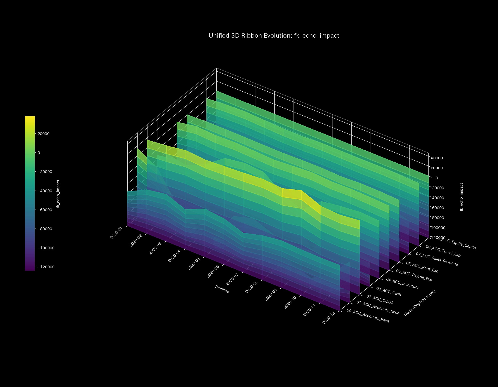
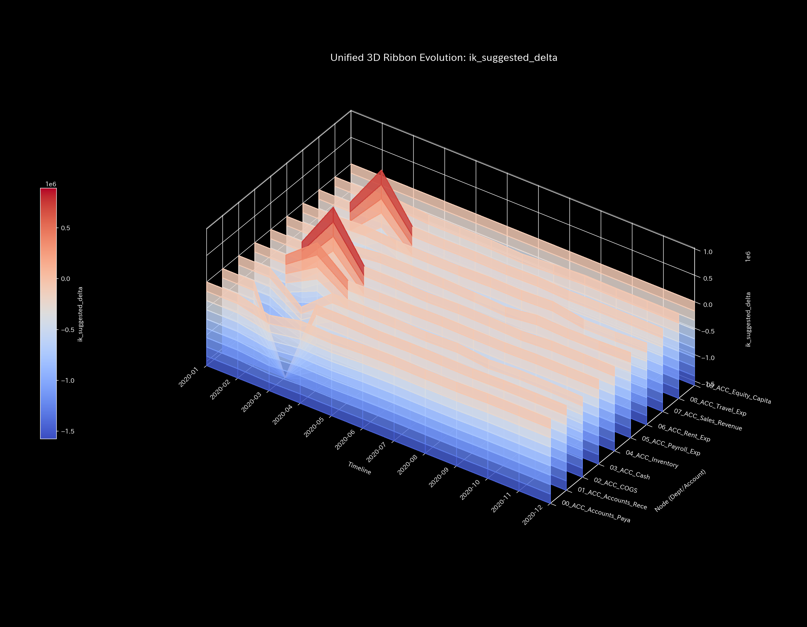
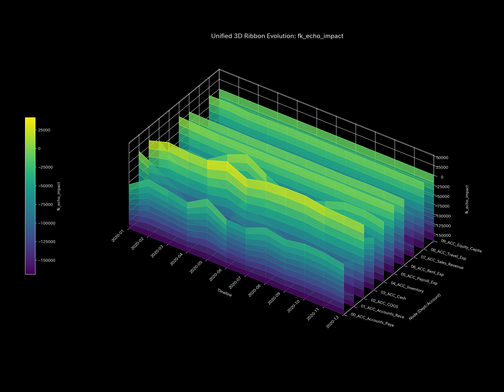
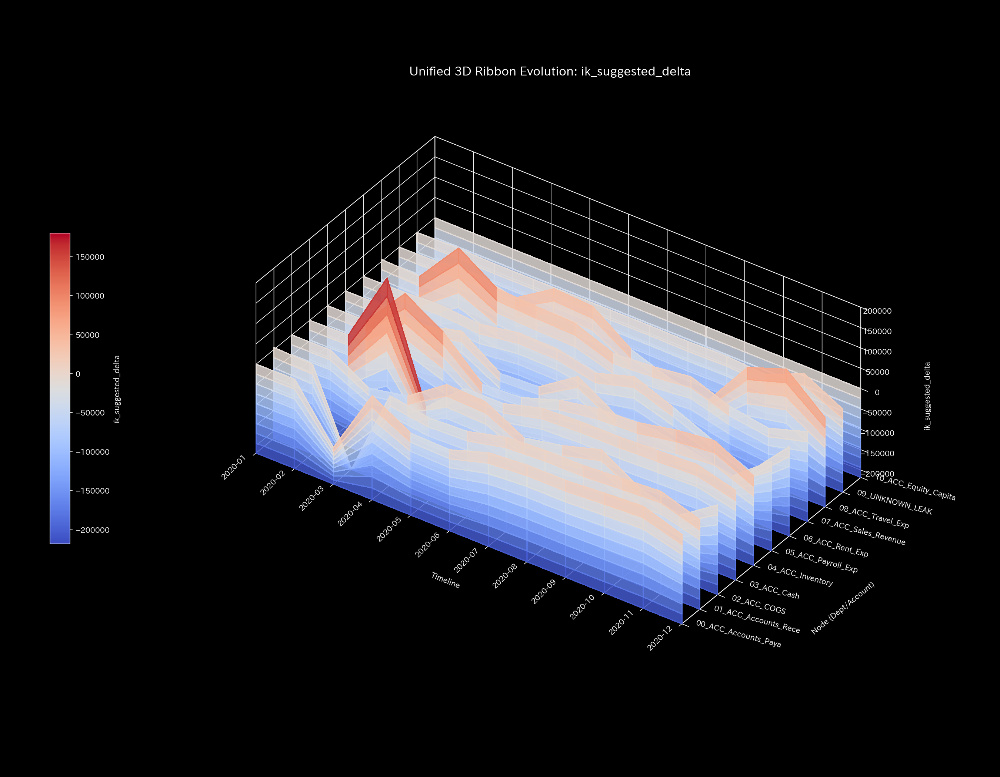
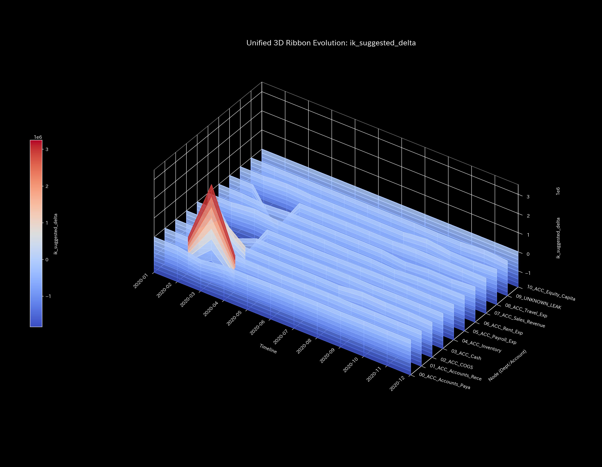
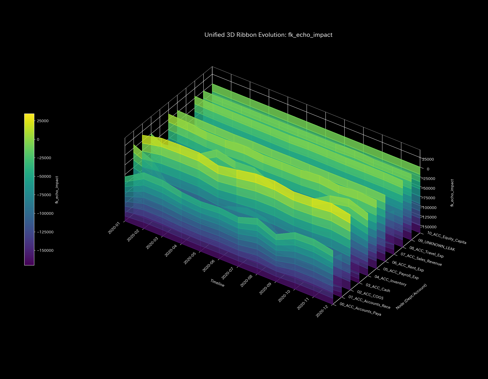
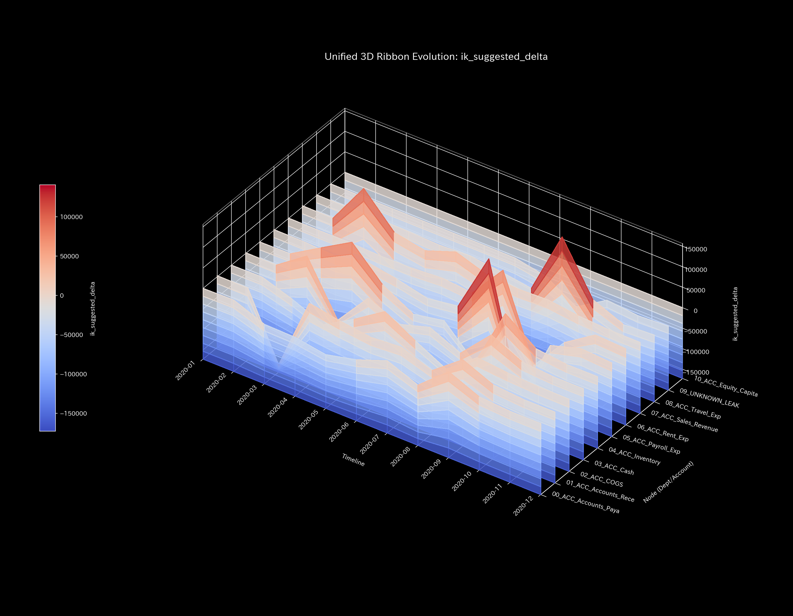
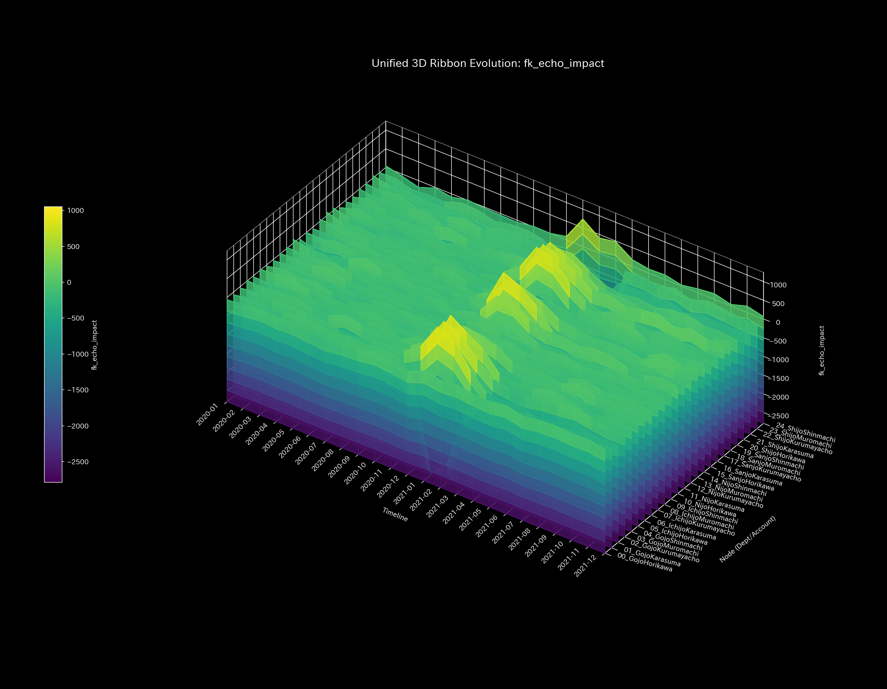
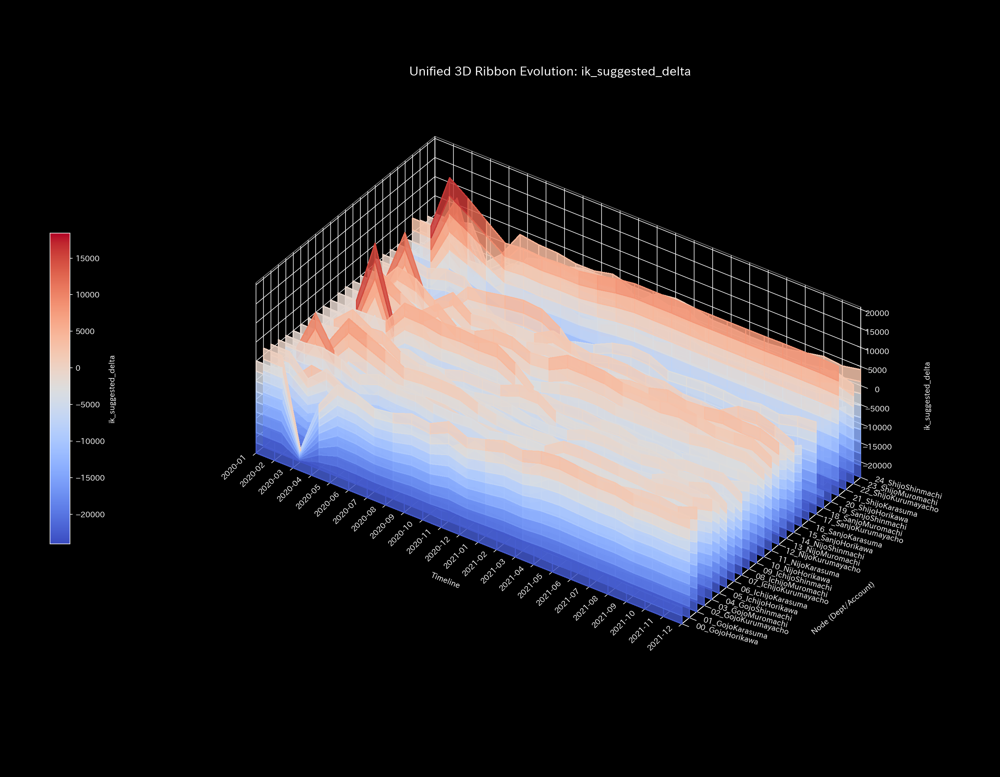
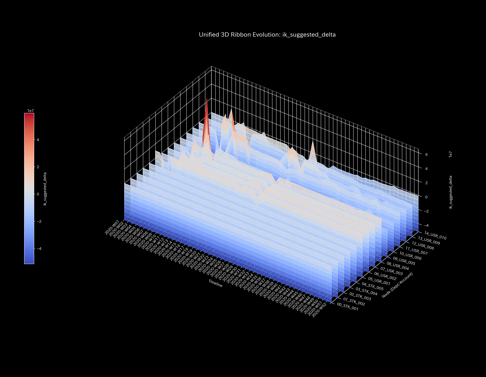

# 📊 ロボット運動学と目標到達性 (Kinematics & Reachability)

## 🔬 ロボット運動学モデルの物理数学理論

TLUは、経営目標（KPI）やネットワークの制御ターゲットを多関節ロボットアームの「エンド・エフェクター（手先位置）」としてマッピングします。各部門や各口座の稼働ポテンシャルを「アームの関節角度（ジョイント）」としてモデル化します。

順運動学（Forward Kinematics: FK）によって現在の構造から到達可能なパフォーマンス空間を計算します。設定された目標に対して「逆運動学 (Inverse Kinematics: IK)」を解きます。これにより、必要な関節ベクトル（各部門の負荷配分）を逆算します。

$$Target\_KPI = FK(Joint\_Angles)$$
$$Joint\_Angles_{required} = IK(Target\_KPI)$$

アームの幾何学的限界（特異点や可動域限界）によりIKが解けない場合があります。または到達誤差（Reachability Error）が上昇する場合があります。この場合、現在の構造を変更しない限り、目標は到達不可能です。

---

## 📊 各検証サンプルの運動学シミュレーション結果

本セクションでは、全10の検証サンプルについて、順運動学（FK）の到達ポテンシャル空間（`003_1_1__3d_kinematics_fk.png`）および逆運動学（IK）の軌道リボン（`003_1_2__3d_kinematics_ik.png`）の解析結果を併記します。物理数学特性を解説します。

### 🟢 Sample 0 (正常代謝: Healthy)

* **順運動学 (FK) 到達ポテンシャル空間 (`003_1_1__3d_kinematics_fk.png`)**
  * **臨床解説:** 到達ポテンシャル空間は広く対称的です。なだらかに球状に広がっています。目標変更に対しても十分な可動マージンを確保しています。
  * 

* **逆運動学 (IK) 軌道リボン (`003_1_2__3d_kinematics_ik.png`)**
  * **臨床解説:** ジョイント軌跡リボンは滑らかです。特異点を踏むことなく接続解を算出しています。歪みエネルギーは低水準です。目標は達成可能です。
  * 

---

### 🟡 Sample 1 (循環取引: Wash Trade)

* **順運動学 (FK) 到達ポテンシャル空間 (`003_1_1__3d_kinematics_fk.png`)**
  * **臨床解説:** 到達空間の広がりは正常代謝と大差ありません。還流経路が形成されています。特定のノードへ出力容量が偏在しています。
  * 

* **逆運動学 (IK) 軌道リボン (`003_1_2__3d_kinematics_ik.png`)**
  * **臨床解説:** 還流同期を維持するため、関節へねじれが発生します。アノマリー期に歪みエネルギーが上昇します。辻褄合わせの限界を捉えています。
  * 

---

### 🔴 Sample 2 (資金横領: Embezzlement Leak)

* **順運動学 (FK) 到達ポテンシャル空間 (`003_1_1__3d_kinematics_fk.png`)**
  * **臨床解説:** 外部バイパスへの流出が発生しています。ノード剛性が低下しています。アームの出力容量が失われています。到達ポテンシャル空間は非対称に陥没しています。
  * 

* **逆運動学 (IK) 軌道リボン (`003_1_2__3d_kinematics_ik.png`)**
  * **臨床解説:** 資金の枯渇や偏在が発生します。目標KPIへの到達の過程で、後半期に歪みエネルギーが上昇します。特異点へ向けたアプローチが生じています。
  * 

---

### 🟡 Sample 3 (入力ミス: Unbalanced Mistake)

* **順運動学 (FK) 到達ポテンシャル空間 (`003_1_1__3d_kinematics_fk.png`)**
  * **臨床解説:** 片面記帳ミスが発生します。一時的にアーム関節の不連続が生じています。到達空間に幾何学的歪みが発生しています。この歪みは修正により翌期には解消します。
  * 

* **逆運動学 (IK) 軌道リボン (`003_1_2__3d_kinematics_ik.png`)**
  * **臨床解説:** 記帳ミスが発生したステップのみ、歪みエネルギーにスパイクが立ち上がります。修正後は正常復帰します。一過性の局所応力と自己修復を示します。
  * 

---

### 🔴 Sample 4 (複合アノマリー: Composite Chaos)

* **順運動学 (FK) 到達ポテンシャル空間 (`003_1_1__3d_kinematics_fk.png`)**
  * **臨床解説:** 循環取引の還流同期と資金横領の漏洩が重なっています。到達空間には非対称な陥没と歪みが発生しています。エンベロープは崩壊しています。
  * 

* **逆運動学 (IK) 軌道リボン (`003_1_2__3d_kinematics_ik.png`)**
  * **臨床解説:** 還流の維持と簿外流出の二重の負荷が関節にかかります。中盤以降に歪みエネルギーが上昇します。特異点への吸い込みが発生し、目標不達です。
  * 

---

### 🔴 Sample 5 (京都交差点網: Kyoto Traffic)

* **順運動学 (FK) 到達ポテンシャル空間 (`003_1_1__3d_kinematics_fk.png`)**
  * **臨床解説:** 渋滞がデッドロック化するにつれて、到達空間が急激に縮退します。最終的にはエンベロープが針状に潰れます。これはアームの可動域をほぼ完全に喪失した状態です。
  * 

* **逆運動学 (IK) 軌道リボン (`003_1_2__3d_kinematics_ik.png`)**
  * **臨床解説:** 主要交差点の容量飽和（特異点）により、軌道リボンが平坦に潰れます。関節の自由度を完全に喪失しています。歪みエネルギーが高騰し続け、目標不達を証明します。
  * 

---

### 🟢 Sample 6 (株券流体: Market Stock Flow)

* **順運動学 (FK) 到達ポテンシャル空間 (`003_1_1__3d_kinematics_fk.png`)**
  * **臨床解説:** 共謀USR口座による出来高の異常膨張が発生しています。到達空間は、特定の銘柄ノード方向へ極端に引き伸ばされています。非常に非対称な形状を示します。
  * 

* **逆運動学 (IK) 軌道リボン (`003_1_2__3d_kinematics_ik.png`)**
  * **臨床解説:** 共謀取引による流動性の不自然な固定化が発生しています。初期に歪みエネルギーが天文学的数値にスパイクします。これにより、市場の自由な流量配分が著しく阻害されています。
  * 

---

### 🟢 Sample 7 (現金流体: Market Cash Flow)

* **順運動学 (FK) 到達ポテンシャル空間 (`003_1_1__3d_kinematics_fk.png`)**
  * **臨床解説:** 口座間取引による流動性の抱え込みが発生しています。到達空間には「局所ポケット構造」が形成されます。この拘束口座周辺でのみエコーが還流します。
  * 

* **逆運動学 (IK) 軌道リボン (`003_1_2__3d_kinematics_ik.png`)**
  * **臨床解説:** 口座間取引による流動性の抱え込みが発生しています。特定期間に歪みエネルギーが上昇します。関節剛性が歪み、決済網全体の効率的な目標配分が妨げられています。
  * 

---

### 🔴 Sample 8 (fMRI 脳梗塞: fMRI Stroke)

* **順運動学 (FK) 到達ポテンシャル空間 (`003_1_1__3d_kinematics_fk.png`)**
  * **臨床解説:** 虚血梗塞により、運動野ノードが切断されています。アームの特定部位が永久に欠損した状態です。到達空間の一部が非可逆的に大きく削落・陥没しています。
  * 

* **逆運動学 (IK) 軌道リボン (`003_1_2__3d_kinematics_ik.png`)**
  * **臨床解説:** 運動野の不活化により、制御入力の伝達機能が破綻しています。アームの稼働能力そのものが著しく失われています。これは幾何学的な「アーム部分麻痺」状態を示します。
  * 

---

### 🔴 Sample 9 (fMRI てんかん発作: fMRI Seizure)

* **順運動学 (FK) 到達ポテンシャル空間 (`003_1_1__3d_kinematics_fk.png`)**
  * **臨床解説:** 脳領野の過同期バーストが発生しています。アーム全体が単一パターンにハックされています。到達可能な空間は極端に縮退し、強直的な軌道に拘束されています。
  * 

* **逆運動学 (IK) 軌道リボン (`003_1_2__3d_kinematics_ik.png`)**
  * **臨床解説:** 全脳が病的同期パターンにハックされています。アームは外部入力を受け付けないロック状態です。軌道への到達が不能になり、幾何学的フリーズ状態に陥っています。
  * 
