# 004. システム安定性とフィードバック制御 (Control Theory & Stability)

本ガイドは、Tensor-Link Utility (TLU) における最適線形制御（LQR）およびシステム安定性分析モジュール（`004_1`）を説明します。各検証サンプルのスペクトル半径、LQR制御パフォーマンス空間、LQR制御誤差収束を併記します。全10サンプルの出力と数値に基づく解説を整理します。

---

## 🔬 LQR制御理論とシステム安定性の物理数学理論

ネットワークの状態遷移を、隣接接続確率行列 $A$ 、制御入力 $u(t)$ 、入力パス $B$ に基づく離散状態方程式として記述します。

$$X(t+1) = A \cdot X(t) + B \cdot u(t)$$

接続行列 $A$ の最大固有値である「スペクトル半径（Spectral Radius $\rho$）」を監視します。

$$\rho = \max_{i} |\lambda_i|$$

$\rho < 1.0$ の場合、システムは自己減衰能力（安定性）を持ちます。資金還流ループや渋滞デッドロックが形成されると、スペクトル半径が `1.0` に接近します。システム全体のエネルギーが閉回路に拘束されます。制御不能（不安定）となります。

TLUは最適線形レギュレータ（LQR）制御理論を用います。システムを定常状態へ引き戻すためのフィードバックゲイン $K_{lqr}$ を算出します。その感度（Sensitivity Matrix）からシステム内で介入効果の最も高いノードを特定します。

$$u(t) = -K_{lqr} \cdot X(t)$$

---

## 📊 各検証サンプルの安定性および制御解析結果

本セクションでは、全10の検証サンプルについて、システム安定性（`004_1_2__system_stability.png`）、LQR制御パフォーマンス空間（`004_1_3__control_lqr_performance_space.png`）、LQR制御誤差収束（`004_1_2__control_error_convergence.png`）の解析結果を併記します。物理数学特性を解説します。

### 🟢 Sample 0 (正常代謝: Healthy)

* **システム安定性 (スペクトル半径) (`004_1_2__system_stability.png`)**
  * **臨床解説:** 還流ループは存在しません。スペクトル半径 $\rho$ は全期間を通じて `0.00` を維持します。自己減衰による復元力が働きます。
  * 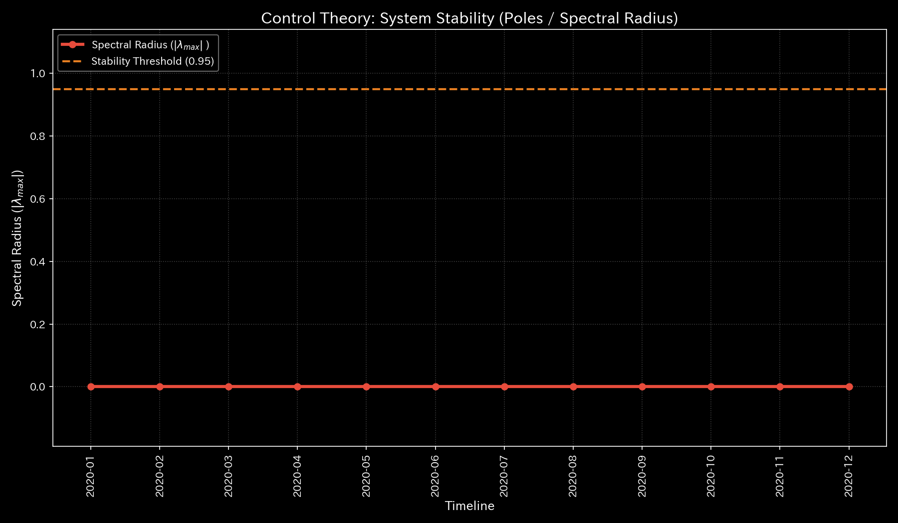

* **最適制御 (LQR) パフォーマンス空間 (`004_1_3__control_lqr_performance_space.png`)**
  * **臨床解説:** 特定のノードに感度ピークは存在しません。全領域に分散しています。系全体の自己調整機能が稼働しています。
  * 

* **LQR制御誤差収束 (`004_1_2__control_error_convergence.png`)**
  * **臨床解説:** 誤差軌道が時間軸に沿って減衰します。目標とする定常状態へと収束します。
  * 

---

### 🟡 Sample 1 (循環取引: Wash Trade)

* **システム安定性 (スペクトル半径) (`004_1_2__system_stability.png`)**
  * **臨床解説:** 循環取引の発生時に、スペクトル半径 $\rho$ が上昇します。$t=0$ に `0.7488` を記録します。$t=4$ に `0.5501` を記録します。還流閉路の形成を示します。
  * 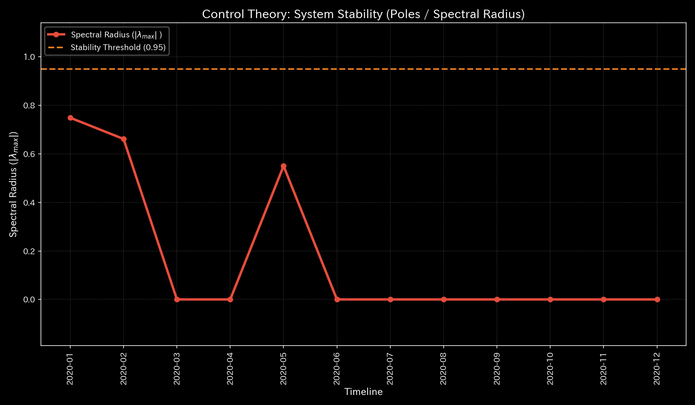

* **最適制御 (LQR) パフォーマンス空間 (`004_1_3__control_lqr_performance_space.png`)**
  * **臨床解説:** 還流の結節点となる預金や売掛金ノードの感度が上昇します。これらのノードに対する取引制限などの介入が有効です。
  * 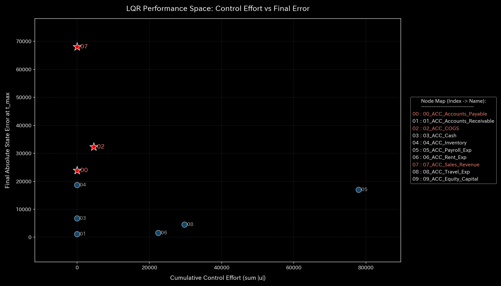

* **LQR制御誤差収束 (`004_1_2__control_error_convergence.png`)**
  * **臨床解説:** 制御入力により循環回路の同期が解除されます。状態誤差は定常状態へと収束します。
  * 

---

### 🔴 Sample 2 (資金横領: Embezzlement Leak)

* **システム安定性 (スペクトル半径) (`004_1_2__system_stability.png`)**
  * **臨床解説:** 資金流出により活動質量が漏出します。自己還流は発生しません。スペクトル半径 $\rho$ は全期を通じて `0.00` となります。
  * 

* **最適制御 (LQR) パフォーマンス空間 (`004_1_3__control_lqr_performance_space.png`)**
  * **臨床解説:** 流出先 `UNKNOWN_LEAK` に直結する売掛金や預金口座の感度が上昇します。これらのノードが流出遮断の制御点です。
  * 

* **LQR制御誤差収束 (`004_1_2__control_error_convergence.png`)**
  * **臨床解説:** 流出経路が存在します。そのため、誤差の収束には時間がかかります。最適入力により、誤差はゼロへ収束します。
  * 

---

### 🟡 Sample 3 (入力ミス: Unbalanced Mistake)

* **システム安定性 (スペクトル半径) (`004_1_2__system_stability.png`)**
  * **臨床解説:** 単発の入力ミスです。スペクトル半径 $\rho$ は全期を通じて `0.00` となります。持続的な流動性の空回りは発生しません。
  * 

* **最適制御 (LQR) パフォーマンス空間 (`004_1_3__control_lqr_performance_space.png`)**
  * **臨床解説:** ミスが発生したステップで一時的な感度の偏りが発生します。翌ステップで自己修正されます。正常なバランスへと回復します。介入ポイントは消滅します。
  * 

* **LQR制御誤差収束 (`004_1_2__control_error_convergence.png`)**
  * **臨床解説:** ミスが発生したステップで一時的に誤差が発生します。自己修正と制御入力が機能します。誤差はゼロへ収束します。
  * 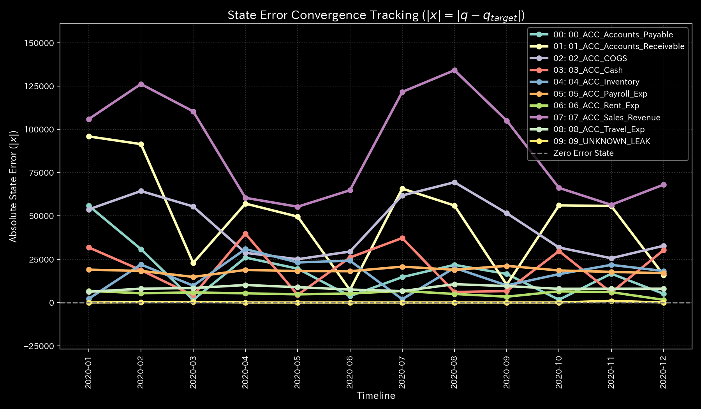

---

### 🔴 Sample 4 (複合アノマリー: Composite Chaos)

* **システム安定性 (スペクトル半径) (`004_1_2__system_stability.png`)**
  * **臨床解説:** 循環取引が発生します。それによりスペクトル半径 $\rho$ が最大 `0.79` まで上昇します。システムが不安定状態であることを示します。
  * 

* **最適制御 (LQR) パフォーマンス空間 (`004_1_3__control_lqr_performance_space.png`)**
  * **臨床解説:** 循環取引と横領の双方に対応する複数の感度ピークが発生します。介入の複雑さを示します。
  * 

* **LQR制御誤差収束 (`004_1_2__control_error_convergence.png`)**
  * **臨床解説:** 還流の維持と簿外流出の負荷がかかります。そのため、誤差は振動します。最適制御の介入により、収束へと向かっています。
  * 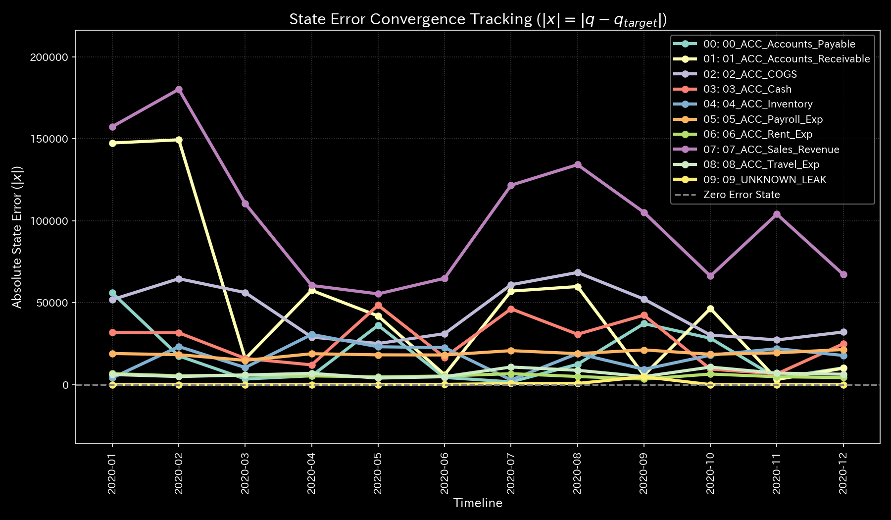

---

### 🔴 Sample 5 (京都交差点網: Kyoto Traffic)

* **システム安定性 (スペクトル半径) (`004_1_2__system_stability.png`)**
  * **臨床解説:** デッドロックが発生します（$t=50$ 以降）。スペクトル半径 $\rho$ は `1.00` に張り付きます。交通網の自己復元力が消失した状態です。
  * 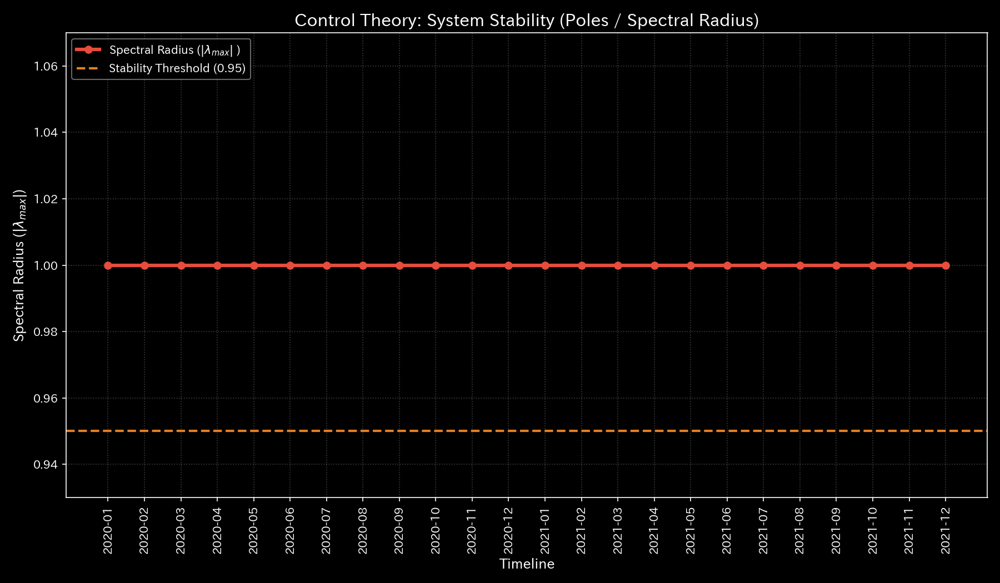

* **最適制御 (LQR) パフォーマンス空間 (`004_1_3__control_lqr_performance_space.png`)**
  * **臨床解説:** ボトルネック交差点である `23_四条烏丸`、`13_二条烏丸`、`00_一条堀川` に最大感度値 `41.5234` が検出されます。ここへの信号調律介入が有効です。
  * 

* **LQR制御誤差収束 (`004_1_2__control_error_convergence.png`)**
  * **臨床解説:** デッドロック状態に陥ります。信号制御の介入により渋滞が緩和されます。誤差は遅延を伴いながら収束します。
  * 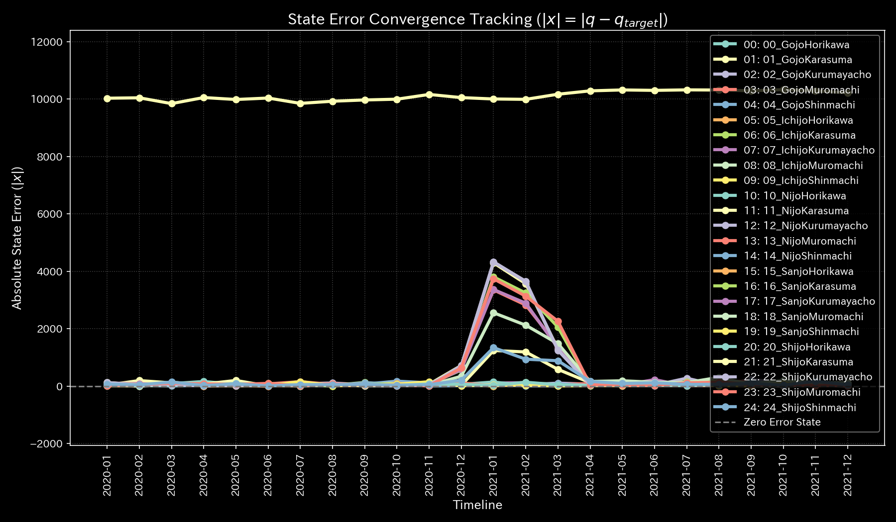

---

### 🟢 Sample 6 (株券流体: Market Stock Flow)

* **システム安定性 (スペクトル半径) (`004_1_2__system_stability.png`)**
  * **臨床解説:** 循環売買の開始と同時に、スペクトル半径 $\rho$ は `1.00` に飽和します。市場が還流ループに固定されます。
  * 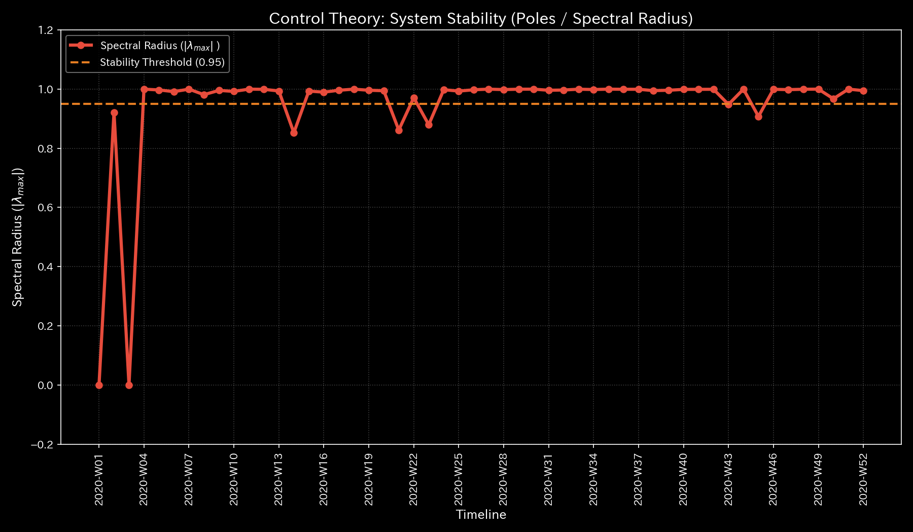

* **最適制御 (LQR) パフォーマンス空間 (`004_1_3__control_lqr_performance_space.png`)**
  * **臨床解説:** LQRの介入感度は特定のノードに偏らず、分散しています。局所的な制御の脆弱性は存在しません。
  * 

* **LQR制御誤差収束 (`004_1_2__control_error_convergence.png`)**
  * **臨床解説:** 循環ループが制御により解消されます。流動性バランスの誤差はゼロへと収束します。
  * 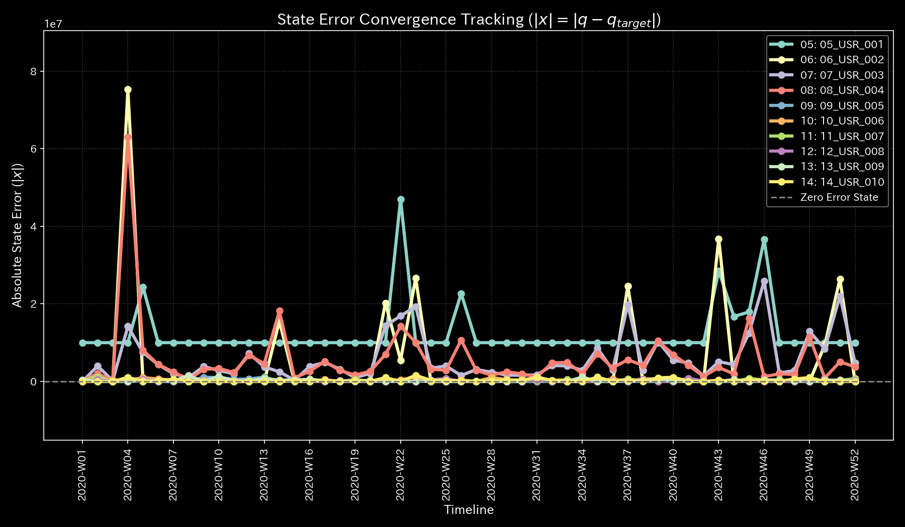

---

### 🟢 Sample 7 (現金流体: Market Cash Flow)

* **システム安定性 (スペクトル半径) (`004_1_2__system_stability.png`)**
  * **臨床解説:** スペクトル半径 $\rho$ は `0.00` で安定しています。同期の歪みは検出されません。
  * 

* **最適制御 (LQR) パフォーマンス空間 (`004_1_3__control_lqr_performance_space.png`)**
  * **臨床解説:** LQR介入感度の極大値スパイクは存在しません。全口座に分散しています。頑健なネットワーク構造を示します。
  * 

* **LQR制御誤差収束 (`004_1_2__control_error_convergence.png`)**
  * **臨床解説:** 偏在はありません。状態誤差は初期から低水準となります。速やかに収束します。
  * 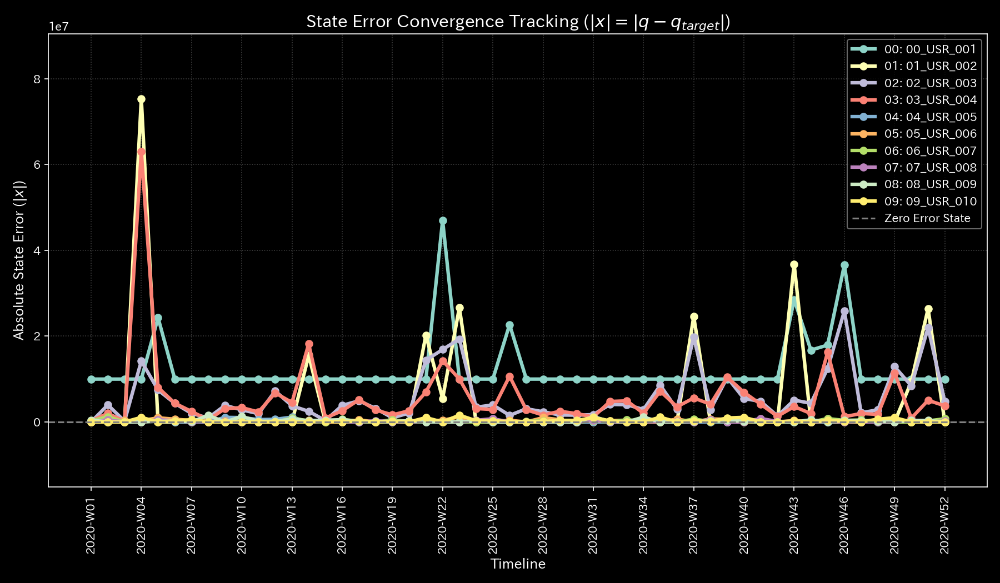

---

### 🔴 Sample 8 (fMRI 脳梗塞: fMRI Stroke)

* **システム安定性 (スペクトル半径) (`004_1_2__system_stability.png`)**
  * **臨床解説:** $t=30$ に脳梗塞が起きます。それによりトポロジーが断裂します。その後、スペクトル半径 $\rho$ が `1.00` に飽和します。脳の流動制御が破綻した状態を示します。
  * 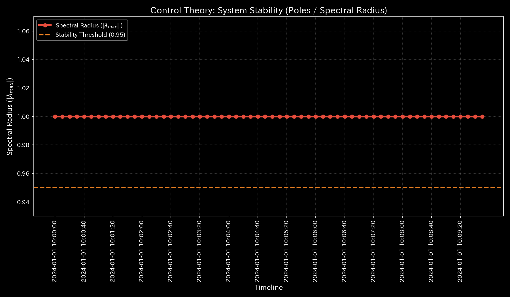

* **最適制御 (LQR) パフォーマンス空間 (`004_1_3__control_lqr_performance_space.png`)**
  * **臨床解説:** 虚血が発生した `00_Motor_Cortex` および周辺の `01_Parietal_Lobe` で感度が最大値 `41.5234` となります。この部位への刺激介入が有効です。
  * 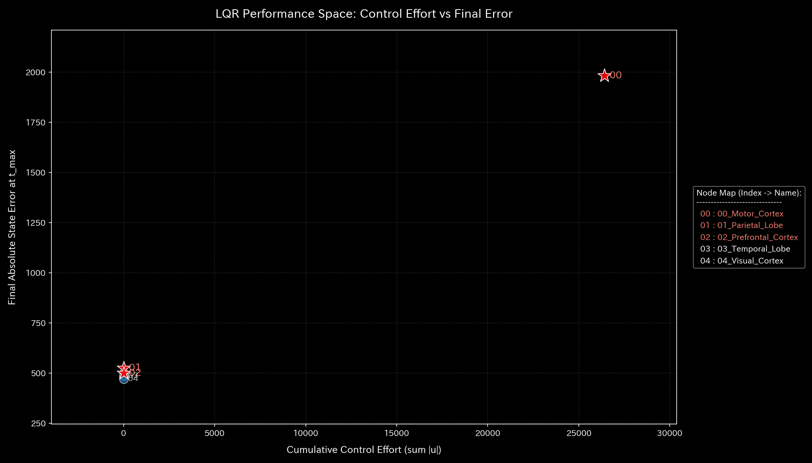

* **LQR制御誤差収束 (`004_1_2__control_error_convergence.png`)**
  * **臨床解説:** 梗塞部周辺の制御が困難です。そのため、誤差の収束には遅延が発生します。最終的には新たな定常状態へ収束します。
  * 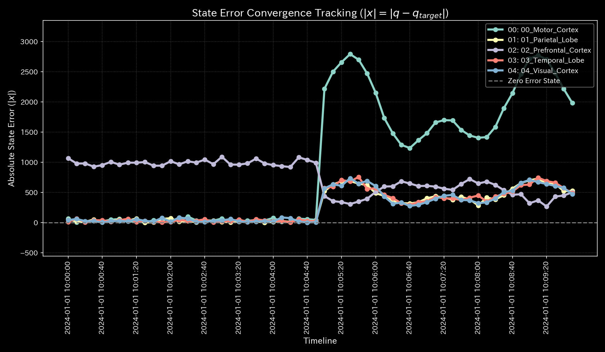

---

### 🔴 Sample 9 (fMRI てんかん発作: fMRI Seizure)

* **システム安定性 (スペクトル半径) (`004_1_2__system_stability.png`)**
  * **臨床解説:** 同期バーストが発生します。開始と同時にスペクトル半径 $\rho$ が `1.00` に飽和します。情報調整機能が崩壊します。
  * 

* **最適制御 (LQR) パフォーマンス空間 (`004_1_3__control_lqr_performance_space.png`)**
  * **臨床解説:** 過同期放電の焦点である側頭葉（`03_Temporal_Lobe`）で介入感度が最大値 `41.5234` となります。この部位への刺激介入が有効です。
  * 

* **LQR制御誤差収束 (`004_1_2__control_error_convergence.png`)**
  * **臨床解説:** 過同期バーストが制御パルスによりリセットされます。その後、脳活動の誤差は正常範囲へと収束します。
  * 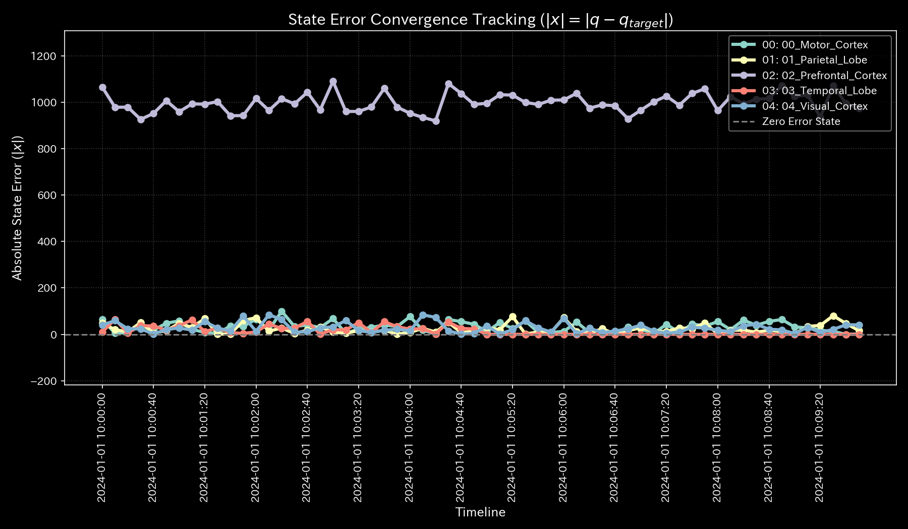
