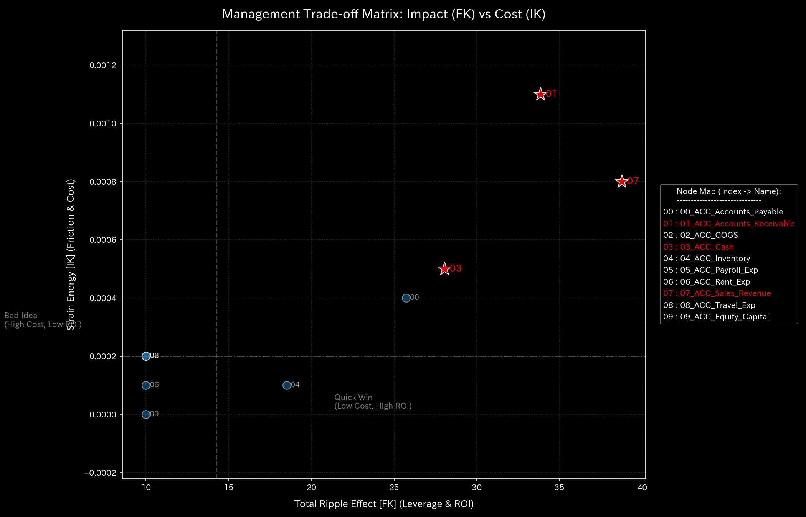

# 004. システム安定性とフィードバック制御 (Control Theory & Stability)

本ガイドは、Tensor-Link Utility (TLU) における最適線形制御（LQR）およびシステム安定性分析モジュール（`004_1`、`004_2`）について、グラフの種類ごとに各検証サンプルの出力と数値に基づく臨床解説を縦列に整理したものです。

---

## 🔬 LQR制御理論とシステム安定性の物理数学理論

ネットワークの状態遷移を、隣接接続確率行列 $A$ および制御入力 $u(t)$、入力パス $B$ に基づく離散状態方程式として記述します。

$$X(t+1) = A \cdot X(t) + B \cdot u(t)$$

接続行列 $A$ の最大固有値である**「スペクトル半径（Spectral Radius $\rho$）」**を監視します。

$$\rho = \max_{i} |\lambda_i|$$

$\rho < 1.0$ であれば、システムは自己減衰能力（安定性）を持ちます。しかし、架空の資金還流ループ（循環取引）や交差点グリッドロックが形成されると、スペクトル半径が境界値の **`1.0`** に飽和（接近）し、システム全体のエネルギーが閉回路に拘束されて制御不能（不安定）となります。

TLUは、最適線形レギュレータ（LQR）制御理論を用いて、システムを健康な定常状態へ引き戻すためのフィードバックゲイン $K_{lqr}$ を算出し、その感度（Sensitivity Matrix）からシステム内の**「最も介入効果の高いノード（ツボ＝経穴：Acupressure Score最大ノード）」**を特定します。

$$u(t) = -K_{lqr} \cdot X(t)$$

---

## 📊 介入感度行列グラフと個別サンプルの所見

### 4. 介入感度行列 (`004_2_1__sensitivity_matrix.png`)
すべてのノードペア間における、LQR制御ゲインの介入に対する感度の相互伝癖強さを示した偏微分行列グラフです。

#### 🟢 Sample 0 (正常代謝)
**臨床解説:**
全ノード間にわたって偏りのない極めて淡いブルーの分布を維持しており、特定の結合パスに偏った制御脆弱性が存在しない安定したトポロジーを証明しています。

