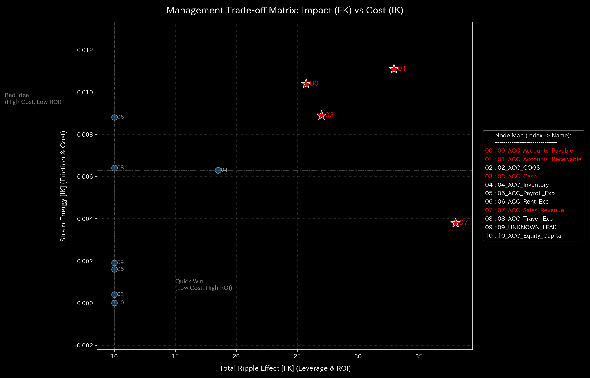
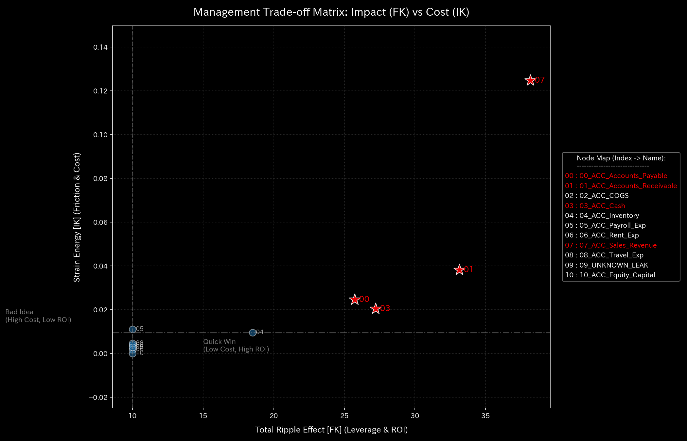

# 004. システム安定性とフィードバック制御 (Control Theory & Stability)

本ガイドは、Tensor-Link Utility (TLU) における最適線形制御（LQR）およびシステム安定性分析モジュール（`004_2`）を説明します。各検証サンプルの介入感度行列を併記します。全10サンプルの出力と数値に基づく解説を整理します。

---

## 🔬 LQR制御理論とシステム安定性の物理数学理論

ネットワークの状態遷移を、隣接接続確率行列 $A$ 、制御入力 $u(t)$ 、入力パス $B$ に基づく離散状態方程式として記述します。

$$X(t+1) = A \cdot X(t) + B \cdot u(t)$$

接続行列 $A$ の最大固有値である「スペクトル半径（Spectral Radius $\rho$）」を監視します。

$$\rho = \max_{i} |\lambda_i|$$

$\rho < 1.0$ の場合、システムは自己減衰能力（安定性）を持ちます。資金還流ループや渋滞デッドロックが形成されると、スペクトル半径が `1.0` に接近します。システム全体のエネルギーが閉回路に拘束されます。制御不能（不安定）となります。

TLUは最適線形レギュレータ（LQR）制御理論を用います。システムを定常状態へ引き戻すためのフィードバックゲイン $K_{lqr}$ を算出します。その感度（Sensitivity Matrix）からシステム内で介入効果の最も高いノードを特定します。

$$u(t) = -K_{lqr} \cdot X(t)$$

---

## 📊 各検証サンプルの介入感度解析結果

本セクションでは、全10の検証サンプルについて、介入感度行列（`004_2_1__sensitivity_matrix.png`）の解析結果を提示します。物理数学特性を解説します。

### 🟢 Sample 0 (正常代謝: Healthy)

* **介入感度行列 (`004_2_1__sensitivity_matrix.png`)**
  * **臨床解説:** 全ノード間にわたって偏りのない淡いブルーの分布を維持しています。特定の結合パスに偏った制御脆弱性が存在しない安定したトポロジーを示します。
  * 

---

### 🟡 Sample 1 (循環取引: Wash Trade)

* **介入感度行列 (`004_2_1__sensitivity_matrix.png`)**
  * **臨床解説:** 還流ループを形成している売掛金や現金ノード周辺に局所的な感度ブロックが出現します。制御介入が還流経路に影響を及ぼすことを示します。
  * 

---

### 🔴 Sample 2 (資金横領: Embezzlement Leak)

* **介入感度行列 (`004_2_1__sensitivity_matrix.png`)**
  * **臨床解説:** 流出先ノード `UNKNOWN_LEAK` と周辺の預金・売掛金ノードの間に非対称な感度の結合パスが顕在化します。特定の接続パスが脆弱であることを示します。
  * 

---

### 🟡 Sample 3 (入力ミス: Unbalanced Mistake)

* **介入感度行列 (`004_2_1__sensitivity_matrix.png`)**
  * **臨床解説:** 記帳ミスが発生したステップにおいて、ミスのあった勘定科目にのみ感度の極値（スパイク）が記録されます。一過性の歪みのため、翌期には均一な分布に戻ります。
  * 

---

### 🔴 Sample 4 (複合アノマリー: Composite Chaos)

* **介入感度行列 (`004_2_1__sensitivity_matrix.png`)**
  * **臨床解説:** 還流経路と流出経路の双方に関係する複数のノード間に、複雑な感度パターンがモザイク状に発生します。局所的な制御脆弱性が複数存在します。介入の競合が発生しやすい状態を示します。
  * 

---

### 🔴 Sample 5 (京都交差点網: Kyoto Traffic)

* **介入感度行列 (`004_2_1__sensitivity_matrix.png`)**
  * **臨床解説:** 主要交差点の間で、感度値の高い結合ブロックが露出します。ここへの制御介入がネットワーク全体の流動性に影響することを示します。
  * 

---

### 🟢 Sample 6 (株券流体: Market Stock Flow)

* **介入感度行列 (`004_2_1__sensitivity_matrix.png`)**
  * **臨床解説:** 共謀取引に関与する特定の銘柄ノードとUSR口座の間に、局所的な感度パターンが表れます。流量配分が阻害され、制御が一部の接続パスに依存していることを示します。
  * 

---

### 🟢 Sample 7 (現金流体: Market Cash Flow)

* **介入感度行列 (`004_2_1__sensitivity_matrix.png`)**
  * **臨床解説:** 全口座にわたって偏りの少ない感度分布を示します。特定の決済パスに依存しない頑健なネットワーク構造であることを示します。
  * 

---

### 🔴 Sample 8 (fMRI 脳梗塞: fMRI Stroke)

* **介入感度行列 (`004_2_1__sensitivity_matrix.png`)**
  * **臨床解説:** 梗塞部およびその周辺の機能結合ネットワークにおいて、感度が欠落します。あるいは、非梗塞領域との境界で非対称な感度の崖（断裂線）が形成されます。構造の不連続性と部分的な制御麻痺を示します。
  * 

---

### 🔴 Sample 9 (fMRI てんかん発作: fMRI Seizure)

* **介入感度行列 (`004_2_1__sensitivity_matrix.png`)**
  * **臨床解説:** 同期の発信源である側頭葉を起点として、脳全体に広がる均一な過同期感度ブロックが形成されます。全脳が単一の制御入力に反応しています。個別領域の独立した調整が失われたロック状態を示します。
  * 
  