# 005_1. 信号処理と波動力学 (Wave Mechanics & Signal Processing)

本ガイドは、Tensor-Link Utility (TLU) における信号処理を説明します。また、波動力学・位相コヒーレンス分析モジュール（`005_1`）を説明します。各検証サンプルの共振周波数スペクトルを示します。また、位相ドリフトヒートマップを併記します。全10サンプルの出力と数値に基づく解説を整理します。

---

## 🔬 波動力学と位相コヒーレンスの物理数学理論

健全なシステムには、無数の独立した意思決定ノードが関与します。その合成周波数スペクトルは「1/f ゆらぎ (Fractal Noise / Pink Noise)」を描きます。

$$S(f) \propto \frac{1}{f^\beta} \quad (\beta \approx 1.0)$$

共謀やてんかん発作などの状態では、特定のノード同士がタイミングを合わせます。これにより位相同調 (Phase Coherence) が発生します。1/f ゆらぎのフラクタル傾きが低下します。そして同期状態を引き起こします。

TLUは、ノード間の位相差の時系列変化を測定します。これは「位相ドリフト（Phase Drift）」と呼ばれます。TLUはコヒーレンス行列を計算します。これにより、従来の統計モデルでは検知できない同期を検出します。

---

## 📊 各検証サンプルの波動力学・信号処理解析結果

本セクションでは、全10の検証サンプルを解説します。共振周波数スペクトル（`005_1_1_resonant_frequency.png`）を提示します。また、位相ドリフトヒートマップ（`005_1_2__phase_drift_heatmap.png`）を併記します。それぞれの物理数学特性を解説します。

### 🟢 Sample 0 (正常代謝: Healthy)

* **共振周波数スペクトル (`005_1_1_resonant_frequency.png`)**
  * **臨床解説:** 特定の周波数に共振ピークは存在しません。雑音（ゆらぎ）は全帯域になだらかに分散しています。これは定常状態を示します。
  * 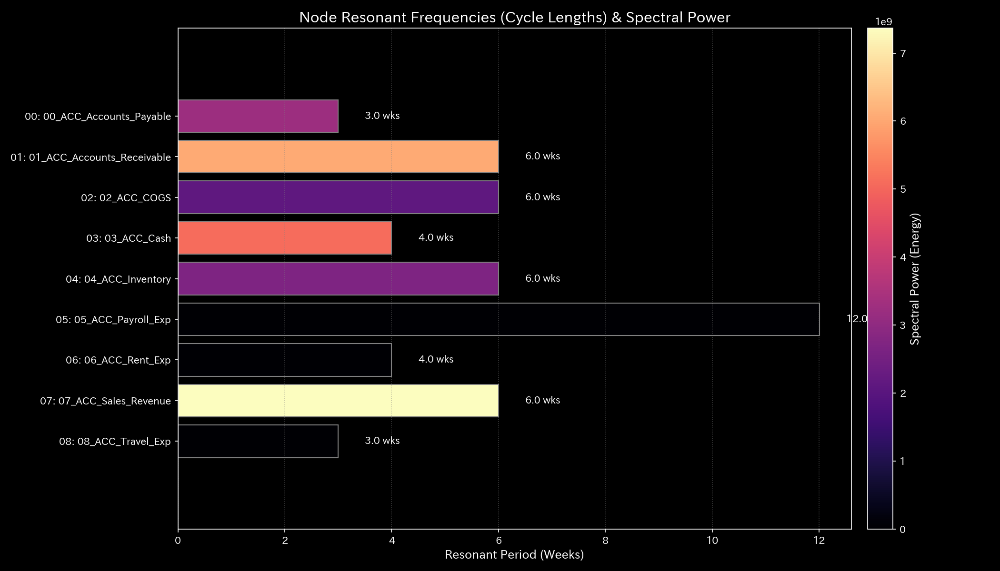

* **位相ドリフトヒートマップ (`005_1_2__phase_drift_heatmap.png`)**
  * **臨床解説:** 位相差は全領域でランダムに拡散しています。特定のペアへの偏りはありません。人工的な同期や位相同調は検出されません。
  * 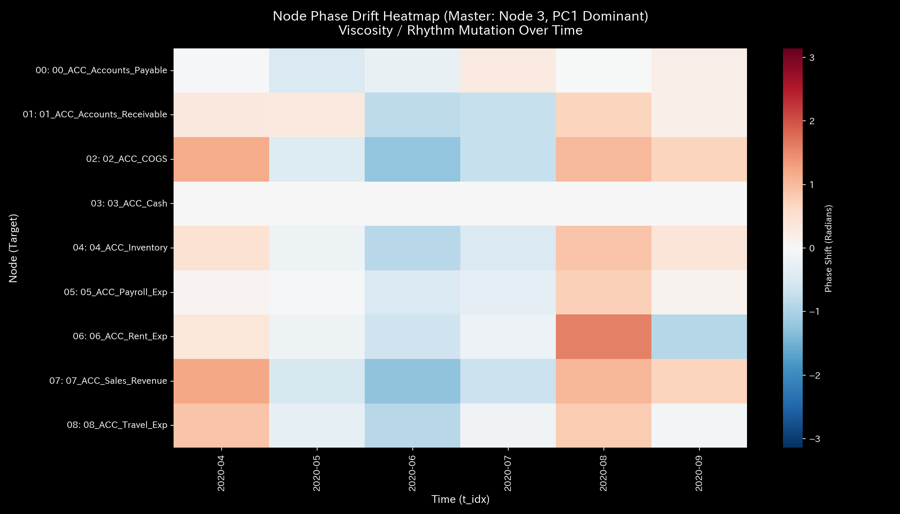

---

### 🟡 Sample 1 (循環取引: Wash Trade)

* **共振周波数スペクトル (`005_1_1_resonant_frequency.png`)**
  * **臨床解説:** 共振ピーク（単一スパイク）が発生します。これは循環取引の往復周期に対応する特定の周波数です。人工的な循環周期の存在を示しています。
  * 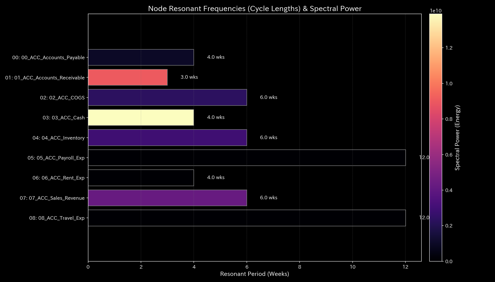

* **位相ドリフトヒートマップ (`005_1_2__phase_drift_heatmap.png`)**
  * **臨床解説:** 循環取引に関与する勘定科目ペアの間で、位相差が一定の値に固定されます。これにより定常同期バンドが形成されます。取引同期の常態化を示します。
  * 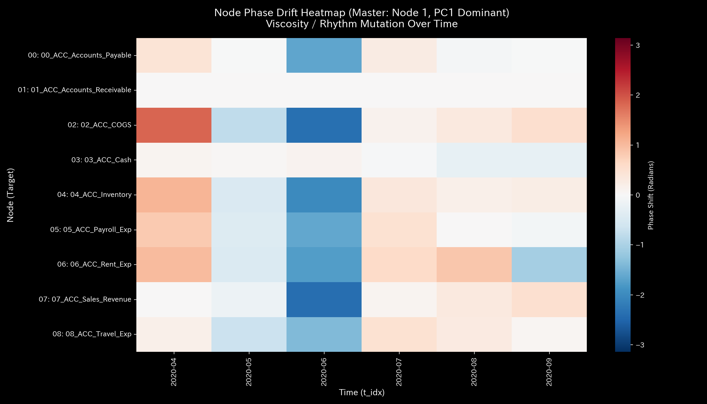

---

### 🔴 Sample 2 (資金横領: Embezzlement Leak)

* **共振周波数スペクトル (`005_1_1_resonant_frequency.png`)**
  * **臨床解説:** 共振スパイクが複数箇所で発生します。これは資金流出によるネットワークの剛性変化に伴うものです。漏洩ノード周辺で発生する局所的な流量変動の共鳴を示します。
  * 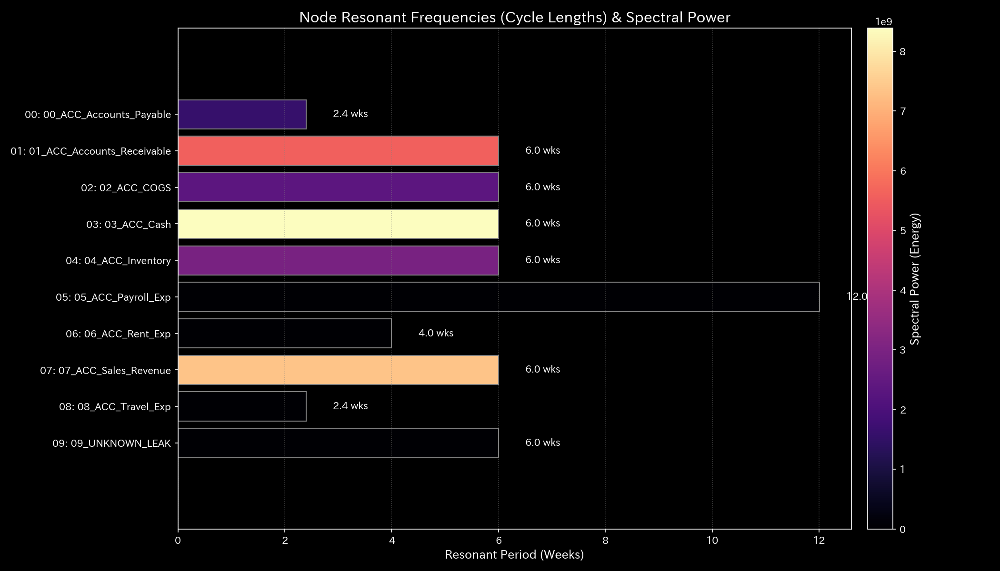

* **位相ドリフトヒートマップ (`005_1_2__phase_drift_heatmap.png`)**
  * **臨床解説:** 流出先と特定の勘定科目の間で、位相差の同調が観察されます。特定の漏洩パスを通じてのみ同期的な決済変動が起きていることを示します。
  * 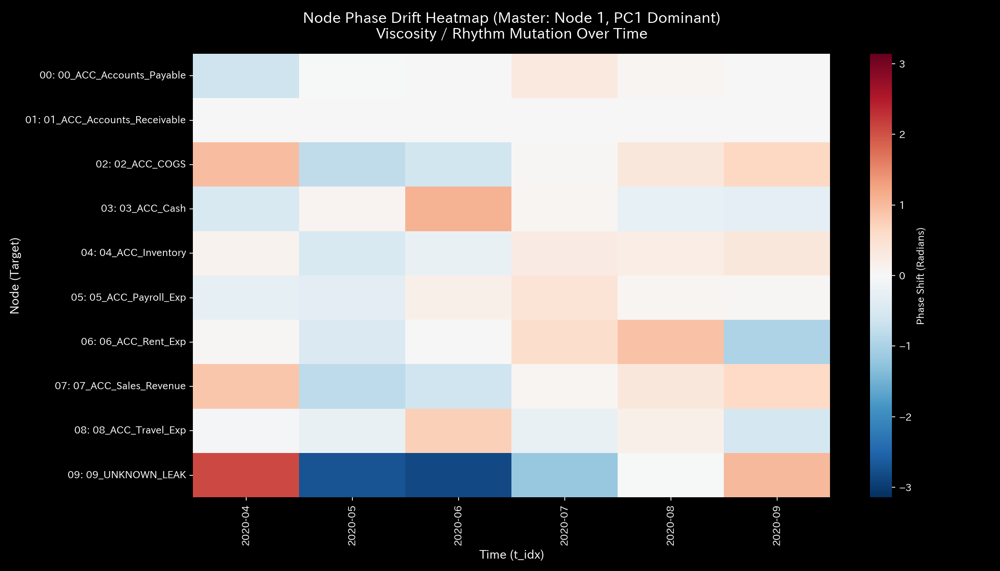

---

### 🟡 Sample 3 (入力ミス: Unbalanced Mistake)

* **共振周波数スペクトル (`005_1_1_resonant_frequency.png`)**
  * **臨床解説:** ミスの発生したステップのみ、一時的な高周波ノイズが励起されます。特定の周波数での持続的な共振は発生しません。
  * 

* **位相ドリフトヒートマップ (`005_1_2__phase_drift_heatmap.png`)**
  * **臨床解説:** ミス発生期のみ、該当勘定科目の位相差が一時的に歪みます。その後、自己修正が働きます。翌ステップではランダムな拡散状態（平常）に復帰します。
  * 

---

### 🔴 Sample 4 (複合アノマリー: Composite Chaos)

* **共振周波数スペクトル (`005_1_1_resonant_frequency.png`)**
  * **臨床解説:** 循環取引の共振ピークが発生します。同時に、横領による非対称な多重共振ピークが発生します。スペクトル全体が複数のスパイクを示します。
  * 

* **位相ドリフトヒートマップ (`005_1_2__phase_drift_heatmap.png`)**
  * **臨床解説:** 循環同期に関与する口座ペアの同期バンドが現れます。同時に、横領漏洩に関与するノード間の同調パターンが現れます。これらが交錯します。ネットワークの二重ハック状態を示します。
  * 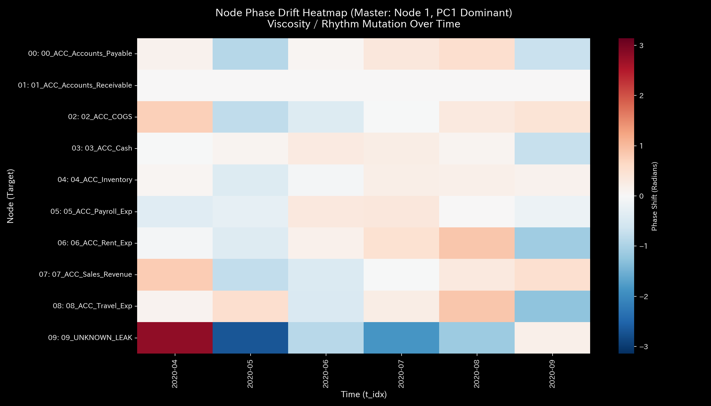

---

### 🔴 Sample 5 (京都交差点網: Kyoto Traffic)

* **共振周波数スペクトル (`005_1_1_resonant_frequency.png`)**
  * **臨床解説:** 渋滞によるデッドロックが発生します。直流成分（周波数ゼロ）付近にすべてのパワーが集中します。高周波の流動が消滅した状態を示します。
  * 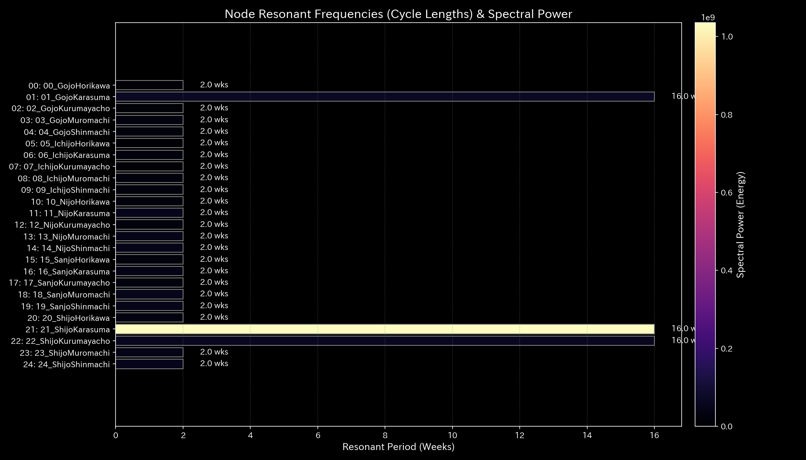

* **位相ドリフトヒートマップ (`005_1_2__phase_drift_heatmap.png`)**
  * **臨床解説:** 主要交差点間で位相差のドリフトが停止します。位相がロックされたまま静止するバンドが全領域で支配的になります。これは車両が動けない状態を示します。
  * 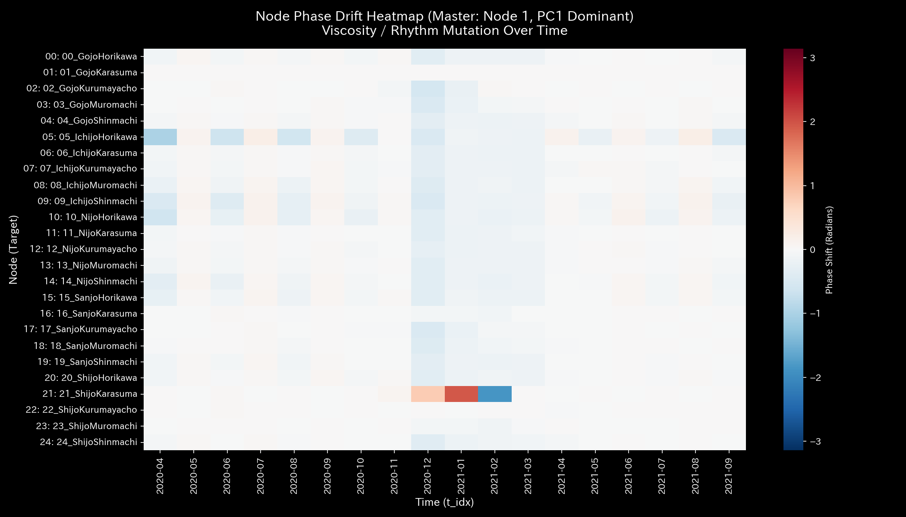

---

### 🟢 Sample 6 (株券流体: Market Stock Flow)

* **共振周波数スペクトル (`005_1_1_resonant_frequency.png`)**
  * **臨床解説:** 共振ピークは存在しません。全帯域にゆらぎとなって分散しています。流動が健全であることを示します。
  * 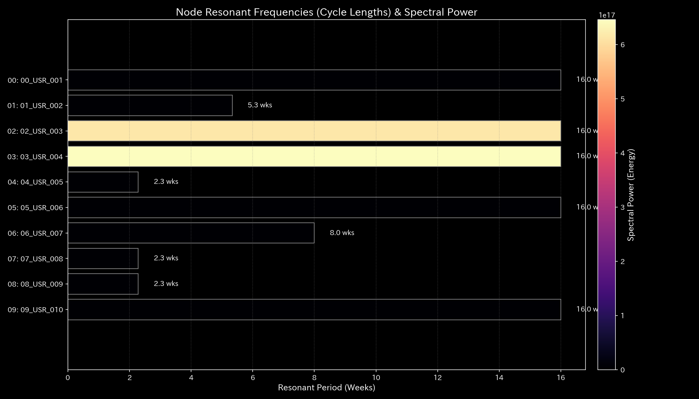

* **位相ドリフトヒートマップ (`005_1_2__phase_drift_heatmap.png`)**
  * **臨床解説:** 位相差は全領域でランダムに拡散しています。特定のペアへの偏りはありません。人工的な同期は検出されません。
  * 

---

### 🟢 Sample 7 (現金流体: Market Cash Flow)

* **共振周波数スペクトル (`005_1_1_resonant_frequency.png`)**
  * **臨床解説:** 共振ピークは存在しません。ゆらぎとなって全帯域に分散しています。
  * 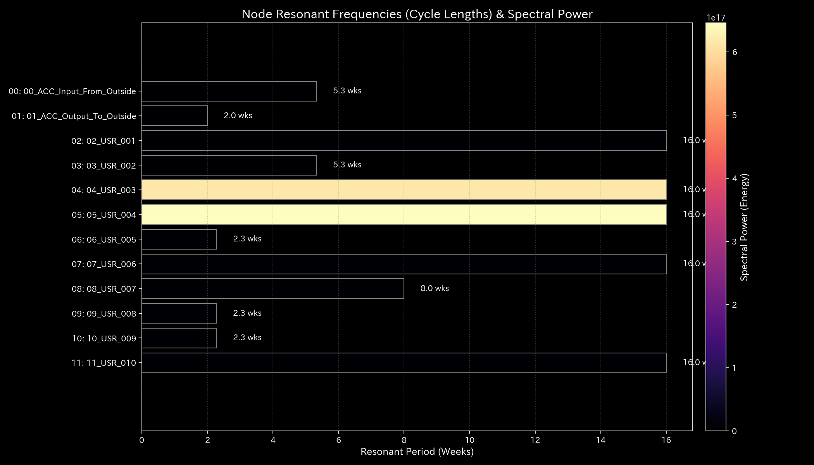

* **位相ドリフトヒートマップ (`005_1_2__phase_drift_heatmap.png`)**
  * **臨床解説:** 送送金口座間において、位相差の固定化は観察されません。位相差はランダムに拡散しています。共謀の兆候はありません。
  * 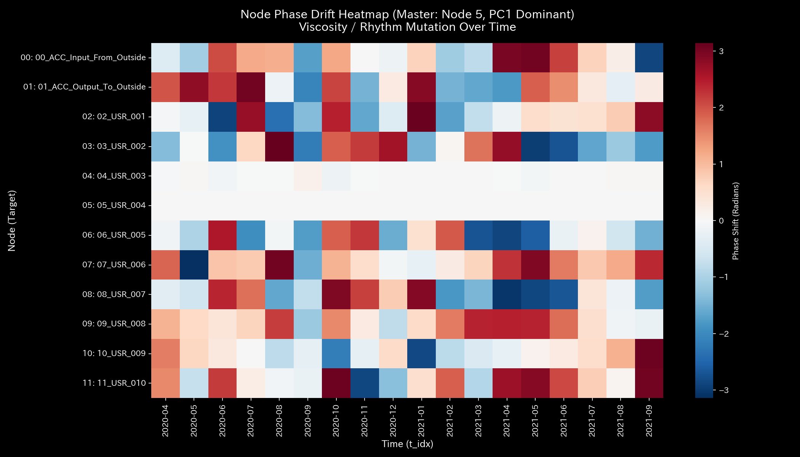

---

### 🔴 Sample 8 (fMRI 脳梗塞: fMRI Stroke)

* **共振周波数スペクトル (`005_1_1_resonant_frequency.png`)**
  * **臨床解説:** 脳梗塞により機能結合が断裂します。運動野周辺の機能的な信号変動周波数が消滅します。低周波領域への偏り（不活性化）が生じます。
  * 

* **位相ドリフトヒートマップ (`005_1_2__phase_drift_heatmap.png`)**
  * **臨床解説:** 梗塞部と他領域との間の位相ドリフトが停止します。またはランダムな漂流に変わります。これは機能的結合の喪失（コヒーレンスの喪失）を示します。
  * 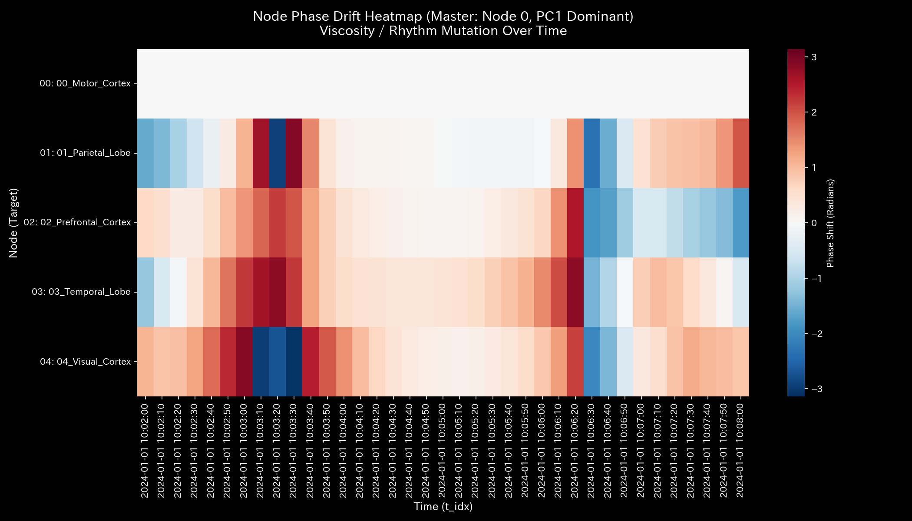

---

### 🔴 Sample 9 (fMRI てんかん発作: fMRI Seizure)

* **共振周波数スペクトル (`005_1_1_resonant_frequency.png`)**
  * **臨床解説:** てんかん発作の同期バーストに対応する単一の周波数があります。そこへ全パワースペクトルエネルギーが集中します。共振スパイクを形成します。
  * 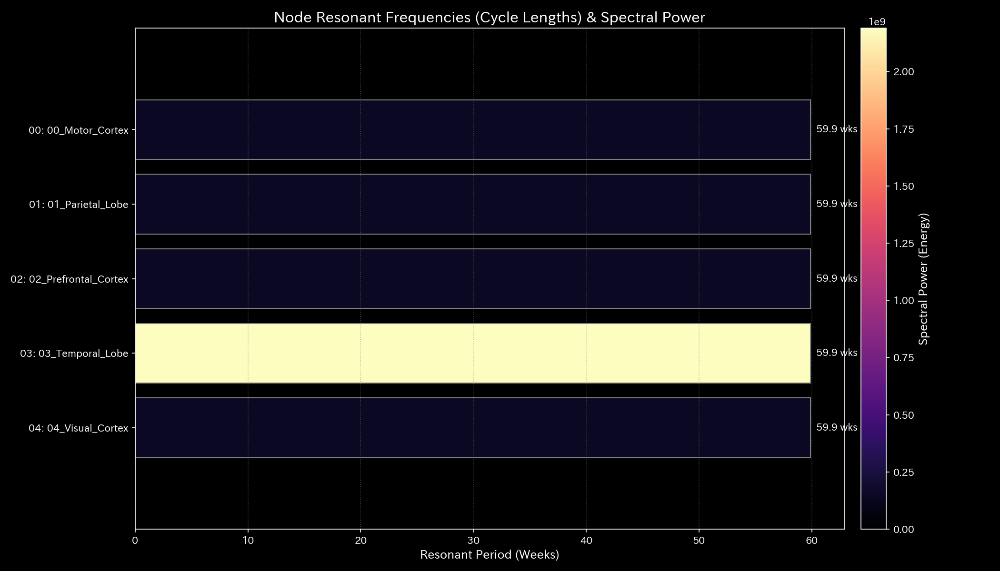

* **位相ドリフトヒートマップ (`005_1_2__phase_drift_heatmap.png`)**
  * **臨床解説:** 脳全体（特に側頭葉周辺）にわたって位相差が同一化します。位相同調（全脳コヒーレンス）が形成されます。個別領域の独立した電気的活動は失われます。
  * 