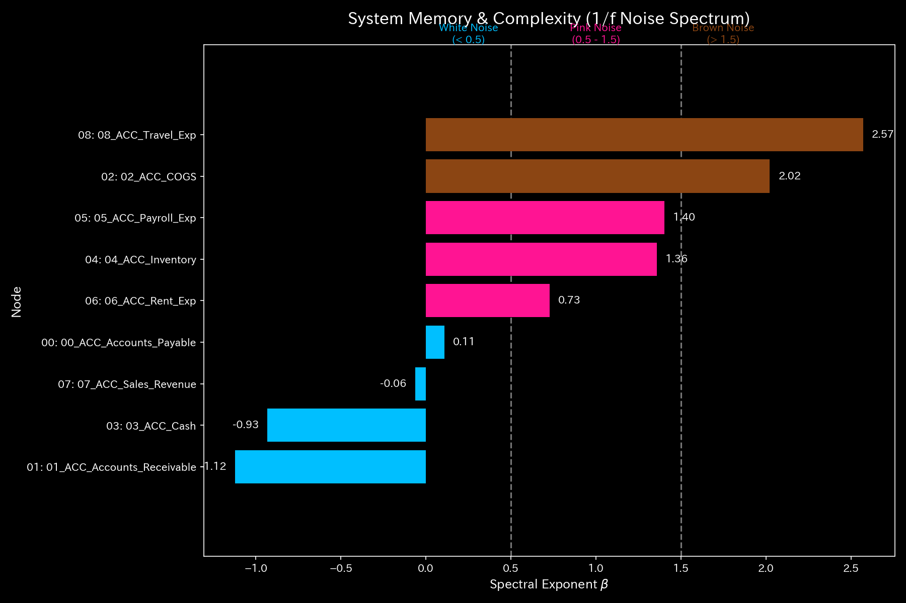
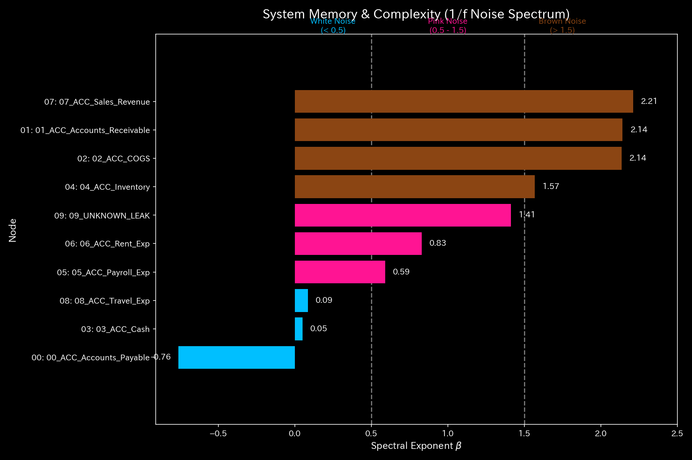
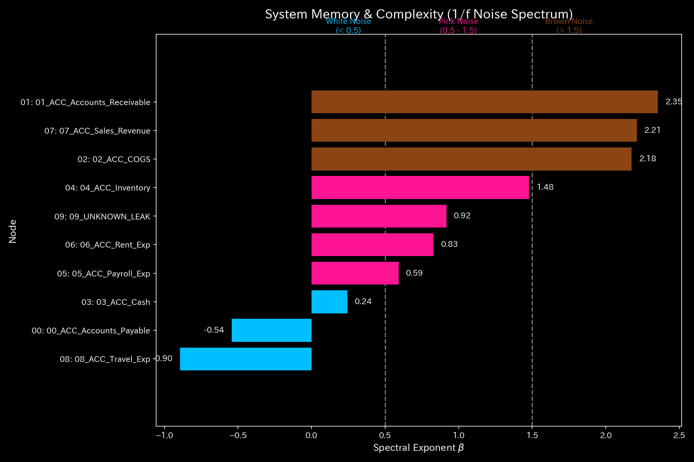
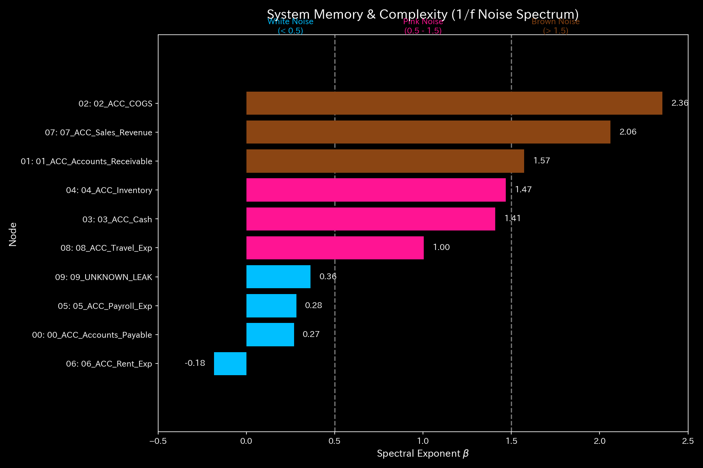
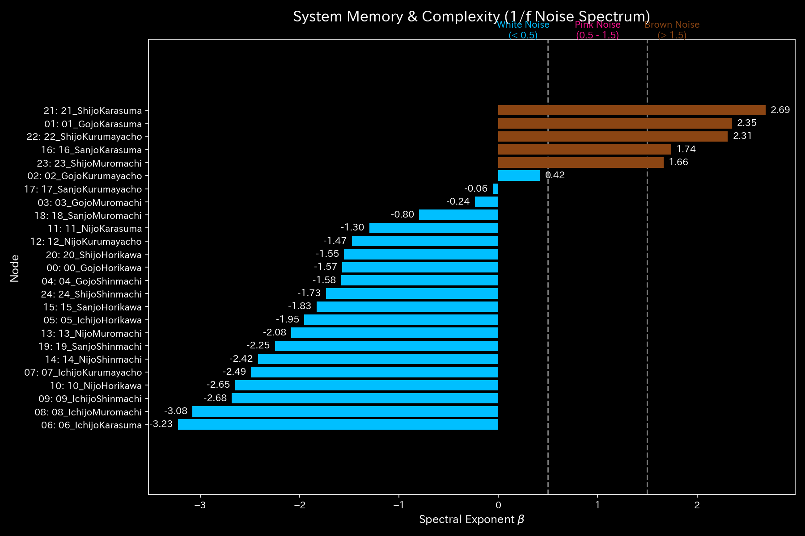
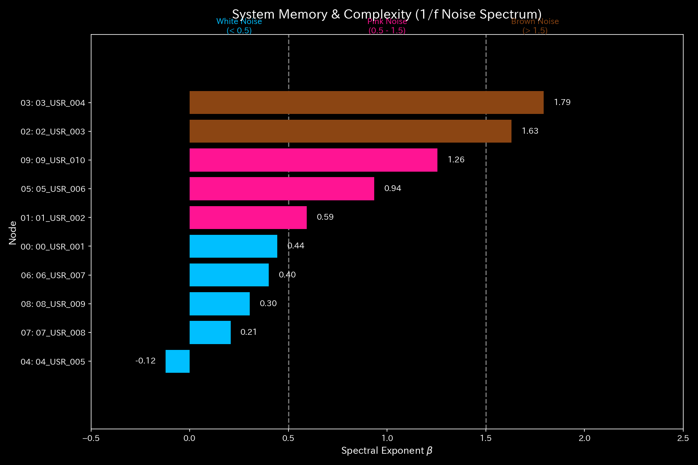

# 005_2. フラクタルノイズ分析 (Fractal Noise)

本ガイドは、Tensor-Link Utility (TLU) における信号処理を説明します。また、フラクタルノイズ（1/f ゆらぎ）分析モジュール（`005_2`）を説明します。各検証サンプルのフラクタルノイズスペクトルを併記します。全10サンプルの出力と数値に基づく解説を整理します。

---

## 🔬 波動力学と 1/f ゆらぎの物理数学理論

健全なシステムには、無数の独立した意思決定ノードが関与します。その合成周波数スペクトルは「1/f ゆらぎ (Fractal Noise / Pink Noise)」を描きます。

$$S(f) \propto \frac{1}{f^\beta} \quad (\beta \approx 1.0)$$

共謀やてんかん発作などの状態では、特定のノード同士がタイミングを合わせます。これにより位相同調 (Phase Coherence) が発生します。1/f ゆらぎのフラクタル傾きが低下します。そして同期状態を引き起こします。

TLUは、ノード間の位相差の時系列変化を測定します。これは「位相ドリフト（Phase Drift）」と呼ばます。TLUはコヒーレンス行列を計算します。これにより、従来の統計モデルでは検知できない同期を検出します。

---

## 📊 各検証サンプルのフラクタルノイズ解析結果

本セクションでは、全10の検証サンプルについて、フラクタルノイズ（1/f ゆらぎ）スペクトル（`005_2_1_fractal_noise_spectrum.png`）の解析結果を提示します。物理数学特性を解説します。

### 🟢 Sample 0 (正常代謝: Healthy)

* **フラクタルノイズ（1/f ゆらぎ）スペクトル (`005_2_1_fractal_noise_spectrum.png`)**
  * **臨床解説:** スペクトルは対数グラフ上で右下がりの直線を描きます。べき乗則指数は $\beta \approx 1.0$ の付近です。新陳代謝を示す「1/f ゆらぎ」が成立しています。
  * 

---

### 🟡 Sample 1 (循環取引: Wash Trade)

* **フラクタルノイズ（1/f ゆらぎ）スペクトル (`005_2_1_fractal_noise_spectrum.png`)**
  * **臨床解説:** べき乗則指数 $\beta$ が上昇します。往復取引の強制同調が発生しています。スペクトル全体の自己相似性（自律性）が失われます。特定周波数にパワーが局所集中した形状を示します。
  * 

---

### 🔴 Sample 2 (資金横領: Embezzlement Leak)

* **フラクタルノイズ（1/f ゆらぎ）スペクトル (`005_2_1_fractal_noise_spectrum.png`)**
  * **臨床解説:** 資金流出が発生しています。流動性の減少に伴い、高周波領域のノイズが減衰します。べき乗則指数 $\beta$ が上昇します。これはシステム全体の活動エネルギーが低下したフラクタル傾きを示します。
  * 

---

### 🟡 Sample 3 (入力ミス: Unbalanced Mistake)

* **フラクタルノイズ（1/f ゆらぎ）スペクトル (`005_2_1_fractal_noise_spectrum.png`)**
  * **臨床解説:** 一過性のミス発生期のみ、インパルス的なノイズが重なります。フラクタル傾きが一時的に歪みます。しかし自己修正が働きます。翌ステップには $\beta \approx 1.0$ の「1/f ゆらぎ」へ復帰します。
  * 

---

### 🔴 Sample 4 (複合アノマリー: Composite Chaos)

* **フラクタルノイズ（1/f ゆらぎ）スペクトル (`005_2_1_fractal_noise_spectrum.png`)**
  * **臨床解説:** 還流同期と資金流出の負荷がシステムにかかります。これにより、スペクトル傾きが歪みます。べき乗則指数 $\beta$ の正常値からの乖離が大きいです。自己組織化能力が崩壊した状態を示します。
  * 

---

### 🔴 Sample 5 (京都交差点網: Kyoto Traffic)

* **フラクタルノイズ（1/f ゆらぎ）スペクトル (`005_2_1_fractal_noise_spectrum.png`)**
  * **臨床解説:** 渋滞によるデッドロックが発生しています。べき乗則指数 $\beta$ が上昇します。高周波の動きが失われます。これはシステムが活動停止した状態を示します。
  * 

---

### 🟢 Sample 6 (株券流体: Market Stock Flow)

* **フラクタルノイズ（1/f ゆらぎ）スペクトル (`005_2_1_fractal_noise_spectrum.png`)**
  * **臨床解説:** べき乗則指数 $\beta \approx 1.0$ を維持しています。市場における自律的かつ多様な取引対流が機能していることを示します。
  * 

---

### 🟢 Sample 7 (現金流体: Market Cash Flow)

* **フラクタルノイズ（1/f ゆらぎ）スペクトル (`005_2_1_fractal_noise_spectrum.png`)**
  * **臨床解説:** べき乗則指数 $\beta \approx 1.0$ を維持しています。決済網内の流体運動が自律的な自己組織化を維持しています。これは頑健な状態であることを示します。
  * 

---

### 🔴 Sample 8 (fMRI 脳梗塞: fMRI Stroke)

* **フラクタルノイズ（1/f ゆらぎ）スペクトル (`005_2_1_fractal_noise_spectrum.png`)**
  * **臨床解説:** 脳梗塞による機能結合の断裂が発生しています。運動野周辺の機能的な信号変動周波数が消滅します。べき乗則指数 $\beta$ が上昇します。傾きが降下します。脳活動のフラクタル自律性の喪失（麻痺）を示します。
  * 

---

### 🔴 Sample 9 (fMRI てんかん発作: fMRI Seizure)

* **フラクタルノイズ（1/f ゆらぎ）スペクトル (`005_2_1_fractal_noise_spectrum.png`)**
  * **臨床解説:** てんかん発作の同期バーストが発生しています。特定の周波数にパワーが集中します。これにより、フラクタルな1/f直線が崩壊します。べき乗則指数 $\beta$ が極大値をマークしています。脳システム全体の自律活動の崩壊を示します。
  * 
